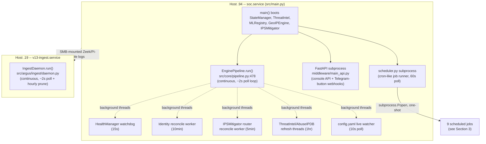
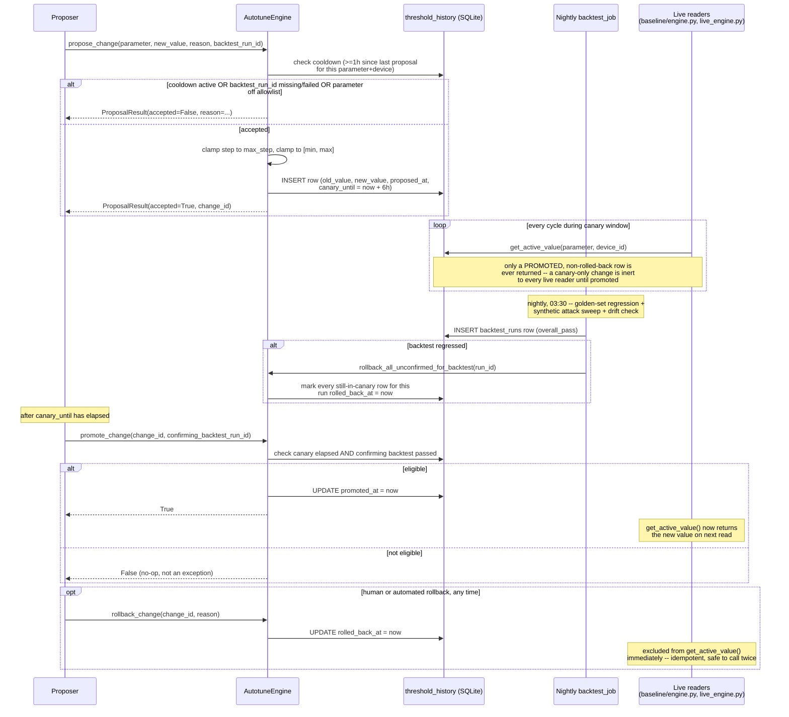
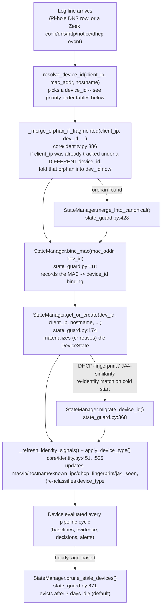
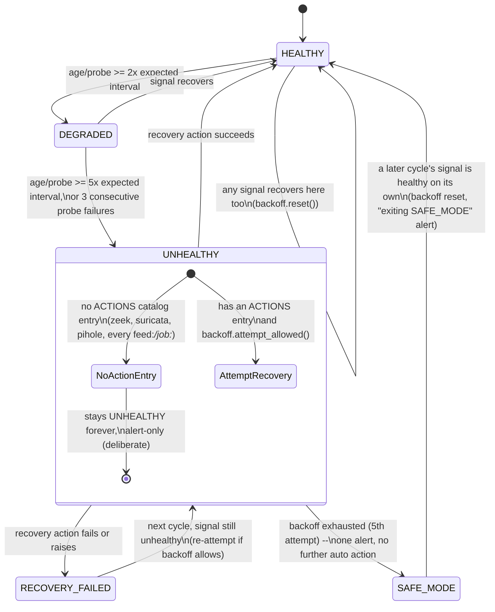
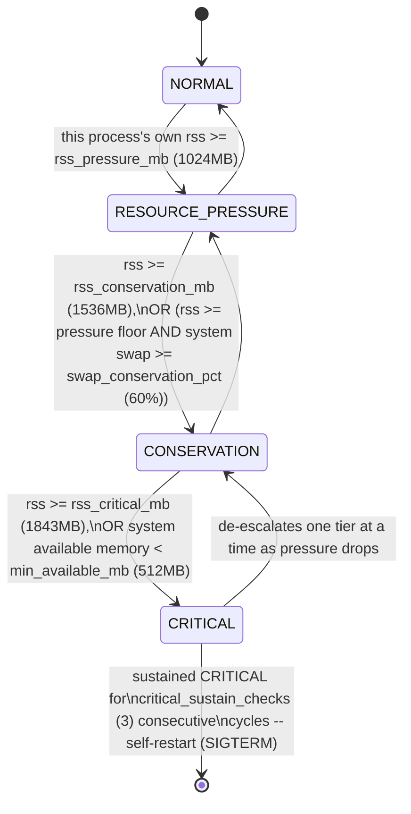
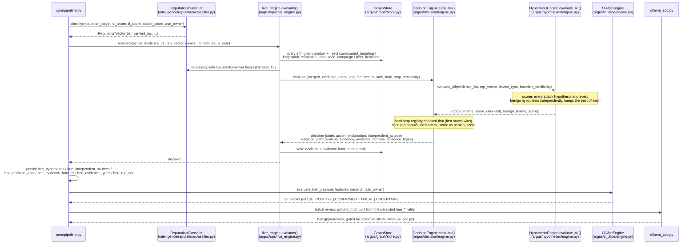
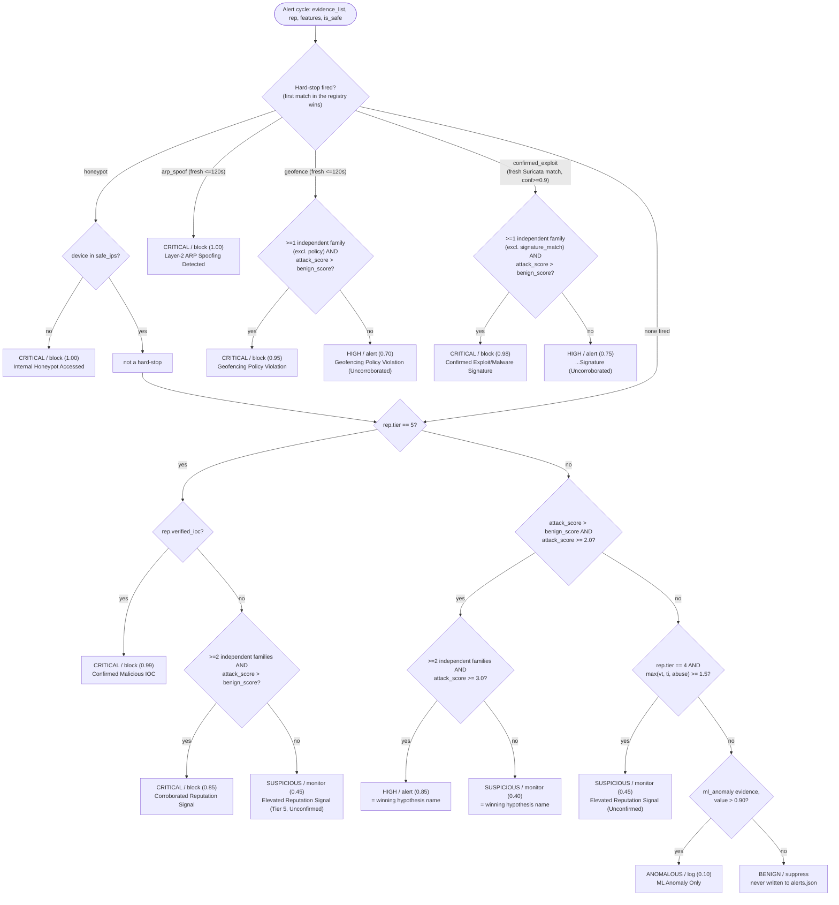

# Argus — Detection Pipeline Architecture

> **Living reference.** If you change a cron string, a decision-engine call chain, or a
> scheduled job, update the relevant section in the same commit — this doc replaces 13
> older, overlapping documents specifically to stop that kind of drift.
>
> **A note on naming**: "Argus" is this project's friendly name for what was formerly
> called `v13` in code. The code-level rename has landed (`src/v13/` → `src/argus/`,
> plus the `engine`/`cl_afpe_engine` config-comparison targets in
> `src/core/pipeline.py` and `src/argus/ops/cl_afpe_flip_monitor.py`) — but a handful of
> identifiers are **deliberately left as literal `v13`, permanently**, because they're
> persisted data or a deployed artifact name, not a namespace: `state/v13_*` data files
> (renaming a live multi-GB SQLite DB has real risk for zero benefit), the
> `v13-ingest.service` systemd unit's filename (avoids an extra disable/enable cycle on
> `.19`), and the `v13_live_engine` provenance string written into evidence rows
> (`source="v13_live_engine"`, already-persisted historical data). See
> `ARGUS_DECISIONS.md` for the reasoning. **The code-level rename is deployed and live**
> — confirmed 2026-09-16 via a direct SSH read of `.94`'s real `config.yaml`:
> `engine: argus` and `cl_afpe_engine: argus` are both set (superseding this note's
> earlier "not yet deployed" claim, which was accurate when first written but went
> stale once the cutover actually shipped). `.94` runs the current Argus code path for
> both the main decision engine and CL-AFPE.

## 1. System Overview

Argus is a home-network intrusion detection/prevention pipeline running across two hosts:

- **`.94`** — the primary box. Runs `soc.service` (`src/main.py`), which owns the live
  decision path, mitigation, and the console API.
- **`.19`** — a secondary host. Runs `v13-ingest.service` (`src/argus/ingest/daemon.py`), a
  standalone shadow ingest daemon that independently re-derives detections from the same
  Zeek/Pi-hole logs (SMB-mounted from `.94`) into its own separate graph database — a
  real-traffic testbed, not part of the live decision path.



## 2. Pipeline Stages

The live decision path on `.94`, one cycle every ~2 seconds
(`EnginePipeline.run()`, `src/core/pipeline.py:478`, loop at line 835):

```mermaid
flowchart LR
    A["Ingest\nZeek/Suricata/Pi-hole logs,\nARP/NDP, honeypot touches"] --> B["Identity resolution\nLiveIdentityManager.resolve_device_id()\nsrc/argus/identity/live_manager.py"]
    B --> C["Detectors\nthreat_signals.py, suricata_scan.py,\nzeek_network.py, dns_evasion.py,\ndns_behavior.py, + inline pipeline.py signals"]
    C --> D["Evidence objects\nsrc/argus/evidence/model.py (Evidence)\nconverted via evidence/ingest.py"]
    D --> E["Graph store (SQLite, WAL)\nstate/v13_graph.db\nsrc/argus/graph/store.py: GraphStore"]
    E --> F["Hypothesis engine\nHypothesisEngine.evaluate_all()\nsrc/argus/hypotheses/engine.py"]
    F --> G["Decision engine\nDecisionEngine.evaluate()\nsrc/argus/decision/engine.py:212"]
    G --> H["Alert / mitigation\nAlertJSONWriter -> state/alerts.json\nIPSMitigator, Telegram"]
```



Each stage, briefly:

- **Ingest** — raw traffic/log observation. On `.94` this feeds the live pipeline directly;
  on `.19` it's `src/argus/ingest/daemon.py`'s own poll-tail-detect loop, reusing the same
  detector code but writing to a separate database.
- **Identity resolution** — raw MAC/IP pairs resolve to a stable canonical `device_id`
  before any evidence is generated, handling multi-subnet trust anchors and MAC
  randomization. See §6.
- **Detectors** — the actual signal-producing code (6 files construct `Evidence` objects
  directly, plus several inline in `pipeline.py` for ARP spoofing, ML anomaly, honeypot
  access, geofencing, etc.).
- **Evidence objects** — the common currency between detection and decision. Two parallel
  `Evidence` classes exist: the legacy in-memory one (`src/intelligence/hypotheses/evidence.py`,
  TTL-decayed, never persisted) and Argus's own (`src/argus/evidence/model.py`, persisted to
  SQLite). `evidence/ingest.py`'s `convert()`/`convert_list()` bridges legacy detector output
  into Argus's shape.
- **Graph store** — the durable handoff point. A single SQLite database
  (`state/v13_graph.db` — filename intentionally left as-is even after a future code
  rename, see the note above) holding devices, destinations, evidence, hypotheses,
  decisions, containment actions, and a generic polymorphic `edges` table
  (`observed`/`targets`/`supports`/`contradicts`/`merged_into`/`corroborates`/`trusts`).
  `.94`'s live copy and `.19`'s shadow copy are two separate files. Three more tables
  sit alongside these (added 2026-09-22, `src/argus/graph/store.py`'s `alert_events`/
  `incidents`/`operator_actions`) — see "Alert-trace graph" below for what they add.
- **Hypothesis engine** — scores 14 `Hypothesis` subclasses (network intrusion, DGA,
  exfiltration, beaconing, coordinated targeting, peer deviation, benign-profile, etc.)
  against the accumulated evidence, and counts how many *independent* evidence families
  corroborate each hypothesis (`src/argus/hypotheses/independence.py`).
- **Decision engine** — the classifier of record (see §4/§8): combines hypothesis scores,
  freshness-filtered evidence, independent-family counts, and a pluggable hard-stop rule
  registry into a verdict (`BENIGN|ANOMALOUS|SUSPICIOUS|HIGH|CRITICAL`).
- **Alert / mitigation** — verdicts above a threshold become alerts (Telegram, `alerts.json`)
  and can trigger `IPSMitigator` containment actions.

## 3. Scheduling & Background Jobs

> **Maintenance rule**: if you change a cron string or add/remove a scheduled job, update
> this table in the same commit. This table is the one place in the docs that's allowed to
> claim an exact frequency — nowhere else should restate these numbers, to avoid drift.

Three separate scheduling mechanisms coexist — don't conflate them:

**A. `src/scripts/scheduler.py`** — a hand-rolled cron daemon, a subprocess of `main.py` on
`.94`. Polls once per minute, parses simple 5-field cron strings (`*`, `*/N`, or an exact
integer — no lists/ranges), and `subprocess.Popen`s each due, enabled job. Config lives in
`config.yaml`'s `scheduled_jobs:` block.

| Job | Script | Cron | Frequency |
|---|---|---|---|
| Legacy autotuner retrain | `scripts/train_fp_classifier.py` | `0 3 * * *` | Daily, 03:00 |
| Argus LLM review | `src/argus/ops/live_llm_review.py` | `45 */4 * * *` | Every 4h at :45 |
| Top domains report | `scripts/top_domains_report.py` | `0 6 * * *` | Daily, 06:00 |
| Argus graph prune | `src/argus/ops/live_prune.py` | `15 3 * * *` | Daily, 03:15 |
| Argus retro hunter | `src/argus/ops/live_retro_hunter.py` | `45 2 * * *` | Daily, 02:45 |
| Decision archive | `src/argus/ops/live_decision_archive.py` | `0 4 1 * *` | Monthly, 1st @ 04:00 |
| Population prior builder | `src/argus/ops/population_prior_builder.py` | `45 3 * * *` | Daily, 03:45 |
| Backtest job | `src/argus/ops/backtest_job.py` | `30 3 * * *` | Daily, 03:30 (on `.94` — see drift note below) |

**v16 cleanup (2026-09-22)**: `scripts/ollama_soc.py` and `scripts/retro_hunter.py`
(the two rows above once named) are fully retired — `live_llm_review.py` and
`live_retro_hunter.py` reached feature parity and replaced them, per
`Documentation/ARGUS_DECISIONS.md`. `cl_afpe_flip_monitor.py`'s **file** was
deliberately kept (its one-time job — watching the `v_current`→`argus` CL-AFPE
cutover — may be needed again for a future engine flip), but its scheduler entry was
removed from `.94`'s live config the same cleanup, since a stale-but-still-firing
15-minute cron would silently re-flip a deliberate future manual rollback back to
`argus` on its next tick. It is not currently in the schedule table above.

**Known repo/deployment config drift**: this repo's own `config.yaml` does not have a
`backtest_job:` entry under `scheduled_jobs.scheduler` (only `config.yaml.example`
does) — but `.94`'s real, deployed `config.yaml` DOES have one (confirmed via direct
SSH read, 2026-09-23), scheduled daily at 03:30. This repo's checked-in `config.yaml`
is personal/deployment-specific and gitignored-adjacent — don't assume it matches
`.94`'s live file for anything schedule-related; always verify via SSH before relying
on a claim about what's actually running.

**Resource-aware scheduling (2026-09-22, `Documentation/RESOURCE_AWARE_SCHEDULING.md`)**:
`core/job_coordinator.py` + `core/resource_gate.py` sit on top of all the jobs above —
a hard, system-wide mutex (at most one of these subprocess jobs runs at a time), with
each job declaring a `priority` (lower = more urgent, decides who gets the slot when
two are due at once and who may preempt/pause whom) and `pausable` (whether
SIGSTOP-pausing it mid-run is safe — `live_prune` is the one job that isn't, since it
runs uncommitted bulk deletes; every other job uses per-statement/explicit commits).
`job_admission_max_pressure_tier`/`job_max_defer_minutes` (config.yaml) gate new job
starts against the current resource-pressure tier, with a starvation backstop that
force-runs a denied job past a max defer window regardless.

**B. `.19`'s ingest daemon internal loop** — not cron-based. A plain sleep loop,
`poll_interval_seconds` (default 2.0s) for detection, plus its own separate
`prune_interval_seconds` (default 3600s / hourly) housekeeping check. Applies only to the
standalone `.19` shadow daemon, not `soc.service`.

**C. `run_gap_check.py`** — triggered by a plain OS crontab entry on `.19`
(`*/15 * * * *`), explicitly outside `scripts/scheduler.py` — a third scheduling surface,
external to any file this repo tracks (edit it via `crontab -e` on `.19`, not by editing a
repo file).

**In-process interval loops inside `soc.service`** (not scheduled "jobs," but periodic
behavior worth knowing about):

| Loop | Interval | Purpose |
|---|---|---|
| `EnginePipeline.run()` main loop | ~2s | The live detect->decide->alert cycle |
| `HealthManager._run_loop` | 15s | Watchdog (see §7) |
| `EnginePipeline._identity_reconcile_worker` | 10min (+once at boot) | Identity graph reconciliation |
| `IPSMitigator._router_reconcile_worker` | 5min | Router/mitigation state reconciliation |
| ThreatIntel / AbuseIPDB refresh threads | 1hr | Reputation feed refresh |
| `config.yaml` live watcher | 10s | Live config reload (no restart needed for most keys) |

## 4. The Two Decision Engines

`config.yaml` selects between two entirely different decision engines at runtime via a
literal string comparison — this is deliberate, not incidental:

- **`engine: argus`** — the current, default engine (the code's comparison target as of
  the v13->argus rename; the deployed `.94` config now also literally says `engine:
  argus`, confirmed live — the transitional `engine: v13` cutover window this section
  used to describe has landed). Read in
  `src/core/pipeline.py` (3 call sites) as `self.config.get("engine", "argus") == "argus"`.
  When true, `LiveIdentityManager` and the Argus decision path (§8) are used.
- **`engine: v_current`** — the original, unmodified legacy engine
  (`src/core/decision_engine.py`, `DeviceIdentityManager`). Kept permanently as the
  documented instant-rollback switch, not a deprecated dead path — flipping this one config
  value and restarting `soc.service` is the entire rollback procedure if Argus needs to be
  disabled.
- **`cl_afpe_engine: v_current` / `argus`** — a second, independent flag selecting which
  false-positive-suppression engine (CL-AFPE) is authoritative. `src/argus/ops/
  cl_afpe_flip_monitor.py` (§5, every 15 min) automatically flips this from `v_current` to
  `argus` once enough clean shadow-mode comparisons have accumulated with zero
  false-negative-shaped divergences — this is a live, in-progress rollout, not a one-time
  setting.

Don't hardcode "the live value is currently X" anywhere in these docs — treat `config.yaml`
itself as the source of truth, since these flags change over time as Argus's rollout
progresses.

## 5. Autotuning

Home-IDS has **three separate self-calibration mechanisms** that are easy to conflate
because they all adjust "how sensitive should this alert be" — but they run on different
schedules, own different state, and answer different questions. Keep them distinct:

| Mechanism | Question it answers | Cadence | Where it's implemented |
|---|---|---|---|
| **Legacy autotuner** | "Retrain the FP classifier and calibrate one suppression threshold from the last day's corrections" | Daily, 03:00 | `src/scripts/train_fp_classifier.py` |
| **Argus closed-loop autotuner** | "Should one of 4 specific detection parameters permanently change value?" | Continuous (propose -> 6h canary -> nightly backtest gate -> promote/rollback) | `src/argus/autotune/engine.py` |
| **CL-AFPE flip monitor** | "Has Argus's suppression engine proven itself safe enough to replace the legacy one?" | Every 15 min, one-time flip | `src/argus/ops/cl_afpe_flip_monitor.py` |

None of these three write to the same state, gate on the same evidence, or share a
promotion path — a change proposed by the Argus autotuner has no effect on the legacy
autotuner's `config_overrides.json`, and the CL-AFPE flip is a single one-shot switch,
not a parameter tuner at all.

### The Argus closed-loop autotuner

**File:** `src/argus/autotune/engine.py` — `class AutotuneEngine` (line 89). Exactly four
parameters are tunable, declared as a closed allowlist (`TUNABLE_PARAMETERS`, line 43)
with per-parameter `min`/`max`/`max_step` bounds — there is no code path by which this
module can touch anything else (the independent-sources minimum, family-collapse rules,
hard-stop registry membership all stay code-level invariants):

| Parameter | Bounds | What it gates |
|---|---|---|
| `reputation_tier_suspicious_floor` | 1.0 - 5.0 | The VT/TI aggregate score needed to reach reputation tier 4 (`intelligence/reputation/classifier.py`'s `classify()`) |
| `reputation_tier_high_floor` | 2.0 - 5.0 | The AbuseIPDB score needed to reach reputation tier 5 |
| `bocpd_hazard_rate` | 1/2000 - 1/100 | How readily the Bayesian changepoint tracker (Sheet 00) assumes a device's behavioral regime has genuinely shifted |
| `hard_stop_candidate_sensitivity` | 0.5 - 0.99 | The `confirmed_exploit` hard-stop rule's `min_confidence` bar (`argus/decision/engine.py`, default 0.9) |

Every change moves through the same four-stage lifecycle, versioned in the
`threshold_history` table (one row per proposal, audit trail never overwritten):



**Live proposer, as of 2026-09-15**: `backtest_job.py`'s `_propose_tuning_change()` +
`_promote_eligible_tuning_changes()` close the loop for `hard_stop_candidate_sensitivity`
— the one parameter with a real signal in a backtest run's synthetic-sweep data (see
`ARGUS_DECISIONS.md` §9 for why the other three stay untriggered). **As of the
2026-09-16 deploy** (v15.5.0, confirmed live via direct SSH query of `.94`'s
`threshold_history` table): 1 global-scope row exists, still in its 6h canary window,
not yet promoted; the per-device/category tiers below are freshly deployed and have
produced zero scoped proposals so far — expected, since scoped proposals need real
per-device/category traffic volume to accumulate first (see the Wilson-bound gate).
Re-verify this table's live state before citing a specific promoted value in an
incident writeup — it changes continuously.

### Per-device and per-category tuning (2026-09-16, on top of the global tier above)

**File:** `src/argus/autotune/engine.py`. Design rationale (category-before-device
sequencing, the scope-validation bug found via tests): `Documentation/ARGUS_DECISIONS.md`.
Every tunable parameter now resolves through 3 tiers, most-specific first
(`get_active_value()`, lines 149-173):

```python
def get_active_value(self, parameter, device_id=None, device_type=None, default=None):
    if device_id:
        value = self._promoted_value_at_scope(parameter, device_id, None)
        if value is not None:
            return value
    if device_type:
        value = self._promoted_value_at_scope(parameter, None, device_type)
        if value is not None:
            return value
    value = self._promoted_value_at_scope(parameter, None, None)
    return value if value is not None else default
```

device-specific → category (`device_type`)-specific → global → caller-supplied
`default`. Each tier lookup requires `promoted_at IS NOT NULL AND rolled_back_at IS
NULL`, most recent `promoted_at` wins — a rolled-back promotion never counts, at any
tier. `propose_change(parameter, new_value, ..., device_id=..., device_type=...)`:
`device_id` (if given) is the scope actually WRITTEN to the row; `device_type` is a
parent-resolution hint only, used to find the right parent tier for the trust-radius
check below, never itself written when `device_id` is also present.

**Three failsafes gate every scoped (device- or category-level) proposal** — a global
proposal only goes through the plain canary/backtest gate above; these three only
apply once a proposal tries to diverge a single device or category away from its
parent:

1. **Wilson-bound safe-threshold gate for loosening** (`_MIN_TRIALS_FOR_LOOSENING = 20`,
   `_TUNE_LOOSEN_WILSON_FLOOR = 0.85`, `_TUNE_TIGHTEN_FLOOR = 0.70`,
   `wilson_lower_bound()` at `autotune/engine.py:91-107`):
   ```python
   def wilson_lower_bound(hits: int, n: int, z: float = 1.959963984540054) -> float:
       if n <= 0:
           return 0.0
       phat = hits / n
       denom = 1.0 + z * z / n
       center = phat + z * z / (2 * n)
       margin = z * ((phat * (1 - phat) / n + z * z / (4 * n * n)) ** 0.5)
       return max(0.0, (center - margin) / denom)
   ```
   the standard 95% Wilson score interval lower bound. **Tightening** a scope has no
   sample-size floor at all — a single confidence-band miss below the 0.70 raw
   detection-rate floor tightens immediately (fail-safe: err toward more scrutiny with
   thin evidence). **Loosening** requires >=20 real trials for every synthetic attack
   class at that scope, a literal 100% raw detection rate, AND the Wilson lower bound
   across all classes >=0.85 — per the code's own comment, `wilson_lower_bound(n, n)`
   at `n=20` is only ≈0.836, so 20 perfect trials alone still isn't enough; ~22 are
   needed in practice. See `Documentation/PIPELINE_MATH_REFERENCE.md` for the full
   derivation and worked example.

2. **Trust-radius cap** (`_TRUST_RADIUS_MAX_STEPS = 2.0`, `autotune/engine.py:81-88,
   256-287`): once a scoped proposal moves in the *less-sensitive* direction, it's
   rejected if `(new_value - parent_value) * direction > 2.0 * max_step` — a device or
   category can never drift more than 2 `max_step`s looser than its own parent tier
   (category looser than global, or device looser than its category/global). Tightening
   past the parent is never capped — only loosening divergence is bounded.

3. **Retroactive circuit-breaker** (`check_retroactive_misses_and_rollback()`,
   `backtest_job.py:422-536`, shipped same day as the two gates above): scans the last
   7 days of real `suricata_signature_match` evidence for any hit whose confidence
   falls in the band between a scope's own (looser) value and its parent's (stricter)
   value — i.e. a real signature match that *would* have cleared the parent tier's
   hard-stop bar but didn't clear this scope's own, looser bar. If any such near-miss
   is cross-referenced against a `CONFIRMED_THREAT` decision for that device within
   the hard-stop freshness window, the scoped override is rolled back immediately and
   unconditionally — no canary, no confirming backtest, no operator approval. This is
   the one failsafe that can fire between backtest runs, not just at proposal time: a
   scoped loosening that looked statistically safe at promotion time gets pulled the
   moment real evidence shows it wasn't.

Console visibility: the Autonomy tab's per-device panel and Overview's "Per-device
tuning" summary (`overview_api.py`'s `_per_device_tuning_summary()`) both read this
same `threshold_history` table — see `Documentation/CONSOLE_DATA_API.md`.

**Live-read integration** (Release 15 Sheet 03a follow-up): `argus/decision/engine.py`
itself never reads `AutotuneEngine` directly (by design — it has no graph dependency).
Two callers resolve promoted values and pass them in as plain arguments:
- `argus/baseline/engine.py`'s `BaselineEngine._load_tracker()` reads `bocpd_hazard_rate`
  once per (device, metric, hour) tracker construction — a value promoted after a
  tracker is already warm in a process doesn't take effect until that tracker is
  reconstructed (process restart, or the cache key evicted).
- `argus/ops/live_engine.py` re-classifies the reputation vector locally
  (`_tuned_rep_vector()`) with the tunable floors before calling `DecisionEngine.evaluate()`,
  and resolves `hard_stop_candidate_sensitivity` the same way — both scoped `if device_id:`,
  degrading to the original hardcoded defaults on any failure. This only affects Argus's
  own decision call; `core/pipeline.py`'s own `rep_vector` and the legacy engine's decision
  path keep reading the untouched original `classify()` output.

A separate posterior-trajectory **drift check** (`compute_drift_result()`, same file)
flags a parameter whose *promoted* changes trend strictly toward "everything looks more
benign" across 3+ promotions within a 7-day window with no `regime_change` evidence to
explain it. This is a `WARNING`-level operator-review signal only — deliberately not
folded into the backtest's `overall_pass`, since drift is a slower-moving trend flag, not
a fast correctness gate.

### The legacy autotuner: daily retrain

**File:** `src/scripts/train_fp_classifier.py`, run by `scripts/scheduler.py` daily at
03:00 (`scheduled_jobs.autotune_schedule_cron`). Retrains a LightGBM/Gradient-Boosting
ONNX false-positive classifier (`train_and_export_onnx()`) from the full alert +
correction history, and separately calibrates `fp_combined_suppress_threshold` — the
threshold CL-AFPE's Stage 2 uses to decide whether to autonomously suppress an alert
(`calibrate_suppress_threshold()`). Calibration is one-directional (only ever moves
toward what the evidence supports) and floored: a global threshold never drops below
`AUTOTUNE_ABSOLUTE_FLOOR = 0.60` regardless of how much correction evidence
accumulates. Adjustments are written to `state/config_overrides.json` — never to
`config.yaml`, which stays human-authored. This predates and is architecturally
unrelated to the Argus autotuner above; it has no `threshold_history` versioning,
no canary period, and no backtest gate — it simply recomputes and overwrites its one
threshold each night. See `AUTONOMOUS_LEARNING.md`-derived material in `ARGUS_DECISIONS.md`
for the full per-device threshold picture (this job also calibrates three other
per-device thresholds the same way).

### Adjacent mechanism: the CL-AFPE flip monitor (not a parameter tuner)

**File:** `src/argus/ops/cl_afpe_flip_monitor.py`, run every 15 minutes
(`scheduled_jobs.scheduler.cl_afpe_flip_monitor`, cron `*/15 * * * *`). This is a
**one-time, one-directional flip gate**, not part of the 4-parameter autotuner above —
it doesn't tune anything, it decides whether to switch which *engine* CL-AFPE's
suppression decisions come from at all.

It watches `state/cl_afpe_divergence_v13.jsonl` (a running shadow comparison of the
legacy engine's real verdict vs. what Argus would have decided on the same alert) against
a fixed bar:
1. **Volume floor:** >=50 real *eligible* comparisons logged (both sides produced a verdict).
2. **Hard veto:** zero false-negative-shaped divergences ever — specifically, Argus
   calling an alert `FALSE_POSITIVE` (would silently suppress it) on an alert the legacy
   engine's real verdict actually surfaced as `CONFIRMED_THREAT` or `UNCERTAIN`. This
   direction never gets relaxed by volume; the opposite direction (Argus more cautious
   than the legacy engine) is not a veto.
3. **A narrow regression suite** (`tests/test_argus_cl_afpe.py`,
   `tests/test_argus_live_cl_afpe_shadow.py`) must currently pass on the box, not just
   "have passed once at build time."

Once all three clear, it edits `config.yaml`'s `cl_afpe_engine` key from its legacy
value directly to Argus's (the literal string the code writes and checks for is
`argus`) — a targeted text edit, not a full YAML round-trip, so the file's comments
survive. This was an explicit, informed
product decision (2026-09-07): fully automatic once the bar clears, with no per-flip
human approval — the hard safety vetoes above are what make that acceptable, not a
substitute for them. It deliberately does **not** restart `soc.service` — that stays a
separate, explicit human-triggered action, same as every other automated flip in this
project's history. A veto or failing-regression state is Telegram-notified once (a
persisted bookmark suppresses re-sending the same standing finding every 15-minute tick).

### Composite trust (a stricter, additive gate on CL-AFPE, not part of the autotuner)

**File:** `src/argus/cl_afpe/composite_trust.py`. A six-dimensional trust key (`device x
behavior_fingerprint x destination_class x hypothesis x evidence_family x regime`) meant
to *tighten*, never loosen, what `ClAfpeEngine`'s existing trust-cache already permits —
trust only builds once >=2 *distinct* evidence families have each independently
corroborated the same tuple, closing the classic gaming move of repeatedly tripping one
weak signal just under the corroboration bar.

Wired into `ClAfpeEngine.evaluate()` (2026-09-15) at two points: the write side
(`record_corroborating_signal()`) fires for real on every genuine `STAGE_3_COMBINED`
suppression, so the table has been accumulating real data since that date; the read side
(`permits_suppression()`) is computed at the existing trust-cache fast path and logged,
but deliberately **not** yet AND-ed onto it as a hard gate — the table started completely
empty, and hard-gating immediately would have stripped away every currently-working
trust-cache suppression until real corroboration re-accumulated. Promote to a hard gate
once the shadow log shows it agreeing with real outcomes, the same shadow-then-promote
shape the CL-AFPE flip monitor above already proved.

`destination_class` had no producer anywhere in the codebase before this — built by
reusing `utils.is_cloud_cdn_provider_org()`/`is_telemetry_domain()` and stdlib
`ipaddress` rather than a new taxonomy. `behavior_fingerprint` simplifies to
activity-state alone (`derive_activity_state()`, reused from `§Autotuning`'s baseline
module) and `regime_id` defaults to a fixed `0` — both honestly first-pass, since the
full BOCPD/regime tracking that would feed richer versions of either only runs on the
out-of-scope `.19` host, not in this live pipeline (see the correction below).

**UPDATE (2026-09-16): Sheet 00 baseline scoring is now live on `.94`, superseding the
2026-09-15 correction below (kept for the record, since it was accurate at the time).**
`BaselineEngine` was previously only ever instantiated by `src/argus/ingest/daemon.py`
(the standalone `.19` shadow host); `argus/ops/live_engine.py`'s `evaluate()` now also
constructs one (`_get_baseline_engine()`, a process-lifetime singleton mirroring
`_get_autotune_engine()`'s own pattern) and calls `_inject_baseline_evidence()` on every
cycle a `device_id` is supplied, per user request ("implement... in `.94`, ignore
`.19`"). This ports `daemon.py`'s own `_score_baselines()` call sequence — same
metric -> model_kind mapping, same one-cycle-lagged `risk` Gaussian input (`.94`'s
version uses its own `_last_risk_score` module dict, the identical circular-dependency
workaround `daemon.py` already used), same fresh-cycle-only Poisson/Markov inputs —
rather than reinventing it. `.94`'s real merged DNS+Zeek `features` dict already
carried every raw input this needs, confirmed against a real live alert before writing
any code. Config-gated: `baseline_scoring_enabled` (default `true`, `config.yaml`'s
`detection_engine:` section, `[LIVE]` — takes effect immediately via
`config_overrides.json`, no restart) is a plain rollback switch, matching this
project's standing precedent for every other newly-cut-over subsystem. The
`baseline_deviation`/`regime_change`/`markov_*` evidence types this doc's
hypothesis-engine tables describe are now genuinely produced on `.94`, not just
consumed-if-present. See `Documentation/PIPELINE_MATH_REFERENCE.md` §1 for the full
math and `tests/test_argus_live_engine.py`'s Section J for the wiring-level test
coverage (the underlying Bayesian/BOCPD math itself is covered separately by
`test_argus_baseline_engine.py`/`test_argus_bayesian_baseline.py`, unaffected by this
change).

*(2026-09-15 correction, superseded above, kept for the record):* Sheet 00 baseline
scoring did not run on `.94` at all. `BaselineEngine` was only ever instantiated by
`src/argus/ingest/daemon.py` — the standalone `.19` shadow host — confirmed via a direct
grep of `live_engine.py`/`pipeline.py` (zero references at the time).

## 6. Identity & Device Lifecycle

**Scope**: the `device_id` lifecycle end-to-end and the subsystems that key state off it — resolve -> orphan-merge -> bind -> materialize -> refresh/classify -> prune. Not a whole-codebase map.

### Overview



### Two engines, one shared core

`DeviceIdentityManager` (`src/core/identity.py:75`) is the real, shared implementation of the whole lifecycle above — resolution, orphan-merge, MAC/IP/hostname refresh, and device-type classification. Which engine drives live traffic is a single config switch, read once at pipeline construction (`core/pipeline.py:532-538`):

- `engine: argus` in `config.yaml` (**the default**) instantiates `LiveIdentityManager` (`src/argus/identity/live_manager.py:123`) — the Argus engine's identity manager. It **subclasses** `DeviceIdentityManager` and overrides only `resolve_device_id()`, `_refresh_identity_signals()`, and `_merge_orphan_if_fragmented()`; everything else (Fritz!Box hosts-webhook polling, the full per-row orchestration in `process_dns_identities()`/`process_zeek_identities()`, `apply_device_type()`) is inherited unchanged.
- Any other `engine` value falls back to the plain `DeviceIdentityManager` — this is the legacy engine's own identity manager, exactly as it behaved before Argus existed.

Both engines produce identical `device_id` values for the same input via the shared `stable_device_id()` formula (sha256 of the lowercased identifier, truncated to 12 hex chars) — `core/identity.py:38` and `src/argus/identity/resolver.py:49` maintain independent copies of this formula, and `live_manager.py:108` asserts the two are byte-identical at import time so a future edit to either can't silently desync Argus's device_ids from the legacy engine's historical ones.

### `resolve_device_id()` priority order

**Legacy engine** (`DeviceIdentityManager.resolve_device_id()`, `src/core/identity.py:239`) — checked in this exact order, first match wins:

1. **Gateway special-case**: if `config.gateway_ip` is set and `client_ip` equals it exactly, return `stable_device_id(gateway_ip)` and (if a MAC is present) learn it into an in-memory `_gateway_mac` field. Inert when `gateway_ip` is unset.
2. **Learned-gateway-MAC fallback**: if `mac_addr` matches the `_gateway_mac` learned in step 1, also return the gateway's canonical id — covers the router's *other* addresses (its IPv6 link-local/ULA side most commonly) once its MAC becomes known, without waiting for `client_ip` to literally equal `gateway_ip` again.
3. **MAC-first anchor**: if `StateManager.get_device_id_for_mac()` already has a binding for `mac_addr`, reuse it — unifies a dual-stack device's IPv4 and IPv6 traffic into one identity, since a MAC is captured at L2 independent of address family.
4. **IP-anchor**: if the IP is "trackable" (private IPv4, IPv6 link-local `fe80::/10`, or IPv6 ULA `fc00::/7` — see `_is_trackable_local_ip()`, `identity.py:45`), `device_id = stable_device_id(client_ip)`.
5. **Hostname-anchor**: if a real (non-generic) hostname is known, anchor on `stable_device_id(f"host:{hostname}")`.
6. **MAC fallback**: `stable_device_id(mac_addr)`.
7. **Raw-IP fallback**: `stable_device_id(client_ip)`.

Only one gateway/trust-anchor exists in this path — a router genuinely has multiple distinct physical MACs (one per LAN/WLAN/WAN interface), so the MAC-first branch alone can never fully unify it; that's what steps 1-2 exist to pin down.

**Argus engine** (`LiveIdentityManager.resolve_device_id()`, `src/argus/identity/live_manager.py:227`) generalizes the single hardcoded gateway to an arbitrary list of named `trust_anchors` (`network.trust_anchors` in config, loaded via `TrustAnchor`, `src/argus/identity/resolver.py:42`) — a deployment can name its gateway, a NAS, a second AP, etc., not just one device:

1. **Trust-anchor IP match**: if `client_ip` equals a configured anchor's `ip`, return `stable_device_id(anchor.ip)` — deliberately reuses the legacy engine's *own* formula (not a role-based hash) so a deployment cutting over to Argus sees zero `device_id` churn for an anchor it was already tracking. Opportunistically learns the anchor's MAC (persisted via `GraphStore.update_device_metadata()`, survives a restart) if that MAC isn't a randomized/locally-administered one.
2. **Trust-anchor learned-MAC match**: if `mac_addr` matches a trust anchor's learned-or-configured MAC (and isn't itself locally-administered), return that anchor's canonical id.
3. **MAC-binding lookup**: `state_manager.get_device_id_for_mac()`, same as the legacy engine's step 3 — checked *regardless* of whether the MAC looks randomized, because the locally-administered bit means "this MAC is capable of rotating," not "it's rotating right now" (modern iOS/Android private-Wi-Fi MACs are randomized per-SSID but stable across reconnects to the same network).
4-7. **Delegated** to the pure function `v13_resolve_device_id()` (`src/argus/identity/resolver.py`) for the remaining branches — trackable IP anchor, hostname anchor, MAC fallback, raw-IP fallback — matching the legacy engine's own shapes.

`is_locally_administered_mac()` (`resolver.py:57`, checks the second-least-significant bit of the MAC's first octet per IEEE 802-2014 §8.2.2) is scoped narrowly to trust-anchor MAC *learning* only — it deliberately does not gate the general MAC-binding lookup in step 3, since excluding randomized-looking MACs there was tried and found to fragment identity for exactly the phones it was meant to help.

### The device-identity "moves"

| | `migrate_device_id()` | `merge_into_canonical()` | `prune_stale_devices()` |
|---|---|---|---|
| **File** | `state_guard.py:368` | `state_guard.py:428` | `state_guard.py:671` |
| **Trigger** | `get_or_create()`'s DHCP-fingerprint/JA4-similarity re-identify match on a cold start (`_find_reidentify_candidate()`, `state_guard.py:274`) — "this looks like a device I already know under a different, now-abandoned identity" | `identity.py`'s `_merge_orphan_if_fragmented()` (`identity.py:386`), called right after `resolve_device_id()` in both `process_dns_identities()`/`process_zeek_identities()` — "this client_ip is already tracked under a DIFFERENT device_id than the one just resolved" | Hourly, age-based (`pipeline.py`'s `_step()`); a device idle > 7 days (default) |
| **Destination state** | Assumed brand-new — **overwrites** `self._states[new_id]` | Assumed already-populated and richer — **untouched**, orphan's data discarded | N/A (device is gone entirely) |
| **Source state** | Moved wholesale to the new key, continuing its history under a new name | **Discarded** (the orphan is typically far sparser than the identity it's folded into; not blended/averaged) | Deleted |
| **`_ip_to_device_id`** | New id gets the old id's `client_ip` entry | Every orphan `known_ip` (+ `client_ip`) redirected to canonical | Every known address cleared (not just `client_ip`) |
| **`_mac_to_device_id`** | Every key mapped to `old_id` repointed via `_repoint_mac_index()` (`state_guard.py:415`, shared helper) | Same shared helper | N/A |
| **ML model** (`ml_engine.py`) | `migrate_device()` — renames `models/<old_id>.pkl` -> `models/<new_id>.pkl` | `discard_device()` — deletes `models/<orphan_id>.pkl`. **Not** `migrate_device()`, whose overwrite semantics would destroy the canonical's own live model | Not touched |
| **FP learned thresholds** (`fp_engine.py`, `device_fp_profiles.json`) | Not touched | `discard_device_profile()` — pops the orphan's key, re-saves the file | `discard_device_profile()` — also called from the prune cleanup loop |
| **Evidence** (`evidence.py`) | Not touched | Caller's job via the consume-once cleanup channel -> `clear_device(orphan_id)` | `evidence_store.clear_device(e_dev_id)` |
| **Prometheus metrics** | Not touched | Caller's job via the consume-once cleanup channel -> `remove_device_metric_labels()` (`metrics_sync.py:126`) | `remove_device_metric_labels()` |
| **Containment** (tarpit/router-isolation) | `_last_migrated_isolation_target` side channel -> `_release_stale_isolation_if_merged()` | Reuses the same side channel — no separate isolation-release code needed | Not applicable |
| **`blocked_domains` attribution** | Not touched | Reattributed (relabel only — `device_id`/`hostname` metadata fields, no functional block/release change) | Not touched — see Known limitations |

**Argus overlay**: when the Argus engine is active, `LiveIdentityManager._merge_orphan_if_fragmented()` (`live_manager.py:286`) runs the legacy merge above unchanged, then *additionally* mirrors the same merge into the Argus evidence graph via `GraphStore.merge_device(orphan_id, dev_id)`. This is a materially different policy than the state-machine-level merge: the graph side is **tombstone-preserving** — the orphan's accumulated graph data isn't discarded, and `resolve_canonical_device_id()` transparently redirects later reads to the canonical id — versus `merge_into_canonical()`'s own discard-on-merge policy for in-memory state. A graph-mirroring failure here is best-effort and never blocks or reverts the real (state-level) merge, which is the one the live pipeline actually depends on.

Argus's `LiveIdentityManager._refresh_identity_signals()` (`live_manager.py:215`) similarly runs the legacy update unchanged via `super()`, then mirrors newly-seen MAC/IP values into `GraphStore.update_device_metadata()`'s `mac_history`/`known_ips_history` dicts (bounded at 20 MAC / 50 IP entries per device, oldest-by-last-seen eviction — a deliberate bound given the Pi-8GB memory/disk target this subsystem is designed for). This is write-only and durability/queryability-only — it is **never read** on the hot `resolve_device_id()` path, which stays sourced from `StateManager`'s in-memory index exclusively.

### What breaks if I change X

**`StateManager.merge_into_canonical(orphan_id, canonical_id, ml_registry=None, fp_engine=None)`** (`state_guard.py:428`)
- **Called by**: `identity.py`'s `_merge_orphan_if_fragmented()` (live traffic path) and `src/merge_fragmented_devices.py` (offline one-time cleanup script, always with `ml_registry=None, fp_engine=None` since it has no running pipeline instance of either).
- **Mutates**: `self._states` (deletes `orphan_id`), `self._ip_to_device_id`, `self._mac_to_device_id`, the canonical state's `known_ips`, `self._ips_state`'s `blocked_domains` entries.
- **Side effects via consume-once channels**: sets `_last_migrated_isolation_target` (reused, no `identity.py` changes needed to release stale containment) and `_last_orphan_merge_cleanup`.
- **If you change what it deletes vs. keeps**: anyone holding an orphan `device_id` string across a call boundary gets a `KeyError` from `lock_device()` afterward — the same failure mode `migrate_device_id()`'s `old_id` already has.
- **What it does NOT clean up itself** (caller's job): evidence/metrics — needs a caller that threads `evidence_store`/`metrics_exporter` through the consume-once channel.

**`DeviceIdentityManager._merge_orphan_if_fragmented()`** (`identity.py:386`)
- **Called by**: both `process_dns_identities()`/`process_zeek_identities()`, once per row, **before** `bind_mac()`/`get_or_create()` run for that row.
- **Depends on**: `StateManager.get_device_id_for_ip()` (`state_guard.py:144`, read-only, self-healing the same way `get_device_id_for_mac()` is).
- **If you reorder this relative to `bind_mac()`/`get_or_create()`**: must stay *before* both — `get_or_create()` assumes `dev_id` is already final for this row.
- **If you add a new per-device collaborator that needs cleanup on merge**: follow the existing pattern — `merge_into_canonical()` gets a new optional param calling a `discard_*()`-style method directly (like `ml_registry`/`fp_engine`) if the collaborator is always available synchronously wherever `merge_into_canonical()` is called (the offline cleanup script included), or route it through the `_last_orphan_merge_cleanup` consume-once channel + `_cleanup_merged_orphan()` (`identity.py:435`) if it's only reachable deep in `pipeline.py`.

**`DeviceIdentityManager.apply_device_type()`** (`identity.py:525`)
- Tags whether `device_type` came from an operator-set override (`device_type_is_override=True`) or hostname/MAC-vendor inference (`False`). `pipeline.py`'s infra-sensitivity evidence filter (`pipeline.py:1586`) only trusts the override path — a device can't self-report its way into "verified infrastructure" status just by choosing a router-like hostname. Guarded structurally by `tests/test_phase5_structural.py`'s Test 3.
- **Precedence**: client-IP override -> device-id override -> hostname-substring override -> (if none apply and not already an explicit override) re-infer via `infer_device_type(hostname, mac_vendor=...)` (`utils.py:662`), using `utils.get_mac_vendor()` (`utils.py:81`, offline MAC-OUI lookup) when no hostname signal exists. `infer_device_type()`'s own final fallback is `"unknown"` (not a guessed type), which activates `fp_engine.py`'s own `dev_type_weights["unknown"]` entry rather than silently misclassifying.
- **Re-inference is idempotent**: it re-runs every cycle whenever the current value isn't an explicit override, but a stable hostname/MAC-vendor always re-infers to the same classification, so this doesn't flap — it only changes the stored value once new signal (a resolved hostname, a resolvable vendor MAC) actually arrives.
- **Called by**: both `process_dns_identities()`/`process_zeek_identities()`, once per row, after `_refresh_identity_signals()`. Inherited unchanged by Argus's `LiveIdentityManager` — this piece of the lifecycle is identical across both engines.
- **Console `device_type_overrides` — immediate reconciliation (2026-09-16, user report: "the device type change do not get apply")**: a console-set override previously only took effect the next time `apply_device_type()` happened to run for that device — i.e. its next real traffic event. An idle device (no fresh DNS/Zeek rows) stayed on its old `device_type` indefinitely, even though `state/config_overrides.json` already had the new value. Fixed by reusing the pre-existing `.ipc_sync_signal` sentinel-file mechanism (the same cross-process "reconcile now" signal `mitigation_api.py` already used for IPS state) — `config_api.py`'s `patch_device_type_override()`/`delete_device_type_override()` now touch that file, and `pipeline.py`'s main loop, on seeing it, immediately calls a new `_reapply_device_type_overrides()` helper that walks every known device and re-runs `apply_device_type()` against the current override dict, under that device's own lock. A console change now reaches every device within one main-loop tick, not just the ones that happen to generate traffic next.

**`MetricsExporter.remove_device_metric_labels(dev_id, hostname, device_type, keep_safe_flag=False)`** (`core/metrics_sync.py:126`)
- **Called by**: `pipeline.py`'s hourly `prune_stale_devices()` cleanup and `identity.py`'s `_cleanup_merged_orphan()` — both always with the *orphan's* own pre-merge `(dev_id, hostname, device_type)`, never the canonical's.
- **If you change its signature**: both call sites need updating — no shared wrapper, a direct 2-site fan-in.

### Consume-once side channels

`StateManager` uses this pattern for "something just happened during a call whose caller needs to know, but adding it to the return value would mean changing that function's signature for every existing caller." Each is set inside `self._global_lock`, popped exactly once by a matching `pop_*()` method (which clears it either way, so a caller that doesn't check every cycle can't act on a stale result).

| Channel | Set by | Popped by | Carries |
|---|---|---|---|
| `_last_reidentify_ambiguous` | `get_or_create()`'s reidentify path, when a candidate is strong enough to log about but not strong enough to auto-merge | `pop_last_reidentify_ambiguous()` (`state_guard.py:327`) | `{new_device_id, candidate_id, confidence, ts}` |
| `_last_migrated_isolation_target` | `migrate_device_id()` **and** `merge_into_canonical()` (shared) | `pop_last_migrated_isolation_target()` (`state_guard.py:337`) -> `identity.py`'s `_release_stale_isolation_if_merged()` | `{mac_addr, ip_addr}` of the pre-merge identity |
| `_last_orphan_merge_cleanup` | `merge_into_canonical()` only | `pop_last_orphan_merge_cleanup()` (`state_guard.py:350`) -> `identity.py`'s `_cleanup_merged_orphan()` | `{orphan_id, orphan_hostname, orphan_device_type, canonical_id}` |

### Known limitations

- Pi-hole `blocked_domains` entries for a device that was **pruned** (not merged) still show that now-gone `device_id` — `merge_into_canonical()` reattributes on merge, but there's no equivalent hook for ordinary prune-based eviction, since a pruned device's historical blocks genuinely have nothing to be reattributed to.
- Under Argus, an ordinary prune-based eviction has no corresponding `GraphStore` un-mirroring step — only merge events are mirrored into the graph today.
- **Deleting a `device_type_overrides` entry does not trigger re-inference** (found 2026-09-16, not yet fixed). Once `device_type_is_override=True`, `apply_device_type()`'s re-infer branch only ever runs `if not device_type_is_override` — so removing the override via the console leaves the device permanently stuck on its last override value, never falling back to hostname/MAC-vendor inference again. Needs `apply_device_type()` to detect "an override existed last cycle but no longer matches this device" and clear the flag so inference resumes.

## 7. Health Manager

One daemon thread (`HealthManager`, `src/core/health_manager.py`), started from `main.py` before the blocking `pipeline.run()` call — same pattern as the pre-existing `boot_alert_thread` / `ti_engine.start_refresh_thread()`. Runs two independent state machines every `health_manager_check_interval_seconds` (default 15s): a per-component health state machine, and a resource-pressure state machine. Built after `soc.service` was killed by the kernel OOM killer in production — the design catches resource pressure early and degrades gracefully instead of running full-speed into a wall.

### Heartbeat channels

| Component | Channel | Reported by |
|---|---|---|
| `pipeline_main_loop` | in-process (`HEARTBEATS` singleton, `core/heartbeat.py`) | `EnginePipeline._step()` |
| `identity_reconcile_worker` | in-process | `EnginePipeline._identity_reconcile_worker()` |
| `ti_refresh` | in-process | `ThreatIntel._refresh_loop()` |
| `api_subprocess` | cross-process file (`state/component_heartbeat.json`) | `middleware/main_api.py`'s startup background task, every ~10s |
| `scheduler_subprocess` | cross-process file | `scripts/scheduler.py`, once per minute-tick |
| `backtest_job` | cross-process file | `argus/ops/backtest_job.py`, once per nightly run — registered with an ~86400s expected interval (not the 15s/60s scale used above), added 2026-09-15 after a gap review found it had none |
| `zeek` | probed directly | `HealthManager._check_zeek_freshness()` — same mtime check as `main.py`'s old boot-time alert, now repeating |
| `suricata` | probed directly | `intelligence.detectors.suricata_scan.check_suricata_health()`, unchanged, now repeating |
| `pihole` | probed directly | `IPSMitigator.check_pihole_health()`, unchanged, now repeating |
| `feed:<name>` | read from existing file | `state/feed_health.json` — classification only, never re-alerts what `feed_health.py` already alerts on |
| `job:<name>` | read from existing file | `state/job_health.json` — staleness = no success within `health_manager_job_staleness_hours` (default 30h, deliberately coarse, not cron-aware) |

In-process vs. cross-process is not a stylistic choice — `main.py` runs `EnginePipeline.run()` on the main thread, while the console/API server and the job scheduler are each spawned as **separate OS processes** via `subprocess.Popen` (`core/subprocess_launchers.py`). A plain in-memory dict can't cross that boundary; the file channel mirrors `utils.write_job_health()`'s existing shape (`job_health.json`) with a different filename and field set.

`component_heartbeat.json` persists across process restarts (`core/heartbeat.py`'s `reset_component_heartbeats()` deletes it once, at the very top of `main()`, before either subprocess is spawned) — without that reset, `HealthManager`'s very first check cycle after a `soc.service` restart would read a stale pre-restart entry and could false-trigger a recovery against a subprocess that in reality just hasn't had time to write its first heartbeat yet.

### Per-component state machine

The tracked states are `HEALTHY`, `DEGRADED`, `UNHEALTHY`, `RECOVERY_FAILED`, and `SAFE_MODE` (`health_manager.py:37-41`). A recovery attempt is not itself a separately-persisted state — when a component signals `UNHEALTHY` and has an `ACTIONS` catalog entry, `_maybe_recover()` runs the recovery action **synchronously**, inline, within the same check cycle, landing directly on `HEALTHY` (optimistic — the next cycle's real signal corrects this if the action didn't actually fix things) or `RECOVERY_FAILED`:



Backoff schedule (`core/backoff.py`, `RecoveryBackoff`): 1st attempt immediate, then 30s / 2min / 10min, then exhausted (default `max_attempts=5`) — fixed during development from a real off-by-one (every attempt after the 1st was being allowed immediately instead of backing off; see that file's own comment).

**`ACTIONS` catalog** (`src/core/healing_actions.py`) has entries for six components, not four: `pipeline_main_loop`, `identity_reconcile_worker`, `ti_refresh`, and `resource_pressure` all recover via `restart_own_process()`; `api_subprocess` and `scheduler_subprocess` recover via `restart_fastapi_subprocess()`/`restart_scheduler_subprocess()`, which actually relaunch that subprocess. `zeek`/`suricata`/`pihole`/every `feed:*`/`job:*` have no entry at all — deliberately alert-only, since all four are either external to this codebase (no systemd unit files or `systemctl` permission exist for them here) or, for TI feeds, have no restart concept.

`restart_own_process()` sends itself `SIGTERM` rather than calling `sys.exit(1)` directly — `HealthManager` runs as a background daemon thread, and `sys.exit()` only unwinds the *calling* thread; Python's threading module silently swallows an uncaught `SystemExit` at the top of `Thread.run()`, so a bare `sys.exit(1)` here would kill only the health-manager thread itself while leaving the rest of the process (and the OOM condition) running, undetected, forever. `SIGTERM` is delivered to the process regardless of which thread calls `os.kill()`, so it correctly reuses `main.py`'s existing `shutdown_handler` (graceful subprocess cleanup, then a real `sys.exit(0)` from the main thread) and relies on `soc.service`'s systemd unit already having `Restart=on-failure`/`RestartSec=10` — no new sudo/systemctl permission needed.

### Resource-pressure state machine



| Level | Trigger (any one) | Actions (cumulative — each tier keeps everything below it) |
|---|---|---|
| NORMAL | none of the below | none |
| RESOURCE_PRESSURE | this process's own RSS >= `health_manager_rss_pressure_mb` (default 1024MB) | one rate-limited alert; `gc.collect()`; `ti_engine.paused = abuseipdb.paused = virustotal.paused = True` |
| CONSERVATION | RSS >= `health_manager_rss_conservation_mb` (default 1536MB), **or** (RSS already >= the pressure floor **and** system-wide swap >= `health_manager_swap_conservation_pct`, default 60%) | disable `reactive_capture_spotcheck_enabled` / `reactive_capture_wired_probe_trigger_enabled` / `reactive_capture_suricata_enabled` via the live config-override channel; raise the pipeline's poll-interval floor to 10s |
| CRITICAL | RSS >= `health_manager_rss_critical_mb` (default 1843MB), **or** system-wide available memory < `health_manager_min_available_mb` (default 512MB) | immediate (non-rate-limited) alert; after `health_manager_critical_sustain_checks` (default 3, ~45s) **consecutive** CRITICAL cycles — not one spike — self-restart |

De-escalation steps down one tier at a time; TI un-pauses and config overrides clear (reverting to `config.yaml`'s real values) via `CONFIG.revert_override()`.

**System-wide swap/sysmem percentages are never independent triggers on their own** — they only count as escalation signals once this process's *own* RSS has already crossed the RESOURCE_PRESSURE floor (`system_signals_active = rss_mb >= rss_pressure_floor`). This was a deliberate correction after a live false-trigger: system-wide swap sat at 87% (entirely from other processes sharing the box) while this process itself held under 1GB RSS and 0 bytes swapped — restarting this process does nothing to lower *other* processes' swap usage, so swap alone was never the right signal for a self-restart. For the same reason, swap is **not** a CRITICAL-tier trigger at all — only this process's own RSS or the system's available-memory floor can trigger the destructive self-restart action.

**The `_STATIC_KEYS` problem and how it's actually solved**: `otx_api_key`/`abuseipdb_api_key`/`virustotal_api_key` can never be toggled through `config_overrides.json` — `config.py`'s live-reload explicitly rejects any mutation to a `_STATIC_KEYS` entry. `HealthManager` doesn't fight this: it holds a direct object reference to `pipeline.ti_engine`/`pipeline.abuseipdb`/`pipeline.virustotal` (the same objects `EnginePipeline.__init__` already constructed with those keys baked in) and sets `.paused = True/False` directly on them — a plain in-process attribute, checked at each fetch/enqueue call site in `intelligence/threat_intel.py`. No config write involved.

The CONSERVATION-tier `reactive_capture_*` keys are the opposite case — none of the three are `_STATIC_KEYS`, so `HealthManager._set_config_override()` reuses the exact same `state/config_overrides.json` read-modify-write shape `middleware/routers/config_api.py`'s own `_set_override()` uses (kept as a small local copy inside `core/health_manager.py` rather than importing that module, to avoid pulling `fastapi`/`pydantic` into the main pipeline process and creating a `core/` -> `middleware/` dependency that doesn't exist anywhere else in this codebase).

### Known, explicitly-documented gap

`scheduler.ollama_soc.enabled` / `autotune_enabled` / `scheduler.retro_hunter.enabled` are read by the **separate** `scripts/scheduler.py` process straight from `config.yaml` on disk (never through `config_overrides.json`). Neither the in-process-flag trick (different process/memory space) nor the live config-override channel (that process never reads it) can reach these. Pausing them under CONSERVATION/CRITICAL would require writing `config.yaml` at runtime, breaking this codebase's established "nothing writes config.yaml at runtime" invariant. **Not attempted** — would need `scripts/scheduler.py` to gain its own config-override-aware load path first.

### Explicitly NOT built

- **Active restart of Zeek/Suricata/Pi-hole-FTL.** All three are external to this codebase — no systemd unit files exist in this repo for them, no `systemctl` permission has ever been granted to this process. Alert-only by design (no `ACTIONS` entry — structurally enforced by `test_health_manager_healing_actions.py`'s `test_actions_catalog_has_no_entry_for_externally_managed_components`).
- **Grafana/Loki heartbeats** — not managed by this codebase at all.
- **`POST /api/health/recover`** — a manual operator-triggered recovery endpoint. `middleware/routers/health_api.py` ships read-only (`GET /api/health/status`); reaching a live `HealthManager` instance from the *separate* console/API subprocess is a second IPC problem (the existing `.ipc_sync_signal` file mechanism solves the analogous problem for IPS state), deliberately deferred.
- **`RecoveryBackoff` retrofitted into `scripts/scheduler.py`'s own dispatch loop** (currently zero retry logic at all). `core/backoff.py` was built generic/standalone specifically so this is a small follow-up, not required now.
- **Heartbeats for `AlertManager`'s own two daemon threads** (`telegram-alert-worker`, `telegram-bot-updates`).

Note: the console **does** now ship a "Health" tab (`web/console.html`'s `renderHealthView()`, reading `GET /api/health/status`) — a later addition beyond the original read-only-endpoint-only scope.

**Suricata "disabled" detail (2026-09-16, user report: "in health, suricata is shown disabled")**: `_check_suricata()` returning `"disabled"` when `reactive_capture_suricata_enabled` is false was correct, working-as-designed behavior — most often the CONSERVATION-tier auto-throttle described above, not a fault — but the console showed a bare "disabled" pill with no reason, indistinguishable from something actually broken. New `_describe_disabled_reason(key)` reads `state/config_overrides.json` directly (the same file `_set_config_override()` already writes) and appends a suffix distinguishing three cases: no override present (`" (set in config.yaml)"`), an operator-set override via the console (`" (operator override via console, set by <who>)"`), or `health_manager`'s own auto-disable (`" -- auto-disabled by resource-pressure conservation at <time> (current level: <level>); re-enables automatically once pressure drops back to normal"`), reading the same `set_by`/`set_at`/`reason` fields `_apply_pressure_level()` already writes into the override entry.

### Files

New: `src/core/heartbeat.py`, `src/core/backoff.py`, `src/core/subprocess_launchers.py`, `src/core/healing_actions.py`, `src/core/health_manager.py`, `src/middleware/routers/health_api.py`.

Modified: `requirements.txt` (added `psutil>=5.9.0`), `config.yaml` (`health_manager:` category), `src/config.py` (`DEFAULT_CONFIG`), `src/middleware/config_schema.py` (`CONFIG_SCHEMA` rows), `src/main.py` (wiring + subprocess-launcher extraction + `reset_component_heartbeats()` at boot), `src/core/pipeline.py` (heartbeat calls + poll-floor read), `src/intelligence/threat_intel.py` (`.paused` flags on `ThreatIntel`/`AbuseIPDB`), `src/scripts/scheduler.py` (heartbeat write), `src/middleware/main_api.py` (router + startup heartbeat task), `web/console.html` (Health tab). *(VirusTotalClient removed 2026-09-29)*

Tests: `tests/test_heartbeat_registry.py`, `tests/test_recovery_backoff.py`, `tests/test_health_manager_state_machine.py`, `tests/test_resource_pressure_modes.py`, `tests/test_health_manager_healing_actions.py`, `tests/test_health_api.py`.

## 8. Threat Categorization & Decision Logic

Argus's classification pipeline runs every alert through three layers, in order. Each layer can only *narrow or override* what the previous layer said — it never sees less information than the layer before it, and Layer 1's verdict is the one written to `alerts.json`; Layers 2 and 3 only ever annotate it (`fp_verdict`, a later LLM-review record), never silently replace it.

| Layer | Module (current) | Question it answers | Can it escalate? | Can it suppress? |
|---|---|---|---|---|
| 1 — HEE (Hypothesis Evidence Engine) | `src/argus/hypotheses/engine.py` + `src/argus/decision/engine.py` | "What does the evidence, taken together, say happened?" -> `BENIGN` / `ANOMALOUS` / `SUSPICIOUS` / `HIGH` / `CRITICAL` | N/A — this *is* the initial verdict | No — it can only choose not to escalate |
| 2 — CL-AFPE (autonomous false-positive engine) | `src/argus/cl_afpe/engine.py` (`ClAfpeEngine`) | "Have we already learned this specific target is safe, or does a model say this looks like noise?" | Yes — a hard-stop re-firing on a trust-cached target overrides a cached "safe" verdict back to `CONFIRMED_THREAT` | Yes — a `FALSE_POSITIVE` verdict sets `suppress=True`, silencing Telegram/containment, but never un-writes the Layer-1 verdict |
| 3 — LLM batch review | `src/scripts/ollama_soc.py` (the legacy engine's script, still the live path, every 4h) — `src/argus/ops/live_llm_review.py` runs in parallel as a shadow comparator only | "Does an LLM, shown only the evidence (never the verdict), independently agree?" | Yes — `malicious` + valid -> `record_confirmed_threat()` + sigma tune-up | Yes — `benign` + `suppress` + valid + not-already-actioned -> autonomous `mark_false_positive()` |

### Layer 1 call chain — how one alert gets its verdict

Argus's `ReputationClassifier` is not a separate implementation — `src/argus/ops/live_engine.py` constructs its own instance of the exact same class the legacy pipeline uses (`classify()` is a pure, stateless function), so both engines score reputation identically. The actual live call site inside `core/pipeline.py` is `live_engine.evaluate()`, not `DecisionEngine.evaluate()` directly — it's the piece that merges fresh evidence with a graph-window read, injects graph-derived synthetic evidence, and only then calls the decision engine.



The `hee_*` fields are the load-bearing bridge between Layer 1 and Layer 3: `hee_decision_path` is what actually gates Layer 3's autonomy — `ai_soc.py`'s `DeterministicValidator` rejects any LLM `benign` recommendation outright when `hee_decision_path` is one of `{hard_stop, tier5_confirmed, tier5_corroborated, hypothesis_high}`, regardless of what the model's free text says. `hee_hypotheses`/`hee_independent_sources`/`hee_evidence_families`/`hee_evidence_types` round-trip the same way but are consumed for reporting/context rather than the pass/fail decision itself.

### Layer 1 — attack hypotheses

Each hypothesis's `evaluate()` (`src/argus/hypotheses/engine.py`) returns **0.0** (its required evidence is absent) or a score on a fixed ladder: **2.0** (bar just cleared) -> **3.0** (a "strong" signal present) -> **4.0** (strong signal + a second confirming condition). The decision engine then compares the single highest-scoring attack hypothesis against the highest-scoring benign hypothesis and the independent-family count to pick a final state.

A cross-cutting rule applies to nearly every hypothesis below: `rep_vector.tier ∈ {1,2}` (trusted/known-safe) sets `contradicting_score += 1.0`, blocking every score bump gated on "contradicting == 0." But `pipeline.py` computes only *one* `ReputationVector` per device per cycle (for whichever destination scored highest that cycle), which is structurally unrelated to any individual hypothesis's own evidence. Every hypothesis therefore routes its tier check through `Hypothesis._effective_rep_tier()`, which compares `rep_vector.domain` against the real destination of that hypothesis's *own* evidence, and returns a neutral tier 3 ("unclassified") whenever both sides carry a destination and provably differ.

| Hypothesis | Requires | 3.0 | 4.0 |
|---|---|---|---|
| `DNS_TUNNELING` | `dns_rate > 100` **and** `dns_entropy > 4.0` | `dns_unique_ratio > 0.8`, tier not (1,2) | above **and** `rep_vector.tier == 4` exactly (tier 3/"unclassified" no longer helps reach the ceiling) |
| `NETWORK_INTRUSION` / `LATERAL_MOVEMENT` | `zeek_lateral_scan>0`, malicious JA3/JA4, `arp_spoof_pending`, **or** a *medium-tier-or-above* `zeek_notice` (weak-tier notices, the large majority of Zeek notice volume, satisfy nothing) | 2+ of {lateral scan, malicious TLS, MAC flip}, or one of those plus a notable notice | `zeek_lateral_scan` fired at all (contradicting==0) reaches 4.0 unconditionally; otherwise strong_score>0.5 with tier ∈ {3,4,5} |
| `DGA_BOTNET_C2` | `dns_dga_burst` present | best weight >=0.6, tier not (1,2) | weight >=0.85 **and** `dns_rate>100` also present **and** tier ∈ {3,4,5} |
| `DATA_EXFILTRATION` | `zeek_exfiltration` present | weight >=0.6, **or** `zeek_beaconing`/`reputation` also present | weight >=0.85 |
| `C2_BEACONING` | `zeek_beaconing` present | `zeek_exfiltration`/`reputation`/malicious JA3/JA4 also present | above **and** weight >=0.85 — capped back to 2.0 unless at least one hit's own provenance is the `persistent_single_target` subtag (interval-regular beaconing); the other two beaconing shapes (`low_and_slow`, `uniform_jitter`) never clear the base floor alone |
| `DNS_COVERT_TUNNELING` | `dns_tunnel_v2` present | 2+ distinct provenance subtags | above **and** weight >=0.85 **and** tier ∈ {3,4} |
| `COORDINATED_TARGETING` | `coordinated_targeting` / `fingerprint_campaign` / `dga_seed_campaign` — synthesized fresh every cycle by `live_engine.py`, never persisted to the graph | weight >=0.6, tier not (1,2) | weight >=0.85 **and** 3+ total devices sharing the signal |
| `CONNECTION_ABUSE` / `PORT_SCAN` / `INTERNAL_RECONNAISSANCE` | `zeek_conn_abuse`, `zeek_long_conn`, **or** `arp_sweep` | weight >=0.6, tier not (1,2) | weight >=0.85, tier not (1,2) (co-occurrence of 2+ categories alone no longer reaches 4.0 — must show genuine within-category intensity) |
| `DNS_POLICY_BYPASS` / `DNS_EVASION` / `DNS_ATTRIBUTION_GAP` | `dns_evasion_anomaly` present; name picked from its provenance subtag | weight >=0.6, tier not (1,2) | any other evidence type also present, tier not (1,2) — but `DNS_ATTRIBUTION_GAP` (the ambiguous fallback name, by far the largest-volume category) is capped at 2.0 regardless; only the two confidently-classified names can climb the ladder |
| `SIGNATURE_MATCHED_THREAT` | `suricata_signature_match` present | weight >=0.6, tier not (1,2) | weight >=0.85, tier not (1,2) |
| `PEER_COHORT_DEVIATION` | `peer_deviation` present — synthesized when a device's 7-day distinct-destination count is >=3x its `device_type` cohort's average | weight >=0.5, tier not (1,2) | **capped at 3.0 — can never reach 4.0 alone.** Deliberate: this is a genuinely new, unvalidated anomaly heuristic and needs an independently-sourced second hypothesis to ever reach `HIGH` |

Two benign hypotheses gate directly on evidence: `ADVERTISING_BURST` (high `dns_rate` **and** `rep_vector.tier == 2`) and `DEVICE_PROFILE_TELEMETRY` (an expected-high-volume `device_type` + a trusted or familiar destination + elevated DNS activity + **no** attack-shaped evidence present at all — a safety valve that blocks the verdict outright if any real attack-shaped evidence exists, regardless of tier). `LOCAL_DEVICE_DISCOVERY` fires on any real `local_device_discovery` hit and is the one hypothesis with zero reputation-tier dependency.

### Layer 1 — the four hard-stops (checked before any hypothesis score)

Hard-stops are a pluggable registry (`DEFAULT_HARD_STOP_REGISTRY`, `src/argus/decision/engine.py`), checked first, in order; the first match short-circuits hypothesis scoring entirely.

| Hard-stop | Trigger | Freshness | Corroboration required for CRITICAL? |
|---|---|---|---|
| `honeypot` | `features["zeek_honeypot_hits"] > 0` and device not in `safe_ips` | n/a (raw feature, not evidence-store TTL) | No — always CRITICAL/block |
| `arp_spoof` | Fresh `arp_spoofing` evidence | 120s | No — always CRITICAL/block |
| `geofence` | Fresh `geofencing_violation` evidence | 120s | **Yes** — >=1 independent family (excluding `policy`) **and** `attack_score > benign_score`; uncorroborated -> HIGH/alert, confidence 0.70, explanation suffixed "(Uncorroborated)" |
| `confirmed_exploit` | Fresh `suricata_signature_match` evidence, confidence >=0.9 (or a live-tuned sensitivity override) | 120s | **Yes** — >=1 independent family (excluding `signature_match`, so a lone Suricata hit can't corroborate itself) **and** `attack_score > benign_score`; uncorroborated -> HIGH/alert, confidence 0.75 |

`confirmed_exploit`'s corroboration requirement is a deliberate policy change: a single Suricata rule match (even against a curated ruleset) can still be a noisy false positive, so it no longer auto-blocks a device off one signal alone — an uncorroborated match now surfaces as a visible HIGH alert instead of silent autonomous containment.

### Layer 1 — independence families

`num_independent_sources` (the number that decides whether an attack hypothesis reaches HIGH or stalls at SUSPICIOUS) counts **distinct families**, not raw evidence items, drawn from `attack_evidence`: every evidence item whose family isn't in `NON_ATTACK_FAMILIES`, that isn't a weak-tier `zeek_notice` (which scores zero and correspondingly never corroborates), and that — when it carries a real destination at all — actually matches one of the winning hypothesis's own relevant-evidence destinations (an item with no destination always counts; the domain-linkage check only ever *strips*, never adds).

| Family | Evidence types | Counts toward `independent_sources`? |
|---|---|---|
| `dns_behavior` | `dns_entropy`, `dns_rate`, `dns_unique_ratio`, `dns_tunnel_v2`, `dns_dga_burst`, `dns_evasion_anomaly` | Yes — all derived from the same DNS query stream |
| `tls_fingerprint` | `malicious_ja3`, `malicious_ja4` | Yes — same underlying sensor (ClientHello) |
| `network_behavior` | `zeek_notice_{weak,medium,strong,highly_deterministic}` (tiered by `utils.py`; weak-tier is excluded from `attack_evidence` despite sharing this family), `zeek_lateral_scan`, `zeek_conn_abuse`, `zeek_long_conn` | Yes, for medium-tier-or-above notices |
| `data_transfer_pattern` | `zeek_exfiltration`, `zeek_beaconing` | Yes — traffic volume/timing, a distinct vantage point from flow notices |
| `network_recon` | `arp_sweep`, `arp_spoof_pending`, `arp_spoofing` | Yes — ARP-layer, same underlying sensor |
| `reputation` | `reputation` | Yes — external TI lookup, independent of any on-network sensor |
| `direct_observation` | `honeypot_access` | Yes — a device actually touching the honeypot |
| `signature_match` | `suricata_signature_match` | Yes — a curated ruleset, not behavioral inference |
| `cross_device_correlation` | `coordinated_targeting`, `fingerprint_campaign`, `dga_seed_campaign` | Yes — another device independently corroborating this |
| `policy` | `geofencing_violation` | **No** — a fact about the destination, not first-hand device behavior |
| `ml_anomaly` | `ml_anomaly` | **No** — an unvalidated model output must never silently supply the "second source" for an unrelated hypothesis |
| `peer_cohort_deviation` | `peer_deviation` | **No** — real signal, but too cheap/statistically fragile to count as one of the two required independent sources |
| `local_context` | `local_device_discovery` | **No** — legitimate UPnP/SSDP discovery |
| `novelty_context` | `first_contact` | **No** — a fact *about* an observation (novelty), not an independent signal |
| `baseline_deviation` | `baseline_deviation` | **No** — Release 15 autotuning; a statistical outlier is context, never proof |
| `regime_change` | `regime_change` | **No** — informational only (e.g. a firmware update reshaping traffic) |
| `sequence_dynamics` | `markov_activity_surprise`, `markov_destination_surprise`, `markov_beaconing_surprise` | **No** — a permanent, deliberate exclusion: acts as a severity multiplier on an already-corroborated verdict, never a corroborating source itself |

### The full decision tree



### Layer 2 — CL-AFPE (`ClAfpeEngine`, `src/argus/cl_afpe/engine.py`)

Runs on every alert after Layer 1, independently of it. It never sees or modifies the Layer-1 state field itself.

1. **Trust-cache fast path**: if the target (base eTLD+1 domain or destination IP) is in the 14-day dynamic trust cache, Stage 1 is re-run anyway (a cached target is never blindly trusted past a hard-stop re-firing). Stage 1 fires anyway -> `CONFIRMED_THREAT` (`TRUST_CACHE_OVERRIDDEN_BY_HARD_STOP`); Stage 1 clean -> `FALSE_POSITIVE`, confidence 1.0, `suppress=True`.
2. **Stage 1 hard-stop** (8 checks, first match short-circuits): (0) Layer-1 already said CRITICAL; (1) `ti_risk > 2.0`; (2) lateral movement across >=2 distinct targets; (3) malicious JA3/JA4; (4) honeypot hit; (5) `abuseipdb_risk >= 4.0`; (6) exfil payload burst (`outbound_bytes_z` over threshold **and** an absolute-byte floor, exempting known telemetry/CDN domains); (7) a local confirmed-intel store match. Any hit -> `CONFIRMED_THREAT`, sigma tune-up, feeds the local confirmed-intel store.
3. **Stage 2 (LightGBM) + Stage 3 (FastEmbed)**: `combined = combine_scores(lgbm_prob, embed_sim, 0.82)`, compared against a per-device `effective_suppress_threshold` (default **0.80**) and a fixed uncertain floor of **0.55**. `combined >= 0.80` attempts `mark_false_positive()` (falls back to `UNCERTAIN` at full severity if it refuses); `0.55 <= combined < 0.80` -> `UNCERTAIN`, published normally, flagged low-confidence; `combined < 0.55` -> `CONFIRMED_THREAT`, full severity, sigma tune-up.

### Layer 3 — LLM batch review (`scripts/ollama_soc.py`, every 4 hours)

Gated by `DeterministicValidator` (`intelligence/ai_soc.py`), which rejects an LLM verdict outright when: `benign` is claimed but a confirmed IOC is present in reconstructed reputation evidence; `benign` is claimed but the deterministic verdict already corroborated an attack hypothesis across independent families (cross-checked against the persisted `hee_independent_sources`/`hee_decision_path`); `benign` is claimed but the persisted `hee_evidence_types` includes an attack-shaped type; the destination isn't trusted/familiar to this specific device; the model's own supporting evidence is empty or self-contradictory; or `malicious` is claimed but the reasoning cites a risk score the model was never shown. A validated `benign + suppress` triggers autonomous `mark_false_positive()` and releases any active containment; a validated `malicious` triggers `record_confirmed_threat()` and a sigma tune-up.

### Destination attribution — what a persisted alert actually shows as "Contacted"

The winning hypothesis decides the *verdict*; a separate per-signature switch in `core/pipeline.py` decides what destination gets *displayed and persisted* as the cause, because it reads a different evidence representation than the one the decision engine scored against. A signature missing from this switch silently degrades to "whatever this device connected to most recently."

| Signature | Real destination source |
|---|---|
| `DNS_EVASION` / `DNS_ATTRIBUTION_GAP` / `DNS_POLICY_BYPASS` | `dns_evasion_anomaly.domain` — structurally has no queried domain by design |
| `DNS_COVERT_TUNNELING` | `dns_tunnel_v2.domain` |
| `DGA_BOTNET_C2` | `dns_dga_burst.domain` |
| `Confirmed Malicious IOC` | `reputation_target` (the same value `rep_vector` was classified from) |
| `CONNECTION_ABUSE` / `PORT_SCAN` / `INTERNAL_RECONNAISSANCE` | `zeek_conn_abuse.domain`, else `arp_sweep.domain` |
| `NETWORK_INTRUSION` / `LATERAL_MOVEMENT` | `zeek_lateral_scan` / malicious JA3/JA4 / `zeek_notice.domain` |
| `COORDINATED_TARGETING` | `decision["winning_evidence"]` — Argus-only synthetic evidence, never in `pipeline.py`'s own evidence store |
| `PEER_COHORT_DEVIATION` | n/a — explicit `"unknown"`; `peer_deviation` is device-level by design (no single destination), so the Telegram message shows the behavioral stat (`my_count`/`peer_avg`/`peer_count`) instead |
| `DNS_TUNNELING` | n/a — explicit `"unknown"`; `dns_rate`/`dns_entropy`/`dns_unique_ratio` are device-wide aggregates with no single destination |
| `DATA_EXFILTRATION` | `decision["winning_evidence"]`, `evidence_type=="zeek_exfiltration"` (a last-known-dest-IP fallback patches the missing `.domain`) |
| `C2_BEACONING` | `decision["winning_evidence"]`, `evidence_type=="zeek_beaconing"` — same fallback mechanism |
| `SIGNATURE_MATCHED_THREAT` / Confirmed Exploit hard-stop | `suricata_signature_match.domain`, set directly by the detector |
| `Layer-2 ARP Spoofing Detected` | `arp_spoofing.domain` |
| `Internal Honeypot Accessed` | `honeypot_access.domain` |
| `Geofencing Policy Violation` (± Uncorroborated) | `geofencing_violation.domain` |

`decision["winning_evidence"]` is the right source for any hypothesis whose real evidence is Argus-only-synthetic or carries a fallback destination; `active_evidence` (`pipeline.py`'s own evidence store) is right for anything a real detector attaches `.domain` to directly.

### Worked example

A device generates a Zeek policy notice (`zeek_notice`, family `network_behavior`) alongside a `coordinated_targeting` hit (family `cross_device_correlation`) — two evidence items in two different independence families, which is exactly the shape `num_independent_sources >= 2` is designed to reward. Two design decisions determine whether this actually reaches HIGH:

1. **The notice's tier matters, not just its presence.** `NetworkIntrusionHypothesis` only treats a `zeek_notice` as "notable" if it's medium-tier or above; a routine protocol-edge-case notice (the majority of real Zeek notice volume) contributes nothing to `strong_score` and can't satisfy the hypothesis's own required-evidence bar.
2. **A shared destination only counts as coordination if it's structurally unusual.** `GraphStore.get_devices_targeting()` excludes multicast/broadcast/link-local destinations outright, and separately excludes a private destination touched by >=40% of the known device fleet (min fleet size 5) — ordinary shared household infrastructure (a second smart-TV, a NAS) that every device on the network legitimately talks to no longer scores as "coordinated targeting" just because several devices touch it.

Only when the notice clears its tier bar *and* the shared destination is genuinely atypical for the fleet do the two families combine into `num_independent_sources = 2` and push `COORDINATED_TARGETING` (3.0) past the `>=2 families AND attack_score >= 3.0` bar into HIGH. This is the general pattern the whole independence-family design exists to enforce: a HIGH verdict should come from two *genuinely* independent, non-trivial signals — never from two cheap signals that both happen to fire on the same ordinary background traffic.

## 9. Old-doc index

Where content from the 13 merged documents now lives. Safe to remove this section after a few months once nobody's relying on the old filenames anymore.

| Old file | Now in |
|---|---|
| `V13_ARCHITECTURE_DEPENDENCY_MAP.md` | Mostly retired (90%+ was a dated build log); durable fragments folded into §1-§5 |
| `V13_FULL_ARCHITECTURE_SHIFT_PLAN.md` | Retired (same dated-status-log nature); durable fragments folded into §5, `ARGUS_DECISIONS.md` |
| `ENGINEERING_MANUAL.md` | §1-§5 (primary source for pipeline/scheduling/autotuning structure) |
| `DECISION_LOGIC_DEPENDENCY_MAP.md` | §8 (call chains); narrative/gap-investigation content -> `ARGUS_DECISIONS.md` |
| `CLOSED_LOOP_AUTOTUNING_ARCHITECTURE.md` | §5; narrative/status content -> `ARGUS_DECISIONS.md` |
| `THREAT_CATEGORY_REFERENCE.md` | §8 |
| `ALERT_CATEGORIZATION_CATALOG.md` | Retired (already superseded by `THREAT_CATEGORY_REFERENCE.md`, contributed nothing new) |
| `DEVICE_IDENTITY_LIFECYCLE.md` | §6 |
| `HEALTH_MANAGER_DEPENDENCY_MAP.md` | §7 |
| `AUTONOMOUS_LEARNING.md` | §5; per-device threshold detail -> `ARGUS_DECISIONS.md` |
| `HEE_ROADMAP.md` | `ARGUS_DECISIONS.md` ("Considered and Not Built") |
| `V13_REMAINING_WORK.md` | Retired (95%+ closed-out TODO ledger); a few durable rationale items -> `ARGUS_DECISIONS.md` |
| `V13_SESSION_HANDOFF_2026-09-06.md` | "Standing Rules" -> `ARGUS_DECISIONS.md`; rest retired (self-described as point-in-time session notes) |
| `PER_DEVICE_CATEGORY_AUTOTUNE_PLAN.md` | Retired 2026-09-23 (fully IMPLEMENTED, content duplicated §5 above at comparable depth) — mechanism -> §5, design rationale -> `ARGUS_DECISIONS.md` |
| `IPV6_DEVICE_IDENTITY_PLAN.md` | Retired 2026-09-23 (fully IMPLEMENTED, IPv6 already enabled+verified live) — design rationale + what shipped -> `ARGUS_DECISIONS.md` |
