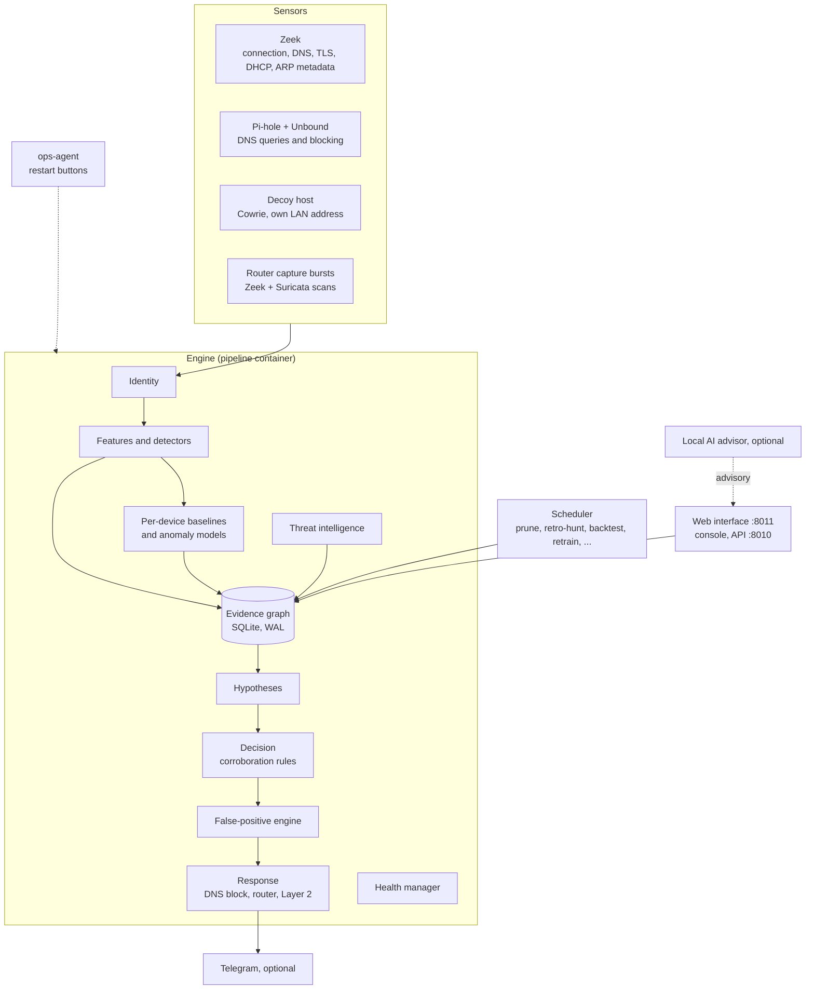
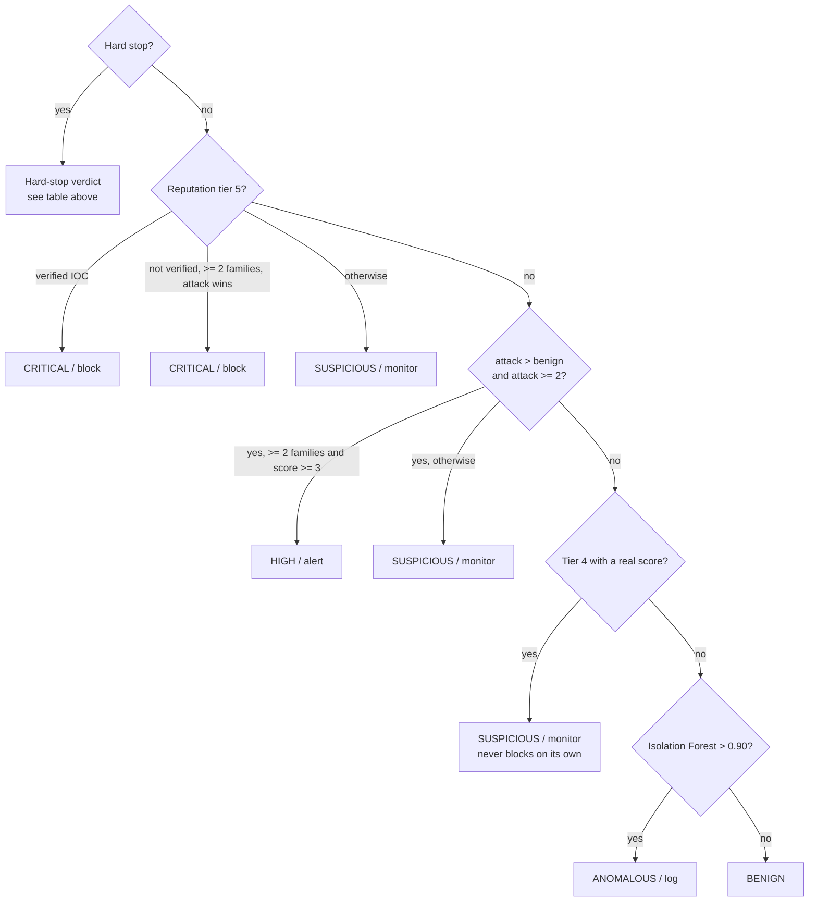

# Home-IDS Engineering Manual

How the system is built, part by part. This is the current reference: everything here describes the code as it
is today. How it got here is told in [EVOLUTION.md](EVOLUTION.md); the formal mathematics is in
[PIPELINE_MATH_REFERENCE.md](PIPELINE_MATH_REFERENCE.md); the product view is in
[PRODUCT_DESCRIPTION.md](PRODUCT_DESCRIPTION.md).

## Contents

1. [The system at a glance](#1-the-system-at-a-glance)
2. [Sensing](#2-sensing)
3. [Device identity](#3-device-identity)
4. [Features and detectors](#4-features-and-detectors)
5. [Per-device learning](#5-per-device-learning)
6. [Threat intelligence](#6-threat-intelligence)
7. [The evidence graph](#7-the-evidence-graph)
8. [Hypotheses, corroboration and the decision](#8-hypotheses-corroboration-and-the-decision)
9. [The false-positive engine](#9-the-false-positive-engine)
10. [Autotuning](#10-autotuning)
11. [Shared threat memory and the daily look-back](#11-shared-threat-memory-and-the-daily-look-back)
12. [Response](#12-response)
13. [The local AI advisor](#13-the-local-ai-advisor)
14. [Scheduled jobs](#14-scheduled-jobs)
15. [Health manager and self-healing](#15-health-manager-and-self-healing)
16. [Storage, retention and flash wear](#16-storage-retention-and-flash-wear)
17. [Web interface, console and APIs](#17-web-interface-console-and-apis)
18. [Observability](#18-observability)
19. [Updates](#19-updates)
20. [Packaging and hardware profiles](#20-packaging-and-hardware-profiles)
21. [Defaults, optional systems and what each one does](#21-defaults-optional-systems-and-what-each-one-does)
22. [Testing and verification](#22-testing-and-verification)
23. [Known limits](#23-known-limits)
24. [Roadmap](#24-roadmap)

---

## 1. The system at a glance

Home-IDS is a network intrusion detection and prevention system for homes and small offices. It runs as one Docker
Compose stack on a Raspberry Pi 8 GB (arm64) or a small x86 Linux machine, uses host networking to see the LAN, and
needs no cloud account.

| Container | Role | Memory limit (default) |
|---|---|---|
| `zeek` | Packet metadata sensor on the capture interface | 1024 MB |
| `pihole`, `unbound` | DNS filter and local recursive resolver | 256 MB, 128 MB |
| `pipeline` | The engine: ingest, identity, detection, decision, response, health manager, console API | 3584 MB, no swap |
| `scheduler` | Background jobs, one at a time, in their own memory budget | 1024 MB |
| `webui` | The consumer web interface | 256 MB |
| `ops-agent` | The only container with the Docker socket; restarts services on request, has no network | 64 MB |
| `honeypot` | The decoy host on its own macvlan address | 128 MB |
| `capture-worker`, `suricata-rules` | Scans of router capture bursts; Suricata ruleset download | 1536 MB, 512 MB |
| `prometheus`, `node-exporter` | Metrics | 512 MB, 64 MB |
| `grafana`, `loki`, `promtail` | Optional dashboards | 512 / 512 / 128 MB |

The engine loop runs about every 2 seconds. Each cycle reads new log data, resolves which device each record belongs
to, updates features, writes evidence, evaluates hypotheses for devices with fresh evidence, decides, and acts. Locks
are held only for short snapshots and commits; all slow input and output (feed lookups, router calls) happens outside
them, so one slow integration never stalls the others.

---

## 2. Sensing

| Source | What the engine takes from it |
|---|---|
| **Zeek** `conn`, `dns`, `http`, `ssl`, `notice`, `dhcp` logs | Flows, bytes, ports, connection states, DNS queries, TLS client fingerprints (JA3 and JA4), DHCP fingerprints, Zeek's own notices |
| **Zeek** MAC logging and an ARP log script | The hardware address on every flow (this is what ties a device's IPv4 and IPv6 traffic together) and ARP behaviour for spoofing and sweep detection |
| **Pi-hole** | Every DNS query per client, with the blocked/allowed outcome; also the place DNS blocks are applied |
| **Decoy host** | Any contact with its address is seen by Zeek and is a hard indicator |
| **Router capture bursts** | Short packet captures from a supported router (Fritz!Box), replayed through Zeek and Suricata in the capture worker. They give ground truth for Wi-Fi devices the wired sensor cannot see directly |
| **Router host table** | Device names known to the router |

Zeek logs are read through per-log byte cursors, so a restart resumes exactly where it stopped, with no loss and no
double counting. Cursors and other high-frequency runtime files live in a RAM-backed directory (section 16).

Zeek needs three site additions, all shipped in the image: MAC logging, the JA4 package, and a DHCP fingerprint
script. It also needs `ignore_checksums` set, because many network cards offload checksums and Zeek would otherwise
discard the client side of TLS handshakes.

---

## 3. Device identity

Every record is mapped to a stable `device_id` before any evidence is created. Identity is resolved in this order;
the first match wins:

1. **Trust anchors.** The gateway and this host are discovered automatically at start-up from the kernel's routing
   and neighbour tables; others (a NAS, a second access point) can be added. An anchor keeps one identity across all
   of its addresses and interfaces. A discovered gateway that does not match the last known good one is not adopted
   automatically.
2. **Known hardware address.** If the MAC is already bound to a device, that device is used. This is what unifies a
   dual-stack device: IPv4, IPv6 link-local, ULA and global addresses all arrive with the same MAC.
3. **Local address**, then **a non-generic hostname**, then **the MAC**, then **the raw address**, each hashed into
   a stable identifier.

**Private (randomised) MAC addresses.** Modern phones use a locally administered MAC that is stable per network.
These are bound like any other MAC, so a phone keeps its identity across reconnects. The locally administered bit is
only used to avoid learning a rotating MAC as a trust anchor's permanent address.

**Re-identification when the MAC itself changes.** When a device would otherwise start fresh under a new MAC, it is
compared with devices active in the last 30 minutes on three signals: the DHCP fingerprint (vendor class and
parameter list), overlap of the TLS client fingerprints its apps present (JA4 set similarity), and an exact
non-generic hostname. A DHCP match alone is capped below the merge bar, because identical devices share it; it needs a
second signal. Confident matches are migrated with their full history. Ambiguous ones are logged, and can trigger a
capture burst to gather more evidence. A wrong merge is treated as worse than a missed one.

**Merging fragments.** If an address already belongs to a different device than the one just resolved, the orphan
is folded into the canonical device. In the graph, the merge is a tombstone: the orphan's history stays and reads
are redirected. Containment that was applied to the old identity is released or moved.

**Address history.** Each device keeps a bounded history of the MACs (20) and addresses (50) it has used, with
last-seen times.

**Device type.** Inferred from hostname and MAC vendor, with `unknown` as an honest fallback. A user confirmation or
correction is stored as an override and re-applied to every device at once. Only an override (never a self-reported
hostname) can mark a device as infrastructure.

**Lifetime.** Devices idle for more than 7 days leave the live working set; their graph history stays until its
retention window (section 16) and they resume their identity if they return.

---

## 4. Features and detectors

Each cycle computes features per device from the DNS and Zeek streams: query rate, label entropy, unique-domain
ratio, NXDOMAIN and blocked ratios, suspicious TLD share, encoded-label and TXT/NULL record use, outbound bytes and
their z-score, beaconing measures (interval regularity, low-and-slow, uniform jitter), long and rejected connections,
port fan-out, lateral scan counts, ARP sweep and spoof signals, and the TLS fingerprint match results.

Detectors turn features into typed **evidence** (`type`, `confidence`, `destination`, `provenance`):

| Detector | Evidence it produces |
|---|---|
| DNS behaviour | `dns_rate`, `dns_entropy`, `dns_unique_ratio` |
| Threat signals | `dns_dga_burst`, `dns_tunnel_v2`, `zeek_exfiltration`, `zeek_beaconing`, `zeek_conn_abuse`, `zeek_long_conn` |
| Zeek network | `zeek_lateral_scan`, Zeek notices graded weak/medium/strong/highly deterministic, `arp_sweep`, `arp_spoof_pending`, `arp_spoofing` |
| TLS | `malicious_ja3`, `malicious_ja4`, with the source list and rule that named the fingerprint |
| DNS evasion | `dns_evasion_anomaly`: real traffic in a capture burst that the device's own DNS history cannot explain. Known VPN providers are recognised by their network owner and not flagged |
| Suricata (capture bursts) | `suricata_signature_match` with the rule and severity |
| Inline | `honeypot_access`, `geofencing_violation`, `reputation`, `ml_anomaly`, `local_device_discovery`, `first_contact` |
| Baselines (section 5) | `baseline_deviation`, `regime_change`, `markov_activity_surprise`, `markov_destination_surprise`, `markov_beaconing_surprise` |
| Cross-device (computed from the graph each cycle) | `coordinated_targeting`, `fingerprint_campaign`, `dga_seed_campaign`, `peer_deviation` |

Each alert is attributed to the destination of the evidence that actually fired (the DGA domain, the beaconing
target, the matched signature's address), not to whatever the device contacted last. Device-wide signals such as a
DNS rate burst are shown without a single destination.

---

## 5. Per-device learning

### Statistical baselines

For every device, every metric and every hour of the day, the engine keeps a conjugate Bayesian model:

| Model | Metrics |
|---|---|
| Gaussian | query rate, label entropy, unique domains, outbound bytes, risk |
| Beta | NXDOMAIN ratio, blocked ratio |
| Poisson | DGA hits, decoy touches |

Each model reports how surprising the current value is. A **Bayesian online change-point detector** (BOCPD) runs
alongside, so a genuine change of habit (a new app, a firmware update) becomes a new regime that is learned, while a
short spike stays a spike. Surprising values become `baseline_deviation` evidence; regime shifts become
`regime_change` evidence. Both are context only and never count as corroboration (section 8).

### Sequence model

A per-device **Markov model** learns how the device moves between activity states (normal, reconnaissance,
threat-intel hit, DNS anomaly, beaconing, lateral movement, exfiltration, policy violation). It is a
Dirichlet-categorical transition matrix with smoothing. It conditions on the last two states once a context has at
least 20 samples, and on the last state otherwise. Unlikely transitions become `markov_*_surprise` evidence, which can
raise the severity of an already corroborated verdict but never corroborates on its own.

### Cold start and safety

- A new device starts from a **population prior** for its device type, built nightly from devices of the same type
  whose recent backtests are clean.
- **Learning pauses during an incident.** While a device is suspicious or worse, and for 30 minutes after it returns
  to normal, its baselines and sequence model do not learn, so an attacker's behaviour is never taught as normal.
- Baseline and sequence state is saved in batches (at most every 5 minutes per tracker) to limit flash writes. A
  crash loses at most that much learning, never the model.

### Anomaly models

An **Isolation Forest** scores each device's feature vector: a global model for new devices, and a per-device model
once a device has 5,000 samples. Scoring uses a compiled, vectorised evaluator that walks all trees in lock-step
(exactly equal to the library result, without its ~21 ms per-call overhead). After a confirmed threat, the device's
samples are excluded from training for a window, so a malicious burst cannot train the model. An Isolation Forest
result alone can only produce an `ANOMALOUS` log entry.

### Local popularity

The engine learns which domains are popular on this network, and with how many devices. This feeds the allowlist
that shields common domains from weak indicators, and the popularity feature of the false-positive model.

---

## 6. Threat intelligence

**Built in, no key, licence-clean:**

| Source | Provides | Refresh |
|---|---|---|
| Emerging Threats Open ruleset (BSD), read as data | Bad IPs and networks (DROP, CINS, compromised, C2), malicious domains (DNS and TLS SNI rules), JA3 fingerprints | Daily, conditional download |
| abuse.ch Feodo Tracker | Botnet command-and-control IPs | Hourly |
| abuse.ch SSLBL | Malicious JA3 fingerprints (stale listings ignored) | Hourly |
| Pi-hole gravity | The ad and tracker blocklists Pi-hole already maintains | Pi-hole's schedule |
| iptoasn.com (public domain) | AS number, registration country and owner for any address | Weekly |
| Local confirmed intel (section 11) | Addresses and domains confirmed on this network | Live |

Downloads are conditional (version file, ETag), jittered, backed off on errors, validated (minimum size, shrink
guard) and swapped atomically; a failed or suspicious download never replaces the last good copy. Indicators age out:
the local index keeps full weight for a period after its last successful check, then decays linearly to zero, so a
unit that stops getting updates stops trusting old data. Each feed's freshness is tracked and shown in the web
interface.

**Optional, keyed (off by default for licence reasons):** AlienVault OTX, URLhaus and ThreatFox, AbuseIPDB
(blacklist and per-address score), and VirusTotal (per-destination verdicts). Their free tiers forbid commercial use;
see section 21. **Optional city-level geolocation:** MaxMind GeoLite2 files, if the user supplies a licence key or the
files.

### Reputation tiers

Every destination gets a tier: **0** local, **1** major trusted vendors, **2** known infrastructure (CDN, cloud,
advertising), **3** unclassified, **4** a single unconfirmed signal, **5** confirmed or strongly indicated malicious.
Only an unclassified destination can be raised to tier 4 or 5 by a reputation score, so a noisy score cannot turn a
known CDN into "malicious". The tier floors are tunable within bounds (section 10).

---

## 7. The evidence graph

A single SQLite database in WAL mode holds the durable record: devices, destinations, evidence, hypotheses,
decisions, containment actions, alert events, incidents, operator actions, trust edges, baselines, population
priors, threshold history and backtest runs. A polymorphic edge table connects them (`observed`, `targets`,
`supports`, `contradicts`, `merged_into`, `corroborates`, `trusts`), so a decision can be traced back to every piece of
evidence that supported or contradicted it.

- The engine owns one long-lived writer connection. Multi-statement changes (device merges, metadata updates) run in
  explicit transactions, so a power cut leaves either the old state or the new one.
- `last_seen` updates are throttled to 5-minute resolution, which removes most redundant page writes.
- Device state that changes every cycle lives in a separate SQLite state store that writes only the rows that
  changed.
- Alerts are also indexed in memory (with a compressed snapshot) so the web interface can page through 30 days of
  alerts without scanning files.

Retention is enforced by scheduled jobs (section 14) and a disk budget (section 16).

---

## 8. Hypotheses, corroboration and the decision

### Hypotheses

Each cycle, every hypothesis is scored against the device's fresh evidence on a fixed ladder: **0** (its required
evidence is absent), **2** (required evidence present), **3** (a strong supporting signal), **4** (strong signal and a
second confirming condition). A destination's reputation tier can contradict a hypothesis; the tier used is the one
for that hypothesis's own destination, not the device's busiest destination.

| Attack hypothesis | Required evidence |
|---|---|
| DNS tunnelling | Very high query rate together with high label entropy |
| Covert DNS tunnelling | Encoded labels, TXT/NULL abuse or suspicious-TLD concentration |
| DGA botnet | A burst of algorithmically generated domains |
| Network intrusion / lateral movement | Lateral scanning, a malicious TLS fingerprint, an ARP anomaly, or a medium-or-stronger Zeek notice |
| Data exfiltration | An outbound byte burst well above the device's baseline |
| C2 beaconing | Periodic connections; only the regular, single-target shape can climb alone |
| Connection abuse / port scan / internal reconnaissance | Abusive connection patterns, long-lived connections, or an ARP sweep |
| DNS evasion / policy bypass | Traffic the device's own DNS cannot explain |
| Signature-matched threat | A Suricata signature match |
| Coordinated targeting | Several devices sharing an unusual destination, TLS fingerprint or DGA seed |
| Peer-cohort deviation | Seven-day destination count at least three times the device type's average; capped at 3 |

| Benign hypothesis | When it applies |
|---|---|
| Advertising burst | High DNS volume to known advertising infrastructure |
| Device-profile telemetry | A chatty device type talking to trusted or familiar destinations, with no attack-shaped evidence at all |
| Local device discovery | UPnP / SSDP / mDNS discovery |

### Independent evidence families

Corroboration counts **families**, not items. Evidence from the same vantage point belongs to one family, so one
noisy sensor cannot pretend to be two witnesses.

| Family | Evidence types | Counts as a witness |
|---|---|---|
| DNS behaviour | DNS rate, entropy, unique ratio, DGA, covert tunnelling, DNS evasion | Yes |
| TLS fingerprint | malicious JA3, malicious JA4 | Yes |
| Network behaviour | Zeek notices (medium and above), lateral scan, connection abuse, long connections | Yes |
| Data transfer pattern | exfiltration, beaconing | Yes |
| Network reconnaissance | ARP sweep, ARP spoofing | Yes |
| Reputation | threat-intelligence match | Yes |
| Direct observation | decoy contact | Yes |
| Signature match | Suricata | Yes |
| Cross-device correlation | coordinated targeting, fingerprint and DGA-seed campaigns | Yes |
| Policy | geofencing | No |
| ML anomaly | Isolation Forest | No |
| Peer-cohort deviation, baseline deviation, regime change, sequence surprise, first contact, local discovery | | No: context, never proof |

An item only counts for a hypothesis if its destination matches that hypothesis's own evidence (or it has no
destination at all).

### Hard stops

A short registry of rules is checked before any hypothesis score:

| Hard stop | Trigger | Result |
|---|---|---|
| Decoy contact | Any contact with the decoy address by a device that is not marked safe | CRITICAL, block |
| ARP spoofing | Fresh spoofing evidence (2 minutes) | CRITICAL, block |
| Geofence | Fresh contact with a blocked country | CRITICAL only with one more independent family and attack winning; otherwise HIGH, alert only |
| Confirmed exploit | A fresh Suricata match at or above the sensitivity bar (default 0.9) | CRITICAL only when corroborated by another family; otherwise HIGH, alert only |

### The decision

If the graph-based engine ever raises an error, that one cycle is decided by the earlier, simpler engine
(`core/decision_engine.py`) instead of being dropped; the same holds for the false-positive engine (section 9).

Every decision carries a reasoning trail (hard-stop checks, reputation context, network owner, hypothesis scores,
families) and a plain-language explanation built from the same evidence labels the console shows.

---

## 9. The false-positive engine

Every alert passes through the closed-loop false-positive engine (CL-AFPE) after the decision. It can suppress an
alert's notifications and containment; it never rewrites the decision itself.

1. **Trust cache.** A destination this device has been confirmed safe with is trusted for 14 days. The trust is only
   used if the **composite trust gate** agrees: the same device, behaviour fingerprint, destination class and
   hypothesis must have been corroborated by at least two distinct evidence families. Even a trusted destination is
   re-checked against the hard stops on every alert.
2. **Stage 1, hard stops.** The decision engine already said CRITICAL; a threat-intelligence match; lateral movement
   across several targets; a malicious TLS fingerprint; decoy contact; a high abuse score (when that feed is on); an
   exfiltration burst above both a statistical and an absolute byte floor (known telemetry and CDN destinations
   excepted); or a match in the local confirmed-intel memory. Any of these means CONFIRMED_THREAT.
3. **Stage 2, a gradient-boosted classifier** (LightGBM, ONNX) over a small tabular feature vector: local popularity,
   label entropy and length, outbound-bytes z-score, device-type weight, prior false positives, lateral moves,
   port-scan intensity and protocol weight.
4. **Stage 3, semantic similarity** of the destination name to known vendor telemetry patterns (small local embedding
   model). Skipped when there is no real name to compare.

The combined score is compared with the device's own threshold (default 0.80) and an uncertainty floor (0.55):
above the threshold the alert is marked a false positive and suppressed; between the two it is published with a
low-confidence flag; below the floor it is a confirmed threat. Refusal guards keep the engine from suppressing
anything with corroborated attack evidence.

**Learning loop.** User corrections, validated false positives and confirmed threats are logged in the graph. A
nightly job retrains the classifier from this history and recalibrates the suppression, uncertainty and ARP-sweep
thresholds, globally and per device. A threshold only moves towards what the evidence supports, never below its
floor, and refuses to move when corrected and uncorrected scores overlap. Every change goes through the autotuner
(section 10), so it is versioned, canaried and reversible like any other.

---

## 10. Autotuning

Detection sensitivity is tuned automatically, inside hard limits.

**What can be tuned.** A closed allowlist of 16 parameters, each with a shipped default, hard bounds and a maximum
step per change. Every one has a live reader and an automatic proposer driven by evidence. "Less sensitive when" is
the direction that makes the system more relaxed. That is the direction that needs statistical proof (below), and
the one the drift check watches.

| Parameter | Default (range) | What it controls | Less sensitive when | Proposed from |
|---|---|---|---|---|
| `reputation_tier_suspicious_floor` | 2.0 (1.0–5.0) | The threat-intelligence or VirusTotal score a destination must exceed to count as confirmed malicious (tier 5) | Raised | Backtest detection rates |
| `reputation_tier_high_floor` | 4.0 (2.0–5.0) | The abuse score a destination must reach to count as confirmed malicious (tier 5) | Raised | Backtest detection rates |
| `hard_stop_candidate_sensitivity` | 0.90 (0.50–0.99) | The Suricata signature confidence needed for the confirmed-exploit hard stop | Raised | Synthetic attack sweep |
| `bocpd_hazard_rate` | 1/500 (1/2000–1/100) | How often the baselines expect a genuine change of habit. Higher means new habits are accepted, and real shifts flagged, sooner | Lowered | Real shifts detected late, against regimes that flap |
| `arp_sweep_unique_targets_threshold` | 8 (4–40; up at most 4, down at most 1 per step) | How many different LAN addresses a device must probe before it counts as a network sweep | Raised | Nightly calibration from corrections |
| `peer_deviation_multiplier` | 3.0 (1.5–10) | How many times more destinations than its device type's average make a device an outlier | Raised | Observed outcomes; loosen only |
| `peer_deviation_min_absolute_count` | 5 (2–20) | The minimum number of destinations before a peer comparison is made at all | Raised | Observed outcomes; loosen only |
| `fp_combined_suppress_threshold` | 0.80 (0.60–1.0) | The false-positive engine's score above which an alert is suppressed as harmless | Lowered | Nightly calibration from corrections |
| `combined_uncertain_threshold` | 0.55 (0.30–0.80) | Below this score an alert is a confirmed threat; between it and the suppress threshold it is "uncertain" | Lowered | Nightly calibration from corrections |
| `familiarity_trust_bar` | 0.60 (0.30–0.90) | How familiar a destination must be to a device to support the benign "normal device telemetry" explanation, and to let the AI advisor call it benign | Lowered | Graph evidence; lower only |
| `trust_cache_ttl_seconds` | 14 days (1–30 days) | How long a destination confirmed safe for a device stays trusted | Raised | Trusted destinations later found malicious; shorten only |
| `reputation_propagation_ttl_seconds` | 1 day (1 hour–7 days) | How long a destination's suspicious reputation keeps counting as evidence when other devices contact it | Lowered | Graph evidence; shorten only, after a minimum sample |
| `pool_gaussian_kappa`, `pool_gaussian_alpha` | 5, 10 (1–20, 1–50) | How strongly a new device's starting point (its device type's typical behaviour) outweighs its own first observations, for rates and volumes | Raised | Nightly prior build, per device type |
| `pool_beta_total` | 10 (1–50) | The same, for ratios (failed and blocked lookups) | Raised | Nightly prior build |
| `pool_poisson_rate` | 5 (1–20) | The same, for counts (DGA hits, decoy touches) | Raised | Nightly prior build |

**What can never be tuned.** The two-family corroboration minimum, family membership, the hard-stop registry, and the
rule that persistence alone never authorises containment are code, not configuration.

**Lifecycle.** propose → canary (6 hours; inert to live readers) → nightly backtest → promote, or roll back. One
proposal per parameter and scope per hour. Every change is a versioned row in `threshold_history`, never overwritten.

**Scopes.** A value resolves device first, then device type, then global. Loosening a device or category needs at
least 20 trials of every synthetic attack class at that scope, a 100% raw detection rate, and a 95% Wilson lower
bound of at least 0.85. A scope can never drift more than two steps looser than its parent. Tightening has no sample
floor, so thin evidence always errs towards scrutiny.

**Retroactive circuit breaker.** If a real signature match fell between a scope's looser value and its parent's
stricter value and that device was later confirmed compromised, the scoped value is rolled back immediately.

**Drift check.** Three or more promotions in seven days that all move towards "more benign", without a regime change
to explain them, raise an operator warning.

**The backtest** runs nightly: a golden set of real incidents, a synthetic attack sweep through the real decision
engine against an isolated in-memory copy of each device's recent graph, and the drift check. Its pass or fail gates
every promotion.

### Reading the console's Autonomy tab

The Autonomy tab in the expert console shows what the system has learned and changed by itself. Nothing on it needs a
tap.

**Tunable parameters.** One row per parameter above:

- *Current* is the value in force for the whole network (the global tier).
- *Shipped default* and *Bounds* are the limits described above.
- *Status* is **At default** or **Tuned**. Tuned means the global value has moved from its default.

A device or device type can have its own value, which takes precedence and appears under **Per-device status** and
**Per-category autotuner status**.

**Autotuner history.** Every proposal, with:

- the direction, **tightened** (more sensitive) or **loosened** (less sensitive), judged by the parameter's meaning,
  not by whether the number went up;
- old and new values;
- the status: **pending canary** (proposed, not yet in force), **promoted** (in force) or **rolled back**;
- the reason, in words.

**Composite trust: resolved.** Destinations the false-positive engine now treats as trusted for a device, and how
that was decided:

- marked as a false positive by the user;
- automatically, by the machine-learning stages;
- automatically, because the destination is one of the network's own devices and the trust was earned
  (see below).

**Composite trust: still building, and its percentages.** These are the "learning percentages". Each row is one
combination of device, alert type (hypothesis), destination class (private, multicast, telemetry, CDN or public) and
evidence family (for example DNS behaviour or network behaviour). Behind each row is a trust value from 0 to 1:

- It rises by **0.15** each time an alert of that kind, for that device and destination class, is confirmed harmless.
  This happens when the user marks it as a false positive, when the machine-learning stages suppress it, or when it
  is traffic to one of the network's own devices with clean reputation. Every evidence family in that alert rises
  together.
- It falls by **0.05 per day** while nothing confirms it, so trust that is not renewed fades.
- **The percentage is trust ÷ 0.6.** At 100% that family has reached the bar and counts as one independent witness
  that this pattern is harmless. Four confirmations close together reach 100%.

**What it changes.** When at least **two different evidence families** reach 100% for the same device, behaviour,
destination class and alert type, the false-positive engine may resolve that alert automatically: it is recorded
and visible but sends no notification and triggers no containment. One family at 100% is never enough, so a single
noisy signal repeated many times cannot earn trust. Trust is kept per behaviour regime, so after a firmware update
changes a device's behaviour it has to be earned again. Hard indicators, threat-intelligence matches and the local
confirmed-threat memory are checked on every alert regardless of trust.

The bar shows the value at its last update. Decay is applied when trust is next used, so a row that has not changed
for days may be lower than its bar shows.

---

## 11. Shared threat memory and the daily look-back

**One device protects the others.** When a destination is confirmed malicious for any device (a Stage-1 threat or a
two-family HIGH/CRITICAL verdict), its address or domain is recorded in the local confirmed-intel memory for 30 days.
Another device contacting it later is a confirmed threat immediately. It is one shared store
(`state/local_confirmed_intel.json`) for the engine, the nightly retro-hunt and the maintenance tools; every writer
re-reads it when another process changed it and saves atomically. The memory covers addresses and registrable
domains. Shared telemetry domains and protected infrastructure addresses are never recorded, so the memory cannot be
poisoned into blocking something essential. DNS
blocks also apply to every device, because they all use the same resolver.

**The look-back (retro-hunt).** Every night the scheduler re-scans the graph's history of destinations each device
contacted against the latest threat intelligence and the local confirmed-intel memory. A destination that is
malicious today becomes new `reputation` evidence for every device that touched it, and goes through the normal
decision path at the device's next cycle. Devices that touched a newly confirmed indicator before it was confirmed are
flagged, and the confirmation feeds the false-positive engine. Findings can be sent to Telegram.

---

## 12. Response

| Layer | Mechanism | When | Undo |
|---|---|---|---|
| DNS | Pi-hole exact-domain deny entry; failed calls are retried with exponential back-off and a dead-letter queue | Decision HIGH or CRITICAL | One click |
| Router | Fritz!Box TR-064 "blocked" profile on the device: internet cut, LAN kept for repair | Risk ≥ 8.5 (a corroborated HIGH or worse), or a lateral threat | One click |
| Layer 2 | ARP (IPv4) and Neighbour Discovery (IPv6) tarpit on raw `AF_PACKET` sockets: the device is told the gateway is unreachable | Risk ≥ 9.0, or a lateral threat; also armed with router isolation, because the router blocks IPv4 only | One click |

A lateral threat is lateral movement across at least two internal targets, or contact with the decoy. A verdict that
reached HIGH only by persisting for 10 minutes is displayed as HIGH but never contains or notifies, because
persistence of one weak signal is not a second witness.

**Policy.**

- **Onboarding:** the first 14 days are alert-only, so the system learns before it acts. The user can end it early.
- **Approval:** by default, router and Layer-2 isolation wait for one tap in Telegram, as they always do for
  critical device types. Lateral threats are contained at once. A single setting makes all isolation automatic. Any
  containment can be released from the web interface or Telegram.
- **Infrastructure protection:** devices marked safe (router, NAS, this host) are never contained automatically.
- **Release cooldown:** after a user releases a device, it is not automatically contained again for an hour, unless
  the threat is lateral.
- **Kill switches:** `ips_enabled: false` gives a detection-only install; `simulation_mode` logs actions without
  performing them.
- **Uncorroborated single signals** (a lone tier-4 reputation, a lone Suricata rule, an Isolation Forest outlier)
  never contain anything.

Containment state is reconciled with the router every 5 minutes and survives restarts; an identity merge moves or
releases containment with the device.

**Telling the user.** Alerts appear in the web interface and, if configured, in Telegram, with a plain-language
story (what was seen, the evidence, the counter-argument considered, the action taken, how to undo it), buttons for
approve, release and mark-as-safe, and `/release` commands. Notifications are grouped per device, target and
signature: a message is sent for a new incident, for a real escalation, or as a 15-minute "still ongoing" update.

---

## 13. The local AI advisor

Optional. If an Ollama server is configured, a scheduled job (every 4 hours) groups recent alerts, asks a local model
for a plain-language second opinion using the evidence only, and adds it to reports and digests. Output is
schema-constrained. A **deterministic validator** rejects any answer that contradicts the evidence: "benign" when a
confirmed indicator is present, when the decision was a hard stop or a corroborated attack, when attack-shaped
evidence exists, when the destination is not familiar to that device, or when the cited evidence is empty,
self-contradictory or invented. The advisor is advisory only: it cannot suppress, confirm or contain anything.

---

## 14. Scheduled jobs

The scheduler runs at most one job at a time. Each job has a priority and a flag saying whether it can be safely
paused mid-run; new jobs wait while the system is under resource pressure, with a starvation backstop of 60 minutes.

| Job | Default schedule | What it does |
|---|---|---|
| Retro-hunt | Daily 02:45 | Section 11 |
| Classifier retrain and threshold calibration | Daily 03:00 | Section 9 |
| Graph prune | Daily 03:15 | Evidence and destination history past retention |
| Disk budget governor | Daily 03:30 | Section 16 |
| Backtest | Daily 03:30 | Section 10 |
| Weak-notice prune | Every 4 hours | Removes weak Zeek notices after 12 hours (they never score) |
| Zeek log prune | Daily 04:15 | Raw Zeek day folders past 14 days |
| Population priors | Daily 04:45 | Device-type priors for cold start |
| Top destinations report | Daily 06:00 | Daily summary of the most contacted domains |
| Decision archive | Monthly | Exports, then removes, decisions past retention |
| AI advisor review | Every 4 hours | Section 13 (needs an Ollama server) |

In-process loops: the main loop (~2 s), health manager (15 s), identity reconciliation (10 min), router
reconciliation (5 min), threat-intelligence refresh (1 h), and a live configuration watcher (10 s) that applies most
settings without a restart.

---

## 15. Health manager and self-healing

A health manager inside the engine checks every component every 15 seconds.

| Component | How it is checked |
|---|---|
| Main loop, identity worker, threat-intel refresh | In-process heartbeats |
| Console API, scheduler | Cross-process heartbeat file |
| Backtest | Daily heartbeat |
| Zeek | Log freshness |
| Suricata, Pi-hole | Direct probes |
| Each feed, each job | Feed-health and job-health records |

Each component moves through HEALTHY → DEGRADED (2× its expected interval) → UNHEALTHY (5×, or 3 failed probes).
Components with a recovery action are restarted with back-off (immediately, then 30 s, 2 min, 10 min); after five
attempts the component enters SAFE_MODE with one alert, and leaves it by itself once healthy. External components
(Zeek, Pi-hole, feeds) are alert-only inside the engine and restarted by their container's restart policy or the
ops-agent.

**Resource pressure.**

| Level | Trigger | Action |
|---|---|---|
| Resource pressure | Engine memory above the first threshold | Alert, garbage collection, pause external lookups |
| Conservation | Higher memory, or high swap while already under pressure | Pause capture spot checks, wired probes and Suricata scans; slow the main loop to 10 s |
| Critical | Higher still, or system available memory under 512 MB | Immediate alert; after 3 consecutive critical checks, a clean self-restart |

Levels step down one at a time as pressure falls, and every temporary change is reverted. System-wide swap is never a
restart trigger on its own, because restarting the engine does not free other processes' memory.

Every container has a restart policy and a hard memory limit, so a misbehaving part is restarted alone. The web
interface shows every part's state and has a restart button for each, carried out by the ops-agent. Memory
profiling (tracemalloc) is available on demand and off by default, because it slows the engine.

---

## 16. Storage, retention and flash wear

| Data | Bound |
|---|---|
| Evidence | 90 days (30 on the Pi profile) |
| Per-device destination history | 30 days |
| Weak Zeek notices | 12 hours |
| Decisions | 365 days (180 on the Pi profile), exported before removal |
| Backtest runs | 90 days |
| Raw Zeek logs | 14 days |
| Capture scratch | 5 GB, oldest first |
| Container logs | 10 MB per container |
| Everything | A disk budget (20 GB by default, split between graph, Zeek logs and state) enforced nightly, deleting the oldest data first |

**Flash wear.** SD cards and small SSDs wear out from writes, so: per-cycle state is written as changed rows only;
heartbeats, cursors, control queues and capture scratch live in RAM-backed volumes; graph `last_seen` updates are
throttled; baselines, sequence models and false-positive profiles are flushed in batches; the host tuning script
enables zram swap, coalesces write-back (`dirty_expire` of 60 s or more) and sets the ext4 commit interval. Measured
on one test host: engine writes fell from roughly 10–25 GB a day to roughly 3 GB a day. Longer measurements and
measurements on Raspberry Pi hardware are still to be done.

**Crash safety.** SQLite WAL with transactions, atomic temp-file-and-rename for every file the engine writes, and
consistent backups through SQLite's backup API before updates.

---

## 17. Web interface, console and APIs

**Web interface (port 8011)**, designed for non-technical users:

| Page | What it offers |
|---|---|
| Home | One status (Protected, Learning your network, Needs your attention, Act now), the next action, recent alerts, system summary, "Turn on protection now" during onboarding |
| Devices | Every device with name, type and state; filters (active, needs a look, isolated, type guessed); confirm or correct the type; block, release, forget |
| Alerts | Plain-language alerts by severity and time range (30 days, paged) |
| Insights | Rule-based next-best-action suggestions |
| System | Every part with its health and a restart button; background jobs with Run now; threat-data freshness; resources; models; maintenance tools with a preview first |
| Integrations | Every external service with its fields, a Test button, keys stored on the box and never shown again, and its licence terms |
| Setup | Threat data (built-in sources, optional city-level data), router capture set-up and test, Pi-hole backup import |
| Password | One shared password for the web interface, console, engine API, Pi-hole and Grafana, changed everywhere at once with rollback if any service refuses |
| Expert | Every setting, with descriptions and validation, and the full detection console |

Pages are rendered on the server with gzip, long-lived static caching, prefetching and stale-while-revalidate data
caches, so they open instantly even while the engine is busy.

**Console and engine API (port 8010):** the expert detection console (evidence graph per alert, autonomy panel with
per-device tuning, health tab) and documented JSON APIs ([CONFIG_API.md](CONFIG_API.md),
[CONSOLE_DATA_API.md](CONSOLE_DATA_API.md)). Settings changed here are written as overrides, never into
`config.yaml`, and take effect live.

---

## 18. Observability

The engine exports Prometheus metrics: decisions and confidence, DNS and Zeek features, false-positive engine
efficacy, containment, feed and job health, resource pressure, and autonomy transparency (what it learned, what it
tuned, what it suppressed, what it could not do). Node exporter adds host metrics. Grafana dashboards are an optional
profile; a built-in Trends page is planned to replace them.

---

## 19. Updates

Releases are built in CI: tests, container image tarballs, and a manifest signed with Ed25519. They are fetched from a
private gateway that checks a per-device token (only its hash is stored). The device verifies the manifest against a
built-in public key, checks every digest, refuses downgrades and replays, backs up state (consistent SQLite backup),
switches, and health-checks for two minutes. If anything is unhealthy, it rolls back by itself. Updates run in a
maintenance window, on a stable or beta channel.

---

## 20. Packaging and hardware profiles

`scripts/init.sh` creates the data tree, generates secrets, seeds configuration from templates, picks a free LAN
address for the decoy, and sets ownership. `scripts/preflight.sh` checks Docker, architecture, memory, swap, write-back
tuning, the capture interface, port conflicts and the decoy address. `scripts/setup-zram.sh` applies host tuning for
small boards.

`hardware_profile` (`pi_8gb`, `x86_16gb`, `custom`) scales caches, retention, per-cycle work and capture limits. Release
images are built for amd64; the arm64 build needs a native arm runner and is pending.

---

## 21. Defaults, optional systems and what each one does

Everything the licences allow is on by default. The table lists every optional part, what it adds when enabled, and
how to enable it.

| System | Default | What it does when enabled | How |
|---|---|---|---|
| Decoy host | **On** | A fake SSH/Telnet machine on a free LAN address; any contact is a hard stop | Automatic; `HONEYPOT_AUTO=0` to opt out |
| Suricata scans | **On** | Signature scanning of router capture bursts (ET Open rules) | `suricata` profile |
| Router capture bursts | **On**, inert until a router is set up | Short Wi-Fi captures on triggers (new device, ARP sweep, DNS anomaly, high-severity alert, ambiguous identity, wired probe, periodic spot check), within hourly count, byte and disk budgets | Set up the router under Setup |
| Router integration (Fritz!Box) | Off until configured | Device names, router-level isolation, capture bursts | Integrations |
| All scheduled jobs | **On** | Section 14 | — |
| Autotuner | **On** | Section 10 | `autotune_enabled` |
| Baseline scoring | **On** | Section 5 | `baseline_scoring_enabled` |
| Geofencing | **On** (RU, KP, IR) | Contact with listed countries is a hard stop, CRITICAL only when corroborated | `geofencing_countries` |
| Response | **On**, after 14-day onboarding | Section 12 | `ips_enabled`, `onboarding_mode_days` |
| Approval for isolation | **On** | Router and Layer-2 isolation wait for one tap | `interactive_blocking_enabled: false` makes them automatic |
| Telegram | Off until configured | Alerts, approvals, release commands, digests, retro-hunt findings | Integrations: bot token and chat ID; optional chat allowlist |
| Local AI advisor | Off until configured | Section 13 | Integrations: Ollama server address |
| Keyed feeds: OTX, URLhaus, ThreatFox | **Off (licence)** | More indicators of malicious addresses, domains and URLs | `scripts/enable-licensed-feeds.sh` with a licence, plus keys |
| AbuseIPDB | **Off (licence)** | Abuse blacklist and per-address abuse scores (can reach tier 5) | Same script, plus key |
| VirusTotal | **Off (licence)** | Antivirus-engine verdicts per destination | Same script, plus key |
| MaxMind GeoLite2 | Off | City-level location in alerts and maps (country and owner are built in) | Setup → Threat data: key or file |
| Dashboards (Grafana, Loki, Promtail) | Off (heavy on small boards) | Pre-built Grafana dashboards and log search | Add `dashboards` to `COMPOSE_PROFILES` |
| Unbound forwarding | Recursive by default | Forward DNS to chosen resolvers over TLS | `UNBOUND_MODE=forward` |
| More decoy addresses | One | Decoys on other subnets or VLANs | `honeypot_ips` |
| Trust anchors | Auto-discovered gateway and host | Extra infrastructure that keeps one identity across addresses | `network.trust_anchors` |
| cgroup isolation for scans | Off | Runs Suricata scans in a CPU-limited systemd slice | Needs `loginctl enable-linger` once |
| Detection-only / simulation | Off | No containment / containment only logged | `ips_enabled: false` / `simulation_mode: true` |
| Network-activity archive | Off | Unbounded diagnostic copy of activity; for short investigations only | `archive_network_activity_backup` |
| Memory profiling | Off | tracemalloc snapshots for diagnosing growth | On demand from the console |
| Automatic updates | On, once a device is provisioned | Section 19 | Updater `config.json` |

---

## 22. Testing and verification

- About 160 test scripts cover the decision engine, every hypothesis, families, hard stops, identity, merges, the
  false-positive engine, autotuning gates, the health manager's state machines, storage (changed-row writes, flash
  wear, atomic merges), the web interface (every page and button), packet builders for the Layer-2 tarpit, the
  updater (signature, digest, downgrade, rollback) and the repository sync guards.
- The nightly **backtest** replays real incidents and a synthetic attack sweep through the real decision code.
- **Decision replay** re-runs any historical decision's real evidence through the current code to show whether a
  change would alter it.
- **Threat hunt** queries the graph directly ("every device that ever touched X", "the full evidence timeline of this
  decision").

---

## 23. Known limits

- Not yet validated on real Raspberry Pi hardware; resource budgets come from an x86 test host.
- No independent security assessment yet.
- The wired sensor sees Wi-Fi devices only through the router; on an all-in-one router, Layer-2 containment of Wi-Fi
  clients does not reach them, and router isolation is used instead.
- The shared threat memory covers addresses and domains, not TLS fingerprints.
- Removing a device-type override leaves the device on its last overridden type; automatic type inference does not
  resume for it.
- Router integration supports Fritz!Box today.
- Marking an alert as safe is done from the Telegram alert; the web interface offers release and block only.

---

## 24. Roadmap

- **Periodicity detector** for slow, jittery command-and-control beaconing (an autocorrelation or Fourier method over
  per-destination connection times). It will run in shadow mode as an evidence source that never counts alone, so its
  real detections and false positives (NTP, update checks) can be measured first. Planned only after resource
  measurements on Raspberry Pi hardware.
- Mark-as-safe from the web interface.
- Built-in Trends page replacing Grafana; Loki and Promtail removed.
- Remaining JSON stores (learned profiles, alerts) moved into SQLite.
- Managed-switch and VLAN isolation (UniFi, MikroTik); more router integrations.
- WireGuard roaming protection; encrypted-traffic analytics; opt-in, privacy-preserving fleet learning.
- Activation-code first-boot set-up for non-technical buyers.
