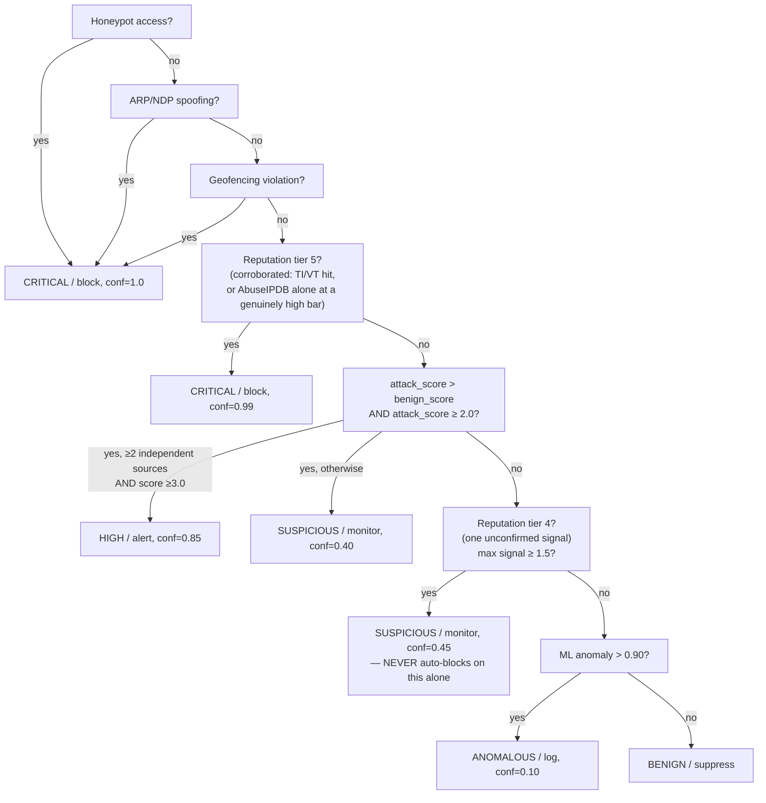

# ⚙️ Home-IDS: Engineering & Architecture Manual

This manual is written for developers, security engineers, and data scientists. It explores the internal mathematics, system architecture, and code-level orchestration of Home-IDS.

Unlike the User Manual (which explains *how to use* the system), this document explains exactly **how the system is built** and **why the mathematics work**.

**A note on accuracy**: an earlier revision of this document described an `asyncio`-based event loop, a Fourier-transform diurnal-rhythm analysis, and a learned, per-device Markov transition matrix that "mathematically approaches 0.0001" over months of history — none of which exist anywhere in this codebase. Every claim below has been checked directly against the running source (file and line references included) rather than carried forward from that earlier description.

---

## 📋 Table of Contents
1. [Core Architecture & The Real-Time Pipeline (`pipeline.py`)](#1-core-architecture--the-real-time-pipeline-pipelinepy)
2. [The Hypothesis & Evidence Engine (HEE)](#2-the-hypothesis--evidence-engine-hee)
3. [Machine Learning Methodologies](#3-machine-learning-methodologies)
4. [Temporal Mathematics & Baselining](#4-temporal-mathematics--baselining)
5. [The Autonomous Self-Calibration Loop](#5-the-autonomous-self-calibration-loop)
6. [Mitigation Pipeline & IPS Integrity](#6-mitigation-pipeline--ips-integrity)

---

## 1. Core Architecture & The Real-Time Pipeline (`pipeline.py`)

The heart of Home-IDS is `src/core/pipeline.py`. It is a **threaded** (`threading.Lock`/`threading.RLock`, background `threading.Thread` daemon workers) execution loop — there is no `asyncio` anywhere in this codebase. High throughput comes from disciplined lock scoping, not from an event loop.

### 1.1 Ingestion & File Cursors
Home-IDS fuses two data streams:
1. **Pi-hole (SQLite)**: polled on `poll_interval` (default 2s) by `pihole_collector.py`.
2. **Zeek NDR (JSON Logs)**: tailed continuously by `zeek_collector.py`.

**The `tail -F` problem**: naive file trailing loses events across a restart (or duplicates them, depending on how you recover). The fix is a cursor file per Zeek log type (`state/zeek_cursor_conn.json`, `_dns.json`, `_http.json`, `_notice.json`, `_ssl.json`, `_dhcp.json`) storing the exact byte offset processed so far. On restart, the collector seeks to that offset before resuming.

### 1.2 The 5-Phase Execution Loop
Verified against the actual `# ─── PHASE N:` comments in `pipeline.py`'s device-evaluation loop:

```python
# ─── PHASE 1: Snapshot state data (short lock window) ───────────────────
# ─── PHASE 2: Pre-fetch Zeek data outside the lock ──────────────────────
# ─── PHASE 3: Compute localized features (re-acquire lock) ──────────────
# ─── PHASE 4: Expensive I/O outside the lock ────────────────────────────
# ─── PHASE 5: ML scoring + risk computation (re-acquire lock) ───────────
```

1. **Phase 1 (short lock)**: copy the device's current baseline variables (rate/entropy/variance state) into local memory, release immediately.
2. **Phase 2 (no lock)**: parse raw Zeek dictionaries — purely functional, no shared state touched.
3. **Phase 3 (short lock)**: compute local temporal features (z-scores, entropy) against the snapshot from Phase 1.
4. **Phase 4 (no lock)**: HTTP calls to OTX/AbuseIPDB/VirusTotal, and (if configured) GeoIP/ASN lookups. This is the phase that matters most for throughput — if a threat-intel API is slow or unreachable, the pipeline does not hold the state lock while it waits, so every other device's evaluation this cycle is unaffected.
5. **Phase 5 (short lock)**: push the computed feature matrix into the Hypothesis Engine, ML scorer, and CL-AFPE; commit the decision.

Separate `Evidence`-generating detectors (`intelligence/detectors/*.py`, `intelligence/hypotheses/engine.py`) run inside Phase 5's window, consuming only already-computed feature values — no additional I/O, no additional feature extraction of their own.

### 1.3 Cross-Address-Family Device Identity (MAC Correlation)

One physical device shows up on the network under multiple, unrelated-looking addresses over its lifetime — a DHCPv4 lease, a SLAAC/privacy-rotated IPv6 address that changes periodically, an IPv6 link-local address — and without correlation each of those would cold-start its own separate `DeviceState`, permanently fragmenting that device's actual behavioral baseline across several never-merged, statistically-thin profiles instead of one continuous one.

`extractors/zeek_features.py`'s `_bind_mac(ip, mac)` is the single correlation point both ingestion paths feed: the DHCPv4 branch of `ingest()` (IPv4 only — a lease is inherently IPv4-only) and `_process_conn()`'s read of `conn.log`'s `orig_l2_addr` field (protocol-family-agnostic — this is what makes IPv6 addresses correlatable at all). `core/identity.py` resolves a device_id by MAC first when one is bound, falling back to per-IP cold-start only when no binding exists yet. `tests/test_phase6_mac_correlation.py` exercises this end-to-end, including the specific case of an IPv6 link-local address correctly resolving to the same `device_id` as that device's already-known IPv4 identity.

**Critical, easy-to-miss deployment dependency**: `orig_l2_addr` is not in `conn.log` by default — it only appears once Zeek's `policy/protocols/conn/mac-logging.zeek` is loaded (`@load` line in the real site-policy file, `$(zeek-config --site_dir)/local.zeek` — for a `zeekctl`-managed install from the `security:zeek` OBS package this is typically `/opt/zeek/share/zeek/site/local.zeek`, **not** `/etc/zeek/local.zeek`; run `zeek-config --site_dir` to confirm on your own install. See `INSTALL.md` §3.3.1). Without it, `_bind_mac()` has nothing to bind for any non-DHCPv4 traffic — the code path is correct and tested, but silently idle. This was true of this project for some time before being caught: the mechanism was built, tested, and referenced in a source comment as "see the Phase 6 README" for its one-line deployment step, but that step was never actually written into the install guide, so IPv6 correlation was live in code but inert in practice. If you're investigating why the same physical device appears to have many entries in the Master Threat Ledger with `hostname` values that are raw IPv6 addresses rather than a resolved name, this is the first thing to check.

### 1.3.1 When the MAC itself changes (Phase 4 fuzzy re-identification)

§1.3 above only helps a device that keeps the *same* MAC across address changes. It does nothing once the MAC itself rotates — which modern phones increasingly do (iOS "Private Wi-Fi Address," Android's per-network randomized MAC) — since `_bind_mac()` has no shared key left to correlate on.

`core/device_matching.py` is a separate, deliberately conservative fuzzy-matching pass for exactly this case, invoked from `StateManager.get_or_create()` via `identity.py`'s `_reidentify_kwargs()` whenever `resolve_device_id()` is about to cold-start a device under a brand-new MAC. It compares the new identity against every device seen within `identity_reidentify_window_seconds` (default 1800s) on two independent signals:

- **DHCP fingerprint** (`dhcp_fingerprint_match()`): exact match on Option 60 vendor class + Option 55 parameter list. A *device-class* signal, not a unique-device one — two identical-firmware IoT units present an identical fingerprint (confirmed on the project's own network) — so this alone tops out at confidence 0.40, below both thresholds.
- **JA3 TLS-fingerprint overlap** (`ja3_overlap()`): Jaccard similarity of the set of TLS client fingerprints (not just malicious ones) a device's apps have presented over time — a real behavioral signal, since a given phone's app mix tends to be stable session-to-session.

`match_confidence()` combines these (plus an exact non-generic-hostname match as a third, weaker corroborator): a DHCP match alone never clears `AUTO_MERGE_CONFIDENCE` (0.75) on its own, but DHCP + decent JA3 overlap does, and strong-enough JA3 overlap (≥0.5 Jaccard) can clear the bar with no DHCP fingerprint at all — the higher-leverage signal to get working first if only one is feasible. Below `MIN_CANDIDATE_CONFIDENCE` (0.45) a candidate isn't even logged. This is a probabilistic match by design, not a guarantee — a wrong merge silently blends two different devices' security history, judged worse than a missed one, so the bar stays conservative rather than optimistic. Tested in `tests/test_phase4_reidentify.py`.

**Same class of deployment gap as §1.3**: both signals need Zeek-side data this project doesn't ship by default. JA3 requires the third-party `zeek/salesforce/ja3` package (`zkg install`, not stock Zeek). DHCP fingerprint fields need a small custom script, `zeek_scripts/local-dhcp-fingerprint.zeek` in this repo, written against Zeek's documented DHCP analyzer API but not verified live (Zeek scripts fail loudly at `zeekctl deploy` time if wrong, not silently). See `INSTALL.md` §3.3.2 for both deployment steps and verification commands.

---

## 2. The Hypothesis & Evidence Engine (HEE)

Located in `src/core/decision_engine.py` (state machine + evaluation order) and `src/intelligence/hypotheses/` (the hypothesis classes themselves), the HEE replaces a single additive risk score with a typed evidence graph.

### 2.1 The Evidence Store
```python
Evidence(
    type="zeek_lateral_scan",
    source="zeek",
    value=450,               # raw S0/REJ packet count
    confidence=0.90,         # sensor reliability
    independence_group="zeek_network",
)
```
`independence_group` prevents evidence-stuffing: two anomalies from the same underlying sensor category collapse into one vote when counting independent sources toward an escalation decision — a single noisy sensor cannot manufacture apparent corroboration by tripping multiple related signals at once.

`EvidenceStore.get_for_device()` also applies age-based decay: general behavioral evidence has a 10-minute TTL, reputation evidence a 24-hour TTL, with linear freshness decay inside that window (`effective_weight() = confidence × freshness`).

### 2.2 Hypothesis Scoring
Each `Hypothesis` subclass (`hypotheses/engine.py`) evaluates required, strong, and contradicting evidence and returns a 0–4 confidence score:
- **0.0** — required evidence absent, hypothesis doesn't apply.
- **2.0 (Suspicious)** — required evidence present, nothing more.
- **3.0 (Probable)** — required + at least one strong corroborating signal, no contradiction.
- **4.0 (High)** — required + strong + no contradiction + (for some hypotheses) reputation tier supports it.

Seven attack hypotheses are registered: `DNS_TUNNELING` (rate+entropy burst — distinct from the newer, richer `DNS_COVERT_TUNNELING`), `NETWORK_INTRUSION`, `DGA_BOTNET_C2`, `DATA_EXFILTRATION`, `C2_BEACONING`, `DNS_COVERT_TUNNELING` (encoded labels / TXT-NULL abuse / suspicious-TLD concentration), `CONNECTION_ABUSE`. One benign hypothesis, `ADVERTISING_BURST`, actively competes against the attack hypotheses for domains under known ad-network reputation tiers.

### 2.3 The Decision Order (`decision_engine.py`)
Evaluated strictly in this sequence — a hard-stop earlier in the list always wins:



**Why tier 4 exists as its own branch (fixed in 8.0)**: before this branch existed, a reputation signal that never rose to "confirmed" (tier 5) had exactly one path through this function — silence. The gap between "99% Confirmed Malicious IOC" and "nothing at all" was a single classification threshold in `reputation/classifier.py`. This was found by tracing a real production alert: a connection to Telegram's own infrastructure reached `CRITICAL`/auto-block purely from a single AbuseIPDB score, with VirusTotal and ThreatIntel both clean. `reputation/classifier.py`'s confirmed-IOC threshold for AbuseIPDB alone is now `≥4.0` (aligned with the exact bar `fp_engine.py`'s own hard-stop check already used for the same metric — previously the two disagreed, `>2.0` vs `≥4.0`, for the identical input). VirusTotal and ThreatIntel — curated, multi-vendor, or blacklist-backed signals — keep the lower `>2.0` bar; they're more authoritative single-source signals than a crowd-sourced abuse-report aggregate.

Every evaluation builds a `reasoning_trail` (list of strings) alongside the decision — hard-stop check results, reputation context (tier, VT/TI/AbuseIPDB values, and now IP ownership via ASN lookup), hypothesis scores, and the final verdict with an explicit note when neither an attack nor a benign hypothesis found supporting evidence ("this rests on reputation context alone"). This is what Telegram alerts render under **🧭 REASONING**, and what `ollama_soc.py`'s LLM prompts now also receive (`alert_payload["reasoning_trail"]`) for better-grounded analysis.

### 2.4 Kill-Chain Phase & the Markov Anomaly Signal
`extractors/dns_features.py` classifies each device's recent window into one of `NORMAL / RECON / LATERAL / C2` using simple threshold rules over already-computed features (e.g. beaconing count + suspicious TLD ratio → `C2`; lateral-move count + S0/REJ count → `LATERAL`). This is **not** a separate model — it's a deterministic function of numbers already computed elsewhere.

The "Markov anomaly" score is a small, deliberately simple addition on top: a hand-authored, static transition-probability table (`_MARKOV_TRANSITIONS`) maps `(previous_phase, current_phase) → probability`, e.g.:
```python
"NORMAL":  {"NORMAL": 0.90, "RECON": 0.08, "C2": 0.01, "LATERAL": 0.01, "EXFIL": 0.00}
"C2":      {"NORMAL": 0.20, "RECON": 0.10, "C2": 0.60, "LATERAL": 0.05, "EXFIL": 0.05}
```
The anomaly score is `1.0 − transition_prob`. This is an analyst-estimated kill-chain progression model, not a per-device learned Markov chain — it doesn't change based on a device's individual history, and there is no `MarkovStateTracker` class or NxN learned matrix anywhere in the code.

---

## 3. Machine Learning Methodologies

### 3.1 `ml_engine.py` — Bespoke IsolationForests
`scikit-learn`'s `IsolationForest`, chosen because it requires no labeled training data.
- **Global model** (`models/ids_model.pkl`): trained on aggregate home-network traffic, the default scorer for new/unwarmed devices.
- **Bespoke per-device fork** (`models/devices/<id>.pkl`): once a device passes `ml_warmup_samples` (default 5,000), a personalized model forks for that device specifically.
- **Anti-poisoning**: `reject_threat()` opens a 120-second exclusion window after a confirmed threat, during which `learn_normal()` calls for that device are skipped — a confirmed-malicious sample can no longer train the model to think its own behavior is normal.

### 3.2 `fp_engine.py` — CL-AFPE
Prevents Brain 1 from blocking legitimate traffic before containment fires. Three stages, evaluated in order, each cheaper than the last is expensive:

1. **Stage 1 — hard-stop filter** (<1ms): confirmed TI IOC, active lateral movement, malicious JA3/JA4 fingerprint, honeypot access, AbuseIPDB ≥4.0, or an exfiltration payload-burst z-score >5.0. Any hit bypasses everything else — `CONFIRMED_THREAT`, no ML consulted. Re-run on **every** trust-cache hit too, not just first evaluation — an immunized domain can never permanently blind the system to a later confirmed IOC on the same registrable domain.
2. **Stage 2 — LightGBM ONNX classifier** (<2ms): 9-dimensional tabular feature vector (Tranco rank, label entropy, label length, outbound-bytes z-score, device-type weight, historical-FP flag, lateral-moves, port-scan intensity, app-protocol weight) → `P(false positive)`.
3. **Stage 3 — FastEmbed semantic similarity** (<15ms): `bge-small-en-v1.5`, 384-dim embeddings, cosine similarity against ~50 known-safe vendor telemetry patterns. **As of 8.0, this stage is skipped entirely when there's no real domain/hostname to compare** (a raw-IP connection has `domain="unknown"`, and scoring that literal string against vendor embeddings was producing a real-looking but meaningless similarity number that materially swayed the combined suppression decision — found by tracing the same Telegram-infrastructure alert mentioned in §2.3). When skipped, the combined score falls back to LightGBM alone at full weight rather than silently blending in a zero.

Combined score = `0.45 × LGBM + 0.55 × Embed` (or `LGBM` alone if Stage 3 was skipped). Compared against **the requesting device's own calibrated threshold if one exists, else the global default** (`get_device_suppress_threshold()` — new in 8.0, see §5).

All four Stage 2/3/combined thresholds are read via a fresh `self.config.get(...)` call on every evaluation — no cached copy anywhere in the path, so a `config.yaml` edit or an autonomous override takes effect on the very next alert.

### 3.3 `scripts/ollama_soc.py` — Batch LLM Analyst
Runs out-of-band, every 4 hours, launched by `scripts/scheduler.py` as a fresh subprocess — never in the real-time per-alert path. (An earlier real-time analyzer class, `intelligence/ollama_analyzer.py`, was instantiated at boot but its only method was never actually called from anywhere in the codebase — a permanently-idle background thread polling an empty queue for the lifetime of every process. Removed in 8.0.)

Groups the last 24h of published, non-suppressed alerts by `device_id + target + signature` before querying anything — a single recurring pattern costs one LLM call regardless of how many times it fired. Checks a 7-day verdict cache (`state/ollama_analysis_cache.json`) before that one call, and hard-caps fresh calls per run (default 5) — added after a live diagnostic call to the actual production Ollama server measured **849 seconds of `total_duration` for a trivial "say hello" prompt**, while the model's own reported load+eval durations summed to only ~13 seconds; the remaining ~836 seconds was pure CPU-contention queueing on the host hardware.

`intelligence/ai_soc.py`'s `DeterministicValidator` is the hallucination guardrail: it reconstructs the alert's reputation evidence from persisted feature values (`max(ti_risk, abuseipdb_risk, vt_risk)`) and rejects any "benign" LLM verdict where that reconstructed evidence shows a confirmed IOC (`≥4.0`) or contradicts a "just telemetry" claim (`≥3.0`). Validated corrections call `fp_engine.mark_false_positive(..., source="llm_validated")` — same mechanism as an operator's Telegram correction (`source="operator"`), distinguished only by an audit-log tag so downstream consumers (the self-calibration pass, §5) can pool or separate the two evidence sources.

---

## 4. Temporal Mathematics & Baselining

Rolling statistical baselines, not static thresholds, implemented in `src/core/state_guard.py`.

### 4.1 Exponentially Weighted Moving Average (EWMA)
$$ \mu_t = \alpha \cdot x_t + (1 - \alpha) \cdot \mu_{t-1} $$
`baseline_alpha` (default 0.05) controls memory. A small $\alpha$ resists sudden spikes — a fresh infection cannot quickly poison the baseline into thinking its own traffic is normal.

### 4.2 Welford's Online Algorithm for Variance
$$ \sigma^2_t = (1 - \alpha) \cdot (\sigma^2_{t-1} + \alpha \cdot (x_t - \mu_{t-1})^2) $$
$$ Z = \frac{x_t - \mu_t}{\sigma_t} $$
Computed incrementally — no need to retain the full sample history in memory. $Z > 3.0$ is a 3-sigma anomaly (top ~0.3% of the statistical distribution for that feature).

### 4.3 Per-Hour Rate Anomaly Bound
Distinct from the general EWMA/z-score baselining above: `pipeline.py` maintains a **per-hour-of-day** rate baseline (`state.rate_baseline`, 24 buckets) and computes a live anomaly bound every cycle:
$$ \text{threshold\_limit} = \text{rate\_mean}_h + \text{threshold\_std\_dev} \times \sqrt{\text{rate\_var}_h} $$
where $h$ is the current hour and `threshold_std_dev` (default 3.0) is read live from config. This is exported as the `home_ids_query_rate_threshold_limit` telemetry gauge for operator visibility — it is **not** a scheduled "weekly autotune" recalculation of `alert_threshold`; it's computed fresh every ~2-second cycle, purely for that hour's rate baseline.

### 4.4 Shannon Entropy for DGA Detection
`src/utils.py`:
$$ H = -\sum_{i=1}^{n} P(x_i) \log_2 P(x_i) $$
High entropy ($H > 3.2$ for labels ≥12 chars, with digit-ratio and vowel-ratio guards to avoid flagging legitimate brand-name-plus-hash patterns) combined with a high NXDOMAIN ratio is the DGA/botnet-C2-hunting signal.

---

## 5. The Autonomous Self-Calibration Loop

New in 8.0. Full mechanics in the User Manual §3 — this section covers the implementation specifics relevant to extending it.

`scripts/train_fp_classifier.py` runs `calibrate_suppress_threshold()` — one function, shared by both the global calibration pass and the per-device pass (different `current`/`min_samples` arguments, not two parallel implementations that could quietly drift apart):

```python
def calibrate_suppress_threshold(corrected_fp_scores, uncorrected_uncertain_scores,
                                  current, min_samples=AUTOTUNE_MIN_SAMPLES):
    if len(corrected_fp_scores) < min_samples:
        return None, "not enough evidence"
    lowest_corrected = min(corrected_fp_scores)
    if uncorrected_uncertain_scores and max(uncorrected_uncertain_scores) >= lowest_corrected:
        return None, "ambiguous overlap — refusing"
    candidate = max(lowest_corrected - SAFETY_MARGIN, ABSOLUTE_FLOOR)
    candidate = min(candidate, current)  # never raises
    if candidate >= current:
        return None, "no change needed"
    return candidate, "<full audit reason string>"
```

Evidence is pulled from `state/autonomous_muted.jsonl` (both `OPERATOR_MARKED_FALSE_POSITIVE` and `LLM_VALIDATED_FALSE_POSITIVE` entries — pooled for the global pass, grouped by `device.id` for the per-device pass) cross-referenced against each corrected alert's *original* CL-AFPE combined confidence, which `pipeline.py` now persists into every alert record as `alert_payload["fp_verdict"]` (verdict/confidence/stage) — this field didn't previously exist, so there was no data to calibrate against at all before 8.0.

Two independent triggers run this same function: the scheduler's standalone daily 3am cron invocation of `train_fp_classifier.py`'s `main()`, and `fp_engine.py`'s own internal 7-day in-process retrain thread (`_weekly_retrain_loop()`) — both now call `run_threshold_calibration()` after their respective model-retrain step, regardless of whether that retrain succeeded (calibration reads a different, if overlapping, slice of the same evidence and shouldn't be gated on ONNX export success).

Output is written via `_write_config_override()` (global → `state/config_overrides.json`) or `AutonomousFPEngine.apply_device_fp_profile()` (per-device → `state/device_fp_profiles.json`, the same architectural home as the existing per-device sigma-shift and trust-cache state). Both are plain JSON, read by `config.py`'s `LiveConfig._load_overrides()` (global) or `fp_engine.py`'s `get_device_suppress_threshold()` (per-device) respectively — neither ever touches `config.yaml`.

---

## 6. Mitigation Pipeline & IPS Integrity

`src/mitigation/ips.py`, engineered for fail-safe resilience.

### 6.1 Layer 7 (Pi-hole Sinkhole)
POST to Pi-hole v6's `/api/domains/deny/exact` endpoint (`{"domain": [domain], "comment": ...}`); release is a DELETE to `/api/domains/deny/exact/{domain}`. Both the list-type (`deny`) and match-kind (`exact`) live in the URL path, not the request body — a live test against a running Pi-hole v6 instance is what surfaced this; the URL shape this code used before always 404'd. On failure, the domain enters a thread-safe retry queue with exponential backoff (`30s × 2^attempts`), falling to a dead-letter queue after 5 attempts. Automatically retried on subsequent cycles.

### 6.2 Layer 3 (Fritz!Box WAN Sever)
TR-064 SOAP API. Applies a "Blocked" profile to the infected MAC, severing WAN access while leaving LAN access intact for remediation. Only reachable at `risk_score ≥ 8.5` or an active lateral-movement flag — and only actually fires if `ips_router_enabled` is set and (when `interactive_blocking_enabled` is true) an operator has approved it.

### 6.3 Layer 2 (Scapy ARP/NDP Tarpit)
The most aggressive mitigation, `risk_score ≥ 9.0` or lateral movement. A daemonized Scapy thread forges ARP (IPv4) and NDP (IPv6) responses telling the infected device the gateway's MAC is unreachable, blackholing its outbound traffic at Layer 2 even if Layer 3 isolation fails or is disabled.

### 6.4 The `interactive_blocking_enabled` Fix (8.0)
Previously, the Telegram "🔒 Approve Hardware Isolation" button and the "⏳ WAITING FOR APPROVAL" status text appeared on **every** alert whenever `interactive_blocking_enabled` was true — including `SUSPICIOUS`/monitor-only alerts where `mitigate()` never reached either isolation branch (both gated behind the 8.5/9.0 risk floors above). The bug: `pipeline.py`'s post-processing checked only "does the containment status contain the word UNBLOCKED", with no check on whether anything was actually pending. Found by tracing a real alert where the decision engine said `SUSPICIOUS / monitor` and the Telegram message simultaneously said `WAITING FOR APPROVAL` — a direct contradiction. Both the status-text override and the inline-button attachment are now gated on `risk ≥ 8.5 or lateral_threat`, matching `mitigate()`'s own floor exactly.
