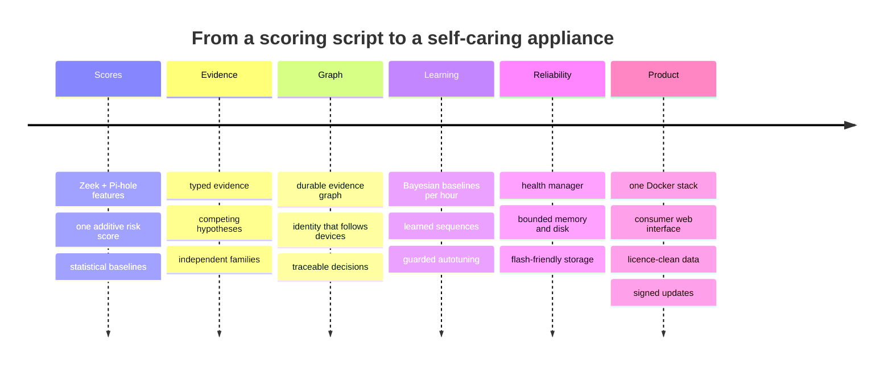

# How Home-IDS Evolved

Home-IDS was built and run on a real home network, and most of its design came from what that network showed it.
This page tells that story: which problems turned up, and what the system does now because of them. The current
design is described in [ENGINEERING_MANUAL.md](ENGINEERING_MANUAL.md).

## 1. From one risk score to weighed evidence

The first version added signals into a single risk score and alerted above a threshold. It caught real problems,
but it could not say *why*. Several weak signals from the same sensor could also add up to a serious alarm.

The system now turns every signal into typed **evidence** and lets **hypotheses** compete for it: attack
explanations against benign ones. A serious verdict needs two **independent evidence families**, so one noisy sensor
cannot pretend to be two witnesses. A middle tier for "a single unconfirmed reputation signal" was added after a real
alert showed the gap. One crowd-sourced abuse score, with every other source clean, was enough to block a major
messaging service's infrastructure. That case now ends at SUSPICIOUS and never blocks on its own.

## 2. From memory to a durable evidence graph

Evidence used to live in memory with a short lifetime, so a decision could not be traced later and a restart lost
context. The engine now writes everything into an **evidence graph** in SQLite: devices, destinations, evidence,
hypotheses, decisions and actions, linked by edges. Any decision can be traced to the exact evidence that supported
or contradicted it, replayed against new code, or hunted across all devices. The false-positive engine's trust became
graph edges as well, so "why is this trusted?" has an answer.

The graph engine first ran in shadow beside the original one, and was compared on live traffic before it took over.
Once it had proven itself, the switch back was removed, and then the earlier engine itself: the duties it still
carried (per-device familiarity, confirmed-threat counts, training records, model reloading) moved into the graph
engine, and its state files are imported once on first start. There is no standby engine. If the engine raises an
error, that cycle is recorded as not evaluated and reported to the health manager, and the false-positive engine
publishes the alert as uncertain rather than hiding it.

## 3. Identity that follows devices

Early on, one phone could appear as several devices: an IPv4 address, several IPv6 addresses and a private Wi-Fi MAC
each started a fresh, thin profile. The identity layer now binds addresses through the hardware address seen on every
flow, treats the gateway and other infrastructure as **trust anchors** discovered automatically, re-identifies a device
whose MAC changed by its DHCP and TLS fingerprints, and merges fragments while keeping their history.

One lesson came from production within minutes of a first deployment. Excluding randomised MACs from identity
fragmented exactly the phones it was meant to protect, because modern phones keep a stable private MAC per network.
That rule now applies only to learning an infrastructure device's permanent address.

## 4. From fixed thresholds to learning that cannot be gamed

Fixed thresholds and simple moving averages became **per-device, per-hour Bayesian baselines** with change-point
detection. A device's routine is now learned too: a hand-written table of kill-chain transition probabilities became
a **learned per-device Markov model**. New devices start from a prior for their type instead of from nothing.

Autonomy grew in the same careful steps. Sensitivity is tuned by an **autotuner** that may change only an allowlist
of parameters, in small steps. Each step is tried in canary, gated by a nightly backtest of real incidents and
synthetic attacks, and rolled back automatically. The local language model once had the authority to suppress alerts.
That authority moved to these backtest-gated mechanisms, and the model is now an advisor whose output a deterministic
validator can veto. The rules that protect users are code, not settings, so no amount of learning can loosen them.

## 5. Accuracy, one real alert at a time

Many rules exist because a specific real alert was wrong:

- **Attribution.** Alerts are tied to the destination that actually fired, not the device's most recent connection.
- **Signature matches.** A lone Suricata rule match used to contain a device on its own. It now needs corroboration,
  because a single rule can be noisy.
- **Geofencing.** It needs corroboration before it blocks.
- **Coordinated targeting.** Shared household infrastructure (a NAS every device talks to) is excluded, so normal
  homes do not look like coordinated attacks.
- **DNS evasion.** The detector recognises VPN providers by network owner, after a legitimate VPN app looked exactly
  like an infected device hiding its lookups.
- **TLS fingerprints.** They now say which list named them and why, after a stock operating-system fingerprint was
  reported as "known bad".

## 6. Reliability under real limits

The engine was once stopped by the kernel's out-of-memory killer, and a 2 GB memory limit was later measured to
restart it every 10 to 45 minutes. The answers were:

- a **health manager** that watches every part, restarts what breaks with back-off, and steps down through
  resource-saving levels before memory runs out;
- memory limits per container, chosen from measurement;
- a **resource-aware scheduler** that runs one background job at a time.

A disk audit found raw Zeek logs that had grown to 7.5 GB with nothing ever deleting them. Every kind of data now has
a retention window, and a **disk budget governor** holds the whole system under a hard ceiling.

Profiling found that one library call took about 21 ms per device per cycle, so an exact, vectorised Isolation-Forest
evaluator replaced it. Measurements of SD-card wear led to:

- writing only changed rows;
- keeping hot files in RAM;
- throttling and batching graph updates;
- tuning the host's write-back.

On the test host, engine writes fell from roughly 10–25 GB a day to roughly 3 GB a day. Measuring this on a
Raspberry Pi is the next step.

## 7. From a project to a product

The system was packaged as one Docker stack with a consumer web interface, so anyone can run it. Every external
dependency was checked against what a sold product may ship:

| Need | Licence-clean answer |
|---|---|
| Threat indicators | The Emerging Threats Open ruleset (BSD), read as data, replaces keyed personal-use feeds |
| Geolocation | iptoasn.com (public domain) replaces a keyed database that may not be redistributed |
| Popular domains | Learned on the network itself, replacing a list with a non-commercial component |
| Layer-2 containment | Own raw-socket code replaces a GPL packet library |

The personal-use feeds remain available for licensed installs. Updates became signed, verified on the device, and
rolled back automatically. Everything the licences allow is on by default, including a decoy host that picks its own
address.

## 8. How the work is done

Each change starts from evidence on the real network, is verified against the running code, and lands with tests.
That adds up to about 160 test scripts, a nightly backtest of real incidents, and published design reviews with written
responses. Where a document and the code disagreed, the document was corrected. The dated engineering records behind
this page are kept in [records/](records/README.md).
