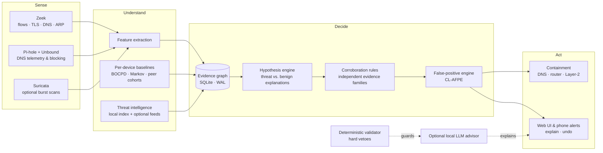

# Home-IDS — product description

*Edge network security for the home and the small office: enterprise-style detection, running on a box you own.*

## 1. In one page

Home-IDS is a network security appliance designed to run entirely at the edge — on a Raspberry Pi 8 GB or any small x86
Linux box — without a cloud account, a subscription, or your traffic leaving the building. It watches every device on
the network, learns what is normal **for each one**, reasons about what it sees as competing explanations backed by
independent evidence, and acts only when the evidence justifies it: block a bad destination, cut a device off, or ask
you — in plain language, with a one-tap answer.

Its guiding principle is **a quiet system that is hard to fool**: nothing at the top severities fires on a single
anomaly, every alert carries the evidence behind it, and every automatic action can be undone.

## 2. How it works

1. **Sense.** Zeek and Pi-hole/Unbound observe flows, TLS handshakes and DNS; Suricata can scan short packet captures
   (opt-in).
2. **Understand.** Features are extracted per device. Each device has its own behavioural baseline (Bayesian online
   change-point detection and Markov models per metric and hour), plus comparison against peers of the same type, and
   a fast Isolation-Forest anomaly score. Threat intelligence (a local index and optional feeds) adds reputation.
3. **Decide.** Every observation becomes typed, timestamped **evidence** in a SQLite evidence graph. A **hypothesis
   engine** weighs, for example, "this device is running a DGA botnet" against benign explanations such as an
   advertising burst or a known device profile. At the top severities the decision engine enforces **corroboration across
   independent evidence families** — a Zeek notice plus a threat-intelligence match, not two readings of one signal.
4. **Check itself.** A second system (CL-AFPE) grades the first: it suppresses what it is confident is benign,
   remembers why, and keeps a revocable record. It never hides a hard indicator.
5. **Act, proportionately.** Block the destination; cut the device off the internet but keep it reachable on the LAN;
   quarantine fully (strongest evidence only). New installs start in a **learning period** with alerts on and automatic
   blocking off.

### The optional local AI advisor
A language model running locally (Ollama) can explain an alert in plain words. It never decides alone: a
**deterministic validator** sits between the model and the system and holds hard-coded vetoes, so the model cannot
override deterministic proof of an attack and a hallucination or prompt injection cannot cause an action.

## 3. The evidence graph (data integrity)

At the centre is a strictly typed SQLite datastore in WAL mode.

- **Causal attribution.** Evidence names the destination that actually triggered it (for example the address that
  received the bytes in an exfiltration signal, or the domain whose queries were periodic in a beacon). Where none can be
  determined, the evidence carries *no* destination rather than a guessed one — so evidence about one destination can
  never corroborate an attack on another.
- **Audit-preserving merges.** When an IP and a MAC address are recognised as one physical device, the graph merges
  identities by *tombstoning* — the old identity stays as a pointer, so the full history remains traceable. Merges run in
  a single transaction.
- **Crash safety.** Writes are batched into transactions (WAL, `synchronous = NORMAL`), so a power cut loses at most the
  last uncommitted batch and never leaves a half-written update.

## 4. Built for small hardware

- **Bounded by design.** O(1) ring buffers for event windows, per-hardware-profile database cache sizing (48 MB for a Pi
  8 GB — a conservative first setting, to be tuned on real Pi hardware), a cap on events per cycle, and hard per-service
  memory limits for the whole container stack.
- **Fast where it counts.** The anomaly model is evaluated by an exact, vectorised evaluator that replaces a ~21 ms
  per-call scikit-learn path (its tests assert numerical equality with scikit-learn).
- **A health manager** watches every component, switches the engine into resource-saving modes under memory pressure,
  restarts what is unhealthy, and degrades gracefully: if threat-intelligence lookups fail because the internet is down,
  the engine keeps deciding on local behavioural evidence.
- **Flash-friendly.** Persistent state is stored as changed rows only; files rewritten every few seconds and temporary
  capture files live in RAM volumes; timestamps are refreshed at most every five minutes; baseline statistics are
  written in batches; host settings coalesce write-back and keep the system journal in RAM. On a test host this cut the
  engine's disk writes from roughly 10–25 GB/day to about 3 GB/day.

## 5. Consumer-grade experience

- **Progressive disclosure.** A single status — *Learning your network*, *Protected*, *Needs your attention*, *Act now* —
  with detail one click away; network forensics are turned into plain-language alert stories.
- **One-click control.** Block or release any device, confirm or correct its type, restart any part of the system,
  run maintenance tools with a preview first.
- **Every integration in one place**, each with a real **Test** button, and keys that are stored on the box and never
  shown again.
- **Safety nets.** Router, NAS and other critical infrastructure can be protected from automatic blocking; an
  automatic action can always be released with one click; the learning period keeps a new install from acting before it
  knows your network.
- **Private by default.** Nothing leaves the network except optional threat-intelligence lookups you enable; signed
  updates are fetched from a private gateway with a per-device token, verified against a built-in public key, and rolled
  back automatically if the new version is unhealthy.

## 6. Add-ons

**Available today**

| Add-on | What it adds |
|---|---|
| Decoy (honeypot) | A fake vulnerable host; any contact is high-confidence proof of lateral movement |
| Wi-Fi capture & scans | Short router-side packet captures scanned with Zeek and Suricata rule sets |
| Dashboards | Grafana, Loki and Promtail for power users (being replaced by a built-in Trends page) |
| Local AI advisor | Plain-language explanations from a local model, behind the deterministic validator |
| Telegram | Alerts and approvals on a phone |

**Ideas (not built)**

- **Managed-switch / VLAN integration** (UniFi, MikroTik): drop a compromised device into an isolated VLAN at the switch
  port, instead of containing it with Layer-2 techniques.
- **Roaming protection:** a WireGuard server so phones and laptops on public Wi-Fi route through the box.
- **Encrypted-traffic analytics:** metadata-based detection of malware inside TLS without decrypting it.
- **Opt-in, privacy-preserving fleet learning:** sharing anonymised threat fingerprints so many installations learn
  normal IoT behaviour and novel command-and-control servers faster.

## 7. Where it stands — plainly

| Area | Status |
|---|---|
| Detection engine, evidence graph, hypotheses, baselines, CL-AFPE | Built; running against a real home network for months; ~160 automated test scripts |
| Consumer web UI, integrations, per-part restarts, signed updates | Built; exercised end to end on the test host |
| Raspberry Pi 8 GB | Designed and budgeted for it; **not yet validated on real Pi hardware** (development and soak testing so far on an x86 box) |
| Flash-wear reductions | Measured and applied; to be re-measured on a Pi |
| Independent security assessment | Not done; internal audits only (published in the engineering repository) |
| Wi-Fi visibility | Depends on the router: an all-in-one router shows Wi-Fi traffic only partly; documented limits |

Home-IDS is a detector that helps a person decide. It does not guarantee protection, and nothing here replaces updates,
good passwords and common sense.

## 8. Further reading

The engineering documents — architecture, the mathematics, decisions and audits — are in the public showcase
repository: <https://github.com/gsaket-sky/home-ids>.
