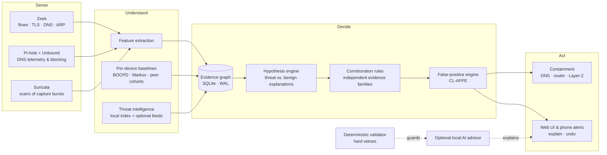

# Home-IDS — product description

*Edge network security for the home and the small office: enterprise-style detection, running on a box you own.*

## 1. In one page

Home-IDS is a network security appliance designed to run entirely at the edge — on a Raspberry Pi 8 GB or any small x86
Linux box — without a cloud account, a subscription, or your traffic leaving the building. It watches every device on
the network, learns what is normal **for each one**, reasons about what it sees as competing explanations backed by
independent evidence, and acts only when the evidence justifies it: block a bad destination, cut a device off, or ask
you — in plain language, with a one-tap answer.

Its guiding principle is **a quiet system that is hard to fool**: nothing at the top severities fires on a single
anomaly, every alert carries the evidence behind it, and every automatic action can be undone.

## 2. How it works

1. **Sense.** Zeek and Pi-hole/Unbound observe flows, TLS handshakes and DNS. A decoy host on its own address catches
   anything probing the network. With a supported router, short Wi-Fi captures are scanned by Zeek and Suricata.
2. **Understand.** Features are extracted per device. Each device has its own behavioural baselines (Bayesian models per
   metric and hour of day, with change-point detection) and a learned model of its usual sequence of activity. It is also
   compared with peers of the same type, and scored by a fast Isolation-Forest anomaly model. Threat intelligence (a local index and optional feeds) adds reputation.
3. **Decide.** Every observation becomes typed, timestamped **evidence** in a SQLite evidence graph. A **hypothesis
   engine** weighs, for example, "this device is running a DGA botnet" against benign explanations such as an
   advertising burst or a known device profile. At the top severities the decision engine enforces **corroboration across
   independent evidence families** — a Zeek notice plus a threat-intelligence match, not two readings of one signal.
4. **Check itself.** A second system (CL-AFPE) grades the first: it suppresses what it is confident is benign,
   remembers why, and keeps a revocable record. It never hides a hard indicator.
5. **Act, proportionately.** Block the destination; cut the device off the internet but keep it reachable on the LAN;
   quarantine fully (strongest evidence only). New installs start in a **learning period** with alerts on and automatic
   blocking off.

### The optional local AI advisor
A language model running locally (Ollama) can explain an alert in plain words. It never decides alone: a
**deterministic validator** sits between the model and the system and holds hard-coded vetoes, so the model cannot
override deterministic proof of an attack and a hallucination or prompt injection cannot cause an action.

## 3. The evidence graph (data integrity)

At the centre is a strictly typed SQLite datastore in WAL mode.

- **Causal attribution.** Evidence names the destination that actually triggered it (for example the address that
  received the bytes in an exfiltration signal, or the domain whose queries were periodic in a beacon). Where none can be
  determined, the evidence carries *no* destination rather than a guessed one — so evidence about one destination can
  never corroborate an attack on another.
- **Audit-preserving merges.** When an IP and a MAC address are recognised as one physical device, the graph merges
  identities by *tombstoning* — the old identity stays as a pointer, so the full history remains traceable. Merges run in
  a single transaction.
- **Crash safety.** Writes are batched into transactions (WAL, `synchronous = NORMAL`), so a power cut loses at most the
  last uncommitted batch and never leaves a half-written update.

## 4. Built for small hardware

- **Bounded by design.** O(1) ring buffers for event windows, per-hardware-profile database cache sizing (48 MB for a Pi
  8 GB — a conservative first setting, to be tuned on real Pi hardware), a cap on events per cycle, and hard per-service
  memory limits for the whole container stack.
- **Fast where it counts.** The anomaly model is evaluated by an exact, vectorised evaluator that replaces a ~21 ms
  per-call scikit-learn path (its tests assert numerical equality with scikit-learn).
- **A health manager** watches every component, switches the engine into resource-saving modes under memory pressure,
  restarts what is unhealthy, and degrades gracefully: if threat-intelligence lookups fail because the internet is down,
  the engine keeps deciding on local behavioural evidence.
- **Flash-friendly.** Persistent state is stored as changed rows only; files rewritten every few seconds and temporary
  capture files live in RAM volumes; timestamps are refreshed at most every five minutes; baseline statistics are
  written in batches; host settings coalesce write-back and keep the system journal in RAM. On a test host this cut the
  engine's disk writes from roughly 10–25 GB/day to about 3 GB/day.

## 4a. Plug in, and forget it

The goal is peace of mind: you plug it in, it learns your network, and it looks after itself. There is nothing to tune.
It was not designed on paper and left there. It has run for months on a real home network, and each round of that run
produced measurements and fixes, summarised below.

**It tunes itself.** Per-device baselines, the false-positive engine and the detection thresholds all learn from your
traffic, and a learning period stops a new install from acting before it knows what is normal. The settings you would
otherwise have to adjust are chosen from the hardware it finds (cache profiles, memory budgets, capture limits).

**Disk cannot fill up.** Every kind of data has a bound:

- Packet-metadata logs are pruned by age, and a disk-budget governor deletes the oldest days first if free space runs low.
- Container logs are size-capped, and the alert, evidence and device stores are trimmed to fixed retention windows.
- Short-lived working files (live status, capture scratch, control queues) sit in RAM, not on the disk.

**Memory cannot creep up.** Each service has a hard memory limit, so one runaway part is restarted instead of taking
the box down. The engine's limit was set from measurement: a smaller limit was observed to restart it every 10 to 45
minutes, so the shipped value is the measured safe one. Caches and history are ring buffers or capped, and
per-cycle work is capped. Memory profiling is available on demand and costs nothing while off. It was found to be
a source of slowdown when left running, so it ships off.

**It restarts what breaks.**

- A health manager checks every part every 15 seconds: the engine's own loops, the console and scheduler, Zeek,
  Pi-hole, Suricata, each threat feed, each background job, and the engine's memory.
- When a part stops responding or falls behind, it restarts that part, with increasing pauses between attempts.
  Under memory pressure it moves to resource-saving modes first, and a stuck part does not stop the rest. Disk use is
  enforced nightly by the disk-budget governor.
- Containers also restart automatically after a crash or a reboot.
- If the internet or a threat-intelligence feed goes away, the status page says so plainly and detection carries on with
  local evidence.

**It survives power cuts and flash wear.** State is held in SQLite with write-ahead logging, so a sudden power loss
leaves the last committed state intact. Only changed rows are written, the hot paths are batched, and the operating
system's write-back is coalesced. In one measurement, engine writes on a test host dropped from roughly 10 to 25 GB a day
to roughly 3 GB a day. The measurement is being repeated over longer windows and on Raspberry Pi hardware.

**It updates itself safely.** Signed updates are checked against a built-in key and applied with an automatic rollback
if the new version does not come up healthy.

**What this does and does not promise.** The design targets unattended multi-year operation on a small board, and every
mechanism above exists and is covered by the automated tests. What has been observed is months on a home network, not
years, and not yet on Raspberry Pi hardware, so the long-run claim is a design goal that has not been proven.

## 4b. Knows every device, and remembers it

**Identity that survives disguises.** Modern phones and laptops change their network address, and many use a
"private" hardware address. A naive tool then sees a new stranger every time. The identity layer follows a device by
several signals together (hardware address, network addresses, its self-announced name) and keeps a durable history of
the addresses each device has used. When one device has been seen under several identities, they are merged into one,
with its history, baselines and your labels kept. Phones that use a stable private address per Wi-Fi network are
handled as the same device across reconnects. Routers, NAS boxes and other infrastructure are recognised as such
and protected from automatic blocking.

**IPv4 and IPv6, together.** Both address families are tracked and attributed to the same device, so a device cannot
hide by switching from one to the other. The Layer-2 containment tools cover IPv6 neighbour discovery as well as IPv4 ARP.

**Nothing is forgotten.** Devices, their types and your corrections, learned baselines, evidence, alert history, and
the address history are all stored transactionally. A restart, an update, a crash or a sudden loss of power returns
the system to where it was, not to a blank learning period.

**Device types you can correct once.** The system guesses what each device is. Confirm or change a guess once and
that answer is kept and reapplied permanently.

## 4c. It tunes itself, within safe limits

- **Continuous learning.** Per-device baselines, per-hour and per-metric, keep adapting as habits change. The
  false-positive engine learns which patterns are benign for this network and remembers why.
- **A closed-loop autotuner.** Detection sensitivity can be adjusted automatically, but only through a fixed list of
  allowed parameters. Each change is small, rate-limited, versioned and audited. It is first tried in shadow mode,
  must pass a back-test against recorded history, and is rolled back if it does not hold up.
- **Guard rails that cannot be tuned.** The rules that protect you are fixed in code, not settings: a serious alert
  always needs independent corroboration, and one weak signal alone can never trigger automatic containment. The
  autotuner has no path to change them.
- **Hardware-aware.** Cache sizes, work per cycle and memory budgets are chosen for the machine it finds.
- **What it tunes:** 16 parameters, each with a live reader and an automatic proposer. They cover reputation
  thresholds, the confirmed-exploit sensitivity, how readily a change of habit is accepted, peer-comparison limits,
  reconnaissance thresholds, and the false-positive engine's thresholds and trust lifetimes. Loosening anything for one
  device or device type needs statistical proof (a 95% lower bound on detection of at least 0.85 from at least 20
  trials per attack type). Tightening needs none, because it errs towards scrutiny.

## 4d. Stays current, and looks back

**Evolving threats.** Threat intelligence is refreshed on a schedule: a local index of known-bad addresses, domains and
fingerprints, plus optional feeds you enable with your own keys. The system watches the freshness of each feed. If one
goes stale or starts failing, the status page says so plainly instead of silently protecting you less, and detection
carries on with the evidence it has locally. The detection models are also retrained on a schedule from what the
system has seen on your network.

**Yesterday's traffic, judged by today's knowledge.** Many threats are only recognised days or weeks after they
first appear. A scheduled retro-hunt job re-scans the stored history of every destination each device has contacted
against the latest intelligence. When something that looked harmless at the time is now known to be malicious, the
finding is written back as new evidence against the device that touched it. It goes through the normal decision path,
so it is weighed, corroborated and explained like any other alert, and you can be notified. If one device's contact with
a newly confirmed threat reveals other devices that touched the same indicator earlier, those are flagged too, and the
system learns from the confirmation.

So you are covered against new threats as they appear, and against old ones that only become known today.

## 4e. Automatic by design, human-overridable

The system is designed to run completely on its own: sensing, learning, tuning, deciding, acting, cleaning up,
updating and repairing itself. It does not need your active input, and it keeps getting better with time, because its
baselines, its false-positive memory and its sensitivity all improve as it sees more of your network.

You are never locked out. Human feedback is welcome, always optional, and always wins:

- **Correct a device type** once and it stays corrected.
- **Block or release** any device with one click. A release is respected: after you release a device, it is not
  automatically isolated again for an hour, unless it is attacking other devices.
- **Protect** infrastructure such as the router or a NAS, so it is never contained automatically.
- **Mark an alert as safe** (from the phone alert) and the false-positive engine learns from it and remembers why.
- **Choose how much autonomy it has.** A new install starts with a 14-day alert-only learning period, then protection
  switches on automatically (or earlier at one click). By default the heaviest actions, cutting a device off the network,
  ask for a one-tap approval on your phone. A single setting makes even those fully automatic, and another turns all
  active response off for a detection-only install.

The defaults favour trust: it acts alone where being wrong is cheap and reversible, and asks where being wrong would be
disruptive. Its own automatic changes are small, logged and reversible, and the rules that guard against careless action
cannot be changed by the learning.

## 4f. Two witnesses, and one for all

**Corroboration: no conviction on one witness.** A single odd signal is a hint. Serious alerts (HIGH or CRITICAL)
need at least two independent kinds of evidence to agree, such as unusual behaviour plus a known-bad reputation, or a
suspicious domain pattern plus a malicious connection fingerprint. Two signals derived from the same underlying fact do
not count twice: they are grouped into one evidence family. A weak signal on its own, or one that merely persisted for a
long time, can never trigger automatic containment. The only exceptions are two hard indicators that are strong enough
alone: contact with the decoy, and ARP spoofing. Even a Suricata exploit signature or a contact with a blocked country
needs a second, independent sign before it is treated as critical.

**One device's threat protects all the others.** When any device is confirmed to be talking to a malicious address or
domain, that indicator is saved in a local threat memory that grows with your network. If a different device later
contacts the same destination, it does not have to earn its way to a verdict again from scratch: it is treated as a
confirmed threat at once. DNS blocks of a bad domain also apply to the whole network, because every device uses the same
resolver. A destination's suspicious reputation is shared too: for a tuned period it counts as evidence when other
devices contact it. The daily look-back (section 4d) applies the same idea to the past: when a new confirmation shows another
device touched that indicator earlier, that device is flagged too.

The memory is time-limited (30 days by default), because malicious infrastructure is often abandoned or reused. It
covers addresses and domains. It does not yet share malicious connection fingerprints between devices.

## 4g. What it learns about each device

Every device gets its own profile, built from its own behaviour and kept up to date:

- **Who it is:** its type (phone, TV, thermostat, laptop, router and so on), the names and addresses it has used, and
  any correction you made.
- **How busy it normally is:** how many lookups it makes, how many different sites it talks to, and how much data it
  sends out.
- **What its normal traffic looks like:** how random-looking the site names it uses are, how often its lookups fail, and
  how often they are blocked.
- **When it is normally active:** each of these is learned separately for each hour of the day, so a TV that streams
  every evening is not suspicious at 8 p.m., and the same traffic at 3 a.m. stands out.
- **How its behaviour usually flows:** the usual sequence of what it does next (quiet, browsing, bursts of activity),
  so an unfamiliar sequence is noticed even when no single number looks odd.
- **When its habits genuinely change:** it tracks shifts, so a legitimate change, such as a new app or a new family
  member, is learned, while a sudden spike is treated as a spike.
- **Which of its alerts were harmless:** the sites and behaviours that turned out to be benign for this device, and why.

Three safeguards keep the learning honest. A new device starts from what is typical for its type instead of from
nothing. A device that is under suspicion stops learning until it has been calm for a while, so an attacker's behaviour
is never taught to the system as normal. Learned profiles are saved safely and are kept across restarts and power loss.

## 5. Consumer-grade experience

- **Progressive disclosure.** A single status — *Learning your network*, *Protected*, *Needs your attention*, *Act now* —
  with detail one click away; network forensics are turned into plain-language alert stories.
- **One-click control.** Block or release any device, confirm or correct its type, restart any part of the system,
  run maintenance tools with a preview first.
- **Every integration in one place**, each with a real **Test** button, and keys that are stored on the box and never
  shown again.
- **Safety nets.** Router, NAS and other critical infrastructure can be protected from automatic blocking; an
  automatic action can always be released with one click; the learning period keeps a new install from acting before it
  knows your network.
- **Private by default.** Nothing leaves the network except optional threat-intelligence lookups you enable; signed
  updates are fetched from a private gateway with a per-device token, verified against a built-in public key, and rolled
  back automatically if the new version is unhealthy.

## 6. What is included, and what is optional

Everything the licences allow is on by default. The **decoy host** is part of the product, not an add-on. It is a
fake vulnerable machine on its own LAN address, chosen automatically. No real device has a reason to touch it, so any
contact is high-confidence proof that something on the network is probing.

| Part | Default | What it does when enabled |
|---|---|---|
| Decoy host | **On** | A tripwire for intruders moving around the network |
| Suricata scans | **On** | Signature scans of captured traffic |
| Wi-Fi capture bursts | **On**, once a supported router is connected | Short captures when something needs a closer look, within hourly and disk budgets |
| Router integration (Fritz!Box) | When configured | Device names, cutting a device off the internet at the router, captures |
| All scheduled jobs | **On** | Retention, disk budget, nightly look-back, retraining, backtests, priors, reports |
| Autotuner, baselines, geofencing | **On** | Self-tuning, per-device learning, country rules that need corroboration |
| Automatic response | **On**, after the 14-day learning period | DNS blocks; isolation asks for one tap by default |
| Telegram | When configured | Alerts, approvals, "mark safe" and release from a phone |
| Local AI advisor (Ollama) | When configured | Plain-language second opinions, advisory only, behind the deterministic validator |
| Keyed threat feeds: OTX, URLhaus, ThreatFox, AbuseIPDB, VirusTotal | **Off: licence** | More reputation sources. Their free tiers forbid commercial use; a licensed install enables them with one script and its own keys |
| City-level geolocation (MaxMind) | Off | City and coordinates in alerts; country and network owner are built in |
| Dashboards (Grafana, Loki, Promtail) | Off | Charts and log search for power users; heavy on small boards, and being replaced by a built-in Trends page |

The full list, including expert switches such as detection-only and simulation modes, is in the
[Engineering Manual](https://github.com/gsaket-sky/home-ids/blob/main/Documentation/ENGINEERING_MANUAL.md#21-defaults-optional-systems-and-what-each-one-does).

**On the roadmap (not built yet)**

- **A periodicity detector** for slow, jittery command-and-control beaconing (autocorrelation or Fourier analysis of
  each destination's connection times). It will first run in shadow mode and never count as evidence on its own, so
  its real detections and its false positives (time sync, update checks) can be measured, and it will be enabled
  only after resource measurements on Raspberry Pi hardware.
- **Mark as safe from the web page.** Today this is done from the phone alert.
- **A built-in Trends page** replacing Grafana.
- **Managed-switch / VLAN integration** (UniFi, MikroTik): move a compromised device into an isolated VLAN at the
  switch port, instead of containing it with Layer-2 techniques. Support for more routers.
- **Roaming protection:** a WireGuard server so phones and laptops on public Wi-Fi route through the box.
- **Encrypted-traffic analytics:** detecting malware inside TLS from metadata, without decrypting it.
- **Opt-in, privacy-preserving fleet learning:** sharing anonymised threat fingerprints, so many installations learn
  normal IoT behaviour and new command-and-control servers faster.
- **Activation-code set-up** for non-technical buyers.

## 7. Where it stands — plainly

| Area | Status |
|---|---|
| Detection engine, evidence graph, hypotheses, baselines, CL-AFPE | Built; running against a real home network for months; ~160 automated test scripts |
| Consumer web UI, integrations, per-part restarts, signed updates | Built; exercised end to end on the test host |
| Raspberry Pi 8 GB | Designed and budgeted for it; **not yet validated on real Pi hardware** (development and soak testing so far on an x86 box). Release images are built for x86 today; the arm64 build is pending |
| Flash-wear reductions | Measured and applied; to be re-measured on a Pi |
| Independent security assessment | Not done; design reviews and internal audits only (published in the engineering repository) |
| Wi-Fi visibility | Depends on the router: an all-in-one router shows Wi-Fi traffic only partly; documented limits |

Home-IDS is a detector that helps a person decide. It does not guarantee protection, and nothing here replaces updates,
good passwords and common sense.

## 8. Further reading

- [Engineering Manual](https://github.com/gsaket-sky/home-ids/blob/main/Documentation/ENGINEERING_MANUAL.md): the
  whole system, part by part.
- [Pipeline Mathematics](https://github.com/gsaket-sky/home-ids/blob/main/Documentation/PIPELINE_MATH_REFERENCE.md):
  every formula and constant.
- [How it evolved](https://github.com/gsaket-sky/home-ids/blob/main/Documentation/EVOLUTION.md): the problems the real
  network revealed, and what the system does now because of them.
- [Engineering records](https://github.com/gsaket-sky/home-ids/tree/main/Documentation/records): dated audits and
  investigations.
