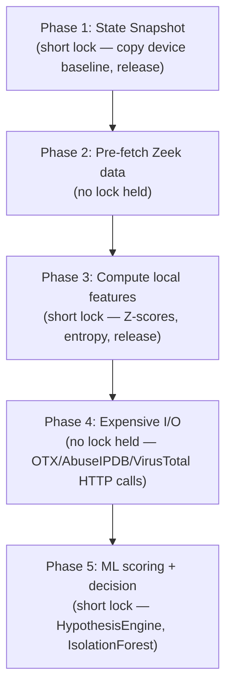
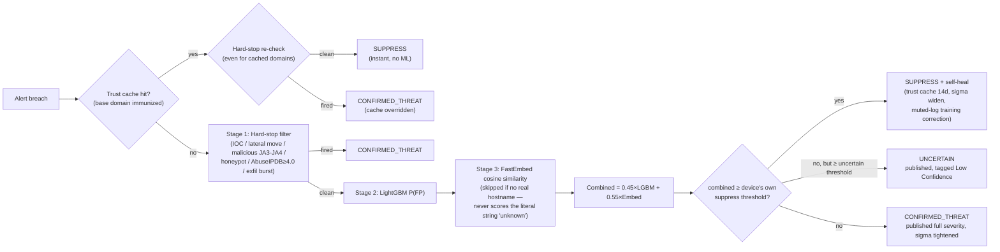
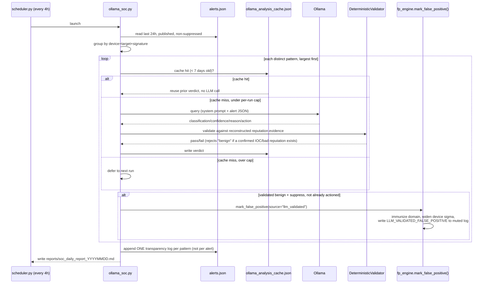
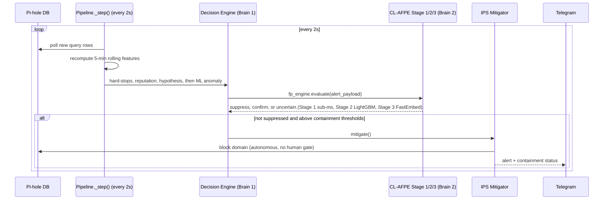
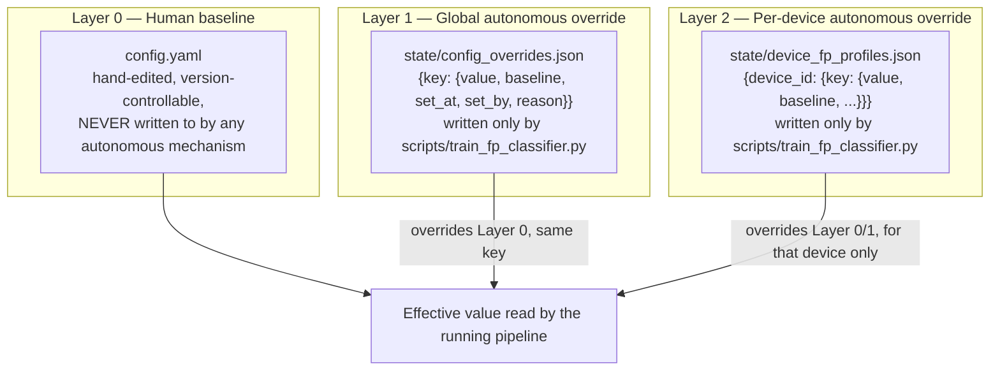

# 🛡️ Home-IDS: The Exhaustive Master Manual & Architecture Guide (Version 14)

Welcome to the definitive reference documentation for **Home-IDS**.

This manual covers the Argus Evidence Graph and Hypothesis Evidence Engine (HEE) —
the live, primary decision engine as of Argus/v14 — how evidence is created and
pruned, and exactly how a decision is reached; the older Tri-Brain architecture
description (still accurate for CL-AFPE and the Ollama batch reviewer, and still
present as a fallback decision path); an exhaustive breakdown of every
configuration parameter in `config.yaml`; the autonomous self-calibration/override
layer; a complete guide to every file in the state repository; service lifecycle
management; testing protocols; complete Prometheus telemetry mappings; a full
threat-category reference; and how-to guides for the Console and Grafana
dashboards.

**Every technical claim in this document was verified directly against the running source code as of this revision** — not carried forward from an earlier draft. Where an earlier version of this manual described something that doesn't actually exist in the code (an `asyncio` event loop, a learned Markov transition matrix, Fourier-transform diurnal analysis, a "weekly autotune job that recalculates `alert_threshold` from historical standard deviation"), it has been corrected or removed rather than repeated. If you are maintaining, debugging, or extending this script, every piece of knowledge here should match what `grep` finds in `src/`.

---

## 📋 Table of Contents
1. [🧬 The Argus Evidence Graph & Decision Engine (Primary)](#-the-argus-evidence-graph--decision-engine-primary)
2. [🌟 The Tri-Brain Architecture & Internal Data Flow](#-the-tri-brain-architecture--internal-data-flow)
3. [⏱️ The Automation Timeline: Sequence, Cadence & Latency](#%EF%B8%8F-the-automation-timeline-sequence-cadence--latency)
4. [🤖 Autonomous Self-Calibration & The Override Layer](#-autonomous-self-calibration--the-override-layer)
5. [⚙️ The Comprehensive Configuration Dictionary (`config.yaml`)](#%EF%B8%8F-the-comprehensive-configuration-dictionary-configyaml)
6. [📁 Exhaustive State & File System Reference](#-exhaustive-state--file-system-reference)
7. [🔄 Service Lifecycle: Warm vs. Cold Restarts](#-service-lifecycle-warm-vs-cold-restarts)
8. [🧪 Test Suite & Validation Scripts](#-test-suite--validation-scripts)
9. [📊 Prometheus Telemetry & Loki Observability](#-prometheus-telemetry--loki-observability)
10. [📚 Threat Category Reference — Every Verdict & How It's Created](#-threat-category-reference--every-verdict--how-its-created)
11. [🖥️ Using the Console](#%EF%B8%8F-using-the-console)
12. [📈 Using the Grafana Dashboards](#-using-the-grafana-dashboards)
13. [❓ How Do I... (Task-Oriented Index)](#-how-do-i-task-oriented-index)

---

## 🧬 The Argus Evidence Graph & Decision Engine (Primary)

This section describes what actually decides a threat verdict today — `.94`'s
`config.yaml` runs `engine: argus`, which means Argus is the primary path, not a
parallel experiment. The older "Brain 1" description in the next section
(`src/core/decision_engine.py` + `src/intelligence/hypotheses/`) still exists in
the codebase and is still wired in, but only as a **fallback** — `pipeline.py`
calls `argus_live_engine.evaluate(..., fallback_evaluate=self.decision_engine.evaluate)`,
so the old engine only ever runs if Argus's own evaluation raises an exception.

### The central rule

> **Unusual is not malicious — only corroborated evidence from genuinely
> independent vantage points can promote a hypothesis into a threat.**

Every fix made to this engine across its lifetime traces back to this one rule:
something being statistically rare, novel, or ML-anomalous is never enough on its
own. A verdict only escalates when multiple *independent* signals — from
different underlying sensors, not the same signal counted twice — agree.

### What "the Evidence Graph" actually is

It's a SQLite database (`state/v13_graph.db`) with a small, fixed schema
(`src/argus/graph/schema.sql`):

| Table | What it holds |
|---|---|
| `devices` | One row per device identity, upserted (never duplicated) — `first_seen`/`last_seen` updated in place. |
| `destinations` | One row per destination (IP or domain) ever observed, same upsert discipline, plus a cached reputation tier. |
| `evidence` | **Append-only event log** — every single observation a detector makes becomes a NEW row here, never deduplicated. This is deliberate: the engine needs to count occurrences, measure rate/burst behavior, and judge timing regularity (e.g. beaconing needs ≥15 separate observations to judge interval consistency) — a "one row per type" model would destroy that signal entirely. |
| `device_destinations` | One UPSERTed row per (device, destination) *pair* — real observed traffic, used specifically for the peer-cohort-deviation comparison (see below). Not the same thing as `evidence`; this table exists precisely because `evidence` is a detector-biased proxy for traffic, not traffic itself. |
| `hypotheses` | The named hypothesis catalog (`NETWORK_INTRUSION`, `DGA_BOTNET_C2`, etc.). |
| `decisions` | The actual verdict history — one row per published/changed decision, the durable audit trail. |
| `containment_actions` | Block/isolate/tarpit/release actions taken, linked back to the decision that authorized them. |
| `alert_events` | One row per cycle that crossed SUSPICIOUS+ — fired to Telegram, autonomously suppressed, or logged-only — including the same plain-English explanation shown in the console and Telegram. Added 2026-09-22. |
| `incidents` / `operator_actions` | Groups repeated alert_events into one ongoing incident, and records human actions (approve/release/immunize/block) taken on an alert. Added 2026-09-22. |
| `edges` | A generic polymorphic table connecting the above (`observed`, `targets`, `supports`, `merged_into`, `corroborates`, `trusts`). |

**Identity tables vs. the event log** is the key distinction worth internalizing:
`devices`/`destinations`/`device_destinations` are genuinely deduplicated —
seeing the same device or destination again just updates `last_seen`. `evidence`
is not, and isn't supposed to be — it's a timestamped log of *events*, not a
registry of *things*.

### How evidence is created

Every detector in the pipeline (`intelligence/detectors/*.py`,
`intelligence/threat_intel.py`, `argus/ops/live_engine.py`'s own synthetic
evidence) produces the same shape:

```python
Evidence(
    device_id="...", destination_id="...",     # or NO_DESTINATION if genuinely device-level
    evidence_type="zeek_notice_weak",           # what specifically fired
    independence_family="network_behavior",     # which VANTAGE POINT this came from
    timestamp=..., source="zeek",
    confidence=0.4, value=1.0,
    provenance="detector:zeek:notice:weird:data_before_established",  # free-text detail for display/correlation
)
```

`independence_family` is the load-bearing field — it's what
`argus/hypotheses/independence.py`'s `INDEPENDENCE_FAMILY_MAP` uses to answer "is
this a genuinely different vantage point, or just another observation of the
same underlying phenomenon?" Two `dns_rate`/`dns_entropy` hits both come from
`dns_behavior` — seeing both is not two independent sources, it's one family
observed twice. A `dns_behavior` hit plus a separate `tls_fingerprint` hit *is*
two independent sources, because they came from genuinely different sensors.

A handful of families are deliberately excluded from ever counting as
independent corroboration at all (`NON_ATTACK_FAMILIES`): `local_context`,
`novelty_context`, `peer_cohort_deviation`, `ml_anomaly`, `policy`. These can
still be shown as supporting *context* in an alert, but they can never by
themselves be one of the two required independent sources for HIGH — they're
each, in their own way, "unusual" without being a real corroborating signal
(novelty, statistical outlier-ness, peer-deviation, and policy facts are all
cheaper/weaker than a genuine second sensor confirming the same story).

`insert_evidence()` auto-upserts the `device`/`destination` identity rows it
references, so a detector never has to remember that bookkeeping step — but the
`evidence` row itself is always a fresh `INSERT`, never an upsert.

### How the graph is pruned (bounded, not unbounded)

Every table has an explicit retention policy — this runs on Pi-class hardware,
so unbounded growth is a real, not theoretical, concern:

| What | Retention | Why |
|---|---|---|
| `evidence` (general) | 90 days (30 on a `pi_8gb` hardware profile) | The long-term audit-trail default — but never deletes a row still referenced by a decision newer than the cutoff (decisions are the actual audit trail; evidence they cite is kept alongside them). |
| `evidence_type='zeek_notice_weak'` specifically | **12 hours** | Weak-tier Zeek notices (routine TCP-framing/capture-timing artifacts, not attacker behavior) contribute **zero** scoring weight to any hypothesis — confirmed live that this one evidence type had grown to 98.3% of the entire table, with zero benefit to any decision beyond the 12h window. A dedicated index (`idx_evidence_type_ts`) keeps this prune query fast even on a 200K+-row table. |
| `device_destinations` | 30 days | Its only consumer (peer-cohort baselining) only ever looks back 7 days — 30 days is already generous. |
| `decisions` | 1 year (180 days on `pi_8gb`), then archived (exported, not deleted) | The durable record of what the system actually concluded. |
| `devices` / `destinations` | Indefinitely | Small row count, high identity value — these are the graph's "nouns", not its event log. |

All of this runs as a scheduled job (`argus/ops/live_prune.py`, config.yaml's
`scheduled_jobs.scheduler.live_prune`, daily by default) — never inline in the
2-second detection loop.

### How a decision is actually made

`argus/decision/engine.py::DecisionEngine.evaluate()`, in this exact order:

**1. Hard-stops** (checked first, first match wins — `DEFAULT_HARD_STOP_REGISTRY`):

| Rule | Trigger | Verdict |
|---|---|---|
| `honeypot` | `features["zeek_honeypot_hits"] > 0` and device isn't in `safe_ips` | Instant **CRITICAL** / block, confidence 1.0 |
| `arp_spoof` | Fresh `arp_spoofing` evidence | Instant **CRITICAL** / block, confidence 1.0 |
| `geofence` | Fresh `geofencing_violation` evidence | **CRITICAL** / block (0.95) *if* ≥1 independent source also corroborates it — otherwise degrades to **HIGH** / alert, "Uncorroborated" (0.70), never silently dropped |
| `confirmed_exploit` | Fresh `suricata_signature_match` evidence, confidence ≥0.9 | Instant **CRITICAL** / block, confidence 0.98 |

**2. If no hard-stop fired, reputation tier 5** (a destination flagged by
threat-intel/VirusTotal/AbuseIPDB at the highest tier):
- A `verified_ioc` (curated threat-intel feed match) → **CRITICAL**, "Confirmed
  Malicious IOC", confidence 0.99.
- Otherwise, requires **≥2 independent evidence families** corroborating it →
  **CRITICAL**, "Corroborated Reputation Signal", confidence 0.85 — deliberately
  the *same* 2-family bar HIGH itself requires; CRITICAL can never be reached
  more cheaply than HIGH.
- Fewer than 2 families → **SUSPICIOUS** only, "Elevated Reputation Signal
  (Unconfirmed)", confidence 0.45 — monitor, never auto-block.

**3. Otherwise, hypothesis competition** — every attack `Hypothesis` and every
benign `Hypothesis` scores independently against the evidence; the highest
attack score competes against the highest benign score:
- Attack wins, score ≥2.0, **≥2 independent families AND score ≥3.0** →
  **HIGH**, confidence 0.85.
- Attack wins, score ≥2.0, but short of that bar → **SUSPICIOUS** only,
  confidence 0.40.

**4. Otherwise** (no hypothesis explains it either way): a moderate-tier
reputation signal alone (tier 4, a real but unconfirmed score ≥1.5) →
**SUSPICIOUS**, "Elevated Reputation Signal (Unconfirmed)", confidence 0.45. A
strong ML-anomaly score alone (>0.90) with nothing else → **ANOMALOUS** / log
only, confidence 0.10 — logged, never alerted on. Otherwise → **BENIGN**.

**The invariant this whole tree protects**: HIGH always implies ≥2 independent
evidence families (or a deterministic hard-stop downgraded rather than
escalated), and CRITICAL only ever comes from a deterministic hard-stop, a
verified IOC, or a fully corroborated reputation signal — never a bare numeric
score threshold in isolation. This is enforced by an actual regression test
suite (`tests/test_argus_decision_engine.py`'s "INVARIANT" battery), not just
documented intent.

### The 24-hour correlation window (and why it isn't "24h stale")

Every live decision queries up to 24 hours of history from the graph
(`argus/ops/live_engine.py`'s `_GRAPH_QUERY_WINDOW_SECONDS`) to gather
corroboration — but this is **not** a delay. Every pipeline cycle (~2 second
poll) evaluates fresh, incoming evidence immediately; the 24h figure is only how
far back the engine is *allowed to look* for supporting history, not how long it
waits before deciding. A handful of other mechanisms use their own, different
windows for different purposes — peer-cohort-deviation baselining looks back 7
days (needs more history to be a stable comparison), and the "have we ever seen
this destination before" first-contact check looks back the full 90-day evidence
retention window.

---

## 🌟 The Tri-Brain Architecture & Internal Data Flow

> **Brain 1 below (`decision_engine.py`/`intelligence/hypotheses/`) is no
> longer the primary decision path** — it's kept live only as a fallback if the
> Argus evaluation in the section above raises an exception. Its description here
> is still accurate for what it does when it runs, and Brains 2 and 3 below
> (CL-AFPE and the Ollama batch reviewer) are unchanged and still primary. Read
> [🧬 The Argus Evidence Graph & Decision Engine](#-the-argus-evidence-graph--decision-engine-primary)
> above first if you're trying to understand what actually decides a live
> verdict today.

Home-IDS separates real-time detection from expensive cognitive analysis so that nothing slow ever blocks the packet/DNS ingestion path.

### 🧠 Brain 1: The Statistical Engine (Real-Time Pipeline)
**Location**: `src/core/pipeline.py`, `src/main.py`, `src/core/decision_engine.py`
**Concurrency model**: a single **threaded** polling loop (`threading.Lock`/`threading.RLock`, background `threading.Thread` workers) — there is no `asyncio` event loop anywhere in this codebase.

Each evaluation cycle follows a disciplined 5-phase lock-release pattern (real comments in `pipeline.py`, not paraphrased):



The point of Phase 4 running with no lock held: if a threat-intel API is slow or the network drops, the pipeline does not freeze evaluation of every other device while it waits out a timeout.

Detection itself runs through the **Hypothesis & Evidence Engine (HEE)**, `src/core/decision_engine.py` + `src/intelligence/hypotheses/`. Every anomaly is normalized into an `Evidence` object:
```python
Evidence(
    type="zeek_lateral_scan",
    source="zeek",
    value=450,               # raw S0/REJ packet count
    confidence=0.90,
    independence_group="zeek_network",
)
```
`independence_group` prevents evidence-stuffing: multiple signals from the same underlying sensor (e.g. two different Zeek anomalies) collapse to one vote when the engine counts "independent sources", so a single noisy sensor can't manufacture the appearance of corroboration.

**Decision order** (`decision_engine.py`, evaluated in this exact sequence):
1. Honeypot access → `CRITICAL` / block, confidence 1.0.
2. ARP/NDP spoofing → `CRITICAL` / block, confidence 1.0.
3. Geofencing violation → `CRITICAL` / block, confidence 1.0.
4. Reputation tier 5 (corroborated: TI/VT hit, or AbuseIPDB alone at a genuinely high bar) → `CRITICAL` / block, confidence 0.99.
5. A behavioral attack hypothesis scoring above its benign counterpart, with ≥2.0 confidence → `HIGH` (auto-block-eligible, needs ≥2 independent sources and ≥3.0 score) or `SUSPICIOUS` (monitor only).
6. Reputation tier 4 (one unconfirmed signal, e.g. a moderate AbuseIPDB score with clean VT/TI) → `SUSPICIOUS` / monitor only, confidence 0.45. **Never auto-blocks on this alone.**
7. ML anomaly only, score > 0.90 → `ANOMALOUS` / log only, confidence 0.10.
8. Otherwise → `BENIGN`, suppressed.

**Every Telegram alert now leads with a 🗣 plain-English paragraph** (added
2026-09-22, `mitigation/plain_explanation.py`'s `build_plain_explanation()`) — no
jargon, no evidence-type codes, no confidence percentages: the device, what was
noticed, the destination (resolved to a hostname/ASN/country, never a raw IP), the
winning hypothesis, the honest counter-argument (the losing hypothesis's own score,
not hidden), and what happened as a result. It sits above the existing technical
sections below, not in place of them — the SAME text also appears in the console's
Evidence Graph (both the Alerts table and as its own `explanation` node connected to
the alert).

Every evaluation also produces a `reasoning_trail` — a plain-language, ordered list of what was checked and why the verdict landed where it did (hard-stop results, reputation context including IP ownership, hypothesis scores, final verdict). This is what Telegram alerts display under **🧭 REASONING** instead of a bare confidence number.

**Telegram's 📊 CONFIDENCE section** shows two intentionally-separate numbers — "is this really the attack pattern" (the HEE's own `threat_confidence`) and "could this still be a false positive" (CL-AFPE's combined score). As of 11.0, the second line is calibration-aware: `{raw}% (uncalibrated model score, not a validated probability)` when no reliable isotonic calibration is loaded yet (the common case until `train_fp_classifier.py` has run a retrain with ≥20 held-out false-positive samples spanning both classes), or `{raw}% raw model score, {calibrated}% calibrated` once one is. A Stage-1 hard-stop shows `bypassed FP scoring` instead of either — its `confidence` field is a hardcoded categorical `0.0`, not a computed probability, and showing it as a bare percentage would imply a precision CL-AFPE never claims for that path.

**Kill-chain phase tracking**: each device's recent behavior is classified into `NORMAL` / `SUSPECTED_RECON` / `SUSPECTED_LATERAL` / `SUSPECTED_C2` / `SUSPECTED_EXFIL` (`src/extractors/dns_features.py`, simple threshold rules over already-computed features — not a separate ML model). The `SUSPECTED_` prefix (new in 11.0) is a labeling-honesty fix, not a detection change — these are heuristic feature-threshold guesses, and nothing in `decision_engine.py`/`hypotheses/engine.py` ever consumes the bare form; it only ever reaches Grafana telemetry, where an un-hedged `EXFIL` read as a confirmed verdict rather than a guess. The engine also computes a small "Markov anomaly" signal: `1.0 - transition_prob`, where `transition_prob` comes from a small **hand-authored, static lookup table** of phase-to-phase transition likelihoods (e.g. `NORMAL → NORMAL` = 0.90, `NORMAL → SUSPECTED_C2` = 0.01) — an analyst-estimated kill-chain progression model, not a per-device learned Markov chain built up over months of history.

### 🛡️ Brain 2: The Continuous Learning False-Positive Engine (CL-AFPE)
**Location**: `src/intelligence/fp_engine.py`

Sits between detection and containment, evaluating every alert that clears `alert_threshold` before it's published or acted on:



**Per-device thresholds (new in 8.0)**: the suppress-threshold comparison in the diagram above (`combined ≥ threshold`) uses `get_device_suppress_threshold(device_id)` — that device's own calibrated profile if one exists (`state/device_fp_profiles.json`), else the global value. See [§3](#-autonomous-self-calibration--the-override-layer).

All four Stage 2/3/combined thresholds are read via a fresh `self.config.get(...)` call on every single evaluation — there is no cached/construction-time copy anywhere in the evaluation path, so a `config.yaml` edit (or an autonomous override) takes effect on the very next alert with no restart.

### 🕵️ Brain 3: The Batch Cognitive Analyst (`scripts/ollama_soc.py`)
**Location**: `src/scripts/ollama_soc.py`, launched every 4 hours by `src/scripts/scheduler.py`.

Reads the last 24h of `alerts.json` entries, filtered to `type=="ids_alert"` (excludes its own prior `ollama_transparency` log entries — without this filter it would re-analyze its own output forever) and `suppressed != true` (CL-AFPE already resolved those cheaply; Ollama is reserved for alerts that actually needed a judgment call).



A single noisy pattern that fired 50 times in the source alert stream costs **one** Ollama call, not 50 — and that one verdict is reused for up to 7 days (`ollama_cache_ttl_seconds`) if the pattern keeps recurring. A hard per-run cap (`ollama_max_queries_per_run`, default 5) protects against a genuinely noisy day turning a 4-hourly job into an hours-long one; anything beyond the cap is deferred to the next run, prioritized by which pattern repeated most.

`DeterministicValidator` (`src/intelligence/ai_soc.py`) is the hallucination guardrail: it reconstructs the alert's reputation evidence from the persisted feature values and rejects any LLM "benign" verdict that contradicts a confirmed IOC (`reputation ≥ 4.0`) or a bad-reputation claim of "just telemetry" (`reputation ≥ 3.0`). The LLM cannot talk its way past a real threat signal.

Validated corrections call `fp_engine.mark_false_positive(..., source="llm_validated")` — the **exact same mechanism** an operator's "🛡️ Mark False Positive" Telegram tap uses (`source="operator"`), distinguished only by an audit-log tag (`LLM_VALIDATED_FALSE_POSITIVE` vs `OPERATOR_MARKED_FALSE_POSITIVE`) so the calibration pass in §3 can tell them apart or pool them.

---

## ⏱️ The Automation Timeline: Sequence, Cadence & Latency

Everything below is verified directly against the constants and gating logic in the running code, not aspirational — including one place where a code comment says "weekly" but the actual behavior is different (flagged explicitly, not implemented around, since this section is documentation-only).

### The continuous loop (Brain 1 + Brain 2, same process, sub-2-second cycle)

The core pipeline never sleeps for long. It polls Pi-hole's query DB every **`poll_interval` = 2 seconds** (`config.yaml → detection_engine`). On every single tick it recomputes each device's features over a **trailing 5-minute window** (`window_seconds = 300`) — the 5 minutes is the width of the lookback, not the refresh rate; the refresh itself happens every 2 seconds.

Everything from raw DNS row to a Pi-hole block is **synchronous, in-process, in the same tick** — there is no queue and no separate worker thread for detection or FP evaluation:



**Lag in practice:** from the offending DNS query landing in Pi-hole's own log to a domain block being live is bounded by one poll tick (≤2s) plus the Pi-hole API call itself (timeout ceiling 5s, typically well under 1s). CL-AFPE's FP check adds no separate lag — it's part of the same tick, not a downstream job.

### What's autonomous vs. what waits for you

| Action | Trigger | Human gate? | Typical lag |
|---|---|---|---|
| **Pi-hole domain block** | Hard-stop / tier-5 reputation / hypothesis score above threshold, domain not on safe/allow list | Never — always autonomous | ≤2s poll tick + ≤5s API call |
| **Pi-hole domain unblock (immunize path)** | CL-AFPE suppress-verdict includes an `immunize_domain` action for an already-blocked domain | Never — always autonomous | Same tick (≤2s) |
| **Pi-hole domain unblock (LLM-validated path)** | Ollama (Brain 3) re-reviews a suppressed alert during its 4-hourly batch and validates it benign | Never — always autonomous | Up to ~4h (bounded by the Ollama schedule below) |
| **Fritz!Box device isolation** | `risk_score ≥ 8.5` OR active lateral movement/honeypot hit, and `ips_router_enabled` | **Yes**, unless `lateral_threat=True` (active internal scanning bypasses the gate) — controlled by `interactive_blocking_enabled` (default `true`) | Same tick if lateral_threat overrides the gate; otherwise indefinite — waits for a human tap on the Telegram "Approve Hardware Isolation" button, no timeout, no auto-approval fallback |
| **Layer-2 ARP/NDP Tarpit** | `risk_score ≥ 9.0` OR lateral_threat, `ips_tarpit_enabled` | Same gating as router isolation | Same as router isolation |
| **Device release / un-isolation** | Device explicitly marked safe (`is_safe=True`), or an explicit "Release Device" Telegram tap | Isolation is **deliberately latched** — never auto-released just because traffic decayed to zero (this would create an isolate→silence→auto-release→re-beacon flapping loop) | Same tick once `is_safe` is true, or immediate on the human tap |

> **Alert buttons (2026-08-29):** an alert only offers a button that would actually do
> something for the device's *current* containment state — already-isolated shows
> Release only, still-pending shows Approve only (Release used to also appear here,
> but since "pending" by definition means nothing is contained yet, tapping it always
> reported "nothing to release" — confusing, not broken; fixed by not offering it),
> and a monitoring-only device shows no hardware buttons at all. If you do nothing on
> a pending alert, the device stays unblocked — there's no timeout that auto-approves
> a stale request.
| **Re-isolation after a manual release** | Any new isolation-worthy event for that device | Suppressed for 1 hour after a manual release (`operator_release_cooldown_seconds = 3600`), unless a new lateral-threat event overrides the cooldown | N/A (cooldown window) |

### Background threads and pollers (same process, but off the main 2-second cycle)

| Mechanism | Cadence | What it does |
|---|---|---|
| `config.py` live-watcher | Every **5s** | Re-reads `config.yaml`'s mtime and `state/config_overrides.json` / `state/device_fp_profiles.json`; applies any change with no restart. This is the delivery lag for anything the autotune system decides — see below. |
| Fritz!Box connected-hosts poller (`core/identity.py`) | Every **60s** | Refreshes the router's MAC/IP hosts list used for device identity resolution. Not a detection action itself. |
| ARP/NDP tarpit resend loop (`ips.py`) | Every **2s** | Keeps an already-trapped device's spoofed ARP entries fresh so it stays isolated at Layer 2. |
| Threat-intel feed refresh (OTX/AbuseIPDB/VirusTotal) | Every **3600s (1h)** (`ti_refresh_interval`) | Refreshes the IOC feed cache used by reputation classification. |
| Suspicious-state escalation | After **600s (10 min)** of uninterrupted persistence | A `SUSPICIOUS` verdict with the same signature escalates to `HIGH` if it doesn't clear. |
| Device re-identification window | **1800s (30 min)** | How long a candidate device stays eligible for identity-merging after last being seen (handles DHCP IP rebinds). |
| Telegram "Revoke" button validity | **86400s (24h)** (`fp_revoke_action_ttl_seconds`) | How long the one-tap Revoke option stays available after an autonomous immunization, in case it turns out to be wrong. |
| Domain trust-cache TTL | **14 days** | An immunized domain stays whitelisted for 14 days, then falls back under normal scrutiny unless immunized again. |
| Operator feedback signal weight | **2592000s (30 days)** (`fp_operator_feedback_ttl_seconds`) | How long a human's "Mark False Positive" correction stays counted as active training/calibration evidence. |

### The autotune / self-calibration cadence — the "getting smarter over time" mechanism

This is the part worth reading carefully, because the code currently runs it on **two independent, overlapping schedules**, and the in-code comments describe it as "weekly" when the practical cadence is closer to daily:

1. **Daily, via cron** (`scripts/scheduler.py`, `autotune_schedule_cron: "0 3 * * *"`, 3:00 AM every day): launches `train_fp_classifier.py` as a standalone subprocess. It unconditionally retrains the LightGBM/ONNX false-positive classifier from the full alert+correction history **and** runs the global + per-device threshold calibration pass — every single time it fires, with no internal freshness check. In practice: **the model and the suppress thresholds are both re-evaluated once a day.**
2. **Independently, roughly every 7 days**, `fp_engine.py`'s own in-process background thread (`_weekly_retrain_loop`) checks once an hour whether ≥7 days have passed since *its own* last retrain (tracked in `state/models/.last_retrain`, a file the daily cron path never touches), and if so, retrains + calibrates again through the same code, then hot-reloads the new ONNX model into the live pipeline with no restart.

Net effect: expect the model file and threshold values to be re-evaluated **daily**, with a second, overlapping retrain roughly every 7th day. Most daily runs find nothing new to adjust (calibration requires ≥5 pooled corrections globally, or ≥3 per device, and refuses on ambiguous evidence) — the calibration step confirms the status quo far more often than it changes anything, by design.

Once a calibration pass *does* write a new value to `state/config_overrides.json` or `state/device_fp_profiles.json`, the **5-second config watcher** above is what actually makes it live — that's the full latency from "system decided to adjust itself" to "the new threshold is being used on the next alert."

### Scheduled reports and closed-loop jobs

```mermaid
gantt
    dateFormat  HH:mm
    axisFormat  %H:%M
    title 24-hour schedule (scripts/scheduler.py polls cron expressions every 60s)
    section Daily jobs
    retro_hunter.py (retro threat-intel + local-intel re-scan) :02:00, 5m
    train_fp_classifier.py (retrain + calibrate)      :03:00, 10m
    top_domains_report.py (digest)                    :06:00, 5m
    section Every 4 hours (30 past the hour)
    ollama_soc.py run                                 :00:30, 5m
    ollama_soc.py run                                 :04:30, 5m
    ollama_soc.py run                                 :08:30, 5m
    ollama_soc.py run                                 :12:30, 5m
    ollama_soc.py run                                 :16:30, 5m
    ollama_soc.py run                                 :20:30, 5m
    section Every 5 minutes
    shadow_watcher.py poll                            :00:00, 5m
```



- **`retro_hunter.py`** — 2:00 AM daily. Two passes: rescans recent history against freshly refreshed external threat-intel feeds (writes findings to `state/retro_hunt_findings.jsonl` + a Telegram summary), and cross-references history against the *local* confirmed-intel store. As of 2026-08-27 the local-intel pass is closed-loop, not purely observational — a match also calls `record_confirmed_threat()` (updates the shared network-effect store) and tightens that device's sigma-shift. See [`Documentation/ARGUS_ARCHITECTURE.md` §5](ARGUS_ARCHITECTURE.md#5-autotuning) for the full loop and a real alert example.
- **`train_fp_classifier.py`** — 3:00 AM daily (plus the independent ~weekly in-process pass above). The only scheduled job that changes live detection behavior via the override layer, and only via the 5s watcher, never immediately.
- **`top_domains_report.py`** — 6:00 AM daily. Markdown + Telegram "top domains per device" digest. Genuinely observational only — never blocks, unblocks, or tunes anything.
- **`ollama_soc.py`** — every 4 hours, at :30 past the hour (00:30/04:30/08:30/12:30/16:30/20:30 — corrected 2026-08-27 after its cron had silently drifted to once-daily). Can both unblock a Pi-hole domain (LLM-validated benign) and tighten sensitivity/update the local-intel store network-wide (LLM-validated malicious) — see [`Documentation/ARGUS_ARCHITECTURE.md` §5](ARGUS_ARCHITECTURE.md#5-autotuning).
- **`shadow_watcher.py`** — every 5 minutes. **Temporary**: notifies the moment the shadow-mode evidence-taxonomy evaluation logs a new divergence (see [`Documentation/ARGUS_ARCHITECTURE.md` §8](ARGUS_ARCHITECTURE.md#8-threat-categorization--decision-logic)). Purely observational, removed once that fix is flipped live or abandoned.
- All of the above are launched by `scripts/scheduler.py`, which itself only checks cron expressions once a minute — so any job can start up to 60 seconds after its exact cron minute.
- For every feedback loop mentioned above (sigma-shift, trust cache, per-device thresholds, local confirmed-intel, transfer learning, retroactive identity merge) explained end-to-end with real Telegram alert examples, see [`Documentation/ARGUS_ARCHITECTURE.md` §5](ARGUS_ARCHITECTURE.md#5-autotuning).

---

## 🤖 Autonomous Self-Calibration & The Override Layer

New in 8.0. Home-IDS now tunes its own false-positive suppression sensitivity from real evidence, without requiring a human to keep pace with every alert — and it does this **without ever writing to `config.yaml`**.

### Why not just edit `config.yaml`?
An earlier design (never shipped in a working state) had the batch LLM analyst write directly into `config.yaml` using a comment-preserving YAML writer. That approach was rejected for 8.0: it conflates a human-authored, version-controllable baseline with autonomous, statistically-derived adjustments, makes it hard to tell "did I set this, or did the robot?", and makes reverting a bad automated decision require editing YAML by hand. 8.0 replaces it with a **layered override system**.

### The layering


- **Layer 0 (`config.yaml`)** is read by `config.py`'s `LiveConfig`, watched for changes every 5 seconds, exactly as in prior versions.
- **Layer 1 (`state/config_overrides.json`)** is a separate JSON file, watched independently (its own mtime, same 5-second cadence) by the same `LiveConfig` instance. `LiveConfig._load_overrides()` re-applies it on top of whatever `config.yaml` just set — so an unrelated `config.yaml` edit can never silently clobber an active override back to its old baseline. **Static keys** (`state_path`, ports, secrets — anything in `config.py`'s `_STATIC_KEYS`) are explicitly rejected here; autonomous tuning is scoped to live-reloadable behavioral thresholds only.
- **Layer 2 (`state/device_fp_profiles.json`)** is owned by `AutonomousFPEngine` itself (`fp_engine.py`), not `config.py` — the same architectural home already used for the per-device trust cache and sigma shifts. `get_device_suppress_threshold(device_id)` checks this first, falls back to the Layer 0/1 effective value.

**To revert an autonomous adjustment**: delete the one key from the relevant JSON file (or the whole file). The next reload (within 5 seconds, no restart) reverts to the `config.yaml` baseline. Nothing about your hand-authored config is ever touched.

### The calibration rule (`scripts/train_fp_classifier.py`)
Runs on the same schedule as the model retrain — which in practice is **daily**, not weekly, since the scheduler's `autotune_schedule_cron` (3am, every day) has no freshness gate; `fp_engine.py`'s own internal 7-day in-process retrain thread is a second, independent, roughly-weekly pass through the same calibration function. See [§2](#%EF%B8%8F-the-automation-timeline-sequence-cadence--latency) for the full breakdown of this overlap and why it exists.

1. **Collect evidence**: every `LLM_VALIDATED_FALSE_POSITIVE` and `OPERATOR_MARKED_FALSE_POSITIVE` entry in `state/autonomous_muted.jsonl`, cross-referenced back to that alert's own CL-AFPE combined confidence (persisted in `alerts.json` as `fp_verdict.confidence` — see the note in §5 on why this field exists). Also collects every published `UNCERTAIN` alert that was **never** corrected by either source, as a safety ceiling.
2. **Global pass**: needs ≥5 pooled confirmations. Candidate new threshold = `min(confirmed-FP scores) − 0.02`, clamped to never exceed the current value (one-directional: never raises) and never below `0.60` (absolute floor). **Refuses outright** if any never-corrected `UNCERTAIN` alert scored at or above the lowest confirmed-FP score — that overlap is never auto-resolved toward suppression.
3. **Per-device pass**: same rule, same function, but scoped to one device's own evidence, needing only ≥3 samples (a device's own history is sparser but more directly relevant to that device than the global pool).
4. **Write**: a qualifying result is written to `state/config_overrides.json` (global) or `state/device_fp_profiles.json` (that device), with a full `reason` string explaining exactly what evidence justified the change — this is what appears if you inspect either file directly.

Because the LLM-validated path requires zero human action, this loop can run and improve continuously even if you never touch a Telegram button. Operator corrections still count — they're pooled in as additional evidence, not a prerequisite.

---

## ⚙️ The Comprehensive Configuration Dictionary (`config.yaml`)

`config.yaml`, at the project root, controls every aspect of the IDS baseline behavior. It replaces the old `config.json` and is organized into **13 logical categories**. Every key is individually tagged:

- **`[LIVE]`** — edit and save the file; the change takes effect within ~5 seconds, no restart needed.
- **`[RESTART]`** — read once at boot. Saving a new value is preserved on disk (never silently overwritten), but has no effect on the running process until `sudo systemctl restart soc.service`.

> **Under the hood**: restart-vs-live behavior is enforced by a single Python set (`_STATIC_KEYS`) in `src/config.py`, matched purely by key *name* — independent of which of the 13 categories a key lives in.

**Secrets are not in this file at all.** They live in `.env` — see [Secrets (`.env`)](#secrets-env) at the end of this section.

### 1. `service_ports`
| Key | Default | Reload | Description |
|---|---|---|---|
| `metrics_port` | `9105` | `[RESTART]` | Prometheus `/metrics` scrape port. |
| `scheduler_metrics_port` | `9106` | `[RESTART]` | The scheduler daemon's own Prometheus `/metrics` port (scheduled-job runs, kills, pauses, results). Add as a second scrape target. |
| `argus_metrics_enabled` | `true` | `[RESTART]` | Publish the Argus evidence graph (alert outcomes, autotune per scope, learned trust, baselines, priors, backtests) to Prometheus from a read-only background thread. |
| `argus_metrics_interval_seconds` | `120` | `[RESTART]` | Seconds between evidence-graph exporter passes. |
| `argus_metrics_pass_timeout_seconds` | `10` | `[RESTART]` | Hard time cap per exporter pass; an over-running pass is abandoned and the previous values are kept. |
| `llm_review_min_query_seconds` | `120` | `[LIVE]` | The LLM review job won't start a new remote LLM call with less than this much of its own budget left; the rest waits for the next run. |
| `fastapi_port` | `8010` | `[RESTART]` | Local-only IPC/webhook port — Telegram bot webhooks, Fritz!Box isolate/hosts endpoints. Not meant to be internet-exposed. |

### 2. `paths`
All relative paths resolve against the directory you launch the process from (repo root), not `src/`.

| Key | Default | Reload | Description |
|---|---|---|---|
| `state_path` | `state/ids_state.json` | `[RESTART]` | Per-device baselines + IPS mitigation state. |
| `model_path` | `models/ids_model.pkl` | `[RESTART]` | Global ML anomaly model. |
| `geoip_db` | `models/GeoLite2-City.mmdb` | `[RESTART]` | MaxMind City DB. Geofencing cannot fire at all if this fails to load — check startup logs for "GeoIP features will be disabled". |
| `geoip_asn_db` | `models/GeoLite2-ASN.mmdb` | `[RESTART]` | MaxMind ASN DB. Missing = ASN/org fields stay "unknown". |
| `pihole_db` | `/etc/pihole/pihole-FTL.db` | `[RESTART]` | Pi-hole's own SQLite FTL database. |
| `zeek_log_dir` | `/opt/zeek/logs/current` | `[RESTART]` | Directory Zeek writes live logs into. |
| `alert_json_path` | `alerts.json` | `[RESTART]` | Every evaluated alert is appended here. Also the training-data source for the weekly classifier retrain and the self-calibration pass. |
| `alert_json_max_bytes` | `1073741824` | `[RESTART]` | 1 GiB. Older entries pruned past this size. |
| `env_file` | `.env` | `[RESTART]` | Path (relative to this file's directory) to your secrets file. |

### 3. `network_and_devices`
| Key | Default | Reload | Description |
|---|---|---|---|
| `home_subnet` | `192.168.1.0/24` | `[LIVE]` | Legacy single-subnet CIDR. Fallback when `home_subnets` is empty. |
| `home_subnets` | `[]` | `[LIVE]` | Preferred multi-subnet list, e.g. `["192.168.1.0/24", "192.168.50.0/24"]`. |
| `max_device_states` | `5000` | `[RESTART]` | Cap on concurrently tracked devices. |
| `safe_ips` | `["127.0.0.1", ...]` | `[LIVE]` | IPs never treated as suspicious destinations. |
| `honeypot_ips` | `["192.168.1.200"]` | `[LIVE]` | Decoy IP(s). Any device contacting one gets an instant 10.0 risk score. |
| `safe_domains` | `[]` | `[LIVE]` | Domains never treated as suspicious (exact match). |
| `safe_host_patterns` | `["paperless", "repeater", "pi-hole", ...]` | `[LIVE]` | Hostname *substring* markers for "safe infrastructure" devices — dampens noisy behavioral evidence for these devices only; reputation/honeypot evidence is never dampened. **This is matched against device hostnames, not destination domains** — do not confuse it with domain-level FP suppression (that's the trust cache, §5). |
| `device_type_overrides` | `{...}` | `[LIVE]` | Manual device-type overrides by hostname/IP. Values: `laptop, desktop, phone, tablet, smart_tv, gaming_console, printer, nas, iot, camera, server, unknown`. |

### 4. `detection_engine`
| Key | Default | Reload | Description |
|---|---|---|---|
| `log_level` | `INFO` | `[LIVE]` | Python logging severity. |
| `poll_interval` | `2` | `[LIVE]` | Seconds between Pi-hole DB polls. |
| `window_seconds` | `300` | `[LIVE]` | Rolling window for rate/entropy/uniqueness baselines. |
| `startup_lookback_seconds` | `300` | `[LIVE]` | Backfill window on boot. |
| `alert_threshold` | `6.0` | `[LIVE]` | Risk score (0–10) required to trigger the alert pipeline. |
| `threshold_std_dev` | `3.0` | `[LIVE]` | Standard-deviation multiplier used **live, per evaluation cycle** in the per-hour DNS query-rate anomaly bound (`pipeline.py`: `threshold_limit = rate_mean + threshold_std_dev × sqrt(hourly_variance)`), exported as the `home_ids_query_rate_threshold_limit` telemetry gauge. This is *not* a weekly recalculation job — it's read fresh on every cycle. |
| `ml_warmup_samples` | `5000` | `[LIVE]` | Samples before a device's own ML model activates. |
| `baseline_alpha` | `0.05` | `[LIVE]` | EWMA smoothing factor. |
| `decay_factor` | `0.995` | `[LIVE]` | Decay factor for domain-count baselines (~4.6 min half-life). |
| `suspicious_escalation_seconds` | `600.0` | `[LIVE]` | How long a `SUSPICIOUS` state must persist uninterrupted with the same signature before escalating to `HIGH`. |

### 5. `false_positive_engine`
| Key | Default | Reload | Description |
|---|---|---|---|
| `fp_lgbm_threshold` | `0.75` | `[LIVE]` | Stage 2: minimum LightGBM P(FP) to lean toward suppression. |
| `fp_embed_similarity_threshold` | `0.82` | `[LIVE]` | Stage 3: minimum cosine similarity to a known-safe vendor pattern. |
| `fp_combined_suppress_threshold` | `0.80` | `[LIVE]` | Combined score required to auto-suppress. **The one value the self-calibration pass may autonomously lower** — see §3. The number here is always your own hand-set baseline; the *effective* live value may be lower if `state/config_overrides.json` or `state/device_fp_profiles.json` has an active override. |
| `fp_combined_uncertain_threshold` | `0.55` | `[LIVE]` | Floor above which a non-suppressed alert is tagged "⚠️ Low Confidence" instead of full severity. |
| `fp_revoke_notifications_enabled` | `true` | `[LIVE]` | Send a "🔔 Auto-action" Telegram notification (one-tap Revoke) on new autonomous domain immunization. |
| `fp_revoke_action_ttl_seconds` | `86400.0` | `[LIVE]` | 24h. How long the Revoke option stays available. |
| `fp_operator_feedback_ttl_seconds` | `2592000.0` | `[LIVE]` | 30 days. How long "Mark False Positive" stays actionable on a published alert. |

### 6. `device_identity`
| Key | Default | Reload | Description |
|---|---|---|---|
| `identity_reidentify_enabled` | `true` | `[LIVE]` | Auto re-link a MAC/IP-rotated device to its prior identity. |
| `identity_reidentify_min_confidence` | `0.75` | `[LIVE]` | Minimum DHCP-fingerprint + JA3/JA4-overlap match confidence to auto-merge. |
| `identity_reidentify_window_seconds` | `1800.0` | `[LIVE]` | 30 min. Re-identification eligibility window. |

### 7. `geofencing`
Depends entirely on `paths.geoip_db` loading successfully.

| Key | Default | Reload | Description |
|---|---|---|---|
| `geofencing_enabled` | `true` | `[LIVE]` | Master switch. |
| `geofencing_countries` | `["RU", "KP", "IR"]` | `[LIVE]` | ISO country codes to block. Blocklist-only — no allowlist mode, no time-of-day policy exists in the code. |

### 8. `threat_intel_and_ai`
| Key | Default | Reload | Description |
|---|---|---|---|
| `ti_refresh_interval` | `3600` | `[LIVE]` | Seconds between OTX/AbuseIPDB/VirusTotal feed refreshes. |
| `ollama_url` | `http://192.168.1.94:11434` | `[LIVE]` | Base URL of your local Ollama server. |
| `ollama_model` | `llama3.1` | `[LIVE]` | Ollama model tag. |
| `ollama_cache_ttl_seconds` | `604800.0` | `[LIVE]` | **New in 8.0.** 7 days. How long a cached verdict for one device+target+signature pattern stays valid before Brain 3 will query Ollama about it again. |
| `ollama_max_queries_per_run` | `5` | `[LIVE]` | **New in 8.0.** Hard cap on fresh Ollama calls per 4-hourly Brain 3 run (cache hits don't count). Exists because a single live call was measured at 849 seconds under real CPU load — see the CHANGELOG. |

### 9. `ips_mitigation`
Per-mechanism toggles (Pi-hole/router/tarpit) live in `.env`, not here.

| Key | Default | Reload | Description |
|---|---|---|---|
| `ips_enabled` | `true` | `[LIVE]` | Global kill switch. `false` = detection-only. |
| `interactive_blocking_enabled` | `true` | `[LIVE]` | `true` = a human must tap Approve before hardware isolation. **As of 8.0, the Telegram "Approve"/"Release" buttons and the "WAITING FOR APPROVAL" status text only appear when a hardware-isolation decision is actually pending** (`risk ≥ 8.5` or an active lateral-movement flag) — a monitor-only `SUSPICIOUS` alert no longer shows an approval prompt for an action that was never queued. DNS sinkholing (Layer 7) is always immediate regardless of this setting. |
| `operator_release_cooldown_seconds` | `3600.0` | `[LIVE]` | 1h. Post-release cooldown before re-isolation. |
| `simulation_mode` | `false` | `[LIVE]` | `true` = IPS actions logged, nothing actually executes. |

### 10. `pihole_integration`
| Key | Default | Reload | Description |
|---|---|---|---|
| `pihole_api_path` | `/api/domains` | `[LIVE]` | Pi-hole v6 API base path. The code appends `/deny/exact[/{domain}]` itself — confirmed live against a running Pi-hole v6 instance; the earlier `/api/v2/domains` 404'd on every call (FTL's own "route not found"), meaning every block/unblock had been silently falling through to the CLI fallback. |
| `pihole_api_timeout_seconds` | `5.0` | `[LIVE]` | HTTP timeout. |

### 11. `fritzbox_router`
| Key | Default | Reload | Description |
|---|---|---|---|
| `fritz_ip` | `192.168.1.1` | `[LIVE]` | Fritz!Box LAN IP. |
| `router_webhook_timeout_seconds` | `5.0` | `[LIVE]` | Isolate-webhook timeout. |
| `router_hosts_url` | `http://127.0.0.1:8010/hosts` | `[LIVE]` | Self-poll URL for the connected-hosts sync. |
| `router_hosts_timeout_seconds` | `5.0` | `[LIVE]` | Hosts-poll timeout. |

### 12. `telegram`
| Key | Default | Reload | Description |
|---|---|---|---|
| `telegram_enabled` | `true` | `[LIVE]` | Master switch. |
| `telegram_allowed_chat_ids` | `[]` | `[LIVE]` | Allowlist for bot commands. Empty = allow any chat with the bot. |

### 13. `scheduled_jobs`
Polled every 60s by `scripts/scheduler.py`. Cron fields: minute/hour/day/month/day-of-week; only `*`, `*/N`, exact integers (no comma-lists, no ranges).

| Key | Default | Reload | Description |
|---|---|---|---|
| `autotune_enabled` | `true` | `[LIVE]` | Enables the daily retrain-and-recalibrate job (`train_fp_classifier.py`). Separate dedicated enable/cron pair — not part of the `scheduler` sub-block. |
| `autotune_schedule_cron` | `"0 3 * * *"` | `[LIVE]` | 3:00 AM daily. |
| `scheduler.ollama_soc.enabled/cron` | `true` / `"30 */4 * * *"` | `[LIVE]` | Brain 3, every 4h at :30 past the hour. Corrected 2026-08-27 after silently drifting to a once-daily `"30 4 * * *"` — worth double-checking after any manual config.yaml edit near this key. |
| `scheduler.retro_hunter.enabled/cron/script` | `true` / `"0 2 * * *"` / `retro_hunter.py` | `[LIVE]` | Retroactive threat-intel + local-intel re-scan, 2 AM. The `script` override is required — this job's config key has never matched its filename by the scheduler's default convention. Don't remove it. |
| `scheduler.top_domains_report.enabled/cron` | `true` / `"0 6 * * *"` | `[LIVE]` | Daily top-domains report, 6 AM. |
| `scheduler.shadow_watcher.enabled/cron` | `true` / `"*/5 * * * *"` | `[LIVE]` | **Temporary.** Notifies on new shadow-mode divergence entries. Every 5 minutes. Remove this job (and disable it here) once the shadow-mode evaluation is flipped live or abandoned. |

No two jobs above fire in the same hour as each other or as `autotune_schedule_cron`'s 3am default — this is asserted by `tests/test_phase7_scheduling.py`, so a future config edit that breaks it fails a test rather than silently double-booking two jobs.

### 14. `reactive_capture` (new in 9.0)
Short, triggered Fritzbox WLAN capture bursts — the only way this deployment gets real Zeek flow visibility (lateral movement, JA3/JA4) for WiFi devices at all, since a consumer all-in-one router+AP means neither a mirror port nor an inline bridge can see WiFi-to-WiFi traffic. Every key here is documented in-line in `config.yaml` itself in more depth than this table; read that file directly when tuning this feature. Fritzbox-specific — never applies to a deployment without an AVM router.

| Key | Default | Reload | Description |
|---|---|---|---|
| `reactive_capture_enabled` | `false` | `[LIVE]` | Master switch. Live-verified and enabled on this deployment; leave `false` until you've confirmed the capture-control CGI parameters against your own router (see `Documentation/ARGUS_ARCHITECTURE.md`). |
| `reactive_capture_max_bursts_per_hour` | `6` | `[LIVE]` | Shared budget every trigger source below draws from — a burst captures the whole radio regardless of which trigger fired it, so trigger-source count doesn't multiply cost, only actual burst count does. |
| `reactive_capture_{new_device,arp_sweep,dns,high_severity,reid_ambiguous,wired_probe}_trigger_enabled` | `true` (all) | `[LIVE]` | Per-source enable flags — six independent trigger conditions, each individually disable-able without touching the shared budget. See `Documentation/ARGUS_ARCHITECTURE.md` for what each one fires on. |
| `reactive_capture_wired_probe_ips` | `[]` | `[LIVE]` | The wired-device IP(s) the wired-probe trigger watches for a new, previously-unseen source connecting to. |
| `reactive_capture_spotcheck_enabled` / `_interval_seconds` | `true` / `1800.0` | `[LIVE]` | Periodic baseline capture regardless of any trigger — runs in-process (not a separate scheduled script), since a burst's findings only reach live detection by ingesting into the same long-running `ZeekFeatureExtractor` instance the pipeline already holds. |
| `reactive_capture_radios` | `[ath0, ath1]` | `[LIVE]` | Which Fritzbox diagnostic interfaces to capture — this router's 2.4GHz/5GHz radios, confirmed live as the only interfaces that see WiFi-to-WiFi traffic. |
| `reactive_capture_burst_seconds` | `120.0` | `[LIVE]` | Length of one capture burst. ~100MB per burst at the measured live dual-radio rate (~3GB/hour continuous). |
| `reactive_capture_snaplen` | `1600` | `[LIVE]` | Per-packet snapshot length in bytes, matching the router's own browser-UI default. |
| `reactive_capture_scratch_dir` | `state/reactive_capture` | `[LIVE]` | Where raw/converted pcaps and Zeek's scratch reprocessing output land. |
| `reactive_capture_delete_after_ingest` | `true` | `[LIVE]` | Deletes each burst's raw pcaps/Zeek scratch logs right after ingestion (disk safety — unbounded retention fills a disk over weeks at ~3GB/hour). `reactive_capture_history.jsonl` (a compact permanent summary) is kept regardless. |
| `arp_sweep_unique_targets_threshold` | `8` | `[LIVE]` | Distinct ARP-requested targets in-window before the ARP host-discovery-sweep evidence fires (§6 Detection Engine's own category, not this one, but tuned alongside reactive capture since ARP sweeps are one of its triggers). Auto-calibrated per-device — see §3 and `train_fp_classifier.py`'s `calibrate_arp_sweep_threshold()`. |
| `local_confirmed_intel_ttl_seconds` | `2592000.0` (30 days) | `[LIVE]` | TTL for the network-effect confirmed-threat learning store — see [`Documentation/ARGUS_ARCHITECTURE.md` §5](ARGUS_ARCHITECTURE.md#5-autotuning) and the state-file reference below (`local_confirmed_intel.json`). |
| `reactive_capture_suricata_enabled` | `false` | `[LIVE]` | New in 11.0. Batch-mode Suricata signature scan of each reactive-capture burst pcap — never continuous against live traffic. Does nothing until Suricata is installed and `reactive_capture_suricata_bin`/`_rules_path` (below) are set. See INSTALL.md §3.7. |
| `reactive_capture_suricata_timeout_seconds` | `60.0` (code default) | `[LIVE]` | Max seconds to let one batch scan run before giving up (non-fatal — the burst's other findings are unaffected). **Set this to `240.0` in practice** — a real deployment measured every batch invocation cold-starting Suricata (full ruleset recompile before any packet is scanned), which took well over 60s against a ~30-40MB burst pcap even with a trimmed ruleset. Bursts are rate-limited to 6/hour and already take 120s to capture, so a generous value here creates no scheduling conflict. See INSTALL.md §3.7.3. |

`reactive_capture_zeek_bin` lives in the `external_system_paths` section at the very bottom of `config.yaml` (describes your Zeek installation's layout, not this app's own data — same reasoning as `pihole_db`/`zeek_log_dir`). New in 11.0: `reactive_capture_suricata_bin`/`reactive_capture_suricata_rules_path` live there too, for the same reason — see INSTALL.md §3.7.

**Suricata ruleset maintenance** (new in 11.0, entirely outside Home-IDS itself): the rules file at `reactive_capture_suricata_rules_path` needs two things Home-IDS doesn't do for you — a `/etc/suricata/disable.conf` filtering out Suricata's own self-generated decoder-event noise and ET's INFO/POLICY categories (real deployment data: without this, 100% of "findings" were Suricata's own checksum-offload/unusual-ethertype decoder complaints, zero real Emerging Threats signatures), and a daily update timer (`suricata-update.timer`/`.service`, a plain systemd unit pair, not a Home-IDS component). Both are one-time setup — see INSTALL.md §3.7.2 and §3.7.5 for the exact commands. No coordination needed after that: every batch scan reads whatever `suricata.rules` is on disk at scan time, so a ruleset update takes effect on the very next reactive-capture burst automatically.

### Removed / dead keys (do not reintroduce)
| Removed Key | Why |
|---|---|
| `scheduled_tasks` | Legacy top-level schema, superseded by `scheduled_jobs.scheduler`. |
| `geofencing_mode`, `geofencing_time_policies` | Geofencing has always been blocklist-only — no allowlist or time-of-day code path exists. |
| `autotune_min_risk_threshold` | Never read by the retrain job. |
| `layer2_spoofing_detection_enabled` | Layer-2 spoofing detection is unconditional in the code — never actually gated by this flag. |
| `ollama_api_key` | **New in 8.0.** Existed only for the real-time `intelligence/ollama_analyzer.py` path, which was itself dead code (instantiated, but its only method was never called — removed in 8.0). `scripts/ollama_soc.py`, the sole remaining Ollama consumer, sends no auth header. |

### Secrets (`.env`)
| `.env` Variable | Feeds | Notes |
|---|---|---|
| `TELEGRAM_TOKEN` | Telegram bot HTTP API token | From BotFather. |
| `TELEGRAM_CHAT_ID` | Destination chat for alerts | |
| `OTX_API_KEY` | AlienVault OTX lookups | Recommended — feeds hard-stop confirmation. |
| `ABUSEIPDB_KEY` (or `ABUSEIPDB_API_KEY`) | AbuseIPDB reputation | Either name accepted. |
| `VIRUSTOTAL_KEY` (or `VIRUSTOTAL_API_KEY`) | VirusTotal lookups | Either name accepted. |
| `PIHOLE_API_PASSWORD`, `PIHOLE_API_URL` | Pi-hole admin API | |
| `FRITZ_USER`, `FRITZ_PASS` | Fritz!Box TR-064 login | |
| `API_SECRET_TOKEN` | This app's own webhook auth token | Loopback requests always trusted regardless. |
| `ROUTER_WEBHOOK_URL` | Isolate-device webhook target | Usually your own `fastapi_port`. |
| `IDS_IPS_PIHOLE_ENABLED` / `IDS_IPS_ROUTER_ENABLED` / `IDS_IPS_TARPIT_ENABLED` | Per-mechanism IPS toggles | |

Two more `.env` variables (`ZEEK_INTERFACE`, `HOME_SUBNET`) exist for shell-scripting convenience but are **not read by the Python application at all** — in particular, `.env`'s `HOME_SUBNET` does **not** override `config.yaml`'s `home_subnet`. To change your tracked LAN subnet, edit `config.yaml`.

---

## 📁 Exhaustive State & File System Reference

```
home_ids/
├── config.yaml         # human-authored baseline (this document, §4)
├── .env                 # secrets (git-ignored)
├── alerts.json           # confirmed alert stream (paths.alert_json_path)
├── requirements.txt
├── src/                  # application code
├── state/                # mutable runtime state (below)
├── models/                # ML model weights + GeoIP databases
├── reports/               # Brain 3's generated Markdown reports
└── tests/                 # the full test suite (§7)
```

### The `state/` Directory

| File | Purpose and Lifecycle |
|---|---|
| `ids_state.json` | Every tracked device's identity, EWMA/variance baselines, active containment status. Managed by `core/state_guard.py`. Flushed periodically and on shutdown. Its `blocked_domains[domain]` entries each carry a `comment` field (**new in 8.0.1**) — the same "Home-IDS Auto-Block \| Device: ... \| Trigger: ..." text sent to Pi-hole, stored here durably regardless of which of the three Pi-hole block paths (v6 API / CLI / legacy v5 API) actually executed the block, so "was this blocked by the script, and why" is always locally answerable. |
| `autonomous_muted.jsonl` | Every suppressed/corrected alert, three event types: `AUTONOMOUS_FP_SUPPRESSED` (CL-AFPE's own Stage 2/3 catch), `OPERATOR_MARKED_FALSE_POSITIVE` (human Telegram correction), `LLM_VALIDATED_FALSE_POSITIVE` (**new in 8.0** — Brain 3's own validated correction). All three feed the weekly retrain and the self-calibration pass equally. |
| `fp_trust_cache.json` | Base-domain → immunization-timestamp map. 14-day TTL. Bypasses ML entirely on a hit (after a mandatory hard-stop re-check — an immunized domain can never permanently blind the system to a later confirmed IOC on the same registrable domain). |
| `fp_sigma_shifts.json` | Per-device EWMA sensitivity adjustment (`+0.25σ` per confirmed FP, `-0.50σ` per confirmed threat, capped `[-1.5, +2.0]`). |
| `config_overrides.json` | **New in 8.0.** Global autonomous threshold overrides — see §3. Absent by default; only appears once the self-calibration pass has real evidence to act on. |
| `device_fp_profiles.json` | **New in 8.0.** Per-device autonomous threshold overrides — see §3. Same absent-until-earned behavior. |
| `ollama_analysis_cache.json` | **New in 8.0.** Brain 3's 7-day verdict cache, keyed by device+target+signature. |
| `retro_hunt_findings.jsonl` | **New in 8.0.** Durable record of `retro_hunter.py`'s zero-day matches — kept separate from `alerts.json` deliberately, since a retro-hunt match has no live device state/features and forcing it into that schema would either crash extraction or be silently misinterpreted by the training pipeline. Only written when a match is actually found. |
| `scheduler.log` | **New in 8.0.** `scripts/scheduler.py`'s own log output, and (since it launches every scheduled job as a child process with no redirect of its own) every scheduled script's log output too. Previously piped to `/dev/null` — a real zero-day retro-hunt finding was going completely unrecorded before this fix. |
| `zeek_cursor_*.json` | Byte-offset + inode trackers per Zeek log file, so a restart never re-reads or skips events. |
| `models/.last_retrain` | Timestamp lock file for `fp_engine.py`'s own internal 7-day retrain thread (a second, in-process path to the same retrain function the scheduler's cron job calls standalone — see §6). |
| `ti_cache/` | Cached threat-intel feed data (OTX/AbuseIPDB/VirusTotal/URLhaus/ThreatFox/Tranco), refreshed on `ti_refresh_interval`. As of 9.0, `ti_cache/tranco_ranks.cache` also persists the full domain→rank mapping (not just top-10k membership) so `ThreatIntel.get_tranco_rank()` can answer without a second download. |
| `fritz_webhook.log` | FastAPI/uvicorn subprocess's own log (isolate/hosts endpoints). |
| `local_confirmed_intel.json` | **New in 9.0.** Network-effect learning store: once ANY device's traffic reaches a Stage-1 hard-stop or a genuinely corroborated HIGH/CRITICAL verdict, the triggering domain/IP is recorded here so a *different* device touching the same infrastructure gets an immediate hard-stop instead of re-earning independent corroboration from scratch. TTL-bounded (`local_confirmed_intel_ttl_seconds`, default 30 days — confirmed-malicious infrastructure from months ago may be repurposed or abandoned). Matches domains at the eTLD+1 base-domain level and IPs by exact string — both the write path and the Stage-1 read path refuse known-safe telemetry/CDN base domains (`utils.is_telemetry_domain()`) and private/multicast/loopback/`safe_ips`-listed addresses, closing a real production incident where amazon.com/netflix.com and this network's own router/server IPs got permanently "confirmed malicious" from one bad hit and then self-reinforced on every subsequent re-check. Audit or prune it with `src/clean_confirmed_intel.py` (dry-run by default, `--apply` to actually remove entries). |
| `reactive_capture_history.jsonl` (inside `reactive_capture_scratch_dir`) | Compact permanent summary of every reactive-capture burst — kept regardless of `reactive_capture_delete_after_ingest`. |
| `training_row_exclusions.json` | **New in 9.0.** Overlay listing historical training rows to skip during the next `train_fp_classifier.py` retrain, without ever mutating `alerts.json`/`autonomous_muted.jsonl` themselves (same "baseline stays untouched, override layer is additive" pattern as `config_overrides.json`). Currently populated by `src/identify_corrupted_training_rows.py` for `DNS_COVERT_TUNNELING`/`DGA_BOTNET_C2` rows predating each signature's own domain-attribution fix (their `f1_entropy` feature was computed from the wrong domain). Absent by default — the exclusion mechanism is strictly opt-in; run the script and pass `--apply` to populate it. |

*(`alerts.json` lives at the project root, not inside `state/` — see `paths.alert_json_path`.)*

### The `models/` Directory
| File / Folder | Purpose |
|---|---|
| `ids_model.pkl` | Global IsolationForest, trained on aggregate home-network traffic. |
| `devices/<id>.pkl` | Bespoke per-device IsolationForest, forked once a device passes `ml_warmup_samples`. |
| `fp_classifier.onnx` | CL-AFPE's Stage 2 LightGBM classifier, retrained weekly. |
| `GeoLite2-City.mmdb`, `GeoLite2-ASN.mmdb` | MaxMind databases (not shipped — download separately). |

### The `reports/` Directory
- `soc_daily_report_YYYYMMDD.md` — Brain 3's per-run summary, now including a per-run header (`N fresh, M cached, K deferred`) so you can see at a glance how much of that run's cost was actually spent on the LLM.
- `top_domains_YYYYMMDD.md` — daily top-domains-per-device summary, 6 AM.

### Maintenance CLI Scripts (`src/`, new in 9.0)
Standalone, operator-run utilities — none of these run automatically. All follow the same convention: dry-run by default (prints what *would* change, changes nothing), `--apply` to actually act. Stop the service first for any of these to avoid a write race with the live process's own periodic saves.

| Script | Purpose |
|---|---|
| `src/clean_confirmed_intel.py` | Audits/prunes `state/local_confirmed_intel.json` for known-safe domains or private/multicast/`safe_ips` addresses — see the state-file reference above. |
| `src/release_wrongly_blocked_domains.py` | Classifies every currently Pi-hole-blocked domain into recognized-safe (CDN/telemetry allowlist), manually-reviewed-safe (a curated list built from this deployment's own blocklist), suspicious (regex DGA-pattern families — never auto-touched), or unclassified — and releases the safe categories via `fp.mark_false_positive()` + `ips.unblock_by_base_domain()`. |
| `src/clear_stale_isolation.py` | `python3 src/clear_stale_isolation.py <identifier>` — removes only matching `tarpit_targets`/`router_isolated_devices` bookkeeping entries, deliberately **not** touching `blocked_domains` (unlike `release_device()`). For the specific case of a device manually released on the router/Pi-hole admin UI while Home-IDS's own state still thinks it's isolated. |
| `src/identify_corrupted_training_rows.py` | Finds and (with `--apply`) excludes historically-corrupted `DNS_COVERT_TUNNELING`/`DGA_BOTNET_C2` training rows — see `training_row_exclusions.json` above and [`Documentation/ARGUS_ARCHITECTURE.md` §5](ARGUS_ARCHITECTURE.md#5-autotuning). |
| `src/audit_stale_multi_device_iocs.py` | Review tool (not auto-clean, unlike `clean_confirmed_intel.py`): flags `state/local_confirmed_intel.json` entries independently "confirmed" by multiple devices within hours of each other — suggestive of a systemic bug poisoning the store rather than a real coordinated compromise, but not proof. Dry-run lists candidates; `--apply <ip> [<ip> ...]` requires you to name the specific IPs to remove after reviewing the report yourself. |
| `src/scripts/incident_report.py` | New in 11.0. Read-only — groups `alerts.json` by `incident_id` into a human "ONE INCIDENT, N occurrences" rollup instead of raw JSONL. `python3 src/scripts/incident_report.py [--hours 24] [--top 30] [--min-occurrences 1]`. Never writes to `alerts.json`; safe to run anytime, including against the live file. |

---

## 🔄 Service Lifecycle: Warm vs. Cold Restarts

### 🟡 Warm Restart (standard operation)
```bash
sudo systemctl restart soc.service
```
1. `SIGTERM` received; `state_guard.py` flushes in-memory state to `state/ids_state.json`.
2. Process terminates; systemd restarts it.
3. Engine reads `ids_state.json`, every `.pkl` model, every `zeek_cursor_*.json` byte offset, `state/config_overrides.json`, `state/device_fp_profiles.json`.

**Result**: processing resumes with 100% of ML baselines, trust caches, autonomous overrides, and active containment states preserved. Use this for any `[RESTART]`-tagged config change or code update.

### 🔴 Cold Restart (the brain wipe)
```bash
sudo systemctl stop soc.service
rm -rf state/ids_state.json models/*.pkl models/devices/*.pkl state/fp_trust_cache.json
sudo systemctl start soc.service
```
Deletes the ML weights and device memory. Every device re-enters a fresh probationary baselining period. **Only do this if your baselines are genuinely poisoned** — e.g. Home-IDS was installed while the network was already compromised, so it learned the infection as "normal."

Note: this does **not** touch `state/config_overrides.json` or `state/device_fp_profiles.json` by default — those represent calibration decisions, not ML weights. Delete them separately (or individual keys inside them) if you also want to reset autonomous tuning back to your `config.yaml` baseline.

Two retrain paths exist for the LightGBM classifier specifically, and both now also run the self-calibration pass (§3): the scheduler's standalone daily 3am cron job, and `fp_engine.py`'s own internal background thread that checks hourly whether 7 days have passed since `state/models/.last_retrain`. They're redundant by design — if the cron job is ever misconfigured or fails to fire, the in-process thread is a second path to the same outcome. See §2 for the full timing breakdown of why this results in an effectively-daily cadence rather than the weekly one the naming implies.

---

## 🧪 Test Suite & Validation Scripts

`tests/` has grown to 129 files as of this writing: 52 `test_phase*.py` (the original
per-implementation-phase suite this section documents), 42 `test_argus_*.py` (the
Argus-era suite — decision engine, hypotheses, baseline/BOCPD, autotune, graph store,
live engine, and more), and the rest covering the console API and other areas. All
are self-contained (no live network, no running Pi-hole, no real malware required).
The table below covers the original `test_phase0`-`test_phase38` files in detail —
useful as a map of what the CORE engine's test coverage looks like, but not an
exhaustive list of every test file that exists today. Run `ls tests/test_*.py` for
the current authoritative list, and see `Documentation/ARGUS_ARCHITECTURE.md`/
`Documentation/ARGUS_DECISIONS.md` for what the newer `test_argus_*.py` files cover.

```bash
source venv/bin/activate
for f in tests/test_phase*.py; do
  echo "=== $f ==="
  python3 "$f" || echo "!!! $f FAILED !!!"
done
```

| File | What it validates |
|---|---|
| `test_phase0_fixes.py` | Foundational fixes: reputation-tier boundary matching, ML poisoning-window rejection, multi-subnet config resolution, fail-closed base-domain extraction. |
| `test_phase1_hypotheses.py` | HEE evidence-to-hypothesis wiring, including the Prime Video/CDN allowlist regression check. |
| `test_phase2_escalation.py` | Single-signal `SUSPICIOUS` alerting and cross-cycle escalation to `HIGH`, verified against `pipeline.py`'s actual source text so the test can't silently drift from what's shipped. |
| `test_phase3_revoke.py` | The closed-loop revoke workflow and the IPC split-brain reconciliation fix. |
| `test_phase4_reidentify.py` | Device re-identification after MAC/IP rotation. |
| `test_phase5_structural.py` | Infra-device evidence dampening scope, TI readiness telemetry, confirms the "async threat-intel worker" requirement was already satisfied by existing code. |
| `test_phase6_fp_selfheal.py` | CL-AFPE Stage 2/3 fall-through fix, training-data mislabeling fix, `record_action()`'s `extra` field round-trip. |
| `test_phase6_mac_correlation.py` | Cross-address-family (IPv4/IPv6) device identity correlation via MAC. |
| `test_phase7_scheduling.py` | Scheduler job→script resolution (the `retro_hunter` filename-mismatch bug class) and non-alert-stream training contamination exclusion. |
| `test_phase19_persistence_escalation_gate.py` | Persistence-driven `SUSPICIOUS`→`HIGH` escalation can't itself authorize containment (`containment_decision_state` downgrade). |
| `test_phase20_alert_quality.py` | Containment-status text mapping (`ROUTER ISOLATED`/`DOMAIN BLOCKED`/monitoring-only) shown in Telegram alerts. |
| `test_phase21_telegram_gate.py` | Telegram notifications require genuine HIGH/CRITICAL corroboration, never fire for SUSPICIOUS/monitor-only. |
| `test_phase22_arp_sweep.py` | ARP host-discovery sweep evidence and its `ConnectionAbuseHypothesis` wiring. |
| `test_phase23_fritzbox_capture.py` | AVM pcap→standard pcap conversion, Fritzbox auth challenge-response. |
| `test_phase24_dns_evasion.py` | DNS-evasion blind-spot audit end-to-end — private-LAN/VPN/known-resolver exclusions, representative-IP selection, and (new in 11.0) the `DNS_EVASION`/`DNS_ATTRIBUTION_GAP`/`DNS_POLICY_BYPASS` naming split. |
| `test_phase25_reactive_capture_triggers.py` | The six reactive-capture trigger sources and the shared hourly budget. |
| `test_phase26_fp_selfheal_new_detectors.py` | Per-device ARP-sweep threshold self-healing via `mark_false_positive()`. |
| `test_phase27_local_intel_and_confirmed_tuning.py` | `local_confirmed_intel.json` write/read poisoning guards, Stage-1 Check 7 cross-device hard-stop, per-device threshold calibration. |
| `test_phase28_alert_redesign.py` | Plain-language "WHY" section evidence descriptions. |
| `test_phase29_metrics_transparency.py` | Local confirmed-intel Prometheus metrics. |
| `test_phase30_arp_spoof_dedup.py` | ARP/NDP spoof detector's real per-IP MAC-history tracking (no false-positive on mesh-WiFi oscillation). |
| `test_phase31_corrupted_training_rows.py` | Historically-corrupted training-row identification/exclusion. |
| `test_phase32_lateral_movement_targets.py` | Distinct-target-count gating for lateral-movement hard-stops (a single SMB/SSH connection isn't a scan). |
| `test_phase33_tunneling_dga_domain_attribution.py` | Evidence-linked domain attribution for `DNS_COVERT_TUNNELING`/`DGA_BOTNET_C2` (not a window-wide "most notable domain" guess). |
| `test_phase34_evidence_families_and_incidents.py` | `EVIDENCE_FAMILIES` independent-source counting, `IncidentTracker` volume aggregation. |
| `test_phase35_device_profiles_and_ollama_guard.py` | `DeviceProfileBenignHypothesis`, Ollama circular-reasoning guard (`DeterministicValidator`). |
| `test_phase36_review_regression.py` | New in 11.0. Golden regression suite for the third-party alerts.json review: the fp_engine Stage-1/HEE dual-verdict fixes, and golden cases for the review's own named examples. |
| `test_phase37_suricata_batch_scan.py` | New in 11.0. Batch-mode Suricata scan — eve.json parsing, device attribution, severity→confidence mapping, `SuricataSignatureHypothesis`, the `has_confirmed_exploit` hard-stop threshold. All against synthetic data; no real Suricata binary needed. |
| `test_phase38_comprehensive_scenarios.py` | New in 11.0. End-to-end scenario coverage across every major signature family, run through the real `DecisionEngine`/`HypothesisEngine`/`ReputationClassifier` stack — the closest thing this project has to a single-file "does the whole system still behave correctly" check. |

Two additional, broader-scope tools live alongside them but are not part of the phase suite:
- `tests/live_system_tester.py` — injects synthetic traffic against a *running* daemon (multi-stage timing/injection test), for validating an actual live deployment rather than pure logic.
- `tests/regression_tester.py` — a broader smoke test across many subsystems (Pi-hole, Zeek, ML engine, geofencing policy reader). Known limitation: it prints expected-vs-actual for a human to eyeball rather than using `assert`, so it will not fail loudly on a silent regression the way the phase tests do.

Run a single file directly after touching a specific subsystem, e.g. after editing `fp_engine.py`:
```bash
python3 tests/test_phase6_fp_selfheal.py
```

---

## 📊 Prometheus Telemetry & Loki Observability

All metrics defined in `src/metrics.py`, exposed on `service_ports.metrics_port` (default `9105`) at `/metrics`.

### Decision & confidence
| Metric | Type | Meaning |
|---|---|---|
| `home_ids_threat_confidence` | Gauge | Live HEE threat confidence, 0.0–1.0. |
| `home_ids_anomaly_confidence` | Gauge | IsolationForest structural-outlier score. |
| `home_ids_decision_state` | Gauge | `0=BENIGN, 1=ANOMALOUS, 2=SUSPICIOUS, 3=HIGH, 4=CRITICAL`. |
| `home_ids_killchain_phase` | Gauge | `0=Normal, 1=Recon, 2=C2, 3=Lateral, 4=Exfil`. |
| `home_ids_markov_anomaly_score` | Gauge | `1 − transition_prob` from the static kill-chain phase table (see §1). |
| `home_ids_risk_velocity` | Gauge | Risk-score z-score vs. that device's own risk baseline. |

### DNS & Zeek feature extraction
| Metric | Type | Meaning |
|---|---|---|
| `home_ids_query_rate` | Gauge | DNS queries/minute. |
| `home_ids_entropy_avg` | Gauge | Average Shannon entropy of queried domain labels. |
| `home_ids_nxdomain_ratio` | Gauge | Fraction of queries resulting in NXDOMAIN. |
| `home_ids_blocked_ratio` | Gauge | Fraction of queries Pi-hole blocked. |
| `home_ids_suspicious_domains` | Gauge | Suspicious/DGA-like domain count this window. |
| `home_ids_new_domains`, `home_ids_deep_domains` | Gauge | First-seen-this-window count; count with >5 DNS labels. |
| `home_ids_dns_txt_null_ratio` | Gauge | Fraction of TXT/NULL/ANY queries (covert-tunneling signal). |
| `home_ids_suspicious_tld_ratio` | Gauge | Fraction of queries to high-abuse-rate TLDs. |
| `home_ids_dns_tunneling_domains` | Gauge | Count of high-entropy encoded-label domains. |
| `home_ids_max_label_length` | Gauge | Longest DNS subdomain label seen this window. |
| `home_ids_zscore_query_rate/entropy/unique_domains/nxdomain_ratio/blocked_ratio/suspicious_domains` | Gauge | Per-feature z-scores against that device's own EWMA baseline. |
| `home_ids_query_rate_baseline_mean` / `_threshold_limit` | Gauge | Per-hour rate baseline mean, and the live `threshold_std_dev`-derived anomaly bound (see §4, `detection_engine.threshold_std_dev`). |
| `home_ids_zeek_conn_count`, `_new_ips` | Gauge | Zeek-observed connection count; unique destination IPs. |
| `home_ids_zeek_lateral_moves`, `home_ids_zeek_lateral_events_total` | Gauge / Counter | Internal port-scan / lateral-movement activity. |
| `home_ids_zeek_s0_rej_count` | Gauge | Rejected/unanswered TCP attempts. |
| `home_ids_zeek_max_duration` | Gauge | Longest continuous connection this window. |
| `home_ids_zeek_suspicious_ports`, `home_ids_zeek_doh_bypass` | Gauge | Suspicious outbound ports; direct DoH bypass attempts. |
| `home_ids_zeek_honeypot_hits`, `home_ids_honeypot_probes_total` | Gauge / Counter | Connections to the configured honeypot IP(s). |
| `home_ids_outbound_bytes_window`, `_zscore` | Gauge | Windowed outbound payload volume; its z-score (exfiltration signal). |
| `home_ids_beaconing_volume_score`, `home_ids_jitter_cv_score` | Gauge | Single-destination traffic concentration; timing-uniformity coefficient of variation (C2 beaconing signals). |
| `home_ids_abuseipdb_risk`, `home_ids_virustotal_risk`, `home_ids_ti_risk`, `home_ids_ti_match` | Gauge | Reputation contribution from each source, and IOC-match flag. |
| `home_ids_ti_ioc_hits_total` | Counter | Total IOC matches, labeled `source`/`ioc_type`. |
| `home_ids_ti_engine_ready` | Gauge | 1 once ThreatIntel has completed at least one feed refresh; distinguishes "checked and clean" from "still cold-starting". |

### CL-AFPE (Brain 2) efficacy
| Metric | Type | Meaning |
|---|---|---|
| `home_ids_fp_evaluations_total` | Counter | Total alerts CL-AFPE evaluated. |
| `home_ids_fp_suppressed_total` | Counter | Total suppressed as false positive. |
| `home_ids_fp_confirmed_threats_total` | Counter | Total that bypassed suppression (hard-stop or low FP probability). |
| `home_ids_fp_confidence_score` | Gauge, `[device, hostname]` | Latest combined FP confidence for that device. |
| `home_ids_fp_trust_cache_size` | Gauge | Current immunized-domain count. |
| `home_ids_fp_domains_immunized_total` | Counter | Total unique domains ever immunized. |
| `home_ids_fp_sigma_shifts_total` | Counter, `[device, hostname]` | Total sigma-widening adjustments applied. |
| `home_ids_fp_lgbm_model_status`, `home_ids_fp_embed_model_status` | Gauge | 1=loaded, 0=unavailable, for each ML sub-model. |

### Containment & IPS
| Metric | Type | Meaning |
|---|---|---|
| `home_ids_ips_tarpit_active`, `home_ids_ips_router_isolated_active` | Gauge, `[device, hostname, mac]` | 1 while a specific device is under Layer-2/Layer-3 containment. |
| `home_ids_ips_pihole_status`, `home_ids_ips_router_status`, `home_ids_ips_tarpit_status` | Gauge | Per-mechanism operational state (1=active, 0=bypassed/disabled). |
| `home_ids_ips_pihole_blocks_total`, `home_ids_ips_router_isolations_total` | Counter, per-device | Per-device action counts. |
| `home_ids_ips_pihole_blocks_aggregate_total`, `_router_isolations_aggregate_total`, `_tarpit_activations_aggregate_total` | Counter | Network-wide totals. |
| `home_ids_ips_errors_total` | Counter, `[target_type]` | Mitigation failures by target type. |

### Geo & infrastructure health
| Metric | Type | Meaning |
|---|---|---|
| `home_ids_geo_risk`, `home_ids_asn_risk_score`, `home_ids_country_threat_density` | Gauge | Risk aggregated by geography/ASN. |
| `home_ids_geo_hits_total`, `home_ids_geo_beaconing_total`, `home_ids_geo_traffic_total` | Counter | Event counts by geography. |
| `home_ids_collector_lag_seconds`, `home_ids_alert_queue_size` | Gauge | Pipeline health. |
| `home_ids_integration_status` | Gauge, `[integration]` | 1=active, 0=inactive, per external integration (Telegram, etc.). |

### Autonomous transparency — what it learned, how it tuned, what it suppressed, what it couldn't do
The whole point of this family: turn "the system is healing/tuning itself" from a log claim into something graphable. See the **🔍 Transparency** Grafana dashboard (`grafana_dashboard/6_transparency.json`) for a curated view built around exactly these four questions.

| Metric | Type | Meaning |
|---|---|---|
| `home_ids_autotune_global_threshold_effective`, `_baseline` | Gauge | Live `fp_combined_suppress_threshold` (from `state/config_overrides.json` if calibration has acted) vs. your hand-set `config.yaml` value. |
| `home_ids_autotune_device_threshold_effective` | Gauge, `[device, hostname]` | Per-device calibrated suppress threshold, for devices with ≥3 pooled corrections of their own evidence. |
| `home_ids_autotune_arp_sweep_threshold_effective` | Gauge, `[device, hostname]` | Per-device calibrated `arp_sweep_unique_targets_threshold`. |
| `home_ids_autotune_conn_abuse_threshold_effective` | Gauge, `[device, hostname]` | Per-device calibrated `conn_abuse_unique_ip_threshold` (new this release). |
| `home_ids_autotune_long_conn_threshold_effective` | Gauge, `[device, hostname]` | Per-device calibrated `long_conn_duration_threshold` (new this release). |
| `home_ids_autotune_calibration_total`, `_arp_sweep_calibration_total` | Gauge, `[scope/device, outcome]` | Cumulative calibration-pass outcomes (`applied`/`refused_ambiguous`/`insufficient_samples`/`no_change_needed`) — refusals are as informative as applications. |
| `home_ids_autotune_evidence_count`, `_arp_sweep_evidence_count` | Gauge, `[scope/device, kind]` | Pooled correction/confirmation sample counts feeding the next calibration pass. |
| `home_ids_autotune_device_profile_correction_total` | Gauge, `[device, key, set_by]` | Cumulative per-device threshold corrections applied via any path, by which threshold key was touched and who/what made the correction (new this release). |
| `home_ids_persistence_escalation_total` | Counter, `[device, hostname, signature]` | Alerts escalated purely because the same uncorroborated signal persisted, not new evidence — deliberately excluded from authorizing containment on its own (new this release). |
| `home_ids_ollama_last_run_timestamp`, `_calls_last_run`, `_cache_hits_last_run`, `_deferred_last_run` | Gauge | Brain 3's most recent run: freshness, and how much of it was fresh LLM calls vs. the 7-day cache. |
| `home_ids_ollama_validated_total` | Gauge, `[verdict]` | Cumulative validated LLM verdicts by outcome. |
| `home_ids_job_last_success_timestamp`, `_last_duration_seconds` | Gauge, `[job]` | Staleness/duration of every scheduled cron job (`ollama_soc`, `retro_hunter`, `train_fp_classifier`, `top_domains_report`, `shadow_watcher`) — turns a silent scheduling bug into a Grafana panel instead of a log line nobody's watching. |
| `home_ids_retro_hunt_findings_total` | Gauge | Cumulative retroactive threat-intel matches. |
| `home_ids_reactive_capture_bursts_total` | Counter, `[trigger_reason, outcome]` | Reactive Fritzbox-capture trigger attempts — dispatched vs. deferred by the shared hourly budget. |
| `home_ids_reactive_capture_bytes_total`, `_errors_total`, `_last_burst_timestamp` | Counter/Gauge | Capture volume per radio; failures by pipeline stage; freshness. |
| `home_ids_reactive_capture_dns_evasion_findings_total`, `_suricata_findings_total`, `_stale_files_removed_total` | Counter | What each burst actually found, and orphaned-file cleanup. |
| `home_ids_suricata_binary_health` | Gauge | 1 if the boot-time `--build-info` smoke test passed (new this release). |
| `home_ids_suricata_scan_total` | Counter, `[outcome]` | Live batch-scan invocations by success/error, and `home_ids_suricata_last_success_timestamp` for freshness (new this release). |
| `home_ids_pihole_gravity_queries_total` | Counter, `[outcome]` | Live Pi-hole gravity-list API lookups (cache_hit/success/error), and `home_ids_pihole_gravity_last_success_timestamp` for freshness (new this release). |
| `home_ids_local_confirmed_intel_size` | Gauge, `[kind]` | Current entry count in the self-growing network-wide confirmed-threat store. |
| `home_ids_local_confirmed_intel_hits_total` | Counter | Cross-device hard-stops — one device's confirmed threat protecting every other device on the network. |

### Loki LogQL examples
- Critical threats: `{job="home_ids_alerts"} | json | threat_confidence > 0.8`
- Brain 2 suppressions: `{job="home_ids_muted"} | json`
- Exfiltration hypothesis hits: `{job="home_ids_alerts"} | json | explanation="DATA_EXFILTRATION"`

---

## 📚 Threat Category Reference — Every Verdict & How It's Created

This is the plain-language version of [`Documentation/ARGUS_ARCHITECTURE.md` §8](ARGUS_ARCHITECTURE.md#8-threat-categorization--decision-logic)
— that section has the exhaustive score ladder and exact evidence-type list per
hypothesis (`argus/hypotheses/engine.py`), sourced directly from the live code;
this section is "what does this alert NAME actually mean and what real-world
behavior creates it," organized by category. Every one of these is an **attack
hypothesis** competing against the **benign hypotheses** below it (see the
decision tree above) — reaching one of these names is necessary but not
sufficient for HIGH/CRITICAL; the independent-source/corroboration rules still
apply on top.

### Hard-stop verdicts (bypass hypothesis competition entirely)

These four are checked *before* any hypothesis scores anything — see the
decision-tree table above for their exact trigger/verdict. In short: **Internal
Honeypot Accessed** (touched a decoy host with no legitimate reason to ever be
contacted), **Layer-2 ARP Spoofing Detected** (a device's IP answered from a
different MAC address), **Geofencing Policy Violation** (contacted a destination
in a `geofencing_countries`-blocked country), **Confirmed Exploit/Malware
Signature** (a real Suricata IDS rule fired). Plus, outside the hard-stop
registry itself, **Confirmed Malicious IOC** / **Corroborated Reputation
Signal** (reputation tier 5 — a curated threat-intel/VirusTotal hit, or a very
high crowd-sourced AbuseIPDB score corroborated by ≥2 independent families).

### DNS-based categories

- **`DNS_TUNNELING`** — elevated query rate + high domain-name entropy +
  unusually high ratio of never-seen-before domains, together. The classic DGA/
  covert-channel shape: lots of queries, to random-looking names, that don't
  repeat.
- **`DGA_BOTNET_C2`** (`DGAHypothesis`) — a burst of DGA-shaped domain names
  (high entropy, digit-heavy labels), optionally corroborated by elevated query
  rate. Dampened for known telemetry/vendor domains so routine app check-ins
  don't trip it.
- **`DNS_COVERT_TUNNELING`** / **`DNS_EVASION`** / **`DNS_ATTRIBUTION_GAP`**
  (`DNSEvasionHypothesis`, one hypothesis, three dynamic names by subtag) —
  built from `dns_evasion_anomaly` evidence. `DNS_POLICY_BYPASS` when the
  subtag shows a confirmed policy-evasion pattern (reaches HIGH normally);
  `DNS_EVASION` when there's no matching DNS lookup history for real traffic
  seen (also reaches HIGH); `DNS_ATTRIBUTION_GAP` for the weaker, ambiguous
  case — this one is deliberately *capped at the base floor* even with high
  confidence and corroboration, since "we can't attribute this" isn't itself
  confirmed evasion. **Known false-positive class**: CDN edge nodes issuing
  long session-token subdomains — several are allowlisted after being found in
  production traffic (see CHANGELOG). If a genuinely new domain trips this,
  check what process owns the connection before assuming malice.

### Network-behavior categories

- **`NETWORK_INTRUSION`** / **`LATERAL_MOVEMENT`** (`NetworkIntrusionHypothesis`,
  dynamic name) — Zeek lateral-scan evidence, a malicious JA3/JA4 TLS
  fingerprint match, an ARP/NDP MAC-flip pending-corroboration signal, or a
  medium-or-above-tier Zeek notice (see the Zeek-notice tiers below), in various
  combinations. Renames itself `LATERAL_MOVEMENT` specifically when a real
  lateral scan drove the finding — the more specific, more actionable story.
- **`CONNECTION_ABUSE`** / **`PORT_SCAN`** / **`INTERNAL_RECONNAISSANCE`**
  (`ConnectionAbuseHypothesis`, dynamic 3-way name) — `PORT_SCAN` when a
  port-scan-shaped signal drove it alone; `INTERNAL_RECONNAISSANCE` when an ARP
  sweep (many distinct internal hosts touched) drove it alone;
  `CONNECTION_ABUSE` (the general name) when both categories co-occur — a
  broader multi-stage story. Reaching HIGH here requires genuine
  *within-category* intensity (high confidence), not merely two weak categories
  coinciding.
- **Zeek notice tiers** (feeds `NETWORK_INTRUSION` and
  `DEVICE_PROFILE_TELEMETRY`'s competing-evidence check): every Zeek
  `notice.log`/`weird.log` signal is classified weak/medium/strong/
  highly_deterministic (`utils.py::classify_zeek_notice()`, grounded in this
  deployment's own real traffic — most raw `weird:*` entries are routine
  TCP-framing/capture-timing artifacts, not attacker behavior). Weak-tier
  notices contribute **zero** scoring weight and can never block a benign
  verdict; only medium-or-above notices count as real corroboration.

### Data-movement categories

- **`DATA_EXFILTRATION`** (`ExfiltrationHypothesis`) — outbound byte volume
  z-score above the device's own learned baseline, plus a minimum absolute
  volume floor (`outbound_z > 0` required — a raw byte count alone is never
  enough regardless of how large). Dampened for curated vendor cloud APIs
  (telemetry endpoints, not real exfiltration).
- **`C2_BEACONING`** (`BeaconingHypothesis`) — regular, low-jitter connection
  timing to a single destination (the classic C2 check-in shape). Only the
  strongest sub-signal (`persistent_single_target` — genuine interval
  regularity, `tdr>0.75` across ≥15 observations) can reach HIGH/CRITICAL on
  its own; the weaker sub-signals (`low_and_slow`/`uniform_jitter`) are capped
  at the base floor — thinner signals, no regularity requirement met yet.

### Cross-device / reputation categories

- **`COORDINATED_TARGETING`** (`CoordinatedTargetingHypothesis`) — the SAME
  destination touched by ≥3 total devices within a short window (raised from 2
  after a third-party review — two devices coinciding on an unclassified
  destination genuinely isn't coordination on its own). The same underlying
  mechanism also covers a shared JA3/JA4 TLS fingerprint across ≥3 devices
  (`fingerprint_campaign`) and a shared DGA seed-domain *shape* across ≥3
  devices (`dga_seed_campaign`) — all score identically, just different shared
  identifiers. Structurally-shared household infrastructure (touched by a large
  fraction of the whole fleet) and multicast/broadcast addresses are excluded
  from ever counting toward this.
- **`PEER_COHORT_DEVIATION`** (`PeerDeviationHypothesis`) — a device's distinct-
  destination count (real observed traffic, `device_destinations` table) is far
  above its peer cohort's own average (same `device_type`, ≥2 real peers
  required for a statistically meaningful comparison). Deliberately capped at
  SUSPICIOUS — it can never reach HIGH on its own, unlike an established signal
  such as `COORDINATED_TARGETING`, since this heuristic is newer and less
  validated than the others.
- **`SIGNATURE_MATCHED_THREAT`** (`SuricataSignatureHypothesis`) — a real
  Suricata rule fired below the hard-stop's own 0.9-confidence bar (the
  hard-stop already handles the high-confidence case instantly).

### The benign hypotheses (what actively suppresses a verdict, and why)

- **`DEVICE_PROFILE_TELEMETRY`** — an expected-high-volume device category
  (`smart_tv`/`iot`/`gaming_console`/`nas`/`router`/`gateway`/`dns_server`)
  showing routine elevated DNS activity against a trusted or familiar
  destination. This is a **required gate**, not just a modifier — any genuinely
  attack-shaped evidence present at all (medium-or-above Zeek notices included)
  blocks this verdict outright, regardless of how strong the device-type
  reasoning looks.
- **`ADVERTISING_BURST`** — high DNS rate specifically against a trusted-tier
  (tier 2) destination, i.e. ordinary ad/tracker chatter, not disguised
  low-entropy DGA activity.
- **`LOCAL_DEVICE_DISCOVERY`** — routine LAN discovery traffic (ARP/mDNS-style)
  — almost always benign, logged as evidence rather than treated as a threat.

See [`Documentation/ARGUS_ARCHITECTURE.md` §8](ARGUS_ARCHITECTURE.md#8-threat-categorization--decision-logic) for the exact score ladder
(what specific combination reaches SUSPICIOUS vs. HIGH vs. CRITICAL) and the
full evidence-type list per hypothesis — this section explains *what triggers
each name*, that one explains *exactly how strong each trigger has to be*.

---

## 🖥️ Using the Console

The console (`web/console.html`) is a single-page, no-build-step web UI served
directly by the same FastAPI process everything else runs under —
`http://<box-ip>:8010/console` (port from `service_ports` in `config.yaml`, the
same port `middleware/main_api.py` serves the rest of the HTTP API on). It's
LAN-accessible by design (the sidebar says so), not exposed to the internet.

**First visit**: the console will prompt you once for an API token — this is
the same `API_SECRET_TOKEN`/`fritz_api_token` value your Fritz!Box/Pi-hole
integrations already use (set as an `Environment=` line in `soc.service`'s unit
file, or in `.env`). It's stored in that browser's `localStorage` only —
nothing is sent anywhere else, and you can change it later from the small
link at the bottom of the sidebar ("API token set — click to change").

**The nine sections** (left sidebar):

- **Overview** — the front page: alert volume (day-clickable), Pi-hole
  blocks/router isolations/tarpit activations this period, and two
  self-explaining panels — "Self-healing (autonomous FP engine)" (Evaluations
  = Confirmed threats + Suppressed false positives + **Uncertain**, the
  three-way split the CL-AFPE verdict actually produces, not a two-bucket
  simplification) and "Autonomous tuning (global & per-device)" (both
  network-wide threshold changes and per-device/per-category scoped ones,
  linking through to the Autonomy tab below for the full history).
- **Devices** — the device roster: every known device, its current containment
  state (tarpitted / router-isolated / neither, shown as pills), and a detail
  view per device (click through from the roster) for investigating one
  device's own history and taking action on it directly (isolate via router,
  release/un-block).
- **Threat Hunt** — ad-hoc investigation tools: pull a device's decision
  timeline, its full evidence history, or the list of *other* devices that
  also touched a given destination ("devices touching X") — the console-side
  entry point for "was this really isolated" or "who else talked to this IP"
  questions without SSHing in and querying the graph db by hand. Includes a
  "replay decision" tool for re-running the decision engine against different
  evidence to sanity-check a verdict.
- **Evidence Graph** — two sub-views, toggled at the top of the tab. The
  **graph canvas**: devices, destinations, evidence, decisions, alerts, and
  each alert's own plain-English explanation (see §2's "Alert delivery"
  below) rendered as connected, color-coded nodes — click a node to see its
  full detail and highlight everything connected to it end-to-end (not just
  its direct neighbors), and filter to one device's own recent activity
  instead of the whole network's (a "View in graph" link on any Alerts-tab
  row jumps straight there, pre-filtered). The **Alerts** sub-view: every
  fired/suppressed/logged-only alert as a sortable, filterable table, with
  natural-language search over alert explanations ("dns tunneling", "peer
  deviation") scoped to a bounded recent window.
- **Blocking** — the Pi-hole side: which domains are currently blocked and why,
  with the ability to unblock directly from the console (the same
  `IPSMitigator.unblock_by_base_domain()` path the "🛡️ Mark False Positive"
  Telegram button uses).
- **Suricata** — signature-match status and health for the Suricata IDS
  subsystem.
- **Health** — live watchdog status from `core/health_manager.py`: per-component
  heartbeat pills (main detection loop, identity reconcile worker, threat-intel
  refresh, Suricata/Pi-hole scan recency, nightly backtest job, and others),
  overall resource-pressure level, and auto-recovery state — the console's
  window into whether the pipeline itself is healthy, not just what it's found.
- **Autonomy** — "what Argus has changed on its own": the autotuner's
  threshold-history table (global-scope changes, with per-device and
  per-category ones broken out into their own panels below it), the
  composite-trust grant history, and a "building trust" view showing how close
  each device/hypothesis/destination-class/evidence-family combination is to
  earning trust through repeated, independently-corroborated safe behavior.
- **Config** — a live editor for `config.yaml`'s tunable parameters, writing
  through the same config-write-back API the autonomous self-calibration layer
  itself uses (§3) — a change here takes effect immediately, no restart, the
  same way an autonomous override does.

Every table in the console sorts on every column (click a header) — there's no
hidden "only some columns are sortable" behavior.

## 📈 Using the Grafana Dashboards

Grafana dashboards are **not auto-provisioned** — they're plain JSON exports in
`grafana_dashboard/`, imported manually once via Grafana's own web UI
(`http://<box-ip>:3000` → **Dashboards** → **Import**, paste or upload the
JSON file). See `Documentation/INSTALL.md` §6 for the one-time Prometheus/Loki
datasource setup they depend on.

**The five current dashboards** (verified against each file's own panel
titles, not assumed from the filename):

1. **`1_main_overview.json`** — "How is the system doing?" the landing page:
   active isolations, a live high-priority-alert timeline, lifetime
   threats-blocked/alerts-triaged counters, and per-subsystem status tiles
   (Pi-hole, Zeek, the FP-engine's ML models, router kill-switch, Layer-2
   tarpit, external API integrations, alert queue depth). Also has its own
   "How to read the Master Threat Ledger" panel and a "New Here? Start With
   This" orientation panel — start here.
2. **`2_threat_landscape.json`** — the network-wide view: a global OSINT/geo
   map of where traffic is actually going, a live threat-event stream,
   command-and-control/threat-intel IOC hits, malicious JA4 fingerprint hits,
   and internal network scanning/probe activity.
3. **`3_device_deep_dive.json`** — pick one device from a dropdown and drill
   into just its own signals: per-device alert log, AI anomaly confidence,
   kill-chain-phase transition anomaly, DNS query rate/entropy/z-score spikes,
   beaconing volume score, and more — the console's "Devices" detail view's
   time-series counterpart.
4. **`4_autonomous_behavior.json`** — "What is this dashboard?" (it tells you):
   HEE decision-path mix over time, self-healing activity (domains immunized
   and sensitivity adjustments, broken down by *source* — operator vs. LLM vs.
   autonomous), and the autotune calibration panels (effective vs. baseline
   thresholds, calibration-pass outcomes, per-device calibrated thresholds).
   This is the "is the self-tuning actually working, and what did it change"
   dashboard.
5. **`5_system_health.json`** — IPS mitigation/tarpit status, confirmed
   threats that bypassed suppression, ML model load status, the AFPE
   suppressed/muted log, AI reasoning/tuning transparency, and live counts of
   active containments (L2 ARP tarpits, WAN isolations, Pi-hole blocks).

A 6th dashboard (`6_transparency.json`) existed earlier and has since been
retired (see `grafana_dashboard/_retired/`) — its content was folded into
`4_autonomous_behavior.json`'s self-healing/autotune panels above. If you see
older documentation referencing 6 dashboards with different numbering, this
current 5-dashboard list (verified directly against the live files) is the
accurate one.

For the raw metric names each dashboard's panels actually query, see
[📊 Prometheus Telemetry & Loki Observability](#-prometheus-telemetry--loki-observability)
above — every metric there is exposed on `service_ports.metrics_port` (default
`9105`) at `/metrics`.

---

## ❓ How Do I... (Task-Oriented Index)

- **...make the system quieter without risking missed threats?** Don't lower `fp_combined_suppress_threshold` by hand first — check whether the self-calibration pass (§3) already has enough evidence to do it safely. If it's refusing, that usually means the evidence is genuinely ambiguous, which is useful information on its own.
- **...see why a specific autonomous adjustment happened?** `cat state/config_overrides.json` or `state/device_fp_profiles.json` — every entry has a full `reason` string.
- **...undo an autonomous adjustment?** Delete its key from the relevant JSON file. Reverts within ~5 seconds, no restart.
- **...reduce Ollama's CPU/time cost further?** Lower `ollama_max_queries_per_run`, or raise `ollama_cache_ttl_seconds` so repeat patterns get re-analyzed less often.
- **...find out if a device has its own calibrated threshold?** `cat state/device_fp_profiles.json | grep -A5 <device_id>`.
- **...confirm a scheduled job actually ran?** `grep <job-name> state/scheduler.log` — this used to go to `/dev/null` entirely; if you're on a pre-8.0 deployment, upgrade first.
