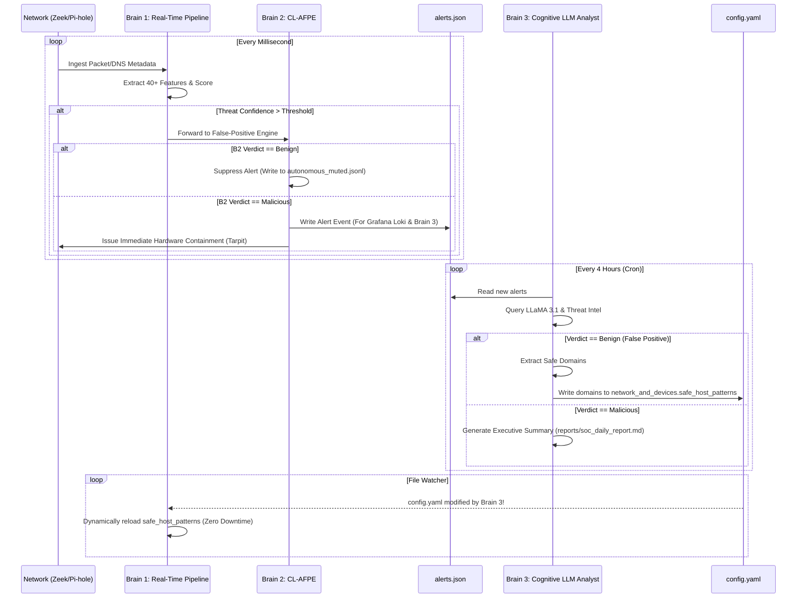

# 🛡️ Home-IDS: The Exhaustive Master Manual & Architecture Guide (Version 7)

Welcome to the definitive, PhD-thesis-level documentation for **Home-IDS Version 7**.

This manual is engineered to provide 100% transparency into the inner workings of the Home-IDS autonomous engine. It covers the exact data flow of the Tri-Brain architecture, an exhaustive breakdown of every single configuration parameter in `config.yaml`, a complete guide to every file in the state repository, service lifecycle management, testing protocols, and complete Prometheus telemetry mappings.

If you are maintaining, debugging, or extending this script, every piece of knowledge you require is contained within this document.

---

## 📋 Table of Contents
1. [🌟 The Tri-Brain Architecture & Internal Data Flow](#-the-tri-brain-architecture--internal-data-flow)
2. [⚙️ The Comprehensive Configuration Dictionary (`config.yaml`)](#%EF%B8%8F-the-comprehensive-configuration-dictionary-configyaml)
3. [📁 Exhaustive State & File System Reference](#-exhaustive-state--file-system-reference)
4. [🔄 Service Lifecycle: Warm vs. Cold Restarts](#-service-lifecycle-warm-vs-cold-restarts)
5. [🧪 Test Suite & Validation Scripts](#-test-suite--validation-scripts)
6. [📊 Prometheus Telemetry & Loki Observability](#-prometheus-telemetry--loki-observability)
7. [📚 Categorized Threat Catalog & Playbooks](#-categorized-threat-catalog--playbooks)

---

## 🌟 The Tri-Brain Architecture & Internal Data Flow

Version 7 operates on a revolutionary tri-brain processing pipeline. To maintain a zero-latency network response, heavy computational tasks are physically separated from the real-time detection loop.

### 🧠 Brain 1: The Statistical Engine (Real-Time Pipeline)
**Location**: `src/core/pipeline.py` and `src/main.py`
**Responsibility**: Real-time packet inspection and high-speed threat scoring.
- Operates entirely in-memory using highly optimized asynchronous workers (`asyncio`).
- Intercepts Zeek (Bro) metadata and Pi-hole DNS logs using `tail -F` cursor tracking.
- Calculates structural deviations using a custom LightGBM model and temporal mathematics (Shannon Entropy, Markov Chains, Fourier Transforms for diurnal rhythms).
- **Data Flow**: Reads configuration dynamically from `config.yaml`. If Threat Confidence exceeds `detection_engine.alert_threshold`, it pushes the alert object directly to Brain 2.

### 🛡️ Brain 2: The Continuous Learning False-Positive Engine (CL-AFPE)
**Location**: `src/intelligence/fp_engine.py`
**Responsibility**: Preventing the system from blocking legitimate traffic (Smart TVs, backup jobs).
- Evaluates alerts in real-time before containment is triggered.
- Uses a dedicated LightGBM model and structural vector embeddings (FastEmbed `bge-small-en-v1.5-onnx-q`) to compare the alert's mathematical signature against known benign telemetry.
- All four suppression thresholds (`false_positive_engine.fp_lgbm_threshold`, `fp_embed_similarity_threshold`, `fp_combined_suppress_threshold`, `fp_combined_uncertain_threshold`) are read fresh from `config.yaml` on every evaluation — tune them and the very next alert uses the new values, no restart.
- **Data Flow**: If benign, the alert is written to `state/autonomous_muted.jsonl` and the domain is temporarily cached in `state/fp_trust_cache.json`. If malicious, the alert is committed to `alerts.json` (for Loki and Brain 3) and hardware containment is fired.

### 🕵️ Brain 3: The Cognitive Analyst (Local LLM SOC)
**Location**: `src/scripts/ollama_soc.py` and `src/scripts/scheduler.py`
**Responsibility**: Deep, cognitive post-incident analysis and permanent self-healing.
- Runs entirely out-of-band as a scheduled batch background task (see `scheduled_jobs.scheduler.ollama_soc` in `config.yaml`).
- Queries a local **Ollama (LLaMA 3.1)** instance.
- **Data Flow (Self-Healing Loop)**: Brain 3 reads the raw JSON alerts from `alerts.json`. If the AI determines an alert is a False Positive, Brain 3 opens `config.yaml` and injects the benign domain directly into `network_and_devices.safe_host_patterns`, using a comment-preserving writer (`ruamel.yaml` round-trip mode) so the file's structure and your own notes survive the edit untouched. Brain 1's file watcher instantly detects this change and reloads the configuration into memory with zero downtime.



---

## ⚙️ The Comprehensive Configuration Dictionary (`config.yaml`)

`config.yaml`, at the project root, controls every aspect of the IDS. As of Version 7.0 it replaces the old `config.json` and is organized into **13 logical categories** — grouped by what each key actually controls, not by restart behavior. Every key below is individually tagged:

- **`[LIVE]`** — edit and save the file; the change takes effect within seconds, no restart needed.
- **`[RESTART]`** — the value is read once at boot. Saving a new value is preserved on disk (it will not be silently overwritten), but has no effect on the running process until you run `sudo systemctl restart soc.service`. This is a deliberate safety rail — these are settings where changing them underneath a live process (a model file path, a listening port) could corrupt state or crash a bound resource.

> **Under the hood**: restart-vs-live behavior is enforced by a single Python set (`_STATIC_KEYS`) in `src/config.py`, matched purely by key *name* — completely independent of which of the 13 categories a key lives in. The category structure below exists entirely for human readability; you can reorganize categories in the future without touching this enforcement mechanism.

**Secrets are not in this file at all.** Telegram tokens, Pi-hole passwords, Fritz!Box credentials, and threat-intel API keys live in `.env` (path set by `paths.env_file` below) — see [Secrets (`.env`)](#secrets-env) at the end of this section.

### 1. `service_ports`
Network ports this process listens on.

| Key | Default | Reload | Description |
|---|---|---|---|
| `metrics_port` | `9105` | `[RESTART]` | Prometheus `/metrics` scrape port. Grafana dashboards read from here. |
| `fastapi_port` | `8010` | `[RESTART]` | Local-only IPC/webhook port. Receives Telegram bot webhooks and serves the Fritz!Box isolate/hosts endpoints used by `mitigation/ips.py`. Not meant to be internet-exposed. |

### 2. `paths`
Every file and directory this process reads from or writes to. **All relative paths resolve against the directory you launch the process from** (your repo root — the same directory `config.yaml` lives in), **not** against `src/`. Absolute paths (starting with `/`) are used as-is.

| Key | Default | Reload | Description |
|---|---|---|---|
| `state_path` | `state/ids_state.json` | `[RESTART]` | Where per-device baselines and IPS mitigation state are persisted between restarts. |
| `model_path` | `models/ids_model.pkl` | `[RESTART]` | Where the trained global ML anomaly model is loaded from and (on retrain) saved to. |
| `geoip_db` | `models/GeoLite2-City.mmdb` | `[RESTART]` | MaxMind GeoLite2 City database. Used for GeoIP telemetry **and** by geofencing — geofencing cannot fire at all if this file fails to load. Check startup logs for a GeoIP load-failure line if geofencing ever seems inactive. |
| `geoip_asn_db` | `models/GeoLite2-ASN.mmdb` | `[RESTART]` | MaxMind GeoLite2 ASN database. Enables ASN/organization name in GeoIP telemetry; leaving it missing just keeps those fields "unknown". |
| `pihole_db` | `/etc/pihole/pihole-FTL.db` | `[RESTART]` | Pi-hole's own SQLite FTL database, read directly for DNS query telemetry. This is Pi-hole's system path — leave as-is unless your install is nonstandard. |
| `zeek_log_dir` | `/opt/zeek/logs/current` | `[RESTART]` | Directory Zeek writes its live logs into (`conn.log`, `dns.log`, etc.). Zeek's system path — leave as-is unless your Zeek deployment is nonstandard. |
| `alert_json_path` | `alerts.json` | `[RESTART]` | Every evaluated alert is appended here. Also the training-data source for the weekly false-positive classifier retrain. |
| `alert_json_max_bytes` | `1073741824` | `[RESTART]` | (1 GiB.) Once `alert_json_path` exceeds this size, older entries are pruned. |
| `env_file` | `.env` | `[RESTART]` | Path (relative to `config.yaml`'s own directory) to your secrets file. `.env` is correct for the standard layout — change only if you keep secrets elsewhere. |

### 3. `network_and_devices`
Your LAN topology and per-device classification.

| Key | Default | Reload | Description |
|---|---|---|---|
| `home_subnet` | `192.168.1.0/24` | `[LIVE]` | Your home LAN in CIDR form. Legacy single-subnet key, still used as the fallback whenever `home_subnets` (below) is empty. |
| `home_subnets` | `[]` | `[LIVE]` | Preferred multi-subnet form — a list of CIDR ranges (e.g. `["192.168.1.0/24", "192.168.50.0/24"]`). While empty, `home_subnet` above is used instead. |
| `max_device_states` | `5000` | `[RESTART]` | Safety cap on how many distinct devices get their own tracked baseline state at once (memory/disk bound). |
| `safe_ips` | `["127.0.0.1"]` | `[LIVE]` | IPs never treated as suspicious destinations, regardless of what else fires (your own infra: Pi-hole box, router, this host, etc.). |
| `honeypot_ips` | `["192.168.1.200"]` | `[LIVE]` | Decoy IP(s) on your LAN. Any device that contacts one gets an instant 10.0 (max) risk score. Only meaningful if you actually run a decoy listener at that address (see [INSTALL.md](INSTALL.md) Step 3.6). |
| `safe_domains` | `[]` | `[LIVE]` | Domains never treated as suspicious (like `safe_ips`, but for DNS queries). Evaluated as exact match. |
| `safe_host_patterns` | `["pi-hole", "paperless"]` | `[LIVE]` | Substring whitelist — any domain *containing* one of these strings is suppressed. **Brain 3 dynamically injects into this list to heal false positives.** |
| `device_type_overrides` | `{}` | `[LIVE]` | Manual device-classification overrides, keyed by hostname or IP. Values: `laptop`, `desktop`, `phone`, `tablet`, `smart_tv`, `gaming_console`, `printer`, `nas`, `iot`, `camera`, `server`, `unknown`. Affects which mathematical baseline is applied to the device in the HEE graph. |

### 4. `detection_engine`
Core scoring loop timing and sensitivity.

| Key | Default | Reload | Description |
|---|---|---|---|
| `log_level` | `INFO` | `[LIVE]` | Python `logging` severity. Switch to `DEBUG` to see raw Zeek dictionary parsing in `journalctl`. |
| `poll_interval` | `2` | `[LIVE]` | Seconds between Pi-hole DB polls. Pi-hole's DB is event-driven, not time-driven, so lower doesn't meaningfully help. |
| `window_seconds` | `300` | `[LIVE]` | (5 min.) Rolling temporal window for rate/entropy/uniqueness baselines. |
| `startup_lookback_seconds` | `300` | `[LIVE]` | On boot, how far back to backfill from existing logs before going fully live. Prevents an avalanche of false alerts from stale traffic on reboot. |
| `alert_threshold` | `6.0` | `[LIVE]` | Threat Confidence (0–10 scale) required to trigger the alert/containment pipeline. |
| `threshold_std_dev` | `3.0` | `[LIVE]` | Autotune sensitivity parameter. When autotuning runs, the threshold is recalculated as `Mean(Historical Scores) + (StdDev * threshold_std_dev)`. |
| `ml_warmup_samples` | `5000` | `[LIVE]` | Number of events a device must generate before its bespoke per-device ML model activates. Prevents wild AI scores on brand-new devices. |
| `baseline_alpha` | `0.05` | `[LIVE]` | EWMA smoothing factor for rate/entropy/unique-domain baselines. Higher = adapts faster; lower = more resistant to sudden spikes (and to poisoning). |
| `decay_factor` | `0.995` | `[LIVE]` | Per-minute decay multiplier for domain-count baselines (~4.6 minute half-life at the default). |
| `suspicious_escalation_seconds` | `600.0` | `[LIVE]` | How long (seconds) a `SUSPICIOUS` state must persist uninterrupted with the same signature before it's escalated to `HIGH`. |

### 5. `false_positive_engine`
Tuning for CL-AFPE's 3-stage pipeline: hard-stop security filter → LightGBM tabular classifier → FastEmbed semantic domain-similarity matcher.

| Key | Default | Reload | Description |
|---|---|---|---|
| `fp_lgbm_threshold` | `0.75` | `[LIVE]` | Stage 2: minimum LightGBM P(false positive) to lean towards suppression. Lower = trust the tabular model more readily. |
| `fp_embed_similarity_threshold` | `0.82` | `[LIVE]` | Stage 3: minimum cosine similarity to a known-safe vendor domain pattern to count as a match. Lower = more domains match as "looks like a known vendor". |
| `fp_combined_suppress_threshold` | `0.8` | `[LIVE]` | Combined score (Stage2×0.45 + Stage3×0.55) required to auto-suppress an alert. Lower = quieter but riskier; higher = noisier but safer. |
| `fp_combined_uncertain_threshold` | `0.55` | `[LIVE]` | Combined-score floor above which an alert that didn't clear the suppress threshold is still tagged "⚠️ Low Confidence" instead of firing as a normal alert. |
| `fp_revoke_notifications_enabled` | `true` | `[LIVE]` | Send a non-blocking Telegram "🔔 Auto-action" notification (with a one-tap Revoke button) whenever the engine autonomously immunizes a new domain. |
| `fp_revoke_action_ttl_seconds` | `86400.0` | `[LIVE]` | (24h.) How long the one-tap Revoke option stays available after an autonomous immunization. |
| `fp_operator_feedback_ttl_seconds` | `2592000.0` | `[LIVE]` | (30 days.) How long an operator's "Mark False Positive" correction stays active as a training-correction signal for the weekly classifier retrain. |

### 6. `device_identity`
MAC-rotation / re-identification resilience.

| Key | Default | Reload | Description |
|---|---|---|---|
| `identity_reidentify_enabled` | `true` | `[LIVE]` | Whether a device that rotates its MAC/IP can be automatically re-linked to its prior identity (keeping threat history) instead of starting a fresh cold-start profile. |
| `identity_reidentify_min_confidence` | `0.75` | `[LIVE]` | Minimum match-confidence score (0–1, from DHCP fingerprint + JA3/JA4 overlap) required to auto-merge two identities. |
| `identity_reidentify_window_seconds` | `1800.0` | `[LIVE]` | (30 min.) How long a candidate stays eligible for re-identification merging after last being seen. |

### 7. `geofencing`
Block traffic to specific countries by GeoIP. **Depends entirely on `paths.geoip_db` loading successfully** — see that key's note above.

| Key | Default | Reload | Description |
|---|---|---|---|
| `geofencing_enabled` | `true` | `[LIVE]` | Master switch. When true, any device contacting an IP whose GeoIP country is in `geofencing_countries` gets an instant CRITICAL verdict (same severity as a confirmed malicious IOC). |
| `geofencing_countries` | `["RU", "CN"]` | `[LIVE]` | ISO 3166-1 alpha-2 country codes to block. **This is blocklist-only** — there is no allowlist mode and no time-of-day policy support in the current implementation (see the note on removed keys below). |

### 8. `threat_intel_and_ai`
External threat-intel refresh cadence and the local Ollama LLM connection.

| Key | Default | Reload | Description |
|---|---|---|---|
| `ti_refresh_interval` | `3600` | `[LIVE]` | (1h.) How often OTX/AbuseIPDB/VirusTotal cache entries are invalidated and re-fetched. API keys themselves come from `.env`, not this file. |
| `ollama_url` | `http://192.168.1.94:11434` | `[LIVE]` | Base URL of your local Ollama server, used by Brain 3 for LLM-based triage and summaries. |
| `ollama_model` | `llama3.1` | `[LIVE]` | Ollama model tag Brain 3 invokes. |

### 9. `ips_mitigation`
Active-response master switches and policy. Per-mechanism toggles (Pi-hole sinkhole / router isolation / ARP tarpit) live in `.env`, not here — see [Secrets (`.env`)](#secrets-env).

| Key | Default | Reload | Description |
|---|---|---|---|
| `ips_enabled` | `true` | `[LIVE]` | Global kill switch for all active response. `false` = detection-only, nothing gets blocked. |
| `interactive_blocking_enabled` | `false` | `[LIVE]` | `true` = a human must tap "Approve" in Telegram before hardware isolation executes. `false` = fully autonomous auto-block. DNS sinkholing (Layer 7) is always immediate regardless of this setting. |
| `operator_release_cooldown_seconds` | `3600.0` | `[LIVE]` | (1h.) Cooldown after an operator manually releases a device before it can be auto-isolated again. |
| `simulation_mode` | `false` | `[LIVE]` | `true` = IPS actions are logged as if they executed but nothing actually happens on the network (dry-run/testing mode). |

### 10. `pihole_integration`
Pi-hole API call behavior. The URL and password come from `.env`.

| Key | Default | Reload | Description |
|---|---|---|---|
| `pihole_api_path` | `/api/v2/domains` | `[LIVE]` | Pi-hole v6 API path for domain sinkholing calls. Change for Pi-hole v5 (`/api/dns/blacklist`) or a custom setup. |
| `pihole_api_timeout_seconds` | `5.0` | `[LIVE]` | HTTP timeout for Pi-hole API calls. |

### 11. `fritzbox_router`
Fritz!Box hardware isolation integration. User/password/API token come from `.env`.

| Key | Default | Reload | Description |
|---|---|---|---|
| `fritz_ip` | `192.168.1.1` | `[LIVE]` | Your Fritz!Box's LAN IP — the target for TR-064 isolation calls. |
| `router_webhook_timeout_seconds` | `5.0` | `[LIVE]` | HTTP timeout for the isolate-device webhook call. |
| `router_hosts_url` | `http://127.0.0.1:8010/hosts` | `[LIVE]` | URL this process's own FastAPI server polls to keep the router's connected-hosts list in sync (used by `core/identity.py`). |
| `router_hosts_timeout_seconds` | `5.0` | `[LIVE]` | HTTP timeout for that hosts-list poll. |

### 12. `telegram`
Bot notification behavior. Token and chat ID come from `.env`.

| Key | Default | Reload | Description |
|---|---|---|---|
| `telegram_enabled` | `true` | `[LIVE]` | Master switch for Telegram alerting. Set `false` if you only want Grafana/Loki logging. |
| `telegram_allowed_chat_ids` | `[]` | `[LIVE]` | Allowlist of chat IDs permitted to send bot commands (approve/release/revoke buttons). Empty = allow commands from any chat that has the bot — populate this if you add the bot to a shared/group chat and want to restrict who can act on alerts. |

### 13. `scheduled_jobs`
Background jobs, polled every 60 seconds by `scripts/scheduler.py`. Cron fields are `minute hour day month day-of-week`; only `*`, `*/N`, and an exact integer are supported per field (no comma-lists, no ranges).

| Key | Default | Reload | Description |
|---|---|---|---|
| `autotune_enabled` | `true` | `[LIVE]` | Enables the weekly/nightly retrain-and-recalibrate job for `alert_threshold`. This job is not part of the `scheduler` sub-block below — it has its own dedicated enable/cron pair. |
| `autotune_schedule_cron` | `"0 3 * * *"` | `[LIVE]` | Cron expression for the autotune job. Default: 3:00 AM daily. |
| `scheduler.ollama_soc.enabled` | `true` | `[LIVE]` | Enables Brain 3's batch LLM triage job. |
| `scheduler.ollama_soc.cron` | `"0 */4 * * *"` | `[LIVE]` | Runs every 4 hours, starting at midnight. |
| `scheduler.retro_hunter.enabled` | `true` | `[LIVE]` | Enables the retroactive threat-intel re-scan job (re-checks recent history against newly-updated OTX/AbuseIPDB/VirusTotal data). |
| `scheduler.retro_hunter.cron` | `"0 2 * * *"` | `[LIVE]` | Runs daily at 2:00 AM. |
| `scheduler.retro_hunter.script` | `retro_hunter.py` | `[LIVE]` | Explicit script-filename override. Required because this job's config key doesn't match its filename by the scheduler's default convention — omitting this was the root cause of the Phase 7 "`retro_hunter` never runs" bug (see [CHANGELOG.md](CHANGELOG.md)). Don't remove it. |
| `scheduler.top_domains_report.enabled` | `true` | `[LIVE]` | Enables the daily top-domains-per-device Markdown/Telegram summary. |
| `scheduler.top_domains_report.cron` | `"0 6 * * *"` | `[LIVE]` | Runs daily at 6:00 AM. |

### Removed in 7.0 (dead keys — do not reintroduce)
The following keys were confirmed to be read nowhere in the codebase during the Version 7.0 audit and have been removed entirely:

| Removed Key | Why |
|---|---|
| `scheduled_tasks` | Legacy top-level schema, fully superseded by `scheduled_jobs.scheduler`. |
| `geofencing_mode` | Geofencing has always been blocklist-only in the actual implementation — no allowlist code path exists. |
| `geofencing_time_policies` | No time-of-day geofencing logic exists in the code. |
| `autotune_min_risk_threshold` | Never read by the autotune job. |
| `layer2_spoofing_detection_enabled` | Layer-2 spoofing (MAC/IP mismatch) detection is unconditional in the code — it was never actually gated by this flag. |

### Secrets (`.env`)
Anything sensitive — bot tokens, passwords, API keys — lives in `.env` at the project root (path configurable via `paths.env_file`), and is pulled in as environment variables on every config reload. **Never put these in `config.yaml`** — if you do, they'll just get silently overwritten by `.env` on the next reload, which is more confusing than helpful.

| `.env` Variable | Feeds | Notes |
|---|---|---|
| `TELEGRAM_TOKEN` | Telegram bot HTTP API token | From BotFather. |
| `TELEGRAM_CHAT_ID` | Destination chat for alerts | Personal ID or group chat ID. |
| `OTX_API_KEY` | AlienVault OTX lookups | Strongly recommended — prevents Brain 3 from hallucinating benign verdicts for known malicious IPs. |
| `ABUSEIPDB_KEY` (or `ABUSEIPDB_API_KEY`) | AbuseIPDB reputation lookups | Either variable name is accepted. |
| `VIRUSTOTAL_KEY` (or `VIRUSTOTAL_API_KEY`) | VirusTotal sandbox/AV lookups | Either variable name is accepted. |
| `PIHOLE_API_PASSWORD` | Pi-hole admin API auth | Web interface password or API token, depending on your Pi-hole version. |
| `PIHOLE_API_URL` | Pi-hole admin API base URL | e.g. `http://192.168.1.94:8080`. |
| `FRITZ_USER`, `FRITZ_PASS` | Fritz!Box TR-064 login | Used to authenticate SOAP calls that sever WAN access. |
| `API_SECRET_TOKEN` | This app's own webhook auth token | Protects `fastapi_port` endpoints from unauthenticated remote calls. Loopback (`127.0.0.1`) requests are always trusted regardless. |
| `ROUTER_WEBHOOK_URL` | Isolate-device webhook target | Usually points back at your own `fastapi_port`. |
| `IDS_IPS_PIHOLE_ENABLED` | Per-mechanism IPS toggle: DNS sinkhole (Layer 7) | |
| `IDS_IPS_ROUTER_ENABLED` | Per-mechanism IPS toggle: router isolation (Layer 3) | |
| `IDS_IPS_TARPIT_ENABLED` | Per-mechanism IPS toggle: ARP tarpit (Layer 2) | |
| `OLLAMA_API_KEY` | Ollama server auth | Only needed if your Ollama server requires authentication. |

Two more `.env` variables exist for convenience in shell scripting around the project (`ZEEK_INTERFACE`, `HOME_SUBNET`) but are **not read by the Python application at all** — in particular, `.env`'s `HOME_SUBNET` does **not** override `config.yaml`'s `network_and_devices.home_subnet`, despite the similar name. To change your tracked LAN subnet, edit `config.yaml`, not `.env`.

---

## 📁 Exhaustive State & File System Reference

To survive reboots, power outages, and to provide data to Brain 3 and Grafana Loki, the system writes specialized artifacts to disk. As of Version 7.0, the project root is a flat, predictable layout:

```
home_ids/
├── config.yaml        # the configuration file described above
├── .env                # secrets (git-ignored)
├── alerts.json         # confirmed alert stream (see paths.alert_json_path)
├── src/                # application code
├── state/              # mutable runtime state (see below)
├── models/              # ML model weights + GeoIP databases
├── reports/            # Brain 3's generated Markdown reports
└── tests/              # the full test suite (see Section 5)
```

### The `state/` Directory (Mutable Event Data)

| File | Purpose and Lifecycle |
|---|---|
| `ids_state.json` | **The Core Brain Record**. Managed by `core/state_guard.py`. Contains the massive nested dictionary of every tracked IP address, its current Threat Confidence score, its mathematical baseline (EWMA rates, variances), and its active hardware containment status (`is_isolated=True/False`). Flushed to disk periodically and on shutdown. |
| `autonomous_muted.jsonl` | **The Suppressed Event Log**. Identical in structure to `alerts.json`, but contains only the alerts that Brain 2 (CL-AFPE) successfully identified as False Positives and suppressed. Used for audits to prove the AI isn't ignoring real threats. |
| `fp_trust_cache.json` | **Brain 2's Short-Term Memory**. When Brain 2 suppresses a false positive, it saves the base domain here with a TTL timestamp (default 14 days). Queries matching this cache bypass heavy ML execution entirely for raw speed. |
| `fp_sigma_shifts.json` | **Brain 2's Variance Adjustments**. If a device keeps triggering false positives by slightly exceeding its volume baseline, Brain 2 writes a "sigma shift" here to permanently widen the standard deviation threshold for that specific device without impacting the global threshold. |
| `zeek_cursor_*.json` | **File Ingestion Trackers**. (`zeek_cursor_conn.json`, `zeek_cursor_dns.json`, etc.). Because `tail -F` is dangerous if the script restarts, these files store the exact byte-offset and inode of the Zeek logs. Upon restart, the engine seeks exactly to this byte offset, guaranteeing zero missed packets and zero duplicate logs. |
| `.last_autotune` | A tiny lock file containing the UNIX timestamp of the last time the `autotune` cron job ran. Prevents duplicate execution. |
| `.last_retro_hunt` | A lock file for the `retro_hunter` script. |
| `ti_cache/` | **Threat Intelligence Caching Directory**. Stores MD5-hashed JSON files mapping external IP addresses to their AlienVault/AbuseIPDB scores. Prevents API rate-limit exhaustion by serving local hits for `ti_refresh_interval` seconds. |

*(`alerts.json` itself lives at the project root, not inside `state/` — see `paths.alert_json_path`.)*

### The `models/` Directory (Machine Learning Weights + GeoIP Databases)

| File / Folder | Purpose and Lifecycle |
|---|---|
| `ids_model.pkl` | The *global* `scikit-learn` IsolationForest model. Trained on the aggregate traffic of your entire home network. Provides the "default" anomaly scoring for new devices. |
| `devices/<IP_ADDRESS>.pkl` | *Bespoke* IsolationForest models. Once a device hits `ml_warmup_samples` (default 5,000 queries), the system forks a personalized ML model for that specific IP and saves it here. |
| `GeoLite2-City.mmdb`, `GeoLite2-ASN.mmdb` | MaxMind databases referenced by `paths.geoip_db` / `paths.geoip_asn_db`. Not shipped with the repo — download separately from MaxMind and place here. |

### The `reports/` Directory (Brain 3 Output)
- **`soc_daily_report_YYYYMMDD.md`**: Generated by the Cognitive Analyst (Brain 3). Contains the LLaMA 3.1 LLM's deep-dive investigations into your alerts, natural language summaries, and a record of any autonomous self-healing config injections it executed.
- **`top_domains_YYYYMMDD.md`**: Generated by the `top_domains_report` cron job daily at 06:00. Lists the top domains queried per device.

### The `tests/` Directory (Validation Suite)
Added as its own top-level directory in Version 7.0 (previously the test files lived inside `src/`, mixed in with application code). See [Section 5](#-test-suite--validation-scripts) below for what each file covers.

---

## 🔄 Service Lifecycle: Warm vs. Cold Restarts

Because Home-IDS is an AI system that *learns* over time, how you restart the daemon (`soc.service`) fundamentally alters its intelligence.

### 🟡 The Warm Restart (Standard Operation)
A warm restart occurs when you run:
```bash
sudo systemctl restart soc.service
```
1. The script receives a `SIGTERM` signal.
2. `state_guard.py` intercepts the signal and immediately flushes the in-memory device states to `state/ids_state.json`.
3. The script terminates.
4. Systemd restarts the script.
5. The engine boots, reads `ids_state.json`, reads all `.pkl` models from `models/`, and reads the byte-offsets from `zeek_cursor_*.json`.

**The Result**: The system resumes processing the exact next packet with 100% of its Machine Learning baselines, historical device Trust Caches, and active hardware isolation states perfectly preserved.
**When to use**: When updating any `[RESTART]`-tagged `config.yaml` key, or applying standard Python code updates.

### 🔴 The Cold Restart (The Brain Wipe)
A cold restart is a manual process that forcefully obliterates the AI's memory and state trackers.
```bash
sudo systemctl stop soc.service
rm -rf state/ids_state.json models/*.pkl models/devices/*.pkl state/fp_trust_cache.json
sudo systemctl start soc.service
```
1. You delete all `.pkl` machine learning weights and the `ids_state.json` memory bank.
2. Upon startup, the engine sees missing files and initializes entirely empty matrices.
3. Every device on your network is forced back into a 24-hour **"Probationary State"**. The system begins at ground zero, re-learning what "normal" traffic looks like.

**When to use**:
- ONLY use this if your ML baselines are completely poisoned. For example, if you installed Home-IDS *while your network was actively infected by a botnet*, the system will have learned that DGA beaconing is "normal." A cold restart after cleaning the botnet will force the AI to learn a clean baseline.

---

## 🧪 Test Suite & Validation Scripts

The repository includes a `tests/` directory with 9 self-contained test files, one per implementation phase, that validate the system's logic without requiring live network traffic, a running Pi-hole, or real malware. All 9 files together cover 151 individual checks.

```bash
source venv/bin/activate
for f in tests/test_phase*.py; do
  echo "=== $f ==="
  python3 "$f" || echo "!!! $f FAILED !!!"
done
```

| File | What it validates |
|---|---|
| `test_phase0_fixes.py` | Foundational bug fixes: state-guard correctness, lock handling, and other early stability fixes. |
| `test_phase1_hypotheses.py` | The Hypothesis & Evidence Engine — that specific evidence combinations correctly trigger (or don't trigger) the intended threat hypotheses. |
| `test_phase2_escalation.py` | State escalation logic — `SUSPICIOUS` → `HIGH` → `CRITICAL` transitions and their timing rules. |
| `test_phase3_revoke.py` | The false-positive revoke workflow — operator "Mark False Positive" corrections and their TTL handling. |
| `test_phase4_reidentify.py` | Device re-identification after MAC/IP rotation, including the confidence-scoring logic. |
| `test_phase5_structural.py` | Structural/vector similarity matching in Brain 2's FastEmbed stage. |
| `test_phase6_fp_selfheal.py` | The Brain 3 self-healing config write path, including the `ruamel.yaml` comment-preservation fix for `safe_host_patterns` edits. |
| `test_phase6_mac_correlation.py` | MAC-address correlation and reverse-index lookups used during device identity tracking. |
| `test_phase7_scheduling.py` | The Version 7.0 scheduler fixes — `retro_hunter`'s job-key/script-override resolution and `ollama_soc`'s read/write path separation. |

Run a single file directly to validate one subsystem after a targeted change, e.g. after editing anything in `intelligence/fp_engine.py`:
```bash
python3 tests/test_phase6_fp_selfheal.py
```

---

## 📊 Prometheus Telemetry & Loki Observability

Home-IDS exposes a massive array of metrics on port `9105/metrics` (see `service_ports.metrics_port`). By scraping this with Grafana, you obtain enterprise-level observability over the engine's internal calculations.

*(All metrics defined in `src/metrics.py`)*

### 1. Threat Confidence & AI State Metrics
| Prometheus Metric (`home_ids_*`) | Type | Deep Explanation |
|---|---|---|
| `threat_confidence` | Gauge (0-1.0) | The live, real-time Threat Confidence score. A spike directly correlates to an alert generation in `alerts.json`. |
| `anomaly_confidence` | Gauge (0-1.0) | The IsolationForest ML structural outlier score. Indicates deviation from the `.pkl` baseline (e.g., unusual query volumes during off-hours). |
| `decision_state` | Gauge (0-4) | The quantized output of the HEE graph state matrix. `0=BENIGN`, `1=ANOMALOUS`, `2=SUSPICIOUS`, `3=HIGH`, `4=CRITICAL`. |

### 2. DNS & Zeek Network Feature Extraction
| Prometheus Metric (`home_ids_*`) | Type | Deep Explanation |
|---|---|---|
| `query_rate` | Gauge | Raw volume of DNS queries per minute. Spikes indicate DoS, DGA, or aggressive telemetry bursts. |
| `entropy_avg` | Gauge | Shannon Entropy of queried domain strings. The higher the number, the closer the strings are to pure random distribution. |
| `nxdomain_ratio` | Gauge | Fraction of queries resulting in NXDOMAIN. Crucial for catching botnets hunting for unregistered backup C2 servers. |
| `zeek_lateral_events_total` | Counter | Tracks aggregate internal `S0/REJ` state connections (Port Scanning). |
| `beaconing_c2_count` | Gauge | Tracks highly uniform, periodic "heartbeat" connections calculated via Coefficient of Variation (Jitter). |
| `outbound_bytes_window` | Gauge | Cumulative payload volume (in bytes) leaving your network across the rolling `window_seconds`. Spikes indicate Data Exfiltration. |
| `zeek_ja3_malicious` | Gauge | Flags devices presenting a TLS Client Hello cryptographic fingerprint (JA3/JA4+) matching a known malware hash table (e.g., AsyncRAT, Cobalt Strike). |

### 3. Brain 2 (CL-AFPE) Efficacy Metrics
| Prometheus Metric (`home_ids_*`) | Type | Deep Explanation |
|---|---|---|
| `fp_evaluations_total` | Counter | Total alerts that crossed `alert_threshold` and were intercepted by Brain 2. |
| `fp_suppressed_total` | Counter | Total alerts Brain 2 identified as benign and killed. (Higher = quieter SOC). |
| `fp_confidence_score` | Gauge (0-1) | The probability matrix output from the LightGBM classifier. High score means "Highly confident this is a False Positive." |
| `fp_domains_immunized_total`| Counter | Number of unique eTLD+1 domains dynamically injected into the local trust cache. |

### 4. Containment Status & Mitigation Telemetry
| Prometheus Metric (`home_ids_*`) | Type | Deep Explanation |
|---|---|---|
| `ips_tarpit_active` | Gauge (0/1) | Emits `1` if a device is currently being locked down by the Scapy Layer-2 ARP Blackhole loop. |
| `ips_router_isolated_active` | Gauge (0/1) | Emits `1` if a device has had its WAN access severed via Fritz!Box API. |
| `ips_pihole_blocks_aggregate_total` | Counter | Running total of all domains automatically written to the DNS Sinkhole. |

### Loki LogQL Debugging Queries
Use these queries in Grafana Explore to inspect the raw JSON evidence graphs:
- **View Critical Threats**: `{job="home_ids_alerts"} | json | threat_confidence > 8.0`
- **Audit Brain 2 Suppressions**: `{job="home_ids_muted"} | json | action = "suppressed"`
- **Trace Exfiltration Events**: `{job="home_ids_alerts"} | json | hypothesis_triggered = "DATA_EXFILTRATION"`

---

## 📚 Categorized Threat Catalog & Playbooks

### Threat 1: Domain Generation Algorithms (DGA) & Botnet C2
**Engine Detection:** Sudden spike in `home_ids_entropy_avg` + high `home_ids_nxdomain_ratio` + Markov Chain transition anomalies.
**Automated Response:** Brain 1 executes a Pi-hole sinkhole and initiates an ARP Tarpit to isolate the device.
**Analyst Playbook:** Isolate device, run endpoint antivirus (Malwarebytes, Defender). Terminate rogue background processes. Release via Telegram webhook once purged.

### Threat 2: DNS Tunneling & Covert Data Exfiltration
**Engine Detection:** Subdomain labels exceeding 45 characters (`max_label_length`), deep domain nesting (>$5$ levels), combined with a spike in `home_ids_outbound_bytes_window` and high TXT/NULL query ratios.
**Automated Response:** Immediate Layer-3 Router WAN isolation (kill internet access).
**Analyst Playbook:** Keep device isolated. Execute `netstat -abno` or `lsof -i` to locate the process holding the network socket. Reset all passwords accessed by the compromised machine.

### Threat 3: Internal Lateral Movement
**Engine Detection:** Zeek NDR logs reveal a high counter of `S0` (Unanswered) or `REJ` (Rejected) TCP states targeting multiple internal IP addresses (Port Scanning).
**Automated Response:** Layer-2 ARP Tarpit to sever LAN access and protect peer devices.
**Analyst Playbook:** Cross-reference the Grafana Zeek dashboard to identify the targeted ports (e.g., Port 445 = SMB). Power off the infected IoT device immediately.

---
*Home-IDS Master Documentation & SecOps Playbook — Engine Version 7.0.0*
