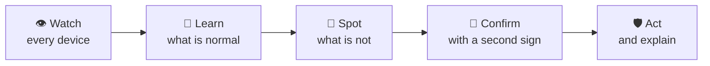

# 🛡️ Home-IDS

### A smart security guard for your home or small office network.
### You plug it in. It watches over everything. You can forget it is there.

---

## The problem, in plain words

Think about everything in your home that connects to the internet: phones, laptops, the TV, the baby monitor, the
smart speaker, the cheap smart plug you bought online. Each one is like a window in your house. **Most of those
windows have no lock, and nobody is watching them.**

Big companies solve this with a security team that watches their network around the clock. That costs a fortune. For
everyone else, the options today are to hope for the best or to buy a gadget that sends a copy of your internet
activity to a company's servers.

## What Home-IDS does

Home-IDS is a small box that sits quietly on your network, like a **night watchman who knows every resident by habit.**

| | In everyday terms |
|---|---|
| 👀 **It watches** | It sees what each device on your network is doing, and which websites and services it talks to. It only reads the "envelope" of the traffic, not the private contents. |
| 🧠 **It learns** | After a few days it knows what is normal for *your* devices. Your TV streams in the evening. Your thermostat chats a little all day. |
| 🚨 **It notices trouble** | A thermostat suddenly contacting strange websites at 3 a.m. is not normal. Home-IDS spots it, even for threats nobody has seen before. |
| 🤔 **It double-checks** | One odd sign is not enough to raise a serious alarm. It looks for a second, independent sign first, so you are not bothered by false alarms. |
| 🛑 **It acts, and tells you why** | It can block a bad website, cut off a misbehaving device, and explain what happened in a sentence anyone can follow. One click undoes it. |
| 🔒 **It keeps your secrets** | Everything stays on the box in your home. There is no account to create and no cloud to trust. |

**A short example.** Your smart thermostat has been hacked. It begins contacting hundreds of strange, random-looking
addresses, which is how a hacked device looks for its master. Home-IDS sees that, finds a second warning sign (the
address is on a list of known bad ones), blocks it, and sends you this: *"Your thermostat was talking to a known
criminal server. I have cut it off. Tap here to restore it if I got it wrong."*

## A trap for burglars

Home-IDS also puts out a **decoy**: a fake, easy-to-break-into computer that exists only as bait. Nothing in your
home has any reason to touch it. So if something does, that is nearly certain proof that something on your network
has been taken over and is snooping around. It works like a tripwire.

## It knows your devices, even when they change disguise

Modern phones keep changing their network "name tag" on purpose, to protect your privacy. A simple security tool then
thinks a stranger has joined. Home-IDS recognises the same phone by putting several clues together, and keeps one
history for it. It works on both kinds of internet address in use today (IPv4 and IPv6), so a device cannot hide by
switching between them. Tell it once what a device is, and it never asks again.

## It never forgets

Restarts, updates, crashes, even a sudden power cut: when it comes back, it picks up exactly where it was. Everything
it has learned about your devices, your corrections and its history is stored safely. It does not go back to day one.

## It teaches itself

Home-IDS keeps learning what is normal for each device, and slowly adjusts how sensitive it is, in small, tested steps
that are undone automatically if they turn out to be wrong. The most important safety rules are locked and cannot be
changed by the learning, so it cannot talk itself into being careless. You never have to tune a thing.

## It keeps up with new threats, and looks back

New dangers appear every day, so Home-IDS keeps refreshing its knowledge of them. If one of its sources stops
updating, it tells you instead of quietly protecting you less.

It also **looks back**. Some threats are only recognised days or weeks after they first appear. Every day it
re-checks everything your devices have connected to in the past against what is known today. If something that looked
harmless back then turns out to be dangerous, you are told, together with which device was involved. You are covered
against new threats, and against old ones that only become known today.

## It runs itself. You can still step in.

Home-IDS is designed to work completely on its own: it learns, adjusts, protects, cleans up, updates and repairs
itself, with no daily input from you. It simply keeps getting better the longer it runs.

And you are always in charge. If you want to, you can correct it, release something it blocked, mark something as
safe, or tell it an alert was wrong, and it learns from that. By default, the biggest step (cutting a device off the
network) waits for one tap from you on your phone; one setting makes even that automatic.

---

## Why it is different: peace of mind

Most security products need constant attention: tune this, update that, read the logs. Home-IDS was built so that you
do not have to.

| What you would normally worry about | What Home-IDS does about it |
|---|---|
| "I will have to set it up and adjust it." | **There is nothing to tune.** It learns your network on its own and keeps getting better. |
| "It will fill up the memory card and crash." | **It cleans up after itself.** Old data is removed automatically, and the disk cannot fill up. |
| "It will slowly get slower and need rebooting." | **It has strict limits on what each part may use,** so a problem in one part is fixed by restarting just that part. |
| "A power cut will corrupt it." | **It is built to survive sudden power loss** without losing or damaging its records. |
| "Something inside will break and I will not notice." | **A built-in doctor checks every part** and restarts anything that stops working. If the internet goes down, it carries on protecting you. |
| "Updates are risky." | **Updates are digitally signed and checked on arrival.** If a new version does not work properly, it goes back to the old one by itself. |
| "Cheap hardware cannot cope." | **It is designed for a tiny, low-power computer** and was tuned against strict memory and storage limits. |

---

## How it works, in one picture

Behind each step is real engineering: a memory of how every device behaves, a system that weighs the evidence the way a
detective would, and a second system whose only job is to catch its own false alarms. Details are in the technical
documents below.

## Using it

Open a web page on your phone or computer and you see one calm status: **Protected**, **Learning your network**,
**Needs your attention**, or **Act now**. Tap for the details. Every device is listed with its name and type, a
**Block** button and a **Release** button. Every connected service has a **Test** button. It works in light and dark
mode and on a phone.

---

## Where it stands, honestly

- ✅ **Built and working.** It has run on a real home network for months, and has been improved over many rounds of
  measuring and fixing. It has about 160 automated test scripts and published reviews of its own design.
- ✅ **Designed to run for years on its own,** on small, inexpensive hardware.
- ⏳ **Not yet proven on the target small computer.** It has been tested on an ordinary small PC so far. Testing on the
  intended low-cost hardware is the next step.
- ⏳ **No independent security audit yet.**
- ⚠️ **It is a helper, not a guarantee.** No security product can promise to stop every attack. Home-IDS is built to
  make problems visible early and to help a person decide.

## What comes next

Easy ordering and first-time setup for non-technical buyers, a built-in trends page, support for network switches that
can isolate a hacked device, protection for phones and laptops when they are away from home, and (optionally, and only
with permission) ways for many homes to learn from each other without sharing private data. These are plans, not
finished features.

---

## For the technically curious

This is a complete, working system: a behavioural detection engine, a graph database of evidence, a hypothesis and
corroboration layer, a false-positive engine, a self-healing health monitor, a signed-update pipeline, and a web
console, all designed to fit in the memory and storage of a small single-board computer.

| Read | |
|---|---|
| [Product description](https://github.com/gsaket-sky/home-ids/blob/main/Documentation/PRODUCT_DESCRIPTION.md) | What it is and where it stands, in more detail |
| [Engineering manual](https://github.com/gsaket-sky/home-ids/blob/main/Documentation/ENGINEERING_MANUAL.md) | The whole system, part by part |
| [Architecture](https://github.com/gsaket-sky/home-ids/blob/main/Documentation/ARGUS_ARCHITECTURE.md) · [Mathematics](https://github.com/gsaket-sky/home-ids/blob/main/Documentation/PIPELINE_MATH_REFERENCE.md) · [Design decisions](https://github.com/gsaket-sky/home-ids/blob/main/Documentation/ARGUS_DECISIONS.md) | How it thinks, and why |

## About

Created and maintained by **Gagan Saket**.

© 2026 Gagan Saket. All rights reserved. The source is visible so it can be read and reviewed. Running, copying,
modifying or redistributing it requires the owner's written permission. Third-party components keep their own licences.
