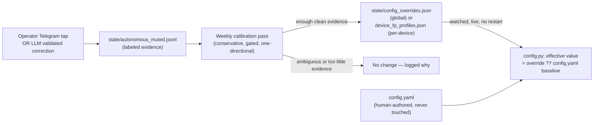

# 🛡️ Home-IDS: Autonomous Threat Defense (Version 8.0)

**Home-IDS** is a self-hosted, autonomous Intrusion Detection and Prevention System (IDS/IPS) for home and edge networks. It fuses network metadata from **Zeek** and DNS telemetry from **Pi-hole** into a real-time evidence-and-hypothesis engine, backs every alert with a false-positive-suppression layer that learns from its own mistakes, and — new in 8.0 — **calibrates its own sensitivity over time**, globally and per device, from real evidence, without needing a human to keep up with every alert.

It is not a toy project pretending to be enterprise-grade. It is a genuinely careful piece of engineering with known, documented limitations — and as of this release, most of the gaps found by two rounds of independent audit this year have been closed, verified against the real running code rather than assumed from its own comments.

---

## ✨ What's New in 8.0

Version 7.0 was a configuration and reliability pass. **8.0 is a correctness, transparency, and autonomy pass** — it fixes real detection bugs found by tracing actual production alerts line-by-line back through the code, and it replaces "the system silently patches its own config file" with a properly layered, auditable, reversible self-tuning architecture.

| | |
|---|---|
| 🎯 **A real false-block bug, fixed** | A live alert for a connection to Telegram's own infrastructure was reaching "Confirmed Malicious IOC / 99% confidence / auto-block" from a single AbuseIPDB score alone — with VirusTotal and ThreatIntel both clean. The reputation classifier's confirmation bar for that one crowd-sourced signal is now aligned with the bar the false-positive engine itself already trusted it at. See [§2](#2-the-hypothesis--evidence-engine-hee) of the Engineering Manual. |
| 🧭 **Alerts now show their reasoning, not just a verdict** | Every Telegram alert carries an explicit step-by-step trail — hard-stop checks, reputation context (with IP ownership), hypothesis scores, and the false-positive engine's own stage-by-stage numbers — instead of two independently-computed confidence percentages sitting side by side with no explanation of what either one means. |
| 🚫 **A resource crisis with the local LLM, fixed** | A live diagnostic call showed a single Ollama request taking 849 seconds under real CPU load for a trivial prompt. The batch analyst (`ollama_soc.py`) now deduplicates identical threat patterns before ever calling the LLM, caches verdicts for 7 days, and hard-caps fresh calls per run — collapsing what could have been 50+ multi-minute calls into a handful. |
| 🤖 **Autonomous, human-independent self-calibration** | The false-positive engine's suppression threshold now calibrates itself from real evidence — both operator Telegram corrections *and* the LLM's own validated corrections (the latter requiring zero human involvement) — conservatively, with a minimum sample count, a safety margin, and an explicit refusal rule whenever the evidence is ambiguous. It **never** writes to `config.yaml`; adjustments live in a separate, human-readable, deletable state file. See [§3](#3-autonomous-self-calibration-new-in-80) below. |
| 📱 **Per-device profiles** | Devices with genuinely different traffic profiles (an IoT sensor vs. a laptop vs. a NAS) can now converge on their own calibrated suppression sensitivity once there's enough of *that device's own* evidence — not forced onto one global number. |
| 🧹 **Dead code removed** | The legacy `mitigation/scoring.py` risk-scoring engine (superseded by the Hypothesis & Evidence Engine, but never deleted) and a duplicate, unthrottled real-time Ollama analyzer (instantiated but never actually called) are gone. |

See [CHANGELOG.md](Documentation/CHANGELOG.md) for the complete, dated technical write-up of every fix, and [USER_MANUAL.md](Documentation/USER_MANUAL.md) for the full `config.yaml` and state-file reference.

---

## 🌟 The Tri-Brain Architecture

```mermaid
flowchart LR
    subgraph Sensors
        Zeek["Zeek NDR<br/>(packet/flow metadata)"]
        Pihole["Pi-hole<br/>(DNS query log)"]
    end

    subgraph Brain1["🧠 Brain 1 — Real-Time Pipeline"]
        direction TB
        Extract["Feature extraction<br/>(entropy, z-scores, kill-chain phase)"]
        HEE["Hypothesis & Evidence Engine<br/>(decision_engine.py)"]
        Extract --> HEE
    end

    subgraph Brain2["🛡️ Brain 2 — CL-AFPE"]
        direction TB
        Stage1["Stage 1: Hard-stop filter"]
        Stage2["Stage 2: LightGBM P(FP)"]
        Stage3["Stage 3: FastEmbed similarity"]
        Combine["Weighted combine<br/>(per-device threshold)"]
        Stage1 --> Stage2 --> Stage3 --> Combine
    end

    subgraph Brain3["🕵️ Brain 3 — Batch LLM Analyst"]
        direction TB
        Dedup["Group by device+target+signature"]
        Cache["7-day verdict cache"]
        LLM["Ollama query<br/>(capped per run)"]
        Dedup --> Cache --> LLM
    end

    Zeek --> Extract
    Pihole --> Extract
    HEE -->|evidence + verdict| Brain2
    Combine -->|suppress| Muted["state/autonomous_muted.jsonl"]
    Combine -->|publish| Alerts["alerts.json + Telegram"]
    Alerts -.every 4h, capped.-> Brain3
    LLM -->|validated correction| Muted
```

### 🧠 Brain 1: The Statistical Engine (Real-Time Pipeline)
`src/core/pipeline.py` and `src/main.py`. A strict, threaded (not `asyncio`) polling loop with a disciplined 5-phase lock/release pattern per cycle — snapshot state under a short lock, pre-fetch Zeek data with no lock held, compute local features under a short lock, do expensive threat-intel I/O with no lock held, then finalize scoring under a short lock. This is what lets thousands of events get processed per second without one slow HTTP call to a threat-intel API stalling every other device's evaluation.

Detection itself runs through the **Hypothesis & Evidence Engine (HEE)**: instead of one additive risk number, the engine collects typed `Evidence` objects (DNS entropy, Zeek lateral-movement counts, reputation signals, ...) and evaluates them against explicit attack and benign hypotheses. A hard-stop (confirmed IOC, honeypot access, ARP spoofing, geofencing violation) can escalate straight to `CRITICAL`; everything else has to actually explain itself through corroborating evidence before it can auto-block anything.

### 🛡️ Brain 2: The Continuous Learning False-Positive Engine (CL-AFPE)
`src/intelligence/fp_engine.py`. Sits between detection and containment. A 3-stage pipeline (hard-stop re-check → LightGBM tabular classifier → FastEmbed semantic domain-similarity) produces a combined confidence that an alert is a false positive. Above the suppress threshold, the alert is silently muted and the domain is trust-cached for 14 days. Below the uncertain threshold, it's published as a full-confidence threat. In between, it's published but explicitly labeled low-confidence — never silently dropped, never silently escalated.

As of 8.0, the suppress threshold is **per-device aware** (falls back to the global default for devices without their own calibrated profile — see below) and Stage 3 no longer runs semantic similarity against the literal string `"unknown"` for raw-IP connections with no resolved hostname.

### 🕵️ Brain 3: The Batch Cognitive Analyst (Local LLM)
`src/scripts/ollama_soc.py`, launched every 4 hours by `src/scripts/scheduler.py`. Reads the last 24h of *published, non-suppressed* alerts (CL-AFPE already resolved the rest cheaply), groups them by device+target+signature so a single noisy pattern only costs one LLM call no matter how many times it fired, checks a 7-day verdict cache before spending a call at all, and hard-caps fresh calls per run. A `DeterministicValidator` rejects any LLM "benign" verdict that contradicts a confirmed IOC or bad reputation signal in the actual evidence — the model cannot hallucinate its way past a real threat signal. Validated corrections feed the exact same closed loop an operator's Telegram tap does (see below) — just running continuously, with zero human involvement required.

---

## 🧬 Autonomous Evolution & Self-Healing

### 1. False-Positive Self-Healing (per-alert, immediate)
When CL-AFPE or the batch LLM analyst confirms a false positive, four things happen immediately: the base domain is added to a 14-day trust cache (`state/fp_trust_cache.json`), the device's own anomaly-sensitivity baseline is widened slightly (`state/fp_sigma_shifts.json`), a labeled training-correction entry is written (`state/autonomous_muted.jsonl`) so the weekly model retrain learns from the correction instead of re-reinforcing the mistake it just fixed — and, **new in 8.0.1**, if an earlier cycle had already blocked that domain in Pi-hole before the pattern was learned as safe, that block is released too. Immunizing a domain only ever stops *future* alerts; it doesn't undo a block already in place, so both autonomous correction paths (CL-AFPE's own suppression and the LLM-validated path) now check and release a stale block, not just the human-operator "Mark False Positive" path that already did. The goal is to block only what's actually still necessary — an over-eager block that outlives its own justification just breaks a device's normal function for no remaining reason.

Every Pi-hole block also carries a `"Home-IDS Auto-Block | Device: ... | Trigger: ..."` comment, so anyone looking at Pi-hole's own blocklist can see it was the script, and why — and that same text is now stored durably in `state/ids_state.json` too, so it's answerable locally even for the two Pi-hole fallback paths that can't verifiably carry a comment through to Pi-hole itself.

### 2. Autonomous Self-Calibration (new in 8.0)
Effectively daily (piggybacking on the existing model-retrain schedule — a 3am cron with no freshness gate, plus a second, independent ~weekly in-process pass layered on top, see the User Manual's Automation Timeline for the full breakdown), `scripts/train_fp_classifier.py` looks at every confirmed false positive from the last cycle — from *either* an operator's Telegram tap or the LLM's own validated corrections — and asks a narrow, conservative question: **"is there a clean, unambiguous gap between confirmed-safe scores and everything else, that would let us safely catch more false positives automatically?"**

- Needs at least 5 pooled confirmations (or 3 for a device's own profile) before touching anything.
- Only ever *lowers* the suppression threshold — raising it back up after over-tuning stays a human decision.
- Refuses outright if any never-corrected alert scored as high as a confirmed false positive — that ambiguity is never auto-resolved toward suppression.
- Has a hard floor it will never cross regardless of evidence.
- **Never writes to `config.yaml`.** Adjustments live in `state/config_overrides.json` (global) and `state/device_fp_profiles.json` (per-device) — separate, human-readable, deletable files that layer on top of your hand-authored config at read time. Delete the file, or just the one key inside it, and the system reverts to your `config.yaml` value on its next reload. No restart, no `config.yaml` edit, no risk of your own configuration being silently rewritten underneath you.

---

## 💥 Multi-Tier Hardware Containment

Upon a genuinely confirmed critical threat, Home-IDS executes a latched, multi-tier isolation protocol — latched meaning it is never auto-released purely because traffic decayed to zero (that would create an isolate → silence → auto-release → re-beacon flapping loop):
* **Layer 2 (ARP/NDP Dual-Stack Tarpit)** — Scapy forges ARP/NDP responses to sever the device from the rest of the LAN.
* **Layer 3 (Router WAN Isolation)** — TR-064 calls a Fritz!Box to cut the device's internet access while leaving LAN access intact for remediation.
* **Layer 7 (DNS Sinkholing)** — Pi-hole blocks the malicious domain network-wide, with a persistent retry queue if the Pi-hole API is briefly unreachable.

---

## 📊 Observability

- **Telegram**: interactive alerts showing the full reasoning trail, one-tap hardware-isolation approval (only offered when something is actually pending — a monitor-only alert no longer shows an "Approve" button that approves nothing), and one-tap false-positive correction.
- **Markdown reports**: daily SOC and top-domains reports in `reports/`, plus a durable `state/retro_hunt_findings.jsonl` for anything the retroactive threat hunter finds.
- **Prometheus & Grafana**: 80+ metrics covering HEE decision states, per-device feature telemetry, CL-AFPE efficacy, and containment status — see the User Manual for the full catalog.

---

## 📚 Documentation Map

| Document | What's in it |
|---|---|
| [USER_MANUAL.md](Documentation/USER_MANUAL.md) | The exhaustive reference: every `config.yaml` key, the full state-file and autonomous-override layer, service lifecycle, test suite, and the complete Prometheus metric catalog. |
| [INSTALL.md](Documentation/INSTALL.md) | Step-by-step installation of Home-IDS and every subsystem it depends on (Pi-hole, Zeek, Prometheus, Loki, Grafana, Ollama). |
| [ENGINEERING_MANUAL.md](Documentation/ENGINEERING_MANUAL.md) | The internal mathematics and architecture, verified line-by-line against the actual code — for developers extending or debugging the engine. |
| [CHANGELOG.md](Documentation/CHANGELOG.md) | The full, dated version history including this release's audit write-up. |

For detailed configuration, architecture diagrams, and metric definitions, start with the [USER_MANUAL.md](Documentation/USER_MANUAL.md).
