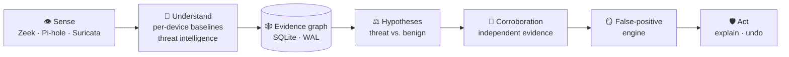

# 🛡️ Home-IDS

### Enterprise-style network security. On a box you own. Watching only your network.

**Detects what's wrong with *your* devices, explains it in plain language, and acts only when the evidence is there.**

[**Product description**](https://github.com/gsaket-sky/home-ids/blob/main/Documentation/PRODUCT_DESCRIPTION.md) ·
[**How it thinks**](https://github.com/gsaket-sky/home-ids/blob/main/Documentation/ARGUS_ARCHITECTURE.md) ·
[**The maths**](https://github.com/gsaket-sky/home-ids/blob/main/Documentation/PIPELINE_MATH_REFERENCE.md) ·
[**Engineering manual**](https://github.com/gsaket-sky/home-ids/blob/main/Documentation/ENGINEERING_MANUAL.md)

---

## Your network has a security guard now

Every smart TV, tablet, laptop and forgotten smart plug is a door. Most home and small-office networks have no idea
what is happening behind them. Enterprise teams have tools for that; everyone else gets a subscription box that sends
their traffic to someone else's cloud.

**Home-IDS is what a security team would run for you, on hardware you own, answering only to you.**

|  |  |
|---|---|
| 🧠 **Learns each device** | Not "speakers are chatty": *your* speaker, over time. Baselines per device, per metric, per hour. |
| ⚖️ **Weighs evidence, not raw anomalies** | It forms hypotheses ("this device runs a DGA botnet") and weighs them against benign explanations. |
| 🤝 **Demands corroboration** | A HIGH or CRITICAL alert never rests on one signal. Independent evidence families must agree. |
| 🪞 **Grades its own work** | A second system suppresses what it is confident is benign, remembers why, and never hides a hard indicator. |
| 🧯 **Acts proportionately, and can undo it** | Block a destination, cut a device off the internet, or quarantine it. One click to release. |
| 🔒 **Stays private** | No cloud account. Nothing leaves your network except optional threat-intelligence lookups you switch on. |

---

## How a decision is made

> **Example.** A thermostat starts querying thousands of random-looking domains. One signal is a hint, not a verdict.
> Home-IDS raises the hypothesis "DGA botnet", looks for an independent second source (a malicious TLS fingerprint, a
> threat-intelligence hit, periodic beaconing), checks the benign explanations, and only then blocks the destination
> and tells you, in a sentence, what it saw and how to undo it.

---

## Built for small hardware, and for SD cards

| | |
|---|---|
| ⚡ **Fast where it counts** | An exact, vectorised Isolation-Forest evaluator replaces a ~21 ms-per-call library path. |
| 📏 **Bounded everywhere** | Ring buffers, per-hardware cache profiles, hard memory limits per service, capped work per cycle. |
| 🩺 **Self-healing** | A health manager watches every part, switches to resource-saving modes under pressure, and degrades gracefully. If the internet drops, it keeps deciding on local evidence. |
| 💾 **Flash-friendly** | State is stored as changed rows only, hot files live in RAM, and host write-back is coalesced. On one test host, engine writes fell from roughly 10–25 GB/day to roughly 3 GB/day (a longer measurement, and one on a Pi, are still pending). |
| 🔌 **Crash-safe** | Transactional writes: a power cut never leaves a half-written update. |

## A calm, consumer-grade experience

**Protected · Learning your network · Needs your attention · Act now.** One status, with detail one click away.
Plain-language alert stories, one-click block and release, a **Test** button for every integration, a restart button
for every part of the system, light and dark themes, and a layout that works on a phone.

## Optional extras

🪤 **Decoy host** (any contact is proof of lateral movement) · 📡 **Wi-Fi capture and Suricata scans** · 📊 **Dashboards** ·
🤖 **Local AI advisor** (explains alerts in plain words; a deterministic validator can veto it) · 📱 **Telegram** alerts and approvals

*On the roadmap (ideas, not built):* managed-switch / VLAN isolation · WireGuard roaming protection ·
encrypted-traffic analytics · opt-in, privacy-preserving fleet learning.

---

## Honest status

Built and running on a real home network for months, with about 160 automated test scripts and published audits.
**Not yet validated on real Raspberry Pi hardware** (designed and budgeted for it, tested on an x86 host so far), and
there has been no independent security assessment. It is a detector that helps a person decide, not a guarantee.

## Documents

| | |
|---|---|
| [Product description](https://github.com/gsaket-sky/home-ids/blob/main/Documentation/PRODUCT_DESCRIPTION.md) | What it is, how it works, where it stands |
| [Engineering manual](https://github.com/gsaket-sky/home-ids/blob/main/Documentation/ENGINEERING_MANUAL.md) | The whole system, component by component |
| [Architecture](https://github.com/gsaket-sky/home-ids/blob/main/Documentation/ARGUS_ARCHITECTURE.md) · [Mathematics](https://github.com/gsaket-sky/home-ids/blob/main/Documentation/PIPELINE_MATH_REFERENCE.md) · [Decisions](https://github.com/gsaket-sky/home-ids/blob/main/Documentation/ARGUS_DECISIONS.md) | How it thinks, and why |

## Licence

© 2026 Gagan Saket. All rights reserved. The source is visible so it can be read and reviewed. Running, copying,
modifying or redistributing it requires the owner's written permission. Third-party components keep their own licences.
