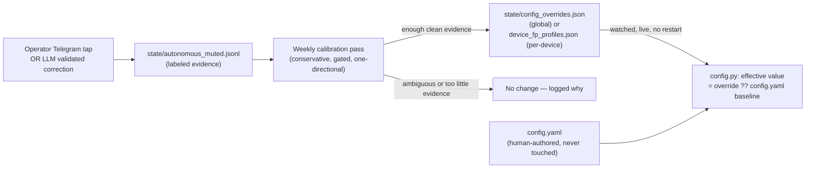

# 🛡️ Home-IDS: Autonomous Threat Defense (Version 9.0)

**Home-IDS** is a self-hosted, autonomous Intrusion Detection and Prevention System (IDS/IPS) for home and edge networks. It fuses network metadata from **Zeek** and DNS telemetry from **Pi-hole** into a real-time evidence-and-hypothesis engine, backs every alert with a false-positive-suppression layer that learns from its own mistakes, and — new in 9.0 — extends real network visibility to WiFi devices for the first time via short, triggered capture bursts, and learns network-wide from every confirmed threat, not just device-by-device.

It is not a toy project pretending to be enterprise-grade. It is a genuinely careful piece of engineering with known, documented limitations — and as of this release, both a live-hardware visibility gap and a wide correctness pass across detection, false-positive suppression, and the ML training pipeline have been closed, verified against the real running code and real production data rather than assumed from its own comments.

---

## ✨ What's New in 9.0

**9.0 adds a subsystem, then goes back and audits everything downstream of it.** The new piece is reactive Fritzbox WLAN capture — this deployment's Zeek setup had zero real flow visibility into WiFi devices before this release, only the two wired ones. The audit traces a full session of live production debugging (real `alerts.json`, `journalctl`, and service-restart evidence) into concrete, reproducible fixes across detection correctness, a self-reinforcing learned-state poisoning bug, and the ML training pipeline's own data integrity.

| | |
|---|---|
| 📡 **WiFi devices get real network visibility for the first time** | Short, triggered `ath0`/`ath1` capture bursts, reprocessed through the same live Zeek policy, feed the exact same `ZeekFeatureExtractor` live traffic uses — meaning lateral-movement detection, JA3/JA4 fingerprinting, and a new blind-spot audit (catches devices with real traffic but no matching DNS footprint) now all work for WiFi, not just the two wired devices. Reactive by design (~100MB/burst) instead of the ~3GB/hour continuous capture measured live. See [ENGINEERING_MANUAL.md §7](Documentation/ENGINEERING_MANUAL.md#7-reactive-fritzbox-wlan-capture). |
| 🧠 **The network learns from itself, not just per-device** | Once any device's traffic confirms a threat, that IOC is remembered network-wide — a *different* device touching the same infrastructure gets an immediate hard-stop instead of re-earning corroboration from scratch. A severe, self-reinforcing poisoning bug found in this exact mechanism (one bad hit against a shared vendor domain or a private/router IP could get "confirmed malicious" permanently, then kept renewing itself) is fixed on both the write and read side. |
| 🎯 **Three separate alerts were showing/acting on the wrong domain** | `DNS_COVERT_TUNNELING` and `DGA_BOTNET_C2` alerts (joining an earlier `DNS_EVASION` fix) fell back to a generic "most notable domain in the window" pick, disconnected from which evidence actually fired — traced to a confirmed live case where an alert's own "Target" domain didn't match the domain its own evidence numbers described. All three now attach the real triggering domain from the evidence itself. |
| 🔁 **A recurring false-positive against Telegram's own infrastructure, and a deeper bug found while fixing it** | AbuseIPDB's crowd-sourced score for shared IP infrastructure naturally drifts, so a threshold-only fix (v8.0) couldn't fully eliminate the oscillation — fixed with ASN-org recognition instead. Also found: an explicit "trusted" classification could still be overridden back to "confirmed malicious" by a single stray score, for *any* tier, not just this one case — now a real floor. |
| 🤖 **The training pipeline's own data integrity, closed** | A `tranco_rank` feature the classifier had been reading since it was added was silently zero for every single prediction — nothing ever wrote it. Fixed, plus a new tool to identify and exclude historical training rows corrupted by the domain-attribution bugs above, without ever touching the underlying alert history. |
| 🧹 **A full dead-code/silent-feature audit** | Checked every function for "is this called at all, and correctly" — found real silent gaps (ML models that never migrated on device re-identification, a webhook server that never started under default config despite Telegram buttons pointing at it) alongside genuinely dead code, and fixed two `UnboundLocalError` crashes in the process. |

See [CHANGELOG.md](Documentation/CHANGELOG.md) for the complete, dated technical write-up of every fix, and [USER_MANUAL.md](Documentation/USER_MANUAL.md) for the full `config.yaml` and state-file reference.

---

## 🌟 The Tri-Brain Architecture

```mermaid
flowchart LR
    subgraph Sensors
        Zeek["Zeek NDR<br/>(packet/flow metadata)"]
        Pihole["Pi-hole<br/>(DNS query log)"]
    end

    subgraph Brain1["🧠 Brain 1 — Real-Time Pipeline"]
        direction TB
        Extract["Feature extraction<br/>(entropy, z-scores, kill-chain phase)"]
        HEE["Hypothesis & Evidence Engine<br/>(decision_engine.py)"]
        Extract --> HEE
    end

    subgraph Brain2["🛡️ Brain 2 — CL-AFPE"]
        direction TB
        Stage1["Stage 1: Hard-stop filter"]
        Stage2["Stage 2: LightGBM P(FP)"]
        Stage3["Stage 3: FastEmbed similarity"]
        Combine["Weighted combine<br/>(per-device threshold)"]
        Stage1 --> Stage2 --> Stage3 --> Combine
    end

    subgraph Brain3["🕵️ Brain 3 — Batch LLM Analyst"]
        direction TB
        Dedup["Group by device+target+signature"]
        Cache["7-day verdict cache"]
        LLM["Ollama query<br/>(capped per run)"]
        Dedup --> Cache --> LLM
    end

    Zeek --> Extract
    Pihole --> Extract
    HEE -->|evidence + verdict| Brain2
    Combine -->|suppress| Muted["state/autonomous_muted.jsonl"]
    Combine -->|publish| Alerts["alerts.json + Telegram"]
    Alerts -.every 4h, capped.-> Brain3
    LLM -->|validated correction| Muted
```

### 🧠 Brain 1: The Statistical Engine (Real-Time Pipeline)
`src/core/pipeline.py` and `src/main.py`. A strict, threaded (not `asyncio`) polling loop with a disciplined 5-phase lock/release pattern per cycle — snapshot state under a short lock, pre-fetch Zeek data with no lock held, compute local features under a short lock, do expensive threat-intel I/O with no lock held, then finalize scoring under a short lock. This is what lets thousands of events get processed per second without one slow HTTP call to a threat-intel API stalling every other device's evaluation.

Detection itself runs through the **Hypothesis & Evidence Engine (HEE)**: instead of one additive risk number, the engine collects typed `Evidence` objects (DNS entropy, Zeek lateral-movement counts, reputation signals, ...) and evaluates them against explicit attack and benign hypotheses. A hard-stop (confirmed IOC, honeypot access, ARP spoofing, geofencing violation) can escalate straight to `CRITICAL`; everything else has to actually explain itself through corroborating evidence before it can auto-block anything.

### 🛡️ Brain 2: The Continuous Learning False-Positive Engine (CL-AFPE)
`src/intelligence/fp_engine.py`. Sits between detection and containment. A 3-stage pipeline (hard-stop re-check → LightGBM tabular classifier → FastEmbed semantic domain-similarity) produces a combined confidence that an alert is a false positive. Above the suppress threshold, the alert is silently muted and the domain is trust-cached for 14 days. Below the uncertain threshold, it's published as a full-confidence threat. In between, it's published but explicitly labeled low-confidence — never silently dropped, never silently escalated.

As of 8.0, the suppress threshold is **per-device aware** (falls back to the global default for devices without their own calibrated profile — see below) and Stage 3 no longer runs semantic similarity against the literal string `"unknown"` for raw-IP connections with no resolved hostname. As of 9.0, Stage 2's LightGBM classifier is an 11-dimension vector (up from 9 — ARP-sweep and DNS-evasion signals added once those detectors existed to feed it), and its Tranco-rank feature — read since the vector's introduction but never actually populated by anything — is now real.

### 🕵️ Brain 3: The Batch Cognitive Analyst (Local LLM)
`src/scripts/ollama_soc.py`, launched every 4 hours by `src/scripts/scheduler.py`. Reads the last 24h of *published, non-suppressed* alerts (CL-AFPE already resolved the rest cheaply), groups them by device+target+signature so a single noisy pattern only costs one LLM call no matter how many times it fired, checks a 7-day verdict cache before spending a call at all, and hard-caps fresh calls per run. A `DeterministicValidator` rejects any LLM "benign" verdict that contradicts a confirmed IOC or bad reputation signal in the actual evidence — the model cannot hallucinate its way past a real threat signal. Validated corrections feed the exact same closed loop an operator's Telegram tap does (see below) — just running continuously, with zero human involvement required.

---

## 🧬 Autonomous Evolution & Self-Healing

### 1. False-Positive Self-Healing (per-alert, immediate)
When CL-AFPE or the batch LLM analyst confirms a false positive, four things happen immediately: the base domain is added to a 14-day trust cache (`state/fp_trust_cache.json`), the device's own anomaly-sensitivity baseline is widened slightly (`state/fp_sigma_shifts.json`), a labeled training-correction entry is written (`state/autonomous_muted.jsonl`) so the weekly model retrain learns from the correction instead of re-reinforcing the mistake it just fixed — and, **new in 8.0.1**, if an earlier cycle had already blocked that domain in Pi-hole before the pattern was learned as safe, that block is released too. Immunizing a domain only ever stops *future* alerts; it doesn't undo a block already in place, so both autonomous correction paths (CL-AFPE's own suppression and the LLM-validated path) now check and release a stale block, not just the human-operator "Mark False Positive" path that already did. The goal is to block only what's actually still necessary — an over-eager block that outlives its own justification just breaks a device's normal function for no remaining reason.

Every Pi-hole block also carries a `"Home-IDS Auto-Block | Device: ... | Trigger: ..."` comment, so anyone looking at Pi-hole's own blocklist can see it was the script, and why — and that same text is now stored durably in `state/ids_state.json` too, so it's answerable locally even for the two Pi-hole fallback paths that can't verifiably carry a comment through to Pi-hole itself.

### 2. Autonomous Self-Calibration (new in 8.0)
Effectively daily (piggybacking on the existing model-retrain schedule — a 3am cron with no freshness gate, plus a second, independent ~weekly in-process pass layered on top, see the User Manual's Automation Timeline for the full breakdown), `scripts/train_fp_classifier.py` looks at every confirmed false positive from the last cycle — from *either* an operator's Telegram tap or the LLM's own validated corrections — and asks a narrow, conservative question: **"is there a clean, unambiguous gap between confirmed-safe scores and everything else, that would let us safely catch more false positives automatically?"**

- Needs at least 5 pooled confirmations (or 3 for a device's own profile) before touching anything.
- Only ever *lowers* the suppression threshold — raising it back up after over-tuning stays a human decision.
- Refuses outright if any never-corrected alert scored as high as a confirmed false positive — that ambiguity is never auto-resolved toward suppression.
- Has a hard floor it will never cross regardless of evidence.
- **Never writes to `config.yaml`.** Adjustments live in `state/config_overrides.json` (global) and `state/device_fp_profiles.json` (per-device) — separate, human-readable, deletable files that layer on top of your hand-authored config at read time. Delete the file, or just the one key inside it, and the system reverts to your `config.yaml` value on its next reload. No restart, no `config.yaml` edit, no risk of your own configuration being silently rewritten underneath you.

### 4. Network-Effect Threat Learning (new in 9.0)
Once any device's traffic confirms a real threat — a Stage-1 hard-stop or a genuinely-corroborated HIGH/CRITICAL verdict — the triggering domain/IP is remembered network-wide (`state/local_confirmed_intel.json`, 30-day TTL). A *different* device touching the same infrastructure later gets an immediate hard-stop instead of re-earning independent corroboration from scratch, and `retro_hunter.py`'s retroactive scan cross-references the same store to catch devices that touched an IOC before it was confirmed. Matching is deliberately conservative — known-safe CDN/vendor domains and private/multicast/`safe_ips`-listed addresses are excluded on both the write and read path, closing a real production incident where a single bad hit against a shared vendor domain or this network's own router IP got "confirmed malicious" permanently and then kept renewing itself on every subsequent match.

### 5. Reactive Fritzbox WLAN Capture (new in 9.0)
On an all-in-one router (modem+router+AP, this deployment's Fritzbox included), neither a mirror port nor an inline bridge can see WiFi-to-WiFi traffic — Zeek had zero real flow visibility into WiFi devices before this release. Short, triggered capture bursts on the router's own diagnostic radios (`ath0`/`ath1`), reprocessed through the same live Zeek policy, close part of that gap without the ~3GB/hour cost of continuous capture: WiFi devices get real lateral-movement detection, JA3/JA4 fingerprinting, and a blind-spot audit (destinations with real traffic but no matching DNS history) for the first time. Six independent trigger sources share one hourly capture budget. Fritzbox-specific — disabled by default, see [ENGINEERING_MANUAL.md §7](Documentation/ENGINEERING_MANUAL.md#7-reactive-fritzbox-wlan-capture).

---

## 💥 Multi-Tier Hardware Containment

Upon a genuinely confirmed critical threat, Home-IDS executes a latched, multi-tier isolation protocol — latched meaning it is never auto-released purely because traffic decayed to zero (that would create an isolate → silence → auto-release → re-beacon flapping loop):
* **Layer 2 (ARP/NDP Dual-Stack Tarpit)** — Scapy forges ARP/NDP responses to sever the device from the rest of the LAN.
* **Layer 3 (Router WAN Isolation)** — TR-064 calls a Fritz!Box to cut the device's internet access while leaving LAN access intact for remediation.
* **Layer 7 (DNS Sinkholing)** — Pi-hole blocks the malicious domain network-wide, with a persistent retry queue if the Pi-hole API is briefly unreachable.

---

## 📊 Observability

- **Telegram**: interactive alerts showing the full reasoning trail, one-tap hardware-isolation approval (only offered when something is actually pending — a monitor-only alert no longer shows an "Approve" button that approves nothing), and one-tap false-positive correction.
- **Markdown reports**: daily SOC and top-domains reports in `reports/`, plus a durable `state/retro_hunt_findings.jsonl` for anything the retroactive threat hunter finds.
- **Prometheus & Grafana**: 80+ metrics covering HEE decision states, per-device feature telemetry, CL-AFPE efficacy, and containment status — see the User Manual for the full catalog.

---

## 📚 Documentation Map

| Document | What's in it |
|---|---|
| [USER_MANUAL.md](Documentation/USER_MANUAL.md) | The exhaustive reference: every `config.yaml` key, the full state-file and autonomous-override layer, service lifecycle, test suite, and the complete Prometheus metric catalog. |
| [INSTALL.md](Documentation/INSTALL.md) | Step-by-step installation of Home-IDS and every subsystem it depends on (Pi-hole, Zeek, Prometheus, Loki, Grafana, Ollama). |
| [ENGINEERING_MANUAL.md](Documentation/ENGINEERING_MANUAL.md) | The internal mathematics and architecture, verified line-by-line against the actual code — for developers extending or debugging the engine. |
| [CHANGELOG.md](Documentation/CHANGELOG.md) | The full, dated version history including this release's audit write-up. |

For detailed configuration, architecture diagrams, and metric definitions, start with the [USER_MANUAL.md](Documentation/USER_MANUAL.md).
