# 🛡️ Home-IDS

**A self-hosted intrusion detection and prevention system that watches your entire home or small-office network, figures out what's actually happening on its own, and steps in when something's genuinely wrong — without sending your traffic to anyone else's cloud, without a monthly fee, and without needing you to babysit it.**

Point your router's DNS at it and give it a mirror of your network traffic, and it starts learning. Not "learning" as a marketing word — it builds a real statistical baseline of what *your* devices normally do, watches for the ways that actually get exploited, and gets measurably quieter and more accurate over time because it grades its own mistakes and corrects itself. Everything it decides, blocks, and learns is visible on a dashboard, in plain language, in real time.

---

## What it actually does for you

Most of what threatens a home or small-office network today doesn't look like a movie hacking scene — it's a smart-TV app phoning an ad network it shouldn't, an IoT device that got dragged into a botnet quietly beaconing out, a laptop's DNS traffic tunneling data past a filter, or a genuinely infected device scanning the rest of your LAN for a way in. Home-IDS watches for exactly these shapes, continuously, on every device on your network:

| It's built to catch | How |
|---|---|
| **DNS tunneling & covert exfiltration** | Encoded/oversized subdomain labels, TXT/NULL query abuse, suspicious-TLD concentration, and label-entropy clustering across a domain family — not just "is this domain on a blocklist." |
| **DGA / botnet command-and-control domains** | Entropy, vowel/digit ratios, and burst patterns that distinguish algorithmically-generated malware domains from a normal one, filtered against real CDN/telemetry infrastructure so it doesn't cry wolf on your smart speaker. |
| **Data exfiltration** | Outbound byte-volume anomalies against that specific device's own baseline, not a network-wide guess. |
| **Lateral movement & internal scanning** | The exact signature of one compromised device probing the rest of your LAN. |
| **C2 beaconing** | Timing-uniformity analysis — the periodic "check in" pattern of malware calling home, a technique borrowed from real threat-hunting practice. |
| **ARP spoofing / man-in-the-middle attempts** | MAC-identity correlation across your network's connection history. |
| **Malicious TLS fingerprints & known-bad infrastructure** | Cross-referenced live against VirusTotal, AbuseIPDB, and curated threat-intel feeds — plus a private, self-growing "confirmed malicious" memory that's entirely your own network's. |
| **Real exploit and malware signatures** | Optional batch-mode Suricata scanning against captured traffic bursts — the same rule-matching engine serious network security appliances use, running only when something's already worth a closer look, so it costs nothing the rest of the time. |

When it catches something, it doesn't just log it and hope you notice. It responds in layers, matched to how serious the evidence actually is:

- **DNS sinkholing** — the malicious domain stops resolving, network-wide, instantly, via your own Pi-hole.
- **Router-level isolation** — the device's internet access gets cut at the router while it keeps talking to the rest of your LAN, so you can still investigate it.
- **Full network quarantine** — a Layer-2 tarpit severs the device from everything, reserved for the alerts with the strongest evidence.

Every one of those actions is reversible with one tap from your phone, and every one is logged with the exact evidence that triggered it — nothing happens silently.

---

## The part that makes this genuinely different

**It doesn't just alert. It reasons, and it shows its reasoning.**

Instead of one opaque risk score, Home-IDS runs a real evidence-and-hypothesis engine: it collects distinct, typed signals (DNS entropy, connection patterns, reputation hits, timing anomalies...) and weighs them against explicit models of what an actual attack looks like versus what normal device behavior looks like. A single weak signal never triggers a network-wide block on its own — corroborating evidence has to actually agree before anything drastic happens, with a small set of exceptions (a confirmed malicious IOC, a honeypot trip, a spoofing attempt) serious enough to act on immediately.

**It grades its own alerts before you ever see them, and gets quieter the longer it runs.**

A second, independent system — think of it as a continuously-learning false-positive filter — checks every alert before it reaches you. It combines a fast rule-based check, a trained machine-learning classifier, and a semantic similarity model, and if it's confident something is a false alarm, it suppresses it and remembers the pattern so the same false alarm doesn't come back. When it's *not* sure, it still tells you — clearly labeled as low-confidence, never silently dropped and never silently escalated.

**It learns each of your devices individually, not a generic profile.**

Beyond knowing "this is a smart TV, TVs are chatty," it builds a per-device behavioral fingerprint — the ports, destinations, and patterns *that specific device* actually uses over time — and only ever learns from activity it already independently judged benign, so a genuinely compromised device can't talk its way into a trusted baseline just by repeating itself.

**One confirmed threat protects your whole network immediately.**

If Home-IDS confirms a real threat from one device, that domain or IP is remembered network-wide. A different device touching the same infrastructure later gets stopped instantly instead of having to independently earn the same suspicion all over again — and a retroactive scan checks whether anything already touched it before it was confirmed.

**It has a local, private, optional AI analyst — with a built-in lie detector.**

A locally-run language model (via Ollama — nothing leaves your network) does a deeper batch review of the alerts that made it through, a few times a day, and can autonomously confirm false positives on its own. But it's never trusted blindly: a dedicated validator rejects any AI verdict that contradicts the hard evidence already on file, so a hallucinated "this looks fine" can't override a confirmed indicator of compromise.

**It heals itself, safely, without you touching a config file.**

When enough evidence accumulates that a detection threshold is a little too sensitive for your specific network, it tunes itself — conservatively, one-directionally (it will loosen a threshold with evidence, but never silently tighten one back up without you), and only ever into an override file layered on top of your own configuration, never overwriting it. Delete the override, and it falls straight back to your original settings. Every autonomous adjustment is fully explained: what changed, why, and how much evidence justified it.

---

## Total transparency — you can watch it think

Every one of the claims above is a **graph, not a promise.** Home-IDS ships with six pre-built Grafana dashboards and well over one hundred live Prometheus metrics covering:

- Real-time threat state, per device, network-wide
- Exactly which reasoning path resolved every decision it made
- What it learned about each device, and how its own thresholds have shifted from your original defaults
- What it suppressed as a false positive, broken down by *who or what* made that call
- The live health of every subsystem it depends on — so a quiet dashboard means a quiet network, never a silently-broken sensor

There's a dashboard built for exactly one question: **"what did the system learn, how did it tune itself, what did it suppress, and what couldn't it do?"** — because a security tool you can't audit isn't one you can actually trust.

And when it does alert you, the alert itself is designed to be read in five seconds, not decoded: **what happened** (the observed facts), **why** (the evidence, strongest first, in plain language), and **how confident** it is — split explicitly into "is this really the attack pattern" versus "could this still be a false alarm," because those are genuinely different questions and conflating them into one number was the old way of doing this. One tap approves an isolation, releases a block, or corrects a false positive — and the system remembers that correction so it doesn't repeat the mistake.

---

## Why not just buy a commercial box?

Commercial home-network security appliances exist, and they work — but they typically mean sending a summary of your network activity to someone else's cloud, paying an ongoing subscription to keep detection current, and trusting a closed system you can't inspect when it makes a decision about your own network.

Home-IDS is the alternative: **fully self-hosted, fully inspectable, and free.** It runs comfortably on hardware you likely already have sitting around (a small Linux box, and it's been engineered specifically to stay workable on something as modest as a Raspberry Pi), its optional AI analyst runs locally instead of calling out to a cloud API, and every single decision it makes is backed by evidence you can read yourself, in a dashboard you control, on infrastructure that never leaves your house. That combination — continuous autonomous learning, a full evidence trail for every action, and genuine self-correction over time — is the kind of thing you'd otherwise expect to pay a real subscription for, if you could find it running anywhere other than an expensive commercial or enterprise-grade appliance at all.

**We'd rather undersell this than oversell it, so here's the honest version too:** it's not clairvoyant, it doesn't see inside an encrypted VPN tunnel (nothing at the network level can), and its deepest traffic inspection is strongest for wired devices, with WiFi coverage that's real but currently triggered rather than continuous on typical all-in-one router setups. It's a serious, actively-defended piece of engineering with a documented, honest account of exactly where its coverage is strongest and where it's still maturing — see the [Engineering Manual](Documentation/ENGINEERING_MANUAL.md#10-detection-coverage--known-limitations) for the full, unvarnished breakdown, threat category by threat category.

---

## The architecture, briefly

```mermaid
flowchart LR
    subgraph Sensors
        Zeek["Zeek NDR<br/>(packet/flow metadata)"]
        Pihole["Pi-hole<br/>(DNS query log)"]
    end

    subgraph Brain1["🧠 Real-Time Decision Engine"]
        direction TB
        Extract["Feature extraction"]
        HEE["Evidence & Hypothesis Engine"]
        Extract --> HEE
    end

    subgraph Brain2["🛡️ Self-Healing False-Positive Filter"]
        direction TB
        Stage1["Hard-stop recheck"]
        Stage2["ML classifier"]
        Stage3["Semantic similarity"]
        Combine["Combined confidence"]
        Stage1 --> Stage2 --> Stage3 --> Combine
    end

    subgraph Brain3["🕵️ Local AI Analyst"]
        direction TB
        Dedup["Group similar alerts"]
        Cache["7-day verdict cache"]
        LLM["Local LLM (Ollama)<br/>— never leaves your network"]
        Dedup --> Cache --> LLM
    end

    Zeek --> Extract
    Pihole --> Extract
    HEE -->|evidence + verdict| Brain2
    Combine -->|suppress, quietly| Muted["Learned & remembered"]
    Combine -->|publish| Alerts["Telegram + Grafana"]
    Alerts -.every few hours, capped.-> Brain3
    LLM -->|validated correction| Muted
```

Three cooperating systems, not one monolith: a real-time engine that decides, a continuous-learning filter that keeps it honest and quiet, and an optional local AI analyst that does deeper batch review without ever touching an external service. Every action either system takes flows through the same evidence trail — visible, explainable, and reversible.

---

## 📚 Documentation

| Document | What's in it |
|---|---|
| [USER_MANUAL.md](Documentation/USER_MANUAL.md) | The exhaustive reference: every configuration option, the full autonomous-override system, service lifecycle, and the complete Prometheus metric catalog. |
| [INSTALL.md](Documentation/INSTALL.md) | Step-by-step installation of Home-IDS and everything it depends on (Pi-hole, Zeek, Prometheus, Loki, Grafana, and the optional local AI analyst). |
| [ENGINEERING_MANUAL.md](Documentation/ENGINEERING_MANUAL.md) | The internal architecture and mathematics, verified line-by-line against the running code — including the full, honest detection-coverage and known-limitations breakdown — for anyone extending or auditing the engine. |
| [CHANGELOG.md](Documentation/CHANGELOG.md) | The complete, dated technical history of every release. |

Start with [INSTALL.md](Documentation/INSTALL.md) if you're setting this up for the first time, or [USER_MANUAL.md](Documentation/USER_MANUAL.md) if it's already running and you want to understand what it's telling you.
