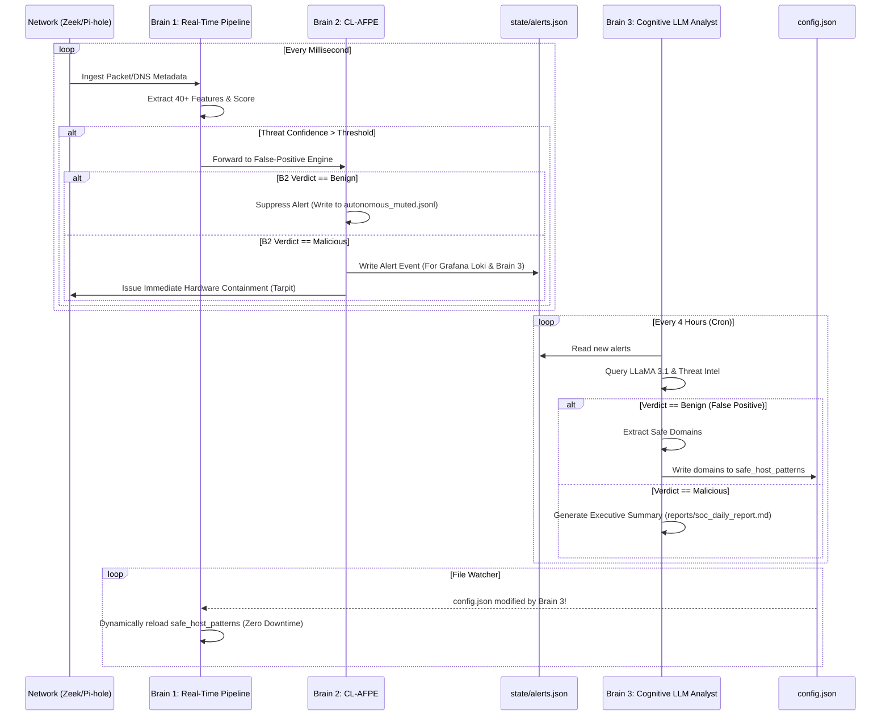

# 🛡️ Home-IDS: The Exhaustive Master Manual & Architecture Guide (Version 7)

Welcome to the definitive, PhD-thesis-level documentation for **Home-IDS Version 7**. 

This manual is engineered to provide 100% transparency into the inner workings of the Home-IDS autonomous engine. It covers the exact data flow of the Tri-Brain architecture, an exhaustive breakdown of every configuration parameter, a complete guide to every file in the state repository, service lifecycle management, testing protocols, and complete Prometheus telemetry mappings.

If you are maintaining, debugging, or extending this script, every piece of knowledge you require is contained within this document.

---

## 📋 Table of Contents
1. [🌟 The Tri-Brain Architecture & Internal Data Flow](#-the-tri-brain-architecture--internal-data-flow)
2. [⚙️ The Comprehensive Configuration Dictionary (`config.json`)](#%EF%B8%8F-the-comprehensive-configuration-dictionary-configjson)
3. [📁 Exhaustive State & File System Reference](#-exhaustive-state--file-system-reference)
4. [🔄 Service Lifecycle: Warm vs. Cold Restarts](#-service-lifecycle-warm-vs-cold-restarts)
5. [🧪 Test Suite & Validation Scripts](#-test-suite--validation-scripts)
6. [📊 Prometheus Telemetry & Loki Observability](#-prometheus-telemetry--loki-observability)
7. [📚 Categorized Threat Catalog & Playbooks](#-categorized-threat-catalog--playbooks)

---

## 🌟 The Tri-Brain Architecture & Internal Data Flow

Version 7 operates on a revolutionary tri-brain processing pipeline. To maintain a zero-latency network response, heavy computational tasks are physically separated from the real-time detection loop.

### 🧠 Brain 1: The Statistical Engine (Real-Time Pipeline)
**Location**: `src/core/pipeline.py` and `src/main.py`
**Responsibility**: Real-time packet inspection and high-speed threat scoring.
- Operates entirely in-memory using highly optimized asynchronous workers (`asyncio`).
- Intercepts Zeek (Bro) metadata and Pi-hole DNS logs using `tail -F` cursor tracking.
- Calculates structural deviations using a custom LightGBM model and temporal mathematics (Shannon Entropy, Markov Chains, Fourier Transforms for diurnal rhythms).
- **Data Flow**: Reads configuration dynamically from `config.json`. If Threat Confidence exceeds the `alert_threshold`, it pushes the alert object directly to Brain 2.

### 🛡️ Brain 2: The Continuous Learning False-Positive Engine (CL-AFPE)
**Location**: `src/core/decision_engine.py`
**Responsibility**: Preventing the system from blocking legitimate traffic (Smart TVs, backup jobs).
- Evaluates alerts in real-time before containment is triggered.
- Uses a dedicated LightGBM model and structural vector embeddings (FastEmbed `bge-small-en-v1.5-onnx-q`) to compare the alert's mathematical signature against known benign telemetry.
- **Data Flow**: If benign, the alert is written to `state/autonomous_muted.jsonl` and the domain is temporarily cached in `state/fp_trust_cache.json`. If malicious, the alert is committed to `state/alerts.json` (for Loki and Brain 3) and hardware containment is fired.

### 🕵️ Brain 3: The Cognitive Analyst (Local LLM SOC)
**Location**: `src/scripts/ollama_soc.py` and `src/scripts/scheduler.py`
**Responsibility**: Deep, cognitive post-incident analysis and permanent self-healing.
- Runs entirely out-of-band as a scheduled batch background task.
- Queries a local **Ollama (LLaMA 3.1)** instance.
- **Data Flow (Self-Healing Loop)**: Brain 3 reads the raw JSON alerts from `state/alerts.json`. If the AI determines an alert is a False Positive, Brain 3 opens `config.json` and injects the benign domain directly into `dynamic_live_reload.safe_host_patterns`. Brain 1's file watcher instantly detects this change and reloads the configuration into memory with zero downtime.



---

## ⚙️ The Comprehensive Configuration Dictionary (`config.json`)

The `config.json` file controls every aspect of the IDS. It is split strictly into static elements (requiring a restart to bind OS resources) and dynamic elements (hot-reloaded instantly).

### 1. `static_requires_restart`
These variables dictate system architecture and API bindings. Modifying them requires `sudo systemctl restart soc.service`.

| Variable | Default | Exhaustive System Impact |
|---|---|---|
| `metrics_port` | `9105` | The TCP port where the Prometheus `/metrics` server binds. Change this if 9105 conflicts with another service. |
| `fastapi_port` | `8010` | The TCP port for the local Uvicorn webhook server. Receives interactive Telegram callbacks (e.g., clicking "Isolate Device" on your phone sends a webhook here). |
| `state_path` | `state/ids_state.json` | The absolute or relative path where the system serializes the `StateManager` object (memory structures) to disk. |
| `model_path` | `models/ids_model.pkl` | Path to save the global `scikit-learn` IsolationForest baseline model. |
| `geoip_db` | `../geoiop/GeoLite2-City.mmdb` | Path to the MaxMind GeoLite2 City database. If missing, `country`, `latitude`, and `longitude` fields in the Prometheus metrics will be null. |
| `geoip_asn_db` | `../geoiop/GeoLite2-ASN.mmdb` | Path to the MaxMind GeoLite2 ASN database. Required for tracking ISP/Organization ownership of malicious IPs. |
| `pihole_db` | `/etc/pihole/pihole-FTL.db` | Absolute path to Pi-hole's SQLite database. The engine parses the FTL schema for raw DNS queries. |
| `zeek_log_dir` | `/opt/zeek/logs/current` | Directory containing live Zeek logs (`conn.log`, `notice.log`, `dns.log`). The engine uses `tail -F` on these files. |
| `alert_json_path` | `state/alerts.json` | Target output file for confirmed malicious JSON alerts. Scraped continuously by Promtail/Loki. |
| `alert_json_max_bytes` | `1073741824` | (1GB). The byte threshold for the internal `RotatingFileHandler`. Once reached, the file is rotated to prevent disk exhaustion. |
| `max_device_states` | `5000` | Limits the `StateManager` LRU (Least Recently Used) cache. Prevents RAM exhaustion if your network is subjected to a massive IP spoofing attack (e.g., millions of fake local IPs). |
| `telegram_token` | `""` | The HTTP API token from BotFather. Enables push notifications to your device. |
| `telegram_chat_id` | `""` | The destination Chat ID for alerts. Can be your personal ID or a group chat ID. |
| `otx_api_key` | `""` | AlienVault Open Threat Exchange API key. Strongly recommended to prevent Brain 3 from hallucinating benign verdicts for known malicious IPs. |
| `abuseipdb_api_key` | `""` | API key for AbuseIPDB reputation lookups. |
| `virustotal_api_key` | `""` | API key for VirusTotal sandbox analysis and AV signatures. |
| `pihole_api_password`| `""` | The Pi-hole web interface password (or raw API token in newer versions). Required for Brain 1 to issue DNS Sinkhole commands via the Pi-hole API. |
| `pihole_api_url` | `""` | The base URL to your Pi-hole (e.g., `http://192.168.1.94:8080`). |
| `router_webhook_url` | `""` | Full URL (usually pointing to the local `fastapi_port`) to trigger a router isolation sequence manually. |
| `fritz_ip` | `192.168.1.1` | The local LAN IP of your Fritz!Box router. |
| `fritz_user` | `admin` | The Fritz!Box API user account. |
| `fritz_password` | `""` | The password for the Fritz!Box API user. Used to authenticate TR-064 SOAP calls to sever WAN connections. |
| `fritz_api_token` | `""` | (Optional) Fallback token for newer FritzOS firmwares requiring specific app-token negotiation. |

### 2. `dynamic_live_reload`
Changing these values takes effect **instantly**. Brain 1's `config.py` runs a background thread that hashes `config.json` every second. If modified, the variables are hot-swapped into the running memory structures.

| Variable | Default | Exhaustive System Impact |
|---|---|---|
| `log_level` | `"INFO"` | Python `logging` severity. Switch to `"DEBUG"` to see raw Zeek dictionary parsing in `journalctl`. |
| `telegram_enabled` | `true` | Toggles Telegram push notifications. Set to `false` if you only want Grafana logging. |
| `telegram_allowed_chat_ids` | `[]` | Security barrier: Only users with these Telegram IDs can click inline buttons (like "Isolate"). Prevents unauthorized users in group chats from executing containment actions. |
| `ips_enabled` | `true` | The master killswitch. If `false`, the system operates in purely "Monitor Only" (Passive) mode. Alerts will trigger, but NO containment (Pi-hole, ARP, Router) will ever execute. |
| `ips_pihole_enabled` | `true` | If true, Brain 1 will use the Pi-hole API to add malicious domains to your blocklist (Layer 7 containment). |
| `ips_router_enabled` | `false` | If true, Brain 1 will execute TR-064 SOAP calls against the Fritz!Box to physically cut WAN access (Layer 3 containment). |
| `ips_tarpit_enabled` | `true` | If true, Brain 1 will spawn a background Scapy process to forge rapid-fire ARP and NDP replies, confusing the infected device's routing table (Layer 2 containment). |
| `interactive_blocking_enabled` | `false` | If true, hardware isolations (`ips_router_enabled`, `ips_tarpit_enabled`) will NOT execute autonomously. They will pause and wait for you to click "Approve" in the Telegram alert. |
| `operator_release_cooldown_seconds`| `3600.0` | Once you manually release a device via Telegram, it is immune from being auto-isolated again for 1 hour. This prevents endless loop-blocking while you are trying to remediate the machine. |
| `poll_interval` | `2` | Polling rate (in seconds) for the Pi-hole SQLite DB. Since Pi-hole does not easily support `tail`, we poll the `queries` table. Keep at `2` for near-real-time detection. |
| `window_seconds` | `300` | (5 minutes). Defines the rolling temporal window for standard deviation calculations (e.g., Query Volume, Entropy) inside `StateManager`. |
| `startup_lookback_seconds` | `300` | When the script boots, it will ignore any logs in Pi-hole/Zeek older than this value. Prevents an avalanche of false alerts from old traffic during a reboot. |
| `alert_threshold` | `6.0` | The absolute minimum Threat Confidence (0-10) required to trigger the containment/alert pipeline. |
| `threshold_std_dev` | `3.0` | **Autotune sensitivity parameter.** If autotuning is enabled, the threshold is automatically calculated as: `Mean(Historical Scores) + (StdDev * threshold_std_dev)`. |
| `ml_warmup_samples` | `5000` | The number of DNS/Network events a specific IP address must generate before its bespoke Machine Learning IsolationForest is activated. Prevents wildly fluctuating AI scores on brand-new devices. |
| `baseline_alpha` | `0.05` | The exponential weight applied to new data when calculating the moving average baselines (EWMA). A higher number (e.g. 0.1) makes the baseline adapt much faster; a lower number (e.g. 0.01) makes it sluggish and resistant to change. |
| `decay_factor` | `0.995` | The decay multiplier applied per minute to time-based features (e.g., `unique_domains`). |
| `home_subnet` | `192.168.1.0/24` | Defines your internal network boundaries. The Zeek parser uses this to mathematically separate "internal lateral scanning" from "external outbound traffic". |
| `ti_refresh_interval` | `3600` | (1 hour). How often external Threat Intelligence (OTX/AbuseIPDB) cache entries are invalidated and re-fetched. |
| `ollama_url` | `http://192.168.1.94:11434` | The HTTP endpoint for the local Ollama daemon. |
| `ollama_model` | `llama3.1` | The specific LLM model tag Brain 3 will invoke. |
| `safe_ips` | `["127.0.0.1"]` | Highly trusted IPs (like your Pi-hole host or Router). Traffic originating from these IPs completely bypasses the feature extraction and HEE scoring pipelines. |
| `honeypot_ips` | `["192.168.1.200"]` | Dummy IPs on your LAN. Any connection attempt detected by Zeek heading toward these IPs instantly triggers a massive Lateral Movement penalty (Score +10.0). |
| `safe_domains` | `[]` | Static list of whitelisted domains. Evaluated strictly as `exact match`. |
| `safe_host_patterns` | `["pi-hole", "paperless"]` | Substring whitelists. Any domain *containing* these strings is suppressed. **Brain 3 dynamically injects into this array to heal False Positives.** |
| `device_type_overrides` | `{"LPTP2044": "laptop"}` | Manual overrides for device classification. Affects which mathematical baseline is applied to the device in the HEE graph. |
| `pihole_api_path` | `/api/v2/domains` | The Pi-hole API URI used for adding domains to blocklists (changed in Pi-hole v6). |
| `fp_lgbm_threshold` | `0.75` | Brain 2 (CL-AFPE) LightGBM threshold. If the model is 75% confident an alert is benign, it suppresses it. |
| `fp_embed_similarity_threshold` | `0.82` | Brain 2 (CL-AFPE) FastEmbed vector distance threshold. A cosine similarity of 0.82 or higher to a known benign cluster triggers suppression. |
| `fp_combined_suppress_threshold` | `0.8` | If the system uses a hybrid model (LightGBM + Vector), the combined score required to suppress. |
| `fp_combined_uncertain_threshold` | `0.55` | The lower bound of uncertainty. If the score is below this, Brain 2 immediately rejects the False Positive hypothesis and fires the alert. |
| `autotune_enabled` | `true` | If true, the `autotune_schedule_cron` job calculates the optimal `alert_threshold` based on your network's actual noise floor every night. |
| `autotune_schedule_cron` | `"0 3 * * *"` | Standard Cron expression for the autotune task (default: 3:00 AM daily). |
| `autotune_min_risk_threshold` | `4.0` | The absolute minimum floor for autotuning. Prevents the script from setting the threshold so low that every packet triggers an alert. |
| `layer2_spoofing_detection_enabled` | `true` | Allows the engine to monitor for MAC/IP mismatches indicating an attacker is attempting ARP spoofing. |
| `geofencing_enabled` | `true` | Toggles IP-based geolocation blocking based on the MaxMind DB. |
| `geofencing_mode` | `"blocklist"` | `"blocklist"` blocks the countries below. `"allowlist"` blocks the entire planet *except* the countries listed. |
| `geofencing_countries` | `["RU", "CN"]` | ISO 3166-1 alpha-2 country codes to block. Connections to IPs in these regions apply Tier-5 Threat Intelligence scores. |
| `geofencing_time_policies` | `[]` | JSON arrays specifying time-based geographic rules (e.g., blocking connections to a region only outside business hours). |
| `scheduler` | `{...}` | Contains cron definitions for `ollama_soc` (Brain 3 batch analyst), `retrohunter` (historical log scanning against new threat intel), and `top_domains_report`. |

---

## 📁 Exhaustive State & File System Reference

To survive reboots, power outages, and to provide data to Brain 3 and Grafana Loki, the system writes specialized artifacts to the disk. 

### The `state/` Directory (Mutable Event Data)

| File | Purpose and Lifecycle |
|---|---|
| `ids_state.json` | **The Core Brain Record**. Managed by `core/state_guard.py`. Contains the massive nested dictionary of every tracked IP address, its current Threat Confidence score, its mathematical baseline (EWMA rates, variances), and its active hardware containment status (`is_isolated=True/False`). Flushed to disk periodically and on shutdown. |
| `alerts.json` | **The Loki Ingestion Log**. An append-only JSONL file. Every time Brain 1 (and 2) confirm a threat, the entire structured Evidence Graph is serialized as JSON and appended here. Grafana Promtail tails this file to populate the Triage Dashboard. Brain 3 (`ollama_soc`) also reads this file to find unprocessed alerts. |
| `autonomous_muted.jsonl` | **The Suppressed Event Log**. Identical in structure to `alerts.json`, but contains only the alerts that Brain 2 (CL-AFPE) successfully identified as False Positives and suppressed. Used for audits to prove the AI isn't ignoring real threats. |
| `fp_trust_cache.json` | **Brain 2's Short-Term Memory**. When Brain 2 suppresses a false positive, it saves the base domain here with a TTL timestamp (default 14 days). Queries matching this cache bypass heavy ML execution entirely for raw speed. |
| `fp_sigma_shifts.json` | **Brain 2's Variance Adjustments**. If a device keeps triggering false positives by slightly exceeding its volume baseline, Brain 2 writes a "sigma shift" here to permanently widen the standard deviation threshold for that specific device without impacting the global threshold. |
| `zeek_cursor_*.json` | **File Ingestion Trackers**. (`zeek_cursor_conn.json`, `zeek_cursor_dns.json`, etc.). Because `tail -F` is dangerous if the script restarts, these files store the exact byte-offset and inode of the Zeek logs. Upon restart, the engine seeks exactly to this byte offset, guaranteeing zero missed packets and zero duplicate logs. |
| `.last_autotune` | A tiny lock file containing the UNIX timestamp of the last time the `autotune` cron job ran. Prevents duplicate execution. |
| `.last_retro_hunt` | A lock file for the `retrohunter` script. |
| `ti_cache/` | **Threat Intelligence Caching Directory**. Stores MD5-hashed JSON files mapping external IP addresses to their AlienVault/AbuseIPDB scores. Prevents API rate-limit exhaustion by serving local hits for 1 hour (`ti_refresh_interval`). |

### The `models/` Directory (Machine Learning Weights)

| File / Folder | Purpose and Lifecycle |
|---|---|
| `ids_model.pkl` | The *global* `scikit-learn` IsolationForest model. Trained on the aggregate traffic of your entire home network. It provides the "default" anomaly scoring for new devices. |
| `devices/<IP_ADDRESS>.pkl` | *Bespoke* IsolationForest models. Once a device hits `ml_warmup_samples` (e.g., 5,000 queries), the system forks a personalized ML model for that specific IP and saves it here. This allows the AI to learn the exact behavioral signature of a specific smart bulb vs a specific laptop. |

### The `reports/` Directory (Brain 3 Output)
- **`soc_daily_report_YYYYMMDD.md`**: Generated by the Cognitive Analyst (Brain 3). Contains the LLaMA 3.1 LLM's deep-dive investigations into your alerts, natural language summaries, and a record of any autonomous self-healing config injections it executed.
- **`top_domains_YYYYMMDD.md`**: Generated by the `top_domains_report.py` cron job daily at 06:00. Lists the top domains queried per device.

---

## 🔄 Service Lifecycle: Warm vs. Cold Restarts

Because Home-IDS is an AI system that *learns* over time, how you restart the daemon (`soc.service`) fundamentally alters its intelligence.

### 🟡 The Warm Restart (Standard Operation)
A warm restart occurs when you run:
```bash
sudo systemctl restart soc.service
```
1. The script receives a `SIGTERM` signal. 
2. `state_guard.py` intercepts the signal and immediately flushes the in-memory device states to `state/ids_state.json`.
3. The script terminates.
4. Systemd restarts the script.
5. The engine boots, reads `ids_state.json`, reads all `.pkl` models from `models/`, and reads the byte-offsets from `zeek_cursor_*.json`.

**The Result**: The system resumes processing the exact next packet with 100% of its Machine Learning baselines, historical device Trust Caches, and active hardware isolation states perfectly preserved. 
**When to use**: When updating `static_requires_restart` config variables or applying standard python updates.

### 🔴 The Cold Restart (The Brain Wipe)
A cold restart is a manual process that forcefully obliterates the AI's memory and state trackers.
```bash
sudo systemctl stop soc.service
rm -rf state/ids_state.json models/*.pkl models/devices/*.pkl state/fp_trust_cache.json
sudo systemctl start soc.service
```
1. You delete all `.pkl` machine learning weights and the `ids_state.json` memory bank.
2. Upon startup, the engine sees missing files and initializes entirely empty matrices.
3. Every device on your network is forced back into a 24-hour **"Probationary State"**. The system begins at ground zero, re-learning what "normal" traffic looks like.

**When to use**: 
- ONLY use this if your ML baselines are completely poisoned. For example, if you installed Home-IDS *while your network was actively infected by a botnet*, the system will have learned that DGA beaconing is "normal." A cold restart after cleaning the botnet will force the AI to learn a clean baseline.

---

## 🧪 Test Suite & Validation Scripts

The repository includes a highly advanced `tests/` directory allowing you to safely validate the system's mathematics and containment capabilities without downloading real malware.

### 1. `tests/live_system_tester.py`
This script simulates real-world attack patterns to verify that Brain 1 and Brain 2 are interacting with Zeek and Pi-hole correctly.
```bash
python3 tests/live_system_tester.py --attack dga --target 192.168.1.45
```
**What it does:**
- It uses `scapy` to forge thousands of high-entropy DNS requests (e.g., `x89zj2.com`) or Rapid TCP SYNs to simulate an internal port scan.
- Because it sends real packets, it proves that your Zeek and Pi-hole sensors are successfully capturing traffic and feeding it into the real-time pipeline.

### 2. `tests/regression_tester.py`
This script validates the internal mathematics of the Hypothesis & Evidence Engine (HEE) without sending actual network traffic.
```bash
python3 tests/regression_tester.py
```
**What it does:**
- It directly injects synthetic Python dictionaries (simulating Zeek outputs) into the HEE graph logic.
- It asserts that specific feature combinations (e.g., `high_entropy=True` + `high_nxdomain=True`) perfectly calculate a Threat Confidence of `> 8.0` and trigger the `DGA_BEACONING` hypothesis.
- Run this after modifying any logic in `src/core/pipeline.py` to ensure you didn't accidentally break the mathematical models.

---

## 📊 Prometheus Telemetry & Loki Observability

Home-IDS exposes a massive array of metrics on port `9105/metrics`. By scraping this with Grafana, you obtain enterprise-level observability over the engine's internal calculations.

*(All metrics defined in `src/metrics.py`)*

### 1. Threat Confidence & AI State Metrics
| Prometheus Metric (`home_ids_*`) | Type | Deep Explanation |
|---|---|---|
| `threat_confidence` | Gauge (0-1.0) | The live, real-time Threat Confidence score. A spike directly correlates to an alert generation in `alerts.json`. |
| `anomaly_confidence` | Gauge (0-1.0) | The IsolationForest ML structural outlier score. Indicates deviation from the `.pkl` baseline (e.g., unusual query volumes during off-hours). |
| `decision_state` | Gauge (0-4) | The quantized output of the HEE graph state matrix. `0=BENIGN`, `1=ANOMALOUS`, `2=SUSPICIOUS`, `3=HIGH`, `4=CRITICAL`. |

### 2. DNS & Zeek Network Feature Extraction
| Prometheus Metric (`home_ids_*`) | Type | Deep Explanation |
|---|---|---|
| `query_rate` | Gauge | Raw volume of DNS queries per minute. Spikes indicate DoS, DGA, or aggressive telemetry bursts. |
| `entropy_avg` | Gauge | Shannon Entropy of queried domain strings. The higher the number, the closer the strings are to pure random distribution. |
| `nxdomain_ratio` | Gauge | Fraction of queries resulting in NXDOMAIN. Crucial for catching botnets hunting for unregistered backup C2 servers. |
| `zeek_lateral_events_total` | Counter | Tracks aggregate internal `S0/REJ` state connections (Port Scanning). |
| `beaconing_c2_count` | Gauge | Tracks highly uniform, periodic "heartbeat" connections calculated via Coefficient of Variation (Jitter). |
| `outbound_bytes_window` | Gauge | Cumulative payload volume (in bytes) leaving your network across the rolling `window_seconds`. Spikes indicate Data Exfiltration. |
| `zeek_ja3_malicious` | Gauge | Flags devices presenting a TLS Client Hello cryptographic fingerprint (JA3/JA4+) matching a known malware hash table (e.g., AsyncRAT, Cobalt Strike). |

### 3. Brain 2 (CL-AFPE) Efficacy Metrics
| Prometheus Metric (`home_ids_*`) | Type | Deep Explanation |
|---|---|---|
| `fp_evaluations_total` | Counter | Total alerts that crossed the `alert_threshold` and were intercepted by Brain 2. |
| `fp_suppressed_total` | Counter | Total alerts Brain 2 identified as benign and killed. (Higher = quieter SOC). |
| `fp_confidence_score` | Gauge (0-1) | The probability matrix output from the LightGBM classifier. High score means "Highly confident this is a False Positive." |
| `fp_domains_immunized_total`| Counter | Number of unique eTLD+1 domains dynamically injected into the local trust cache. |

### 4. Containment Status & Mitigation Telemetry
| Prometheus Metric (`home_ids_*`) | Type | Deep Explanation |
|---|---|---|
| `ips_tarpit_active` | Gauge (0/1) | Emits `1` if a device is currently being locked down by the Scapy Layer-2 ARP Blackhole loop. |
| `ips_router_isolated_active` | Gauge (0/1) | Emits `1` if a device has had its WAN access severed via Fritz!Box API. |
| `ips_pihole_blocks_aggregate_total` | Counter | Running total of all domains automatically written to the DNS Sinkhole. |

### Loki LogQL Debugging Queries
Use these queries in Grafana Explore to inspect the raw JSON evidence graphs:
- **View Critical Threats**: `{job="home_ids_alerts"} | json | threat_confidence > 8.0`
- **Audit Brain 2 Suppressions**: `{job="home_ids_muted"} | json | action = "suppressed"`
- **Trace Exfiltration Events**: `{job="home_ids_alerts"} | json | hypothesis_triggered = "DATA_EXFILTRATION"`

---

## 📚 Categorized Threat Catalog & Playbooks

### Threat 1: Domain Generation Algorithms (DGA) & Botnet C2
**Engine Detection:** Sudden spike in `home_ids_entropy_avg` + high `home_ids_nxdomain_ratio` + Markov Chain transition anomalies.
**Automated Response:** Brain 1 executes a Pi-hole sinkhole and initiates an ARP Tarpit to isolate the device.
**Analyst Playbook:** Isolate device, run endpoint antivirus (Malwarebytes, Defender). Terminate rogue background processes. Release via Telegram webhook once purged.

### Threat 2: DNS Tunneling & Covert Data Exfiltration
**Engine Detection:** Subdomain labels exceeding 45 characters (`max_label_length`), deep domain nesting (>$5$ levels), combined with a spike in `home_ids_outbound_bytes_window` and high TXT/NULL query ratios.
**Automated Response:** Immediate Layer-3 Router WAN isolation (kill internet access).
**Analyst Playbook:** Keep device isolated. Execute `netstat -abno` or `lsof -i` to locate the process holding the network socket. Reset all passwords accessed by the compromised machine.

### Threat 3: Internal Lateral Movement
**Engine Detection:** Zeek NDR logs reveal a high counter of `S0` (Unanswered) or `REJ` (Rejected) TCP states targeting multiple internal IP addresses (Port Scanning).
**Automated Response:** Layer-2 ARP Tarpit to sever LAN access and protect peer devices.
**Analyst Playbook:** Cross-reference the Grafana Zeek dashboard to identify the targeted ports (e.g., Port 445 = SMB). Power off the infected IoT device immediately.

---
*Home-IDS Master Documentation & SecOps Playbook — Engine Version 7.0.0*
