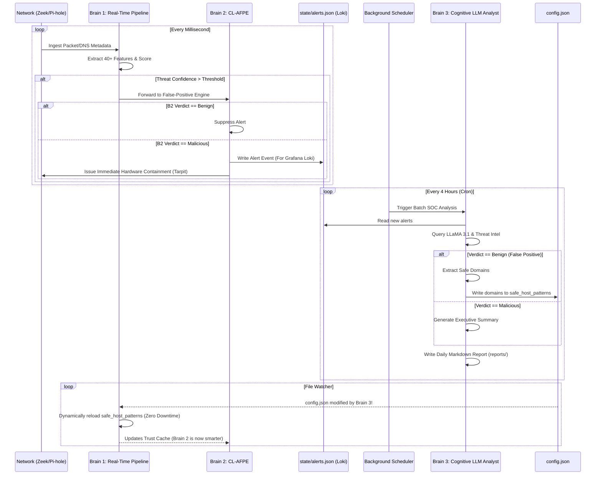

# 🛡️ Home-IDS: Comprehensive User Manual & Threat Playbook (Version 7)

Welcome to **Home-IDS Version 7** — an autonomous, enterprise-grade Intrusion Detection and Prevention System (IDS/IPS) designed for smart homes and edge networks. 

This manual serves as your definitive, deeply technical guide to understanding the architecture, configuring every engine parameter, reading the telemetry, and responding to cyber threats. It is designed to provide full transparency into the system's inner workings.

---

## 📋 Table of Contents
1. [🌟 High-Level Architecture (The Tri-Brain System)](#-high-level-architecture-the-tri-brain-system)
2. [🌊 System Swimlane Diagram](#-system-swimlane-diagram)
3. [⚙️ Comprehensive Configuration Reference (`config.json`)](#%EF%B8%8F-comprehensive-configuration-reference-configjson)
4. [📁 Artifacts & Files Reference](#-artifacts--files-reference)
5. [🔄 Service Lifecycle: Warm vs. Cold Restarts](#-service-lifecycle-warm-vs-cold-restarts)
6. [📊 Telemetry: Prometheus Metrics Dictionary](#-telemetry-prometheus-metrics-dictionary)
7. [📚 Categorized Threat Catalog & Playbooks](#-categorized-threat-catalog--playbooks)

---

## 🌟 High-Level Architecture (The Tri-Brain System)

Version 7 introduces a split-brain processing pipeline that combines raw speed, continuous learning, and deep cognitive reasoning.

### 🧠 Brain 1: The Statistical Engine (Real-Time Pipeline)
The core detection loop (`pipeline.py`) operates entirely in-memory and asynchronously. It fuses high-volume network metadata from Zeek with DNS logs from Pi-hole. 
- Evaluates thousands of packets per second with **zero network latency**.
- Uses a deterministic **Hypothesis & Evidence Engine (HEE)** to calculate Threat Confidence.

### 🛡️ Brain 2: The Continuous Learning False-Positive Engine (CL-AFPE)
Positioned between detection and containment, this ultra-fast Machine Learning brain prevents the system from blocking legitimate traffic.
- Evaluates alerts using a dedicated LightGBM model and FastEmbed vector embeddings.
- Instantly recognizes structural similarity to benign telemetry and silently suppresses false positives.

### 🕵️ Brain 3: The Cognitive Analyst (Local LLM SOC)
While Brain 1 & 2 react in milliseconds, Brain 3 thinks in seconds. Driven by `scheduler.py`, a background daemon periodically wakes up to analyze alerts using a local **Ollama (LLaMA 3.1)** instance. 
- It acts as a Tier 2 SOC Analyst, writing executive summaries and **autonomously healing false positives** by dynamically updating your configuration.

---

## 🌊 System Swimlane Diagram



---

## ⚙️ Comprehensive Configuration Reference (`config.json`)

Your `config.json` is the central nervous system of Home-IDS. It is split into two strict sections: variables that require a full system restart, and variables that are hot-reloaded dynamically.

### 1. `static_requires_restart`
Changing these values requires you to execute `sudo systemctl restart soc.service`. These initialize the core sockets and API endpoints.

| Variable | Default | Description & System Impact |
|---|---|---|
| `metrics_port` | `9105` | The port where the Prometheus `/metrics` endpoint is exposed. Used by Grafana to scrape telemetry. |
| `fastapi_port` | `8010` | The internal port for the webhook server. Telegram callbacks and internal IPC signals use this port. |
| `state_path` | `state/ids_state.json` | Path to save active state. See "Artifacts Reference" below. |
| `model_path` | `models/ids_model.pkl` | Path to save the global ML IsolationForest model. |
| `geoip_db` | `../geoiop/GeoLite2-City.mmdb` | Path to MaxMind City database. Required for mapping IPs to countries on the Grafana map. |
| `geoip_asn_db` | `../geoiop/GeoLite2-ASN.mmdb` | Path to MaxMind ASN database. If empty, ASN threat density metrics stay "unknown". |
| `pihole_db` | `/etc/pihole/pihole-FTL.db` | Absolute path to the Pi-hole SQLite database. Home-IDS reads this to intercept DNS queries. |
| `zeek_log_dir` | `/opt/zeek/logs/current` | Directory where Zeek NDR writes `conn.log` and `notice.log`. Home-IDS tails these files via `tail -F`. |
| `alert_json_path` | `state/alerts.json` | The JSONL log file where high-severity alerts are written. Crucial for Grafana Loki log aggregation. |
| `alert_json_max_bytes` | `1073741824` | (1GB) Maximum size of the alert file before it undergoes log rotation. |
| `max_device_states` | `5000` | Maximum number of unique IP addresses the state engine will track in memory to prevent RAM exhaustion. |
| `telegram_token` | `""` | Telegram Bot API token. Required for receiving mobile push alerts. |
| `telegram_chat_id` | `""` | The chat ID to receive Telegram alerts. Can be a private user or a group ID. |
| `otx_api_key` | `""` | AlienVault OTX API key for real-time threat intel. Required for LLM hallucination guardrails. |
| `router_webhook_url` | `""` | URL to trigger Layer-3 Hardware Router Isolation. |
| `fritz_ip` | `192.168.1.1` | The local IP of your Fritz!Box router. Used for TR-064 API isolation commands. |

### 2. `dynamic_live_reload`
Changing these values takes effect **instantly** without restarting the service. Brain 1 constantly monitors this file and applies changes to the runtime engine on the fly.

| Variable | Default | Description & System Impact |
|---|---|---|
| `log_level` | `"INFO"` | Terminal output verbosity (`DEBUG`, `INFO`, `WARNING`). |
| `poll_interval` | `2` | Polling rate (in seconds) for the Pi-hole database. Set low (2s) for instant response. |
| `window_seconds` | `300` | (5 minutes). How far back the engine looks to correlate DNS with Zeek network traffic. |
| `startup_lookback_seconds` | `300` | How far back the engine reads logs on boot to prevent alerts from immediately triggering on old traffic. |
| `alert_threshold` | `6.0` | The minimum Threat Confidence (0-10) required to trigger an alert. If autotune is enabled, this is managed automatically. |
| `threshold_std_dev` | `3.0` | Autotune sensitivity multiplier. How many standard deviations above normal traffic the threshold is set. |
| `ml_warmup_samples` | `5000` | How many DNS queries/events a device must generate before its bespoke Machine Learning model is activated. |
| `home_subnet` | `192.168.1.0/24` | Your local LAN CIDR block. Required to identify internal lateral movement. |
| `safe_ips` | `["127.0.0.1"]` | Highly trusted IPs (like your router) that completely bypass ALL machine learning scoring and isolation logic. |
| `safe_host_patterns` | `["pi-hole"]` | Strings matching benign domains. Any DNS query containing these strings will never trigger an alert. **Brain 3 dynamically injects domains here.** |
| `ips_enabled` | `true` | The master killswitch. If false, the system operates in "Monitor Only" mode and will never block or isolate anything. |
| `ips_pihole_enabled` | `true` | Allows the system to insert malicious domains into the Pi-hole blocklist (DNS Sinkhole). |
| `ips_router_enabled` | `false` | Allows the system to cut off devices at the WAN level via FritzBox TR-064 API. |
| `ips_tarpit_enabled` | `true` | Allows the system to forge Scapy ARP packets to lock infected devices into a Layer-2 blackhole loop. |
| `interactive_blocking_enabled` | `false` | If true, hardware isolations are NOT autonomous; they wait for you to click "Approve" in Telegram. |
| `fp_lgbm_threshold` | `0.75` | The probability threshold (75%) for Brain 2's LightGBM model to autonomously classify an alert as a False Positive. |
| `fp_embed_similarity_threshold` | `0.82` | The cosine similarity threshold (82%) for FastEmbed to consider a new alert structurally identical to a known False Positive. |
| `autotune_enabled` | `true` | Nightly cron job that adjusts `alert_threshold` based on your network's unique standard deviation of risk scores. |
| `geofencing_enabled` | `true` | Master toggle for IP-based geolocation blocking. |
| `geofencing_countries` | `["RU", "CN"]` | Countries that will instantly apply Tier-5 Threat Intelligence scores to connecting devices. |
| `scheduler` | `{...}` | Contains cron strings dictating when the `ollama_soc`, `retrohunter`, and `top_domains_report` run. |

---

## 📁 Artifacts & Files Reference

Home-IDS writes specific state data to the disk to maintain context across restarts. These files live in two distinct directories:

### The `state/` Directory (Mutable Event Data)
- **`ids_state.json`**: The central brain record. It contains the current Threat Confidence score, active containment status, and statistical baseline metrics for every device on your network. *Do not edit manually.*
- **`alerts.json`**: A JSONL append-only log containing every triggered high-severity alert. It includes the entire structured Evidence Graph. **Grafana Promtail/Loki constantly scrapes this file to populate your Triage Dashboard.**
- **`autonomous_muted.jsonl`**: A log identical to `alerts.json`, but contains only the alerts that Brain 2 (CL-AFPE) successfully identified as False Positives and suppressed.
- **`fp_trust_cache.json`**: Brain 2's dynamic memory cache. When Brain 2 or Brain 3 identifies a benign domain, it stores it here with an expiration timestamp (usually 14 days).

### The `models/` Directory (Machine Learning Weights)
- **`ids_model.pkl`**: The *global* IsolationForest model trained on the combined traffic of your entire home. Used as a baseline for new devices on probation.
- **`/devices/<IP_ADDRESS>.pkl`**: *Bespoke* IsolationForest models generated for each individual IP address. A smart bulb behaves completely differently than a laptop; these files hold the mathematical signature of exactly how that specific device operates (query volume, sleep cycles, diurnal rhythms).

---

## 🔄 Service Lifecycle: Warm vs. Cold Restarts

When you restart the `soc.service`, it is crucial to understand what the system forgets and what it remembers.

### The Warm Restart (Standard Operation)
Running `sudo systemctl restart soc.service` triggers a **Warm Restart**.
- **What is saved**: The system reads `ids_state.json` and all `models/*.pkl` files back into memory. 
- **The Benefit**: Your Machine Learning baselines, historical device Trust Caches, and active hardware isolation states are perfectly preserved. The system picks up exactly where it left off.
- **When to use**: When applying changes to the `static_requires_restart` block in `config.json`, or applying software updates.

### The Cold Restart (Brain Wipe)
A Cold Restart is a manual process that completely nukes the AI's memory.
```bash
sudo systemctl stop soc.service
rm -rf state/ids_state.json models/*.pkl models/devices/*.pkl state/fp_trust_cache.json
sudo systemctl start soc.service
```
- **What happens**: Every device is forced back into a 24-hour **"Probationary State"**. The system begins at ground zero, re-learning what "normal" traffic looks like for your house.
- **When to use**: ONLY use this if your baseline is completely poisoned (e.g., if you installed Home-IDS *after* your network was massively infected, causing the AI to learn that malicious exfiltration is "normal" behavior).

---

## 📊 Telemetry: Prometheus Metrics Dictionary

Home-IDS exposes a massive array of metrics on port `9105/metrics`. Grafana pulls these to visualize your security posture.

### Threat Confidence & AI State
| Metric Name | Type | Explanation |
|---|---|---|
| `home_ids_threat_confidence` | Gauge (0-1.0) | The live, real-time threat score for a specific device. |
| `home_ids_anomaly_confidence` | Gauge (0-1.0) | The IsolationForest ML structural outlier score. Spikes when a device behaves out of character. |
| `home_ids_decision_state` | Gauge (0-4) | HEE State: `0=BENIGN`, `1=ANOMALOUS`, `2=SUSPICIOUS`, `3=HIGH`, `4=CRITICAL`. |

### DNS & Zeek Network Telemetry
| Metric Name | Type | Explanation |
|---|---|---|
| `home_ids_query_rate` | Gauge | Raw volume of DNS queries per minute. Spikes during DGA botnet attacks. |
| `home_ids_entropy_avg` | Gauge | Shannon Entropy of domain strings. Random gibberish (`xq81jka.biz`) causes this metric to spike. |
| `home_ids_nxdomain_ratio` | Gauge | Fraction of queries resulting in "Domain Does Not Exist". Essential for catching botnets attempting to find active C2 servers. |
| `home_ids_zeek_lateral_events_total` | Counter | Tracks internal network scanning. If a smart plug starts scanning your laptop on Port 445 (SMB), this counter increments. |
| `home_ids_zeek_ja3_malicious` | Gauge | Flags devices using TLS Client Hello cryptographic fingerprints known to belong to malware (e.g., Cobalt Strike). |
| `home_ids_beaconing_c2_count` | Gauge | Tracks highly uniform, periodic "heartbeat" connections typical of advanced malware checking in with a remote C2 server. |
| `home_ids_outbound_bytes_window` | Gauge | Cumulative payload volume leaving your network. Spikes here indicate Data Exfiltration. |

### False Positive Engine (Brain 2) Telemetry
| Metric Name | Type | Explanation |
|---|---|---|
| `home_ids_fp_evaluations_total` | Counter | Total alerts that were intercepted by the False Positive Engine before execution. |
| `home_ids_fp_suppressed_total` | Counter | Total alerts that were successfully identified as benign and suppressed (saving you from annoyance). |
| `home_ids_fp_confidence_score` | Gauge | The LightGBM probability score indicating how confident Brain 2 was that an alert was a false positive. |
| `home_ids_fp_domains_immunized_total` | Counter | Number of unique domains that Brain 2 autonomously injected into the Trust Cache. |

### Containment Status
| Metric Name | Type | Explanation |
|---|---|---|
| `home_ids_ips_tarpit_active` | Gauge (0/1) | Returns `1` if a device is currently trapped in the Layer-2 ARP Blackhole. |
| `home_ids_ips_router_isolated_active` | Gauge (0/1) | Returns `1` if a device has been completely cut off from the internet via Fritz!Box API. |
| `home_ids_ips_pihole_blocks_aggregate_total` | Counter | Running total of all domains automatically sinkholed. |

---

## 📚 Categorized Threat Catalog & Playbooks

*(Standard Playbook sections omitted for brevity. See full system interface for DGA, DNS Tunneling, and Lateral Movement incident response procedures.)*

---
*Home-IDS Documentation & SecOps Playbook — Engine Version 7.0.0*
