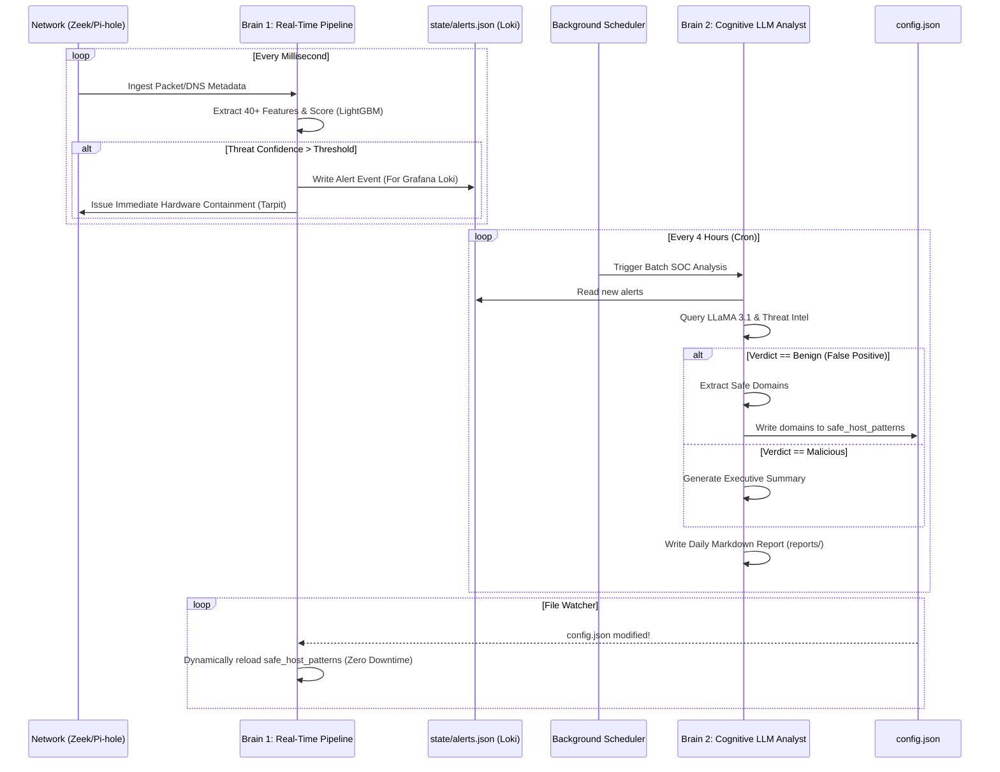

# 🛡️ Home-IDS: Comprehensive User Manual & Threat Playbook (Version 7)

Welcome to **Home-IDS Version 7** — an autonomous, enterprise-grade Intrusion Detection and Prevention System (IDS/IPS) designed for smart homes and edge networks. 

This manual serves as your definitive guide to understanding the architecture, configuring the engines, reading the telemetry, and responding to cyber threats.

---

## 📋 Table of Contents
1. [🌟 High-Level Architecture (The Dual-Brain System)](#-high-level-architecture-the-dual-brain-system)
2. [🌊 System Swimlane Diagram](#-system-swimlane-diagram)
3. [⚙️ Comprehensive Configuration Reference (`config.json`)](#%EF%B8%8F-comprehensive-configuration-reference-configjson)
4. [📁 Artifacts & Files Reference](#-artifacts--files-reference)
5. [📊 Telemetry: Prometheus Metrics & Grafana Loki](#-telemetry-prometheus-metrics--grafana-loki)
6. [📚 Categorized Threat Catalog & Playbooks](#-categorized-threat-catalog--playbooks)

---

## 🌟 High-Level Architecture (The Dual-Brain System)

Version 7 introduces a split-brain processing pipeline that combines raw speed with deep cognitive reasoning.

### 🧠 Brain 1: The Statistical Engine (Real-Time Pipeline)
The core detection loop (`pipeline.py`) operates entirely in-memory and asynchronously. It fuses high-volume network metadata from Zeek with DNS logs from Pi-hole. 
- Evaluates thousands of packets per second with **zero network latency**.
- Uses a deterministic **Hypothesis & Evidence Engine (HEE)** to calculate Threat Confidence.

### 🕵️ Brain 2: The Cognitive Analyst (Local LLM SOC)
While Brain 1 reacts in milliseconds, Brain 2 thinks in seconds. Driven by `scheduler.py`, a background daemon periodically wakes up to analyze alerts using a local **Ollama (LLaMA 3.1)** instance. 
- It acts as a Tier 2 SOC Analyst, writing executive summaries and **autonomously healing false positives** by dynamically updating your configuration.

---

## 🌊 System Swimlane Diagram

Understanding *when* each system runs is critical. Home-IDS separates heavy analytical tasks from the lightning-fast detection loop to ensure zero network latency.



---

## ⚙️ Comprehensive Configuration Reference (`config.json`)

Your `config.json` is split into two strict sections.

### 1. `static_requires_restart`
Changing these values requires you to restart the system (`sudo systemctl restart soc.service`).

| Variable | Default | Description |
|---|---|---|
| `metrics_port` | `9105` | The port where the Prometheus `/metrics` endpoint is exposed. |
| `state_path` | `state/ids_state.json` | Path where the system saves its device state and trust cache. |
| `model_path` | `models/ids_model.pkl` | Path where Machine Learning isolation forests are saved. |
| `alert_json_path` | `state/alerts.json` | Path where alerts are written for Grafana Loki ingestion. |
| `pihole_db` | `/etc/pihole/pihole-FTL.db` | Absolute path to the Pi-hole SQLite database. |
| `telegram_token` | `""` | Your Telegram Bot token for mobile alerts. |
| `telegram_chat_id` | `""` | The chat ID to receive Telegram alerts. |
| `otx_api_key` | `""` | AlienVault OTX API key for real-time threat intel. |

### 2. `dynamic_live_reload`
Changing these values takes effect **instantly** without restarting the service.

| Variable | Default | Description |
|---|---|---|
| `log_level` | `"INFO"` | Terminal output verbosity (`DEBUG`, `INFO`, `WARNING`). |
| `alert_threshold` | `6.0` | The minimum Threat Confidence required to trigger an alert. *Autotuned by default.* |
| `window_seconds` | `300` | How far back in time the engine looks to correlate DNS with network traffic (5 mins). |
| `safe_ips` | `["127.0.0.1"]` | Devices that are entirely exempt from all ML scoring and isolation. |
| `safe_host_patterns` | `["pi-hole"]` | A list of domain strings that will NEVER trigger an alert. **Brain 2 autonomously adds to this list.** |
| `ips_enabled` | `true` | Master killswitch for all automated containment actions. |
| `ips_tarpit_enabled` | `true` | Allows Scapy to forge ARP packets to blackhole infected devices. |
| `scheduler` | `{...}` | Defines the cron schedule for background tasks like `ollama_soc` and `retrohunter`. |
| `autotune_enabled` | `true` | Allows the system to automatically adjust `alert_threshold` nightly to reduce noise. |

---

## 📁 Artifacts & Files Reference

Home-IDS writes several files to the disk to maintain state across reboots and log threats.

### Root Directory
- **`config.json`**: The master configuration file (see above).

### `/state/` Directory
- **`ids_state.json`**: The master state file. It contains the current Threat Confidence, ML baselines, and active containment status of every device on your network. *Do not edit manually.*
- **`alerts.json`**: The JSONL log file containing every triggered alert and its evidence graph. **Grafana Promtail/Loki scrapes this file.**
- **`autonomous_muted.jsonl`**: A log of alerts that were detected but successfully suppressed by the CL-AFPE (False Positive engine).
- **`fp_trust_cache.json`**: A rolling 14-day cache of benign domains identified by the AI.

### `/models/` Directory
- **`ids_model.pkl`**: The global network baseline Machine Learning model.
- **`/devices/<IP>.pkl`**: Per-device IsolationForest models. Each device has a bespoke model that learns its unique sleep/wake cycles and traffic patterns.

### `/reports/` Directory
- **`soc_daily_report_YYYYMMDD.md`**: Generated by the Cognitive Analyst (Brain 2). Contains the AI's investigation into your alerts, confidence scores, and a record of any autonomous self-healing actions taken.
- **`top_domains_YYYYMMDD.md`**: Generated daily at 06:00, listing the highest volume domains queried by each device on your network.

---

## 📊 Telemetry: Prometheus Metrics & Grafana Loki

Home-IDS exposes a massive amount of telemetry for enterprise observability.

### Prometheus Metrics (Exposed on Port `9105/metrics`)
Connect your Grafana dashboard to Prometheus to visualize these metrics in real-time.

| Metric Name | Type | Description |
|---|---|---|
| `ids_pipeline_lag_seconds` | Gauge | How far behind real-time the engine is processing packets. Should be near `0.0`. |
| `ids_threat_confidence` | Gauge | The live 0-10 threat score of a specific IP address. |
| `ids_ml_anomaly_score` | Gauge | The live IsolationForest structural anomaly score for a device. |
| `ids_device_state` | Gauge | Enumeration of device status: `0=Normal`, `1=Probation`, `2=Isolated`. |
| `ids_tarpit_active` | Gauge | Returns `1` if a device is currently ARP Tarpitted. |
| `ids_alerts_total` | Counter | Total number of alerts triggered. |

### Grafana Loki Integration (`alerts.json`)
Home-IDS doesn't just log strings; it logs highly structured JSON. Promtail reads `state/alerts.json` and ships it to Loki.

**How to Read Loki Logs in Grafana:**
1. Open the Grafana **Explore** tab.
2. Select your **Loki** data source.
3. Run this query to see all critical alerts:
   ```logql
   {job="home_ids_alerts"} | json | threat_confidence > 8.0
   ```
4. Run this query to see what the AI suppressed:
   ```logql
   {job="home_ids_muted"} | json | action = "suppressed"
   ```

---

## 📚 Categorized Threat Catalog & Playbooks

### Threat 1: Domain Generation Algorithms (DGA) & Botnet C2
**Detection:** High Shannon Entropy, Markov Chain anomalies, and NXDOMAIN bursts.
**Response:** Pi-hole sinkhole and ARP Tarpit.
**Playbook:** Run an antivirus scan on the infected device. Check Task Manager for rogue processes. Release via Telegram when cleaned.

### Threat 2: DNS Tunneling & Covert Data Exfiltration
**Detection:** Subdomain labels > 45 characters, deep nesting, high TXT/NULL query ratios.
**Response:** Immediate Layer-3 Router WAN isolation.
**Playbook:** Keep device isolated. Inspect `netstat -abno` for the process holding the network socket. Change sensitive passwords immediately.

### Threat 3: Internal Lateral Movement
**Detection:** Zeek TCP S0/REJ port scan signatures across multiple local IP addresses.
**Response:** Layer-2 ARP Tarpit to sever LAN access.
**Playbook:** Check Grafana Zeek dashboard to see which ports were scanned. Unplug the infected IoT device.

---
*Home-IDS Documentation & SecOps Playbook — Engine Version 7.0.0*
