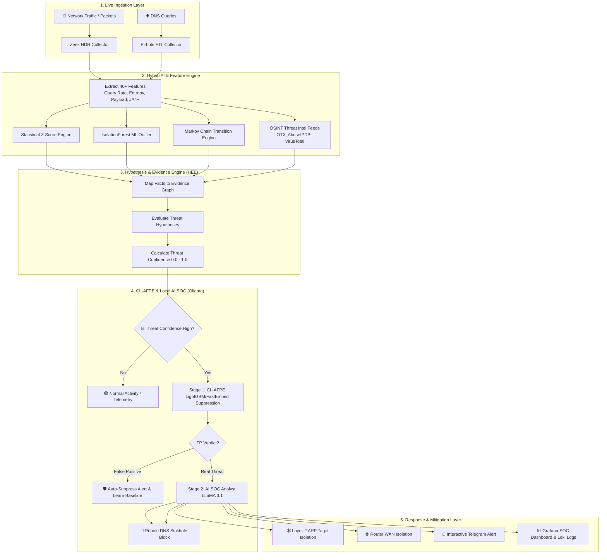
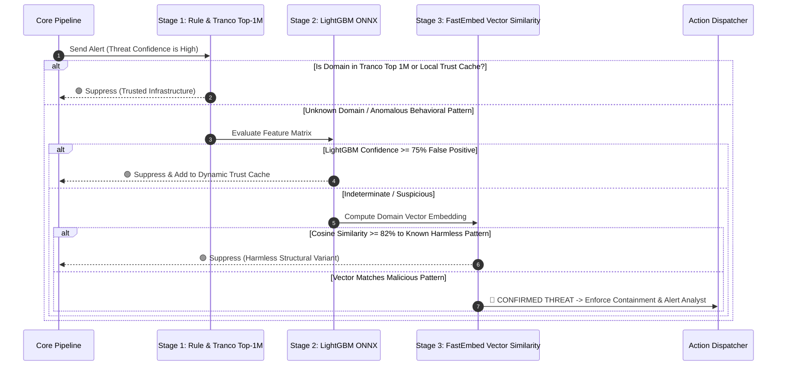
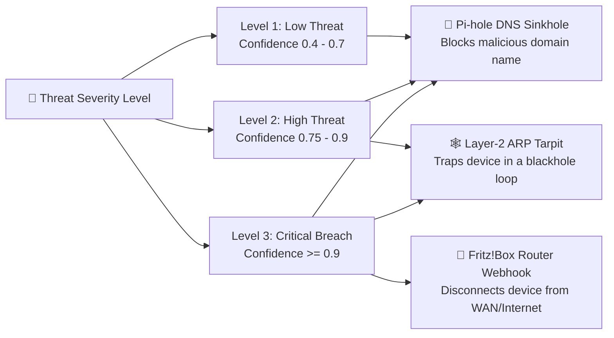
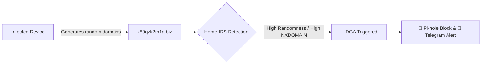
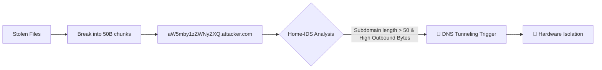
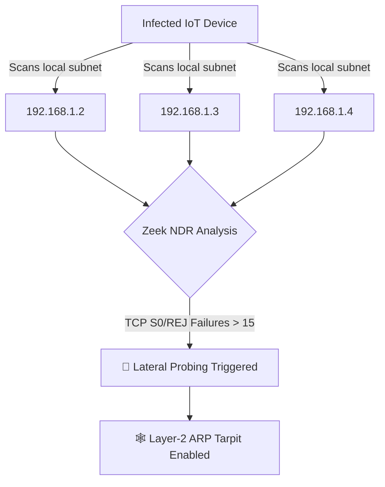
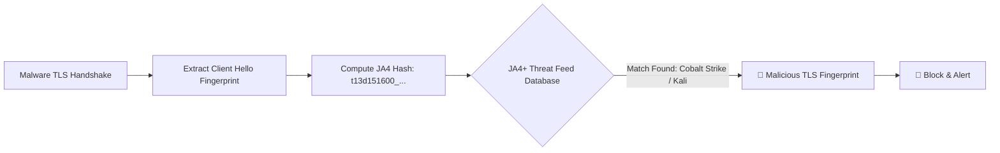
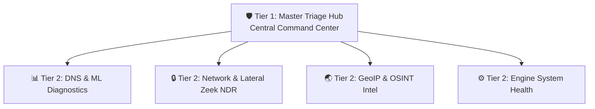

# 🛡️ Home-IDS: Comprehensive Beginner User Manual & Threat Playbook

Welcome to **Home-IDS** — an autonomous, enterprise-grade Intrusion Detection and Prevention System (IDS/IPS) specifically designed for smart homes, edge networks, and small office environments.

Whether you are a home network enthusiast or a beginner analyst entering Security Operations (SecOps), this manual will guide you through how Home-IDS works, how it detects attacks, how it automatically protects your network, and what steps you should take when a threat is identified.

---

## 📋 Table of Contents
1. [🎯 Who Needs Home-IDS?](#-who-needs-home-ids)
2. [⚔️ Why Traditional Antivirus (AV) is NOT Enough](#%EF%B8%8F-why-traditional-antivirus-av-is-not-enough)
3. [🌟 High-Level Architecture & How Home-IDS Works](#-high-level-architecture--how-home-ids-works)
4. [🤖 The 3-Stage Autonomous False-Positive Engine (CL-AFPE)](#-the-3-stage-autonomous-false-positive-engine-cl-afpe)
5. [🛡️ Multi-Layer Containment & Defense-in-Depth](#%EF%B8%8F-multi-layer-containment--defense-in-depth)
6. [📚 Categorized Threat Catalog & Analyst Playbooks](#-categorized-threat-catalog--analyst-playbooks)
   - [Threat 1: Domain Generation Algorithms (DGA) & Botnet C2](#threat-1-domain-generation-algorithms-dga--botnet-c2)
   - [Threat 2: DNS Tunneling & Covert Data Exfiltration](#threat-2-dns-tunneling--covert-data-exfiltration)
   - [Threat 3: Internal Lateral Movement & Network Port Scanning](#threat-3-internal-lateral-movement--network-port-scanning)
   - [Threat 4: Encrypted DoH Bypass & Malicious TLS Fingerprints (JA3/JA4+)](#threat-4-encrypted-doh-bypass--malicious-tls-fingerprints-ja3ja4)
   - [Threat 5: Machine Learning Structural Outliers & Probation Breaches](#threat-5-machine-learning-structural-outliers--probation-breaches)
   - [Threat 6: Geographic Hazards & Threat Intelligence Feed Hits](#threat-6-geographic-hazards--threat-intelligence-feed-hits)
7. [🖥️ Operating the Grafana SOC Dashboards](#%EF%B8%8F-operating-the-grafana-soc-dashboards)
8. [📱 Interactive Telegram Alerts & Incident Remedies](#-interactive-telegram-alerts--incident-remedies)
9. [❓ Troubleshooting & Frequently Asked Questions](#-troubleshooting--frequently-asked-questions)

---

## 🎯 Who Needs Home-IDS?

Home-IDS is built for anyone who owns devices connected to the internet that cannot run traditional security software.

1. **🏠 Smart Homes & IoT Device Owners**:
   Modern homes have 20 to 60+ connected devices (Smart TVs, Wi-Fi Security Cameras, Smart Plugs, Thermostats, Robotic Vacuums, Smart Speakers). **None of these devices can run an antivirus program**, making them the #1 attack target for botnets (like Mirai).
2. **💻 Remote Workers & Freelancers**:
   If a compromised IoT device (e.g., a cheap smart bulb) gets hacked on your home Wi-Fi, attackers can attempt to hop across the local network to steal sensitive data from your work laptop.
3. **🛠️ Network Enthusiasts & Homelabbers**:
   Users running home servers, NAS storage (Synology, Unraid, TrueNAS), or self-hosted applications who need real-time network visibility, threat intelligence scoring, and automated containment.
4. **🏢 Small Offices & Remote Teams (SOHO)**:
   Small businesses that require enterprise-grade Network Detection & Response (NDR) without paying tens of thousands of dollars for enterprise Security Operations Center (SOC) contracts.

---

## ⚔️ Why Traditional Antivirus (AV) is NOT Enough

Many people ask: *"I already have Windows Defender or Bitdefender installed on my PC, why do I need Home-IDS?"*

Traditional Antivirus (AV) is an **endpoint-only tool**. It runs locally on a single computer and scans files stored on the hard drive. However, modern cyber attacks operate **at the network layer** and bypass endpoint antivirus entirely.

### Comparison Matrix: Antivirus vs. Home-IDS (NDR/IPS)

| Security Capability | 🛡️ Traditional Antivirus (Endpoint AV) | 🚀 Home-IDS (Network NDR & IPS) |
|---|---|---|
| **Coverage Scope** | ❌ **Single Device Only** (Must be installed on each PC/laptop) | ✅ **100% Network Coverage** (Protects all 30-60+ devices, including Smart TVs & IoT) |
| **IoT & Camera Defense** | ❌ **Completely Blind** (Cannot run AV software on Linux-embedded IoT devices) | ✅ **Full Protection** (Monitors all IoT network traffic passively) |
| **Covert Data Exfiltration** | ❌ **Misses DNS Tunneling** (Attackers encode stolen files inside DNS requests) | ✅ **Detects & Blocks** (Monitors subdomain entropy, payload Z-scores, and label lengths) |
| **Zero-Day Botnet C2 (DGA)** | ❌ **Fails on New Domains** (Relies on static file signature databases) | ✅ **AI Behavior Detection** (Uses Shannon Entropy & Markov Chains to catch unseen random domains) |
| **Lateral Movement (Port Scans)** | ❌ **Blind to Internal Scans** (Only sees incoming traffic to its own host) | ✅ **Detects Subnet Probing** (Zeek NDR catches internal TCP $S0/REJ$ port scans across IPs) |
| **Encrypted DoH & TLS Hijacking** | ❌ **No Visibility** into network DNS bypasses | ✅ **JA3/JA4+ Fingerprinting** (Identifies Cobalt Strike / Metasploit TLS handshakes) |
| **Automated Network Isolation** | ❌ **Cannot disconnect other devices** | ✅ **Hardware Router Isolation + Layer-2 ARP Tarpit** (Traps infected devices in blackhole loops) |

> [!IMPORTANT]
> **Summary**: Antivirus protects **one computer's file system**. Home-IDS protects **your entire network's traffic behavior**. Having Antivirus without Home-IDS is like putting a heavy lock on your front door while leaving all windows open for smart devices to be exploited.

---

## 🌟 High-Level Architecture & How Home-IDS Works

Think of Home-IDS as an **adaptive immune system** for your local network. Traditional firewalls only block items listed on static blocklists. Home-IDS goes much further: it watches every device's behavior, learns normal daily patterns, and uses artificial intelligence to catch Zero-Day malware that has never been seen before.



### Core Subsystems Explained:
1. **Network Data Collectors**: Home-IDS ingests raw data from **Zeek NDR** (Network Detection and Response) and **Pi-hole FTL** (DNS Resolver).
2. **Feature Extractor**: Computes over 40 behavioral attributes every few seconds (e.g., query volume, domain randomness/entropy, payload sizes, port scan attempts, and TLS fingerprints).
3. **Hypothesis & Evidence Engine (HEE)**: Combines statistical deviation, temporal machine learning anomaly scores (IsolationForest with time-of-day awareness), and live Threat Intelligence feeds into a structured **Evidence Graph**. It evaluates this graph against threat hypotheses to calculate a **Threat Confidence** from `0.0` to `1.0`.
4. **Local AI SOC Analyst**: When high-confidence threats are confirmed by the CL-AFPE, the full evidence graph is passed to a local **Ollama (LLaMA 3.1)** instance which operates as a Tier-2 SOC Analyst. It investigates the telemetry and appends a 1-sentence executive summary directly to your Telegram alert.

---

## 🤖 The 3-Stage Autonomous False-Positive Engine (CL-AFPE)

One of the biggest problems with security systems is **false positives** — annoying false alarms triggered by smart TVs, diagnostic tools, or software updates. Home-IDS solves this using a **3-Stage Continuous Learning Engine**:



> [!TIP]
> **Dynamic Trust Cache**: When CL-AFPE confirms a false positive, it saves the base domain to `state/fp_trust_cache.json` for 14 days. Subsequent queries to that service will be instantly suppressed without re-evaluating the AI model.

---

## 🛡️ Multi-Layer Containment & Defense-in-Depth

When a threat is confirmed, Home-IDS deploys **Defense-in-Depth containment** based on severity:



1. **🛑 Pi-hole DNS Sinkhole**: Instantly responds to malicious domain lookups with `0.0.0.0`, preventing malware from connecting to its C2 server.
2. **🕸️ Scapy Layer-2 ARP Tarpit**: Sends fake ARP responses to the infected device, confusing its network stack and trapping its outbound connections in a blackhole.
3. **🔌 Hardware Router Isolation**: Sends a secure webhook command to your Fritz!Box router to completely cut off internet access for the infected device.

---

## 📚 Categorized Threat Catalog & Analyst Playbooks

---

### Threat 1: Domain Generation Algorithms (DGA) & Botnet C2

#### 💡 What it is (Beginner Analogy)
Imagine a bank robber who generates 1,000 random passcodes every minute until one unlocks the vault. Malware infected with **DGA** generates hundreds of random, gibberish domain names (e.g., `x89qzk2m1a.biz`) every hour to contact its control server (Botnet C2) while avoiding static blocklists.



#### 🔍 How Home-IDS Detects It
- **Shannon Entropy**: Measures randomness in domain names. English domain names like `google.com` have low entropy ($\approx 2.1$), while `x89qzk2m1a.biz` has high entropy ($> 3.8$).
- **NXDOMAIN Ratio**: A high volume of failed DNS queries (domain does not exist).
- **Markov Chain Anomaly Score**: Evaluates letter transition probabilities (e.g., `qx` or `zk` are unnatural in legitimate domain names).

#### 🛡️ Automated Action Taken
- Domain is sinkholed at Pi-hole (`0.0.0.0`).
- If DGA burst is accompanied by high query rates, device enters **Layer-2 ARP Tarpit**.

#### 📋 Analyst Playbook (What To Do Next)
1. **Identify the Device**: Check the Telegram notification or Grafana Triage Hub for the hostname and IP address (e.g., `user_asus_fritz_box` / `192.168.1.16`).
2. **Scan the Host**: Run an antivirus scan (e.g., Windows Defender, Malwarebytes) on the affected machine.
3. **Inspect Active Processes**: Check Task Manager / Process List for unrecognized background executables.
4. **Remedy**: Once cleaned, click **🔓 Release Device** in Telegram or run `python3 src/release_device.py <device_ip>`.

---

### Threat 2: DNS Tunneling & Covert Data Exfiltration

#### 💡 What it is (Beginner Analogy)
Traditional firewalls block file downloads, so attackers encode stolen data into DNS query requests (e.g., `chunk1.secretpassword.attacker.com`). It is like sneaking secret documents out of a building inside thousands of small postal envelopes.



#### 🔍 How Home-IDS Detects It
- **Deep Domains**: Domain names with more than 5 subdomain levels.
- **Max Label Length**: Subdomain strings exceeding 45 characters.
- **Outbound Payload Z-Score**: Detects sudden spikes in payload volume sent over DNS/UDP.
- **TXT/NULL Query Abuse**: High ratio of non-standard DNS query types (`TXT`, `NULL`) used for data payloads.

#### 🛡️ Automated Action Taken
- **Stage-1 Hard-Stop**: Automatically triggers **Hardware Router Isolation** and **ARP Blackhole Tarpit**.
- ML Anti-Poisoning immediately locks the baseline so malware cannot "train" the system to accept exfiltration.

#### 📋 Analyst Playbook (What To Do Next)
> [!CAUTION]
> Data exfiltration is a critical security breach requiring immediate containment.

1. **Keep Device Isolated**: Do NOT release the device from isolation immediately.
2. **Identify Exfiltrated Process**: Inspect network sockets on the device using `netstat -abno` (Windows) or `lsof -i` (Linux).
3. **Isolate Sensitive Accounts**: Change passwords for accounts logged in on that machine.
4. **Remedy**: Format/reinstall the operating system if malware cannot be completely purged.

---

### Threat 3: Internal Lateral Movement & Network Port Scanning

#### 💡 What it is (Beginner Analogy)
Once a hacker gets into one device on your Wi-Fi (like a smart bulb), they try to sneak into your laptop or NAS storage. They do this by "knocking on all doors" (Port Scanning) to see which devices are open.



#### 🔍 How Home-IDS Detects It
- **Zeek Connection Status (S0 / REJ)**: High count of unanswered connection attempts (`S0`) or rejected connections (`REJ`) across multiple internal IP addresses.
- **Honeypot Hits**: Detects attempts to connect to fake, unassigned IP addresses configured as internal decoys.
- **Unique Internal Targets**: Spikes in the count of distinct internal IP addresses contacted per minute.

#### 🛡️ Automated Action Taken
- **ARP Tarpit**: Traps the infected device so it cannot send Layer-2 ARP packets to other local Wi-Fi devices.

#### 📋 Analyst Playbook (What To Do Next)
1. **Check Targeted Ports**: Open Grafana **Zeek NDR Dashboard** to see which ports were scanned (e.g., Port 445 = SMB/Windows Sharing, Port 22 = SSH, Port 80/443 = Web).
2. **Isolate Compromised IoT Device**: Unplug the compromised device from power.
3. **Verify Local Firewalls**: Ensure local firewalls are enabled on your laptops/PC.

---

### Threat 4: Encrypted DoH Bypass & Malicious TLS Fingerprints (JA3/JA4+)

#### 💡 What it is (Beginner Analogy)
Modern malware tries to hide from security software by using encrypted HTTPS tunnels (DNS-over-HTTPS or DoH) or specific encrypted TLS signatures. **JA3 and JA4+** are like taking a digital fingerprint of the exact SSL/TLS library malware uses to handshake with servers.



#### 🔍 How Home-IDS Detects It
- **JA3 / JA4+ Fingerprint Matching**: Cross-references TLS Client Hello parameters (cipher suites, extensions, elliptic curves) against malicious threat intelligence databases (e.g., Cobalt Strike, Metasploit, AsyncRAT).
- **Direct DoH Bypass**: Detects devices making direct IP connections to known encrypted DNS providers (Cloudflare `1.1.1.1`, Google `8.8.8.8`) to bypass your Pi-hole.

#### 🛡️ Automated Action Taken
- **Pi-hole Block & Webhook Isolation**: Blocks connection endpoints and alerts the operator.

#### 📋 Analyst Playbook (What To Do Next)
1. **Identify Application**: Look up the application or process using that TLS signature.
2. **Enforce Local DNS**: Disable "Use Secure DNS / DoH" settings in web browsers on that machine so queries pass through Pi-hole.

---

### Threat 5: Machine Learning Structural Outliers & Probation Breaches

#### 💡 What it is (Beginner Analogy)
If a smart refrigerator suddenly starts uploading gigabytes of data or making thousands of queries at 3:00 AM, it is acting out of character. Home-IDS learns a custom "profile" for every device and flags sudden structural shifts.

#### 🔍 How Home-IDS Detects It
- **IsolationForest Anomaly Score**: An unsupervised Machine Learning model that isolates unusual feature combinations. Score $> 0.65$ indicates an anomaly.
- **Probationary Volume Breach**: Devices in their first 24 hours (probation) generating abnormally high query volumes.

#### 🛡️ Automated Action Taken
- Threat confidence increases. If confidence is high, CL-AFPE & Ollama evaluate the evidence graph.

#### 📋 Analyst Playbook (What To Do Next)
1. **Check Device Behavior**: Determine if a new software update or background backup caused the activity.
2. **Train FP Engine**: If legitimate, click **🛡️ Immunize FP Domain** in Telegram to teach CL-AFPE that this behavior is normal.

---

### Threat 6: Geographic Hazards & Threat Intelligence Feed Hits

#### 💡 What it is (Beginner Analogy)
Connecting to high-risk IP addresses or server hosts located in regions known for hosting cybercrime infrastructure or flagged by international threat feeds.

#### 🔍 How Home-IDS Detects It
- **GeoIP & ASN Lookup**: Cross-references destination IPs against MaxMind GeoLite2 databases to compute Country Threat Density and ASN Threat Confidences.
- **OSINT Threat Feeds**: Real-time integration with **AbuseIPDB**, **VirusTotal**, and **AlienVault OTX**.

#### 🛡️ Automated Action Taken
- Submits critical Tier-5 malicious reputation evidence into the HEE graph.

#### 📋 Analyst Playbook (What To Do Next)
1. **Inspect Country Heatmap**: Check the Grafana **GeoIP & OSINT Dashboard** to see destination countries.
2. **Review AbuseIPDB Score**: Click the AbuseIPDB link in Grafana to inspect community reports for the IP.

---

## 🖥️ Operating the Grafana SOC Dashboards

Home-IDS includes **5 pre-configured Grafana Dashboards** designed to guide you step-by-step:



### Dashboard Quick Reference:
| Dashboard | Primary Purpose | Key Widgets to Watch |
|---|---|---|
| **Tier 1: Master Triage Hub** | Main incident response hub | 🚨 Master Threat Ledger, 📜 High-Priority Loki Logs, 🛑 Pi-hole Active Blocks |
| **Tier 2: DNS & ML Diagnostics** | Analyze DGA bursts and ML scores | IsolationForest Anomaly Score, Markov Transition Score, Entropy Matrix |
| **Tier 2: Zeek NDR** | Network security & lateral movement | JA4+ TLS Fingerprints, Port Scans ($S0/REJ$), Beaconing C2 Periodicity |
| **Tier 2: GeoIP & OSINT** | World traffic & OSINT risk | 🌍 World Geolocation Threat Heatmap, Country Threat Density, ASN Reputation Ledger |
| **Tier 2: System Health** | System resources & pipeline lag | CPU/RAM Usage, Pipeline Processing Lag, Alert Queue Size, Scapy Traps |

---

## 📱 Interactive Telegram Alerts & Incident Remedies

When a threat is confirmed, Home-IDS sends an interactive alert directly to your Telegram phone:

```text
🚨 [ALERT] user_laptop_fritz_box (192.168.1.12)
📊 Confidence: 0.96 (Threshold: 0.60)
🏷️ Primary Trigger: ML absolute structural outlier (Probationary)

🌐 DNS Activity (Pi-hole Context)
- Target Domain: g.live.com
🕒 Threat-Filtered DNS Sequence:
  16:45:03 | 🟢 ALLOWED | g.live.com

🔌 Network Activity (Zeek Context)
- Dominant Outbound: DNS (Port 53 / TCP)
- App / Process: Unknown
- Lateral Scans: None

🛡️ Mitigation & Confidence
- Containment: UNBLOCKED
- Confidence: 0% FP / 100% Threat

Top Factors:
- ML absolute structural outlier: +5.0
- Probationary volume ceiling breach: +3.5
- Zeek notice: +1.125

🚨 Recommendation: High Threat Confidence – Immediate remedy recommended.
```

### Interactive Buttons:
- **🔒 Approve Hardware Isolation**: Instantly instructs your Fritz!Box router to disconnect the device from the internet.
- **🔓 Release Device**: Removes the device from isolation, unblocks its domains, and resets containment.
- **🛡️ Immunize FP Domain**: Tells CL-AFPE that this domain is a false positive, saving it to the dynamic trust cache for 14 days.

---

## ❓ Troubleshooting & Frequently Asked Questions

### Q1: Why are some panels showing 0 or empty?
- **Time Range Filter**: Check Grafana's time range picker in the top right. Change it from *Last 6 hours* to **Last 7 days** to view historical alerts.
- **Promtail Ingestion**: Ensure Promtail service is running (`sudo systemctl status promtail`).

### Q2: How do I release a device manually from the command line?
Run the built-in release helper script:
```bash
python3 src/release_device.py <device_ip_or_hostname>
```

### Q3: How do I reset the Machine Learning models and start fresh?
```bash
sudo systemctl stop soc.service
rm -rf state/ids_state.json models/*.pkl
sudo systemctl start soc.service
```

---

*Home-IDS Documentation & SecOps Playbook — Engine Version 5.0.27*
